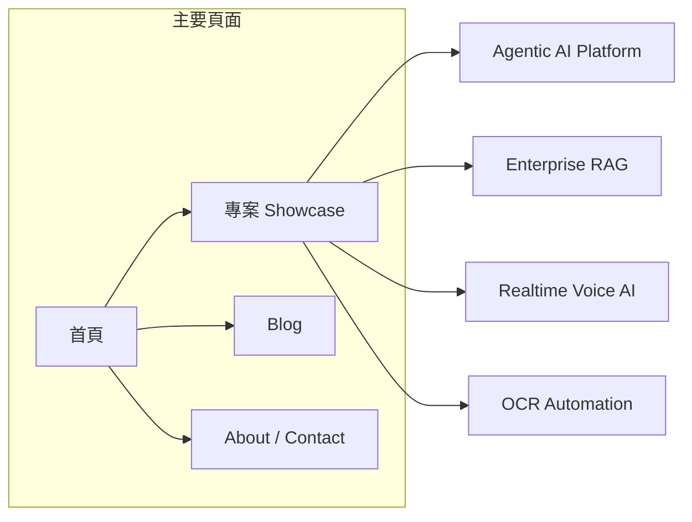

# AI 技術品牌平台規劃：呈現與行銷策略

## 現狀

- 目前站點：[index.html](index.html) 僅有「Hello World」，純靜態、無框架。
- 目標：打造 **AI Platform / Agentic AI Engineer** 品牌，首頁以「你是誰 + 解決什麼問題」為主，專案以 Business + Architecture + Scale 呈現，搭配 Blog 建立差異化。

---

## 一、品牌標語與首頁主軸

建議採用 **版本 C** 作為主標（可 A/B 測試）：

- **主標**：`Designing Scalable AI Platforms`
- **副標**：`RAG · Multi-Agent · Realtime AI`

首頁 Hero 文案建議（英文，與 LinkedIn/國際求職一致）：

> I design and build enterprise-grade AI platforms, focusing on RAG, multi-agent collaboration, and real-time AI systems.

可選：在 Hero 下方加一句 **價值主張**（例如：從 PoC 到上線、從 OCR 到 Agent，降低企業導入 GenAI 的風險與成本）。

---

## 二、網站架構（資訊架構）

- **首頁**：Hero + 三大能力 + 精選專案 Showcase（含架構/商業 impact）+ CTA（看專案 / 看文章 / 聯絡）。
- **專案頁**：4 大核心專案各一頁（或一頁多區塊），每專案依「問題 → 架構 → 技術亮點 → 指標」呈現。
- **Blog**：分類為 Generative AI、Enterprise AI、Realtime AI，支援 SEO 與每週發文節奏。
- **About / Contact**：完整個人簡介（見下方「Contact 頁面內容」）、技能標籤、LinkedIn / GitHub / 接案或求職 CTA。

**行銷動線**：  
首頁建立信任（能力 + 專案）→ 專案頁證明「商業落地 + 架構能力」→ Blog 建立「專家感」→ About/Contact 轉換（求職/接案）。

---

## 三、首頁區塊設計（由上而下）

### 1. Hero

- **誰**：AI Platform & Agentic AI Engineer（或你選的標語）。
- **解決什麼問題**：一句話（如上方 Hero 文案）。
- **視覺**：簡潔、可放一張代表「平台/系統」的示意圖或抽象圖，避免過度花俏。
- **CTA**：例如「View Projects」、「Read Latest」或「Get in Touch」。

### 2. 三大能力（Three Pillars）

用三張卡片或三欄呈現，每項標題 + 1～2 句說明 + 關鍵字：

| 區塊                  | 標題              | 關鍵內容                                                 |
| ------------------- | --------------- | ---------------------------------------------------- |
| **Enterprise AI**   | Enterprise AI   | M365 Copilot、Knowledge assistant、Fact-checking agent |
| **Agentic Systems** | Agentic Systems | Multi-agent、Workflow automation、n8n                  |
| **Realtime AI**     | Realtime AI     | Voice AI、Low latency LLM、Customer service            |

可加小圖示或簡短架構示意（不需複雜），強化「系統思維」而非單點技術。

### 3. Showcase（核心專案精選）

- **不要**：長篇技術描述。
- **要**：每個專案一塊「卡片」或「區塊」，包含：
  - **專案名稱**
  - **一句話商業價值**（例如：Fact verification + research automation for 161 users）
  - **關鍵數字**：users、accuracy、latency、AIGO Top 20 等
  - **可選**：小型架構圖（Agent / RAG / Vector DB 等高層次）
  - **連結**：點擊進入該專案的詳細頁

建議首頁只放 **2～4 個** 最強專案，其餘可放在「專案總覽」頁。

### 4. 次要區塊（可選）

- **Latest from Blog**：最新 2～3 篇文章標題 + 連結，強化「持續輸出」。
- **CTA 區**：一段話（例如：正在尋找 AI 平台或 Agent 落地夥伴？）+ 按鈕（Contact / LinkedIn）。

---

## 四、Contact / About 頁面內容

Contact（或 About）頁面納入以下完整簡介，可依區塊分段呈現，方便掃讀：

### 開場（定位）

熱衷於 AI 應用與技術創新的工程師，具備扎實的機器學習與深度學習背景，專注於將前沿技術快速轉化為可落地、可擴展的實務系統。

### 國泰金控時期（OCR 與文件智能）

加入國泰金控後，主導醫療收據 OCR 系統建置，負責資料前處理流程設計、繁體中文 PaddleOCR 模型訓練優化與表格文字解析演算法開發，成功提升醫療單據辨識準確率與處理效率，建立可擴展的智能文件處理架構。

### 近年重心（LLM、Agent、RAG、AIGC）

近年專注於大型語言模型（LLM）應用與 AI IDE 全新開發模式，強調高速開發與安全並行。實務成果包含：

- 於回饋平台導入 **LLM as a Judge**，將質化回饋轉化為量化評分
- 於 **M365 知識助手**建構 **Agentic RAG** 架構，支援業務即時客服與知識檢索
- 打造研討會新聞趨勢整理工具
- 實踐數字人影片製作應用，拓展 **AIGC** 落地場景

### 當前研究方向（Agent、MCP、企業架構）

目前深入研究 **AI Agent** 架構與 **Model Context Protocol（MCP）**，探索多代理協作、工具調度與安全邊界設計，致力於：

- 以 **AI IDE** 重構開發流程
- 在高速迭代中兼顧資安與系統穩定性
- 建立可持續演進的**企業級 AI 架構**

### 結語（價值主張）

我相信 AI 的價值不僅在模型能力，而在於如何以工程思維整合技術、流程與安全機制，真正實現高效率且可規模化的智慧應用。

---

**頁面實作建議**：上述每段可為一區塊（標題 + 內文）；文末加上 **聯絡方式**（LinkedIn、GitHub、Email 或表單）與 **CTA**（接案／求職合作）。

---

## 五、專案頁模板（每個專案一致）

每個核心專案頁建議包含以下四塊，方便企業與 recruiter 快速掃描：

1. **Business problem**
  - 1～3 句：要解決什麼問題、為誰解決（例如：減少人工、提升決策品質、合規與事實查核）。
2. **Architecture**
  - 一張高層架構圖（可 Mermaid 或圖檔）：標出 Agent、RAG、Vector DB、LLM、Realtime 等元件，不寫細部實作。
3. **Technical highlight**
  - 3～5 個 bullet：例如 LLM as judge、multi-agent 協作、realtime streaming、安全與治理。
4. **Metrics & impact**
  - 數字化結果：users、accuracy、latency、throughput、獎項（如 AIGO Top 20）等。

你提到的四個專案可對應為：

- **Agentic AI Platform**：15 agents、fact verification、knowledge search、161 users、AIGO Top 20。
- **Enterprise RAG**：Copilot Studio、Agentic RAG、LLM judge。
- **Realtime Voice AI**：MCP + Realtime GPT、customer support。
- **OCR Automation**：金融/醫療場景、95% accuracy、實際部署。

---

## 六、Blog 策略（高薪與差異化）

- **定位**：Generative AI × Enterprise × Realtime，與「只做模型」的 ML 工程師區隔。
- **建議分類**（可作為 nav 或 tag）：
  - **Generative AI**：Agent 設計、RAG 優化、Evaluation、Prompt/Flow 設計。
  - **Enterprise AI**：AI governance、security、cost control、落地經驗。
  - **Realtime AI**：Low latency、streaming、voice。
- **節奏**：每週 1 篇或雙週 1 篇，可先準備 3～5 篇存稿再正式開站。
- **形式**：技術文章 + 可選的架構圖或簡短 demo 連結，利於 LinkedIn 轉載與 SEO。

---

## 七、技術選型（與 GitHub Pages 相容）

你目前是 **純靜態 HTML**，有兩條路：

| 方案             | 優點                            | 缺點                 | 建議                     |
| -------------- | ----------------------------- | ------------------ | ---------------------- |
| **A. 繼續靜態**    | 無 build、GitHub Pages 原生支援、載入快 | 多頁與版型需手動維護         | 適合先快速上線、內容不多時          |
| **B. 遷移到 SSG** | 版型統一、易擴充 Blog、可接 Notion CMS   | 需設定 build 與 deploy | 若打算長期經營 Blog 與多專案頁，較推薦 |

**建議**：

- **短期**：用 **單一 HTML + CSS（可多頁）** 先做出首頁 + 4 專案頁 + 簡易 Blog 列表，不依賴 Node 建置，部署不變。
- **中期**：若 Blog 文章變多、需要分類與 SEO，再遷移到 **Next.js (static export)** 或 **Astro**，部署到 GitHub Pages（`gh-pages` 或 `docs/`）。  
- **Notion CMS**：可作為「寫作後台」，用 Notion API 或 export 產生 Markdown，再由 SSG 吃檔；或先手寫 Markdown 放在 repo，不一定要一開始就接 Notion。

---

## 八、與轉職／接案的行銷串聯

- **LinkedIn**：首頁 URL 放在 LinkedIn 主頁；發文主題對齊三大能力（Agent、RAG、架構），可附專案頁或 Blog 連結。
- **求職**：履歷上「個人網站」指向此站；面試時可說「我有整理專案架構與商業 impact，可從網站上的專案頁快速了解」。
- **接案**：About/Contact 明確寫「可接 AI 平台、Agent、RAG、Realtime 相關顧問或開發」，並在 Showcase 強調企業落地與數字。

---

## 九、實作優先順序（建議）

1. **Phase 1**：首頁結構（Hero + 三大能力 + 4 專案 Showcase 卡片）+ 統一版型與導覽。
2. **Phase 2**：4 個專案詳細頁（依 Business / Architecture / Technical / Metrics 模板填寫）。
3. **Phase 3**：About / Contact 頁，納入「四、Contact / About 頁面內容」之完整簡介（開場、國泰 OCR、近年 LLM/Agent/RAG/AIGC、當前研究、結語）+ 聯絡方式與 CTA。
4. **Phase 4**：Blog 列表頁 + 至少 2～3 篇文章上線。
5. **Phase 5**（可選）：遷移 SSG、SEO 優化、Notion 或 MD 驅動的 Blog。

---

## 總結

- **定位**：AI Platform / Agentic AI Engineer，主軸「Generative AI × Agent × Realtime × Enterprise」。
- **首頁**：先建立「誰 + 解決什麼問題」，再用三大能力與專案 Showcase 建立信任，最後用 Blog 與 Contact 做轉換。
- **專案**：一律用「商業問題 → 架構圖 → 技術亮點 → 指標」呈現，突出系統設計與商業落地。
- **技術**：可先靜態多頁快速上線，再視 Blog 與內容量決定是否遷移 Next.js/Astro 與 CMS。

若你提供現有專案的一兩句「商業問題」與關鍵數字，我可以幫你把四個專案的 Showcase 文案與專案頁大綱寫成可直接貼上的版本（仍維持規劃模式，不直接改檔）。