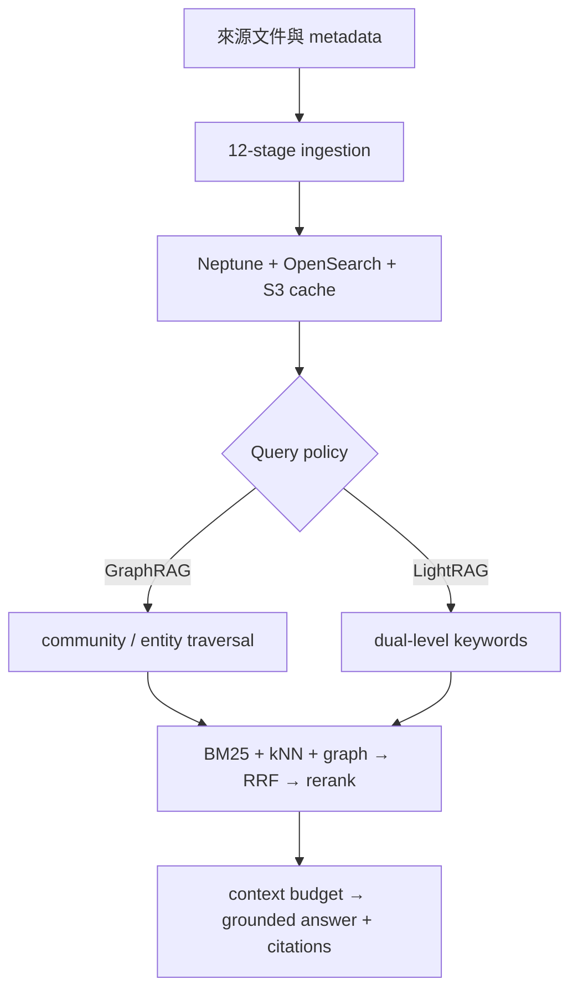

當一個問題的答案分散在多份文件，關鍵不只在「哪一段文字最像問題」，而在於哪些實體、關係與來源可以被連成一條證據鏈。AWS 在 2026 年 9 月 14 日發表的 [Unified Knowledge Graph RAG on AWS](https://aws.amazon.com/blogs/opensource/unified-knowledge-graph-rag-on-aws-graphrag-and-lightrag-on-one-stack/) 提供了一個值得拆解的答案：把 Microsoft GraphRAG 的 community-summary 與 LightRAG 的 dual-level keyword retrieval 放在同一個 AWS-native stack 上，讓每個 query 選擇策略。

這個設計的重點不是「GraphRAG 贏過 LightRAG」，也不是替企業宣告一個永久最佳的 RAG 方法，而是把決策邊界拆開：入庫與資料血緣是一層，查詢策略是另一層，最後的 Hybrid Retrieval、reranking、context assembly 與生成又是共用的一層。這使得團隊可以在相同的 graph、文件與模型條件下比較策略，而不是每換一個方法就重建整套資料管線。

> **花花的一句話**
>
> GraphRAG 與 LightRAG 應該是「針對問題選擇的 query policy」，不是一個替所有問題切換的全域開關。

本文以 AWS Open Source Blog、[awslabs/unified-kg-rag-on-aws repository](https://github.com/awslabs/unified-kg-rag-on-aws) 及其 [technical design document](https://github.com/awslabs/unified-kg-rag-on-aws/blob/main/docs/design.md) 為主要來源。文中的品質、成本與延遲是 AWS 在公開 benchmark 上執行的測量；架構與 lineage 說明則以公開 reference implementation 的程式與設計文件為準。最後提出的 provenance contract 是 Bloss0m 的工程建議，不是 AWS 宣稱已完成的企業治理產品。

## 為什麼純向量 RAG 會在關係問題前失速？

一般的 vector RAG 把文件切成 chunks，對問題與 chunks 做 embedding，再取回相似度最高的候選。它很適合回答「合約第 4 節的保固期限是多少？」這種答案集中在一段文字裡的問題。但以下三種問題，真正需要的不是鄰近文字，而是資料之間的結構：

- **多跳問題**：一份修訂文件改了里程碑，主合約把付款綁在里程碑上，風險備忘錄又把它連到供應鏈影響。答案需要沿著文件與實體之間跳轉。
- **跨文件聚合**：問題要求列出所有引用同一個 indemnity cap 的條款，沒有一個 chunk 會單獨包含完整清單。
- **全域或主題問題**：問題是「整個 corpus 的主要風險是什麼？」它需要跨社群與主題綜合，而不是只找 top-k。

知識圖譜把抽取出的 entity、relationship 與它們出現的 text unit 連在一起，因此可以表示「誰和誰有什麼關係、關係在哪些原文出現」。但這不代表建圖後就自動正確：LLM 可能漏抽、實體解析可能合併錯誤，graph traversal 也可能把不該一起看的內容帶進 context。GraphRAG 的價值是提供另一種可檢索結構，仍然需要資料品質、評估與來源治理。

## 同一個 ingestion backbone，兩種查詢方法

[AWS 的 reference repository](https://github.com/awslabs/unified-kg-rag-on-aws) 以 clean-room 方式重實作兩種方法，並在 Apache-2.0 授權下公開。它們共用同一份 ingestion outputs：chunks、entities、relationships、communities、embeddings，以及用於快取與增量處理的狀態。查詢時才在 retrieval layer 分支。

| 維度 | GraphRAG | LightRAG |
| --- | --- | --- |
| 核心索引想法 | 對圖做 Leiden community detection，再產生階層式 community reports | 不做 community summary，保留 entity 與 relationship 的雙層檢索 |
| 查詢焦點 | `local` 從實體展開；`global` 從 communities 做 map-reduce；`drift` 逐步探索 | low-level keywords 找具體 entity；high-level keywords 找 relationship，再做 graph expansion |
| 主要策略 | `simple`、`local`、`global`、`drift`、`auto` | `naive`、`hybrid`、`mix` |
| 時間與成本位置 | 把 community summarization 的部分推理成本放到 indexing | 索引較輕，但把更多理解與檢索工作放到每次 query |
| 適合的問題 | 實體脈絡、跨社群的主題敘事、探索式問題 | 關係導向的 entity lookup、多跳問題與希望保留原文 chunks 的回答 |

GraphRAG 的 `global` 不是「更大的 local」。它依賴 community reports，把多個主題的部分答案再 reduce 成總結；這對全域敘事合理，卻可能在需要單一精確值的 extractive QA 中吃掉細節。LightRAG 的 `hybrid` 則以 low-level／high-level keywords 分別搜尋 entity 與 relationship index，再由 Neptune 做鄰域展開；`mix` 還會把被命中的 entities／relationships 所引用的原始 chunks 混進來，讓答案不只依賴圖上的短描述。

## 端到端架構：策略只改變圖怎麼走

這個 stack 的工程意義在於把「資料如何被建立」與「問題如何被回答」分開。下面是從來源文件到引用答案的縮寫；GraphRAG 與 LightRAG 只在 query policy 的位置分支。

### 入庫：12 個可 checkpoint 的階段

公開設計文件把 `DataIngestionPipeline` 分成 12 個順序階段：文件解析、載入、切塊、可選翻譯、graph extraction、可選 gleaning、graph resolution、可選 claim extraction／resolution、graph analysis、community detection 與 indexing。前幾階段把 PDF、TXT、CSV、JSON 等輸入變成 text units；中間階段由 LLM 抽取與合併 entities 和 relationships；最後把圖寫入 Neptune，把 BM25 與向量索引寫入 OpenSearch。

每個 stage 都可以寫入 local cache，並可選擇同步到 S3。失敗後可使用 pipeline ID 與 resume-from-stage 從 checkpoint 繼續，不必把整條昂貴管線當成一次不可分割的 request。翻譯、gleaning、claim extraction 與 community detection 都是有設定邊界的能力；不是每個 corpus 或每個部署都必須開啟。

### AWS 元件各自負責什麼？

| 關注點 | AWS 服務 | 在 reference stack 中的角色 |
| --- | --- | --- |
| LLM、embedding、rerank | Amazon Bedrock | entity／relationship 抽取、摘要、回答、embedding 與可選 rerank |
| 圖儲存 | Amazon Neptune | entity／relationship graph 與 Gremlin traversal；寫入使用 idempotent upsert |
| 關鍵字與向量 | Amazon OpenSearch Service | BM25 lexical index、kNN vector index，以及 entity／relationship／chunk 等檢索 |
| 增量狀態 | Amazon DynamoDB | 可選的 document-status registry，保存 content hash 與 artifact lineage |
| 原始文件與快取 | Amazon S3 | corpus、stage cache 與跨執行重用的產物 |

Query 進來後，框架可先做語言處理、翻譯、entity／keyword extraction，再由選定 strategy 取得候選。固定的 triple-hybrid backbone 會從 OpenSearch BM25、OpenSearch kNN 與 Neptune graph expansion 收集結果，使用 Reciprocal Rank Fusion（RRF）融合，可選擇 Bedrock rerank，接著按 token budget 組裝 context，最後生成帶來源 attribution 的答案。換句話說，策略改變的是圖檢索如何產生候選；融合、重排、context 與回答政策仍是同一套。

這個邊界也反映在 repository 的 hexagonal architecture：domain core 不依賴 boto3 或 LangChain，retrieval strategy 透過 registry 自我註冊，具體 backend 由 role-based injection 提供。增加一個策略不必在中央 `if/elif` 增加分支；但這仍是 reference implementation 的可擴充性設計，不等同於已完成的多租戶隔離或服務等級保證。

## Strategy selection：先看問題形狀，再看預算

「GraphRAG 或 LightRAG 哪個比較好？」不是一個足夠好的上線問題。更好的做法是把 query policy 當成可觀測、可評測的路由決策：

| 問題形狀 | 第一個要測的策略 | 判斷理由 |
| --- | --- | --- |
| 單一事實、精確欄位或簡短 FAQ | `simple` 或 `naive`，並保留普通 vector／hybrid baseline | 圖譜的建置與 traversal 未必能增加價值 |
| 圍繞一個 entity 的細節問題 | `local` 或 `mix` | 需要從 entity 找關聯，同時保留原文證據 |
| 跨文件、多跳關係 | `local`、`hybrid`、`mix` 以相同評測集比較 | 需要 graph expansion，但品質與成本取捨要由題目分布決定 |
| 整個 corpus 的主題敘事 | `global`，另外建立 thematic evaluation | 它是為 community-level synthesis 設計，不應用 extractive QA 代替評測 |
| 多面向、逐步探索 | `drift` 或受控 router | 需要反覆擴張，但每輪都增加延遲、token 與失敗點 |

`auto` 可以讓 LLM router 在策略間選擇，但 AWS 文章明確指出 `auto` 沒有單獨 benchmark；表格中的數字是它可能路由到的策略，不是 `auto` 本身的品質保證。正式環境若採 router，至少要把 query class、router version、選擇理由、候選策略與 fallback 寫入 trace。否則看到答案退步時，團隊不知道是 router 分錯、graph 沒抽好，還是生成階段出了問題。

## AWS-run benchmark：品質、成本與延遲不是同一條排名

AWS 用 MuSiQue 與 2WikiMultihopQA 各 100 題，兩者都刻意要求從多份文件跳轉。每個策略在同一份 graph、同一模型與同一 scorer 上執行，token-F1 取三次 run 的平均。以下保留 AWS 公開表格的完整比較；`MuSiQue / 2Wiki` 兩欄都是 token-F1，成本是每 1,000 次 query 的估算，延遲是 median response。

| 策略 | 方法 | MuSiQue | 2Wiki | 每 1,000 次 query | Median |
| --- | --- | ---: | ---: | ---: | ---: |
| `hybrid` | LightRAG | 0.634 | 0.628 | $42.29 | 19.8s |
| `mix` | LightRAG | 0.602 | **0.654** | $38.67 | 23.6s |
| `local` | GraphRAG | 0.519 | 0.577 | **$5.23** | **6.5s** |
| `drift` | GraphRAG | 0.379 | 0.541 | $7.99 | 12.0s |
| `naive` | LightRAG、vector only | 0.354 | 0.424 | $8.56 | 7.3s |
| `global` | GraphRAG | 0.231 | 0.396 | $66.22 | 17.3s |
| `simple` | GraphRAG | 0.209 | 0.374 | $7.41 | 5.1s |

這些數字應該這樣讀：

1. `hybrid` 在 MuSiQue 得分最高，`mix` 在 2Wiki 得分最高；兩者差距只有 0.032 與 0.026，不應解讀成永久冠軍。AWS 也提醒，約 0.05 以下的差異應視為 noise。
2. `local` 的成本是 $5.23／1,000 次 query、median 6.5 秒；`hybrid` 的成本是 $42.29、19.8 秒。這是約八倍成本與三倍延遲，換來兩個資料集約 0.12 與 0.05 的 F1 差距。高品質且流量不大的情境可能值得，十萬次月查詢則是完全不同的財務問題。
3. `global` 在這兩個 extractive multi-hop benchmark 表現最差，不代表它不能做 global question；它的 context 是少數較長的 community summaries，會省略單一值的原文細節。AWS 另用 28 題 UltraDomain thematic set 做 LLM judge：`global` 只以 64% 勝過 plain vector，`local` 是 82%，`mix` 是 93%。這組結果也不是通用結論，因為 judge 與生成模型同屬一個 model family。
4. 成本欄只涵蓋 query cost，不含完整的 infrastructure、embedding、圖抽取與索引成本。AWS 在一個 corpus 觀察到 community summarization 約佔 ingestion bill 的 7.6%，但主要成本仍是兩種方法都需要的 entity／relationship extraction。

這是 AWS-run、特定設定下的實驗，不是獨立 production benchmark。成本使用 Claude Sonnet 4.5 與 Titan Text Embeddings V2 的 on-demand pricing，在 us-west-2、2026 年 8 月執行，且成本實驗以 20 題、嚴格一次一題的 runs 估算。你的 region、模型、快取、並行度、tokenization、query mix 與 corpus size 都會改變結果。

### 與 upstream reference implementation 的差異

AWS 也把這個 clean-room implementation 與上游 GraphRAG／LightRAG reference implementations 用相同問題和 offline scorer 比較：LightRAG `mix` 在 MuSiQue／2Wiki 為 0.602／0.654，上游為 0.591／0.629；`hybrid` 為 0.634／0.628，上游為 0.567／0.629；`local` 為 0.519／0.577，上游為 0.404／0.471。AWS 對這些差異做 paired bootstrap，指出 LightRAG 的差異落在統計 noise 內；GraphRAG local 的改善主要來自把原始 document passages 與圖描述一起交給模型，而非只給一行 entity description。

因此，「重實作忠實」與「在此 benchmark 分數較高」是兩件事。採用這個 repository 是因為你要的是 AWS-native shared stack、某種方法的行為，或一個可以在自有 corpus 上做策略對照的基座，而不是因為表格證明它在所有資料上勝過上游。

## Incremental indexing：改文件，不等於重付整個 corpus

Graph RAG 的難題常被說成「建圖很貴」，但正式環境更容易卡在「文件每天會變」。這個 repository 的增量設計把 document registry 當成資料生命週期的一部分：開啟 DynamoDB registry 後，系統以穩定的 document ID 與 content hash 判斷文件是 new、changed、unchanged 還是 deleted。

對 changed 文件，系統先依 registry 的 lineage 移除不再被其他文件引用的舊 artifacts，再對新抽取的 artifacts 做 idempotent upsert。對 deleted 文件，只刪除它獨有的 text units、entities、relationships、claims、communities 或 reports；仍被其他文件引用的 shared entity 不應因為一個來源撤下就消失。這些行為依賴 `text_unit_ids` 的實際關聯，而不是以 token overlap 猜「這個 entity 是否屬於這段文字」。

這個流程有三個值得保留的契約：

- **hash 是變更偵測，不是版本治理的全部**：同一內容若在不同來源路徑出現，仍要由你的 source identity、權限與版本規則決定是否視為同一份文件。
- **lineage 是刪除安全的前提**：沒有 entity／relationship 到 text unit、text unit 到 document 的鏈，系統無法安全地只刪除 exclusive artifacts。
- **寫入成功才更新 registry**：公開 `IncrementalIndexer` 只有在 delta artifacts 寫入達到成功條件後才把 document 記為 processed；刪除若部分失敗也保留 registry record，讓下次可以重試，避免留下無主的圖譜資料。

增量 indexing 不代表所有設定都能熱更新。改變 graph extraction prompt、chunking、entity resolution 或 embedding model，會改變既有輸出；這種情況不能只把新增文件跑一遍，應建立新 index generation 或安排完整 rebuild。若只使用 LightRAG，則可關閉 `graph.community_detection.enabled`，省掉 Leiden 與 community-report LLM calls；但要使用 GraphRAG `global` 或 `drift`，就必須保留這段 ingestion。

## Provenance contract：讓「有引用」變成可追查

GraphRAG 的回答可能來自 raw chunk、entity description、relationship description、community report 或它們的組合。只在 UI 顯示一個來源 URL，並不足以回答「這個結論是由哪個版本的哪段內容支持、經過哪個 graph artifact、用哪個策略找出來？」

對企業服務，我建議把每次 query 的 trace 至少固定成以下幾層：

| 層 | 必要欄位 | 用途 |
| --- | --- | --- |
| Request | `trace_id`、`query_id`、tenant／principal、原始 query、時間、policy／router version | 重播路徑、確認誰在什麼邊界下提問 |
| Source | stable `doc_id`、canonical source、version、content hash、captured／effective time、ACL snapshot | 確定答案所依據的文件版本與可見範圍 |
| Lineage | `text_unit_ids`、page／section、entity／relationship／claim IDs、community／report IDs | 從回答回走到原文與圖譜衍生物 |
| Build | `pipeline_id`、stage status、chunking／extraction prompt version、LLM／embedding model、config hash、index generation | 知道這張圖是如何建出的，能否與另一版公平比較 |
| Retrieval | strategy、query class、retriever candidates、BM25／kNN／graph scores、RRF／rerank score、selected context、token count、latency | 分辨沒找到、排序錯、context 爆量或生成錯 |
| Answer | generation model/version、每個 claim 對應的 source IDs、citation、拒答／不確定性、quality evaluator、human review | 讓答案成為可驗證的產物，而不是不可重播的文字 |

這份 contract 還需要四條政策配套：

1. **ACL 在 retrieval 套用**，不能先把跨租戶內容取回，再在 prompt 裡要求模型忽略；快取 key 也必須包含 tenant 與權限範圍。
2. **引用要能回到可再次授權的來源**。答案頁面能看到 citation，不代表點擊原文件時可以跳過 source system 的授權檢查。
3. **摘要不能抹掉證據鏈**。如果 `global` 只提供 community report，系統應標出抽象層級與 report ID；對高風險回答，最好仍能展開支撐 report 的 chunks。
4. **刪除要可驗證**。文件撤回後，不只刪 source record，也要確認 vector、relationship、entity、community 與 cache 不再被新的 query 使用；失敗時保留 tombstone 與重試狀態。

這個 contract 是把 repository 的 document hash、artifact lineage、query sources 與 evaluation outputs 連成營運資料模型。它不是多加一個「來源」欄位，而是讓品質、權限、延遲、成本與資料新鮮度可以對同一個回答共同負責。

## Production caveats：reference stack 不是 production sign-off

AWS blog 與 repository 都明確把這個專案定位為 reference framework／sample，要求使用者在 production 前自行做 security testing、threat modeling、hardening 與資料治理。可選 CDK app 提供 private VPC、KMS at-rest encryption、TLS、least-privilege IAM 與 optional Bedrock Guardrail 的起點，但這些 secure defaults 不會替你的租戶模型、資料分類、終端使用者驗證與 incident response 背書。

部署成本也不能只看表格的 query cost。CDK 會建立 Neptune、OpenSearch、S3、DynamoDB、ECS Fargate 與 Step Functions 等資源；public network mode 可能還有 NAT gateway。repository 提醒 dev profile 的 teardown 可能刪除 stateful resources，production 則要重新檢查 deletion protection、Multi-AZ、CMK、VPC flow logs、rate limiting、監控與備份策略。

品質方面至少要注意：

- 公開 benchmark 只有兩組各 100 題，足以看出 trade-off，不能證明兩個策略真正等價；AWS 建議約 0.05 以下的單次差異當作 noise。
- MuSiQue 與 2Wiki 天生偏好多跳 graph retrieval；一般 FAQ、權限過濾、時間版本與無答案問題仍要加入自己的 eval set。
- 每個策略共用一張由 LLM 抽出的 graph；抽取 prompt、entity resolution、語言翻譯與 model version 的誤差會一起影響所有 query。
- `global` 的 thematic 評估使用 LLM judge，且 judge 與 generator 同 model family，存在 self-preference 風險；應以人工抽樣和獨立 judge 校準。
- 這些測量沒有告訴我們多租戶負載、並行吞吐、P95／P99、跨 region、ingestion freshness curve 或長期 graph drift 的結果。

> **花花的工程提醒**
>
> 不要把 AWS 的 $／1,000 queries 或某次 token-F1 直接當成你的 SLO。先固定 corpus、問題分布、權限、模型與 scorer，再用同一份 provenance trace 比較策略；reference implementation 仍需要你的安全、負載與資料治理驗證。

## 一條可執行的導入路線

如果要把這個想法帶進企業 RAG，建議依序做以下事情：

1. **先建立 baseline**：用 lexical、vector 與一般 Hybrid Retrieval 分別測量 single-fact、multi-hop、global、無答案與權限題，不要從 GraphRAG 的最佳故事開始。
2. **固定資料身份**：為來源、版本、content hash、ACL、chunk、entity、relationship 與刪除事件建立穩定 ID；先驗證 lineage，再談更複雜的 query policy。
3. **建一次 shared graph，跑多種策略**：在相同 ingestion generation 上比較 `local`、`mix`、`hybrid`；讓品質、延遲、token、成本與 citation coverage 進入同一份評測結果。
4. **把 router 當成產品功能評測**：若使用 `auto`，另外評估 query classification、fallback、錯誤路由與成本上限，不要把 router 的決策藏在 trace 外。
5. **用 delta 測試更新**：測試新增、修改、刪除、共享 entity、抽取失敗與部分 backend failure；確認 registry 不會過早把不完整寫入標為 processed。
6. **最後才決定 production profile**：按 query volume 選策略，按風險決定人工審查與拒答，按資料敏感度設計 ACL、加密、網路與保存期限。

這種設計最實用的實驗很簡單：對同一批真實問題，在同一份 graph 上各跑兩個策略，檢查 answer、引用、延遲、token 與成本。若你的 corpus 讓排名改變，這不是實驗失敗，而是證明 query policy 應該由 corpus 與問題形狀決定。

## 延伸閱讀與一手來源

如果你要先補齊基礎，建議從 [Enterprise RAG 完整指南](/blog/65-enterprise-rag-guide/) 開始，接著看 [GraphRAG 深度解析](/blog/35-graph-rag-llm/) 理解圖譜檢索，再用 [TREC RAG 2026：RAG Evaluation Harness](/blog/85-trec-rag-2026-rag-evaluation-harness/) 把品質與營運指標接起來。若要從成本模型延伸，可讀 [LLM API Pricing 與 Inference Cost](/blog/94-llm-api-pricing-inference-cost/)。

- [AWS Open Source Blog：Unified Knowledge Graph RAG on AWS](https://aws.amazon.com/blogs/opensource/unified-knowledge-graph-rag-on-aws-graphrag-and-lightrag-on-one-stack/) — 架構、策略、AWS-run benchmark 與限制。
- [awslabs/unified-kg-rag-on-aws](https://github.com/awslabs/unified-kg-rag-on-aws) — Quickstart、CLI、服務整合、測試與 production disclaimer。
- [Technical design document](https://github.com/awslabs/unified-kg-rag-on-aws/blob/main/docs/design.md) — domain model、12-stage pipeline、retrieval modes、incremental indexing 與 hybrid scoring。
- [`incremental.py`](https://github.com/awslabs/unified-kg-rag-on-aws/blob/main/unified_kg_rag/application/ingestion/incremental.py) — document delta、artifact lineage、exclusive deletion 與 registry update。
- [Microsoft GraphRAG paper](https://arxiv.org/abs/2404.16130) 與 [LightRAG paper](https://arxiv.org/abs/2410.05779) — 兩種上游方法的原始研究。
