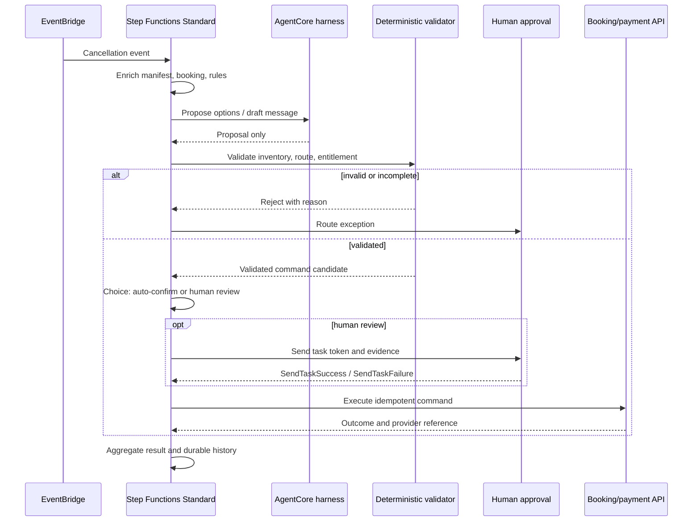

多代理系統最危險的瞬間，不是它回答得不夠像人，而是它把一個看似合理的回答直接變成訂位、付款、退款或其他不可逆的狀態變更。AWS Compute Blog 在 2026 年 9 月 14 日提出的 [Step Functions 與 Bedrock AgentCore 參考流程](https://aws.amazon.com/blogs/compute/validating-multi-agent-decisions-with-step-functions-and-bedrock-agentcore/) ，正好把問題改寫成一個工程邊界：**Agent 可以提案，但不能直接寫入關鍵系統；提案必須先經過確定性驗證，必要時再等待人工核准，最後才由受控的執行步驟產生副作用。**

本文不把這個航空改簽案例當成已證明的生產系統，也不補寫不存在的公開 demo repository 或 benchmark。重點是拆解一個可測試的控制流：哪些工作交給非確定性的 Agent，哪些工作必須留在可重播的 workflow 與程式規則裡，以及這些邊界如何處理平行規模、等待、超時、重試、冪等與稽核。

> **花花的一句話**
>
> Agent 的輸出是待驗證的提案，不是可以直接執行的命令；真正改變關鍵狀態的，必須是驗證後、可追蹤且具備冪等性的執行步驟。

## 先把「會推理」與「能改狀態」拆開

AWS 的參考案例以航班取消後的乘客改簽為例。每位乘客的偏好、艙等、會員權益、航段銜接與可用座位不同，Agent 適合在這種資訊不完整、候選方案很多的地方提出前三個替代選項，也可以草擬給乘客的通知文字。另一個 Agent 可以根據路線、延誤時間與原因草擬補償說明。

但「提出航班」和「真的訂下航班」不是同一種責任。航班可能已經沒有座位、違反票價規則、路線不成立，或 Agent 誤讀了適用的補償制度。因此參考流程把系統分成四類工作：

- **Proposal**：AgentCore harness 根據上下文提出候選方案或草擬文字，只回傳結果，不直接寫 reservation 或 payment system。
- **Validation**：Lambda 等確定性 Task 查即時庫存、票價與路線規則，計算或核對 entitlement，剔除不存在、過期或不合規的候選。
- **Approval**：Choice state 先判斷哪些驗證通過的個案可自動確認；例外則送人工佇列，workflow 以 task token 暫停。
- **Execution**：只有通過驗證與核准的結構化命令，才交給訂位、退款或通知 API；執行時仍需使用與 decision 綁定的 idempotency key。

這個拆分的價值不是宣稱 deterministic code 永遠正確，而是讓錯誤可以被定位：是提案不合理、驗證器漏規則、人工沒有核准、還是外部 API 的 side effect 沒有正確去重。

## 一條可讀、可測試的控制流

這裡有一個容易被忽略的 AgentCore 整合限制：AWS 的 [AgentCore harness integration](https://docs.aws.amazon.com/step-functions/latest/dg/connect-bedrockagentcore.html) 目前是 request-response pattern；AgentCore Task 不支援 `.sync` 或 `.waitForTaskToken`，而且 Step Functions Task 最長是 15 分鐘（900 秒）。因此人工等待不能塞在 Agent Task 裡，必須由另一個支援 callback 的 Task 負責。若 Step Functions Task 先超時，harness 仍可能繼續跑到自己的 timeout；兩邊的 timeout 要對齊，否則會留下不再被 workflow 使用、卻仍消耗資源的推理。

## 合約表：每一段都要有責任、輸出與失敗邊界

下表是把參考流程轉成實作前可以審查的 contract。它不是 AWS 服務的正式術語，而是方便團隊把「誰能做什麼」寫清楚的工程分界。

| 階段 | 可接受輸入／輸出 | 誰擁有決策權 | 失敗與副作用規則 |
| --- | --- | --- | --- |
| Proposal | 乘客與業務上下文 → 候選航班、補償草稿 | Agent 提供候選，不擁有 side effect 權限 | 可因 hallucination、過時資料或格式錯誤而被拒；不得呼叫寫入型 API |
| Validator | proposal + 即時庫存、票規、路線與規則表 → validated options / entitlement | 確定性程式與版本化規則 | 語意不合規不是重試理由；回傳明確 rejection reason 或升級人工 |
| Approval | 驗證證據、差異、風險與 task token → approved / rejected | 人或明確的 Choice policy | 用 `.waitForTaskToken` 暫停；逾時、撤回或 token 錯誤必須進例外路徑 |
| Execution | 已核准的結構化 command + decision ID → provider reference | 受 IAM 與 API policy 約束的 deterministic Task | 只有這一段可產生訂位、退款等副作用；每次呼叫帶 idempotency key |
| Timeout | Agent 900 秒上限；人工等待採業務 SLA | Workflow owner | Agent timeout 與 harness timeout 要一致；approval timeout 不能默默 auto-approve |
| Retry | 可分類的暫時性錯誤 → 重試結果 | State machine 的 `Retry` policy | 只重試 throttling、網路或暫時服務錯誤；不要重試已判定無效的提案 |
| Catch | 不可恢復錯誤 → human queue / compensating path | Workflow owner 與 on-call | Agent、Lambda、Map 都應有可觀測的 `Catch`；不要讓單一乘客拖垮整批流程 |
| Idempotency | passenger ID + decision ID / validated option-set hash → stable key | 執行 API 與資料擁有者 | Standard Workflow 的 exactly-once 不等於外部 API 不會重複；重試、redrive、client replay 都要是 no-op |

## Distributed Map：平行不是無限放大

當一次取消事件影響數百或數千名乘客，逐一處理會讓人工佇列與回應時間一起惡化。AWS 的 [Distributed Map](https://docs.aws.amazon.com/step-functions/latest/dg/state-map-distributed.html) 把每個 item 執行成獨立的 child workflow，讓同一套「Agent → validator → routing → execution」在個案層級平行展開。每個 child 有自己的 execution history，也能把大量輸入交給 Map Run 管理。

文件列出的選擇條件包括：需要超過 40 個 concurrent iterations、執行事件可能超過 25,000 筆，或資料集超過 256 KiB。Distributed Map 預設可以同時執行最多 10,000 個 child workflow；這是平台能力上限，不是你應該直接採用的產品設定。參考文章把 `MaxConcurrency` 設為 1000，理由是要保護下游 booking 與 inventory system。實際值應由庫存 API 的 rate limit、AgentCore／模型吞吐、Lambda concurrency、人工審核量與可接受的失敗比例共同決定。

平行化也改變了失敗處理：一位乘客的無效航班不應使所有 child 失敗，但若失敗比例超過門檻、ItemReader 出錯或下游全面 throttling，parent workflow 需要停止或改走批次例外處理。這是為什麼 `MaxConcurrency`、Map failure threshold、每個 child 的 `Catch` 與 aggregate state 要一起測，而不是只把 Map 從 Inline 換成 Distributed。

> **花花的工程提醒**
>
> `10,000` 是 Distributed Map 的平行能力，不是吞吐量保證。每個 child 還會產生 Agent 推理、驗證、狀態轉移與下游 API 壓力；先用下游可承受的 concurrency 建模，再用失敗注入驗證。

## waitForTaskToken：把人放在例外路徑，而不是 Agent 迴圈裡

人工審核的正確抽象不是讓 Agent 不斷輪詢「人有沒有按同意」，而是把一個可識別的 task token 交給通知或任務系統，讓 Step Functions 暫停，直到外部程序呼叫 `SendTaskSuccess` 或 `SendTaskFailure`。AWS 的 [callback integration pattern](https://docs.aws.amazon.com/step-functions/latest/dg/connect-to-resource.html) 可以搭配 SQS、SNS 或 Lambda 等傳遞審核工作；token 必須由同一 AWS account 的 principal 回傳。

參考文章以四小時作為人工 review timeout，這是案例中的政策設定，不是通用的服務保證。正式設計要回答：四小時後是拒絕、轉人工佇列、重新產生提案，還是取消整筆交易？審核畫面要看到原始 proposal、validator 的證據與版本、將要執行的 command、風險差異與 decision ID；不能只給一個沒有上下文的 Approve 按鈕。

等待期間不需要讓 Lambda 或 Agent 持續佔住執行資源，但「callback 不跑 compute」不代表整個流程沒有成本。要把 Step Functions state transitions、AgentCore 與模型呼叫、通知系統、資料保存和人工處理時間放進成本模型；也要設定 heartbeat、到期與撤銷，避免遺留 token 永遠沒有回應。

## Timeout、Retry、Catch 與冪等必須成套

### Timeout 先界定「還能不能安全等」

Agent Task 的 900 秒上限是明確的 workflow 邊界；Lambda validator 也要有合理的 timeout，不能讓一個卡住的即時庫存查詢拖住整個 child。人工 approval 則是業務 SLA，不應用「等久一點」代替政策。對每個 timeout 都要有可觀測的 reason code 與下一步。

### Retry 只處理暫時性錯誤

Step Functions 的 [`Retry` 與 `Catch`](https://docs.aws.amazon.com/step-functions/latest/dg/concepts-error-handling.html) 可以針對 Task、Parallel、Map 設定錯誤分類、間隔、最大次數與 exponential backoff。適合 retry 的例子是 throttling、短暫網路故障或 Lambda service exception；「Agent 提議的航班不存在」是業務驗證失敗，不是把同一份提案多跑幾次就會變好的暫時性錯誤。

`Catch` 則把不可恢復的單一個案送去 human queue，或把整個 Map Run 交給批次補救流程。這裡不應只在最後加一個 `States.ALL`；錯誤命名、輸入保留、敏感資料遮罩與回放資訊都要能讓 on-call 判斷是否可安全重跑。

### Exactly-once 不替你完成外部去重

對需要長時間、耐久與稽核的流程，AWS 建議使用 [Standard Workflows](https://docs.aws.amazon.com/step-functions/latest/dg/choosing-workflow-type.html)。它的 workflow execution 是 exactly-once 模型，最長可達一年，完整 execution history 可透過 API 取回至多 90 天；Express Workflows 則是 at-least-once，最長五分鐘，更適合可冪等的高量事件處理。

但「workflow 不重跑」和「reservation API 永遠只收到一次請求」是不同命題。Retry、redrive、網路斷線後的未知結果、使用者重送事件，以及下游 provider 的 timeout，都可能讓 client 不知道 side effect 到底有沒有成功。執行步驟應使用 `passengerId + decisionId`，或通過驗證的 option set hash，產生穩定的 idempotency key；訂位與付款 API 必須把它當成正式契約，重複請求回傳既有結果，而不是再次扣款或開票。

## Durable history 是稽核材料，不是完整真相

Standard Workflow 會記錄 state transitions，讓團隊可以回看輸入、輸出、哪個 validator 通過、誰完成 approval，以及最後送了哪個 command。Distributed Map 的 child history 也讓每位乘客的決策脈絡可分開檢查。這比只保存最後一段自然語言答案更接近「為什麼這樣做」的稽核需求。

仍然要保留幾個邊界：

- AWS 文件所說的 90 天是 Step Functions execution history 的可取回期間，不是企業法規要求的長期保存方案。合規留存應把經過遮罩與存取控制的 proposal、validation result、approval event、command 與 provider reference 另存到你的 evidence store。
- history 的存在不證明輸入資料正確、規則版本正確或 validator 沒有 bug。每個決策都應保存規則版本、資料時間點、Agent harness／model 設定與 schema version。
- AgentCore 整合只回傳最後的 assistant message；若需要調查工具使用與推理步驟，還要依照官方文件開啟 CloudWatch 等觀測能力，並設計敏感資料 redaction。
- durable execution 不是資料治理。乘客資料、付款資訊、token 與外部回應都需要最小權限、加密、保留期限與誰能回放的政策。

## Reference architecture 與 production proof 的界線

這篇 AWS 文章的證據是可讀、可實作的 workflow pattern：它示範 EventBridge trigger、enrichment、Distributed Map、AgentCore proposal、Lambda validation、Choice routing、human callback、execution、aggregation，以及每一段應放的 timeout、retry、catch 與 idempotency。這足以支持一個設計判斷：**把 Agent 限制在 proposal boundary，能讓關鍵 side effect 進入可測試的 deterministic gate。**

但它沒有提供負載測試、故障注入結果、實際成本曲線、跨區域失敗分析、獨立安全審查或 production incident history。因此不能從「流程圖能跑」推論「航空公司可以安全全自動改簽」，也不能把 AWS 的服務保證誤寫成你的業務規則正確性。尤其補償法規、票價規則、庫存一致性與付款 provider 的語意，仍然是各團隊必須自行版本化、測試與審核的責任。

更成熟的驗證計畫至少要建立四類測試：

1. **語意拒絕測試**：故意餵入不存在航班、無座位、錯誤路線、過期 entitlement 與不合法 schema，確認不會抵達 execution。
2. **控制流測試**：測試 Agent timeout、validator timeout、callback timeout、錯誤 token、重試耗盡、單一 child 失敗與 Map failure threshold。
3. **副作用測試**：重送相同事件、redrive、API timeout 後重試、人工重複按核准，確認 idempotency key 只產生一個訂位或付款。
4. **營運測試**：以真實下游 quota 建立 concurrency 上限，量測 state transitions、token usage、延遲、人工 backlog、資料留存與回放權限。

## 工程上的落點

如果你正在把 Agent 接進任何會改變關鍵狀態的流程，可以先採用這個最小邊界：

- 把 proposal schema 與 execution command schema 分成兩個不可混用的型別；前者允許不確定性，後者只能由 validator 產生。
- 讓所有寫入型 API 都只被 deterministic Task 呼叫，並在 IAM、network 與 application layer 同時拒絕 Agent 直連。
- 把 validator 當成產品程式碼：規則版本、測試題庫、拒絕原因與回歸結果都要能追蹤。
- 對每個可能重跑的副作用建立 idempotency contract，不把 Standard Workflow 的 exactly-once 當成下游保證。
- 把人工核准設計成帶證據的 callback，明確處理到期、撤回、拒絕、重送與權限變更。
- 先把整條流程的 trace 與成本帳建立起來，再決定是否擴大 Distributed Map 的 concurrency。

若要補齊更大的架構脈絡，可以先讀 [AI Agent 完整架構指南](/blog/64-ai-agent-guide/)，再看 [Enterprise Agentic AI 治理](/blog/39-enterprise-agentic-ai-governance/) 如何把 policy、evaluation 與 audit 放進 control plane；[Agentic AI 平台契約](/blog/93-agentic-ai-platform-contract/) 則把「上線前必須接上的控制面」收斂成可審查的契約。若你的 Agent 還會透過 MCP 呼叫外部工具，也可對照 [Forge MCP auth runtime](/blog/99-forge-mcp-auth-runtime/) 的身分、同意與留痕邊界。

## 來源與延伸閱讀

- [Validating multi-agent decisions with Step Functions and Bedrock AgentCore](https://aws.amazon.com/blogs/compute/validating-multi-agent-decisions-with-step-functions-and-bedrock-agentcore/) — AWS Compute Blog，2026-09-14；本文的主要參考架構與限制來源。
- [Invoke Amazon Bedrock AgentCore harness with Step Functions](https://docs.aws.amazon.com/step-functions/latest/dg/connect-bedrockagentcore.html) — AWS Step Functions Developer Guide；AgentCore integration pattern、900 秒限制與 response 行為。
- [Using Map state in Distributed mode](https://docs.aws.amazon.com/step-functions/latest/dg/state-map-distributed.html) — AWS Step Functions Developer Guide；child executions、Map Run 與 concurrency 條件。
- [Discover service integration patterns](https://docs.aws.amazon.com/step-functions/latest/dg/connect-to-resource.html) — AWS Step Functions Developer Guide；`waitForTaskToken` callback 語意與 token 邊界。
- [Choosing workflow type in Step Functions](https://docs.aws.amazon.com/step-functions/latest/dg/choosing-workflow-type.html) — AWS Step Functions Developer Guide；Standard／Express 的耐久、執行語意與 history 期限。
- [Handling errors in Step Functions workflows](https://docs.aws.amazon.com/step-functions/latest/dg/concepts-error-handling.html) — AWS Step Functions Developer Guide；`Retry`、`Catch` 與 timeout error handling。
