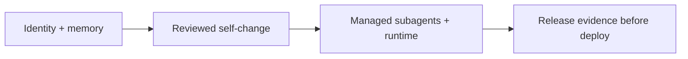

自我修改的 Agent 把「發布什麼」變成一個需要回答的問題。傳統服務通常把 source repository、build pipeline 與 release artifact 視為相對穩定的鏈；但像 [Ouroboros 官方 repository](https://github.com/razzant/ouroboros) 所描述的 Agent，會持續保存身分、記憶與歷史，能協調 managed subagents，也能修改自己的程式、架構、prompts、tools 與 dependencies。這種系統即使每次修改都經過 review，部署前仍需要一份外部可檢查的 provenance：不是只說「測試有過」，而是讓人能把 artifact 追溯到確定的 source、組成與檢查結果。

因此，本文只聚焦一個工程問題：**如何讓 self-modifying agent 的 release provenance 在部署前可被檢查？** 我以 [Ouroboros v7.4.4 release](https://github.com/razzant/ouroboros/releases/tag/v7.4.4) 的公開材料為例，分開說明 first-party claim、可下載的 release evidence，以及目前仍不能從這些檔案推導出的結論。

> **花花的一句話**
>
> 對會改寫自己的 Agent 而言，發布 provenance 不是附加的簽名檔，而是把「它現在是什麼」與「它如何被建出來」接回同一條可驗證的鏈。

## 先把 Agent 的變動面說清楚

Ouroboros 的 README 把產品描述成一個具有持續身分、durable memory 與跨 task／restart history 的 general-purpose AI agent；它也宣稱可以重寫執行自身的 code、architecture、prompts、tools 與 dependencies，並協調 specialist agents。這些是專案的 first-party capability claims，不能直接當成獨立測試結論。

從 repository 的實作與文件可以先建立四個需要被納入 provenance 的變動面：

1. **身分與記憶（identity and memory）**：README 將 identity、memory、dialogue、knowledge、reflection 與 version history 視為同一段持續 biography。`ouroboros/memory.py` 也顯示 identity、scratchpad、journal 與 dialogue history 是 runtime data 的持久化面。這表示「同一個 Agent」不只是一個 model version；部署檢查也要知道 data root、memory schema 與 migration 是否屬於 release scope。
2. **自我修改（self-modification）**：官方文件將可修改面擴到 application code、architecture、prompts、tools 與 dependencies，並以 Git history、review evidence、protected surfaces 與 restart checks 使變更可追溯。要注意，Git history 能追蹤變更，不等於它已證明每個自我修改都正確或安全。
3. **受管理的子 Agent（managed subagents）**：v7.4.4 的 release notes 提到，可以個別啟用或停用已配置的 subagents，且 label 會反映 model 與 route；repository 的 `SubagentDispatch` 則把 lane、model、executor、route、profile 與 capability delta 在 dispatch 時解析並寫入 durable projection。對發布者來說，這些 managed runtime 與 route 也可能改變實際行為，不能只鎖主程式版本。
4. **打包的 execution surface**：README 說明桌面與 headless CLI 共用 managed tasks、progress、artifacts、logs 與 schedules，桌面包也含 Claudexor execution layer。這使 packaged runtime、embedded repository bundle 與 companion runtime 都成為 artifact 內容，而不是部署後才臨時下載的細節。

這四面可以用一個簡單的邊界表示：

## v7.4.4 的證據鏈：從 commit 到可下載 artifact

v7.4.4 的 release page 宣稱 release built from commit `796f2e8708ee375216783a7fd80a3bf79f081079`，並列出 workflow run、artifact digest、SBOM 與 smoke receipt。比較重要的是，這些資料不是只散落在 release notes，而是以幾種互相對照的檔案交付。

### 1. Git tag 與 source commit：先固定「從哪裡建」

release page 與 [release workflow](https://github.com/razzant/ouroboros/blob/v7.4.4/.github/workflows/ci.yml) 將 `v7.4.4` 與 source commit 綁定。workflow 也檢查 annotated tag 是否存在、tag 的 peeled commit 是否等於 build commit，避免只看到同名但指向不同內容的 ref。

這是 self-modifying system 的第一道界線：任何 self-change 若要進入 release，必須先落在一個可定位的 Git object 上。它回答「source identity」；它不回答「這個 commit 內容是否符合組織的安全政策」，後者仍需要 review、測試與人工決策。

### 2. SHA256SUMS：把下載檔案和內容 digest 對上

`SHA256SUMS` 為每個可安裝 platform artifact、對應 SBOM 與 smoke receipt 列出 SHA-256 digest。`release-evidence.json` 也在每個 artifact row 中記錄 `name`、`proofId`、`sha256`、`size`、SBOM 檔名與 smoke receipt 檔名。這裡的價值在於「檔名」不再是唯一識別；部署者可以先對下載檔案重新計算 digest，再對照 evidence index。

SHA-256 只證明「你手上的位元組是否和被記錄的位元組相同」。它不證明 artifact 沒有惡意行為，也不證明記錄 digest 的上游流程本身值得信任；所以 digest 必須和 source、build provenance 及內容清單一起看。

### 3. CycloneDX SBOM：把 artifact 內的元件列出來

release page 宣稱每個 installable platform artifact 都有 CycloneDX SBOM attestation。SBOM 的角色是回答「這個 package 帶了哪些 components」，而不是回答「每個 component 是否安全」。例如 release 中的 macOS SBOM metadata 由 Syft 產生，並以 CycloneDX 格式交付；它可以支援依賴盤點、漏洞比對與 license review，但不能替代 runtime 測試或人工審查。

對 Ouroboros 這類包含 packaged runtime、embedded repository bundle 與 Claudexor 的 Agent，SBOM 特別重要：如果 managed subagent 的 execution layer 或某個 companion dependency 改版，部署審查不應只看主 repository commit。

### 4. GitHub build provenance：把 artifact 接回 workflow

release notes 提供兩個 `gh attestation verify` 範例：一個驗證 artifact 的 GitHub build provenance，另一個以 CycloneDX predicate 驗證 SBOM attestation；兩者都指定 repository、signer workflow、source digest 與 `refs/tags/v7.4.4`。這個命令設計把「哪個 workflow、替哪個 source ref、產生了哪個檔案」變成部署前可以執行的查核步驟。

但要精確區分兩件事：release page 是在提供驗證方法與 first-party release claim；本文沒有替每個大型 installer 重新下載並執行 `gh attestation verify`，因此不把「可驗證」寫成「本文已獨立驗證」。正式 pipeline 應在自己的 trusted runner、權限與 policy 下重新執行這些檢查。

### 5. release-evidence.json 與 smoke receipts：把結果組成索引

`release-evidence.json` 是這條鏈的索引層。它把 `source`（repository、tag、commit）、`workflow`（run URL 與 gate status）、`artifacts`（digest、size、SBOM、receipt）與 verification commands 放在同一個 schema version 1 的 JSON 中。每個 `release-smoke-*.json` 則記錄 artifact、release tag、source commit、sha256、實際執行的 checks 與 `status: passed`。

這讓 smoke test 的意義更清楚：它不是「模型很安全」的證明，而是「這一個已打包檔案在特定 CI smoke checks 中通過」的 receipt。例如 macOS receipt 列出 applications shortcut、arm64 executable、embedded runtime、repo bundle 與 packaged CLI help；Linux AppImage receipt 則列出 extract-and-run、gateway readiness、clean shutdown、shared libraries 與 packaged CLI help。這些檢查能降低「source 測試過、包裝後卻壞掉」的風險，但仍是有限的 execution sample。

> **花花的工程提醒**
>
> `passed` 是一個有範圍的結果：它只表示指定 artifact、指定 runner 與指定 checks 的結果，不應被升格成所有硬體、root／boot 行為、外部 provider、長時間 memory continuity 或 Agent decision quality 都已通過。

## 從 release evidence 到部署 gate

如果要把這套做法移植到自己的 self-modifying Agent，我會把部署前檢查拆成四個可拒絕發布的 gate：

| Gate | 需要固定的證據 | 失敗時應停止什麼 |
| --- | --- | --- |
| Source identity | annotated tag、peeled commit、workflow run、review record | 停止產生或接受未綁定 source 的 artifact |
| Artifact integrity | SHA256SUMS、evidence index、下載檔重新計算的 digest | 停止安裝 digest 不一致的檔案 |
| Composition | 每個 artifact 的 CycloneDX SBOM 與 attestation | 停止帶有未批准 runtime、dependency 或 subagent layer 的部署 |
| Runtime evidence | 對應 artifact 的 smoke receipt、環境與 checks | 停止把 source-only test 當成 packaged runtime 的證據 |

實作上，`release-evidence.json` 不應只是 release note 的裝飾檔。部署系統可以把它當成 machine-readable manifest：先檢查 tag／commit 是否符合預期，再檢查每個 artifact 的 digest、SBOM 與 receipt 是否存在且互相指向，最後在 policy 允許的環境執行 provenance verification 與必要的 smoke／install checks。任何 `NOT_RUN`、缺檔、source mismatch 或 attestation 失敗，都應產生明確的 blocked 狀態，而不是讓 Agent 自己解釋成「大概可以」。

對 self-modification 來說，還需要把變動面和證據欄位建立固定對應：

- code、architecture、prompt、tool 與 dependency 的變更，指向 commit、review record 與 SBOM diff。
- identity、memory、journal 與 history schema 的變更，指向 migration version、fixture 或 restart／recovery check。
- managed subagent 的 model、route、executor 與 capability 變更，指向 dispatch projection、runtime digest 與 route-specific smoke receipt。
- packaged desktop、CLI、embedded repository bundle 與 companion runtime 的變更，指向每個 platform artifact 的 digest、SBOM 與 smoke receipt。

這種 mapping 的重點不是把所有運行時狀態塞進一個 JSON，而是避免「主 repo 有 provenance、真正被部署的執行面沒有 provenance」的斷鏈。

## 哪些是 first-party claim，哪些仍未驗證？

截至 v7.4.4 的公開材料，可以負責任地說：

- **Ouroboros 自己宣稱**它具備持續 identity、durable memory、self-modification、evolution campaigns 與 live swarm；這些描述可在 [README 的 capability section](https://github.com/razzant/ouroboros/blob/v7.4.4/README.md) 與 repository code 中檢查其設計意圖，但不是本文的獨立能力評測。
- **v7.4.4 release materials 記錄** source commit、SHA256SUMS、release-evidence.json、CycloneDX SBOM、GitHub attestation 指令與各平台 smoke receipts；這些是可下載、可解析、可拿來重跑查核的 release evidence。
- **release workflow 宣稱並記錄** full test、UI／Docker smoke、skill smoke、packaged artifact smoke 與 Android build 等 gate status。這仍是該專案 CI 的 first-party result；它不等於第三方 reproducibility study。

公開材料仍不足以推出以下結論：self-modification 在所有任務中都能保持正確；durable memory 永遠不會遺失、污染或錯誤回憶；managed subagents 在所有 model／route 組合下都會遵守預期權限；或任何一個通過 smoke 的 installer 可以在所有硬體、作業系統、provider 與 production data 上安全運作。Android setup 的說明尤其把 root、boot、hardware 與 phone runtime behavior 排除在 CI artifact checks 的保證之外。

> **花花的判斷**
>
> self-modifying Agent 的成熟度，不該用「它能不能自己改自己」單一衡量；更有用的問題是，每一次改動能否在部署前被定位、列出組成、重跑必要檢查，並在證據不完整時確實停下來。

## 給平台團隊的最小落地清單

若今天要為一個會修改自身的 Agent 加上發布 provenance，可以先做一個小而硬的版本：

1. 每次 release 只接受 annotated tag 與唯一 source commit，並把它寫入 machine-readable evidence manifest。
2. 對每個實際部署的 platform artifact 計算 SHA256；不要只 hash source archive，也不要讓 packaged runtime 在安裝後才偷偷下載未鎖定的執行面。
3. 產出對應 artifact 的 SBOM，將 model adapter、subagent runtime、tool bridge 與 native／Python／Node dependencies 視為 composition，而不是附註。
4. 用 trusted build provenance 把 artifact 接回 workflow、repository、source ref 與 commit；同時保留人類可讀的 verification command。
5. 讓 smoke receipt 精確記錄測了哪個檔案、哪個 commit、哪些 checks、哪個環境，以及未測到什麼。
6. 把 evidence manifest 接到 deployment policy：缺 digest、缺 SBOM、缺 receipt、attestation mismatch 或 `NOT_RUN` 都是阻擋條件。
7. 針對 identity／memory migration 與 managed subagent route 做獨立的 restart、recovery、permission 與 routing tests；不能用 artifact smoke 代替它們。

這條路徑的工程價值，在於把「Agent 會持續改變」轉成一個可審查的 release interface。它不會自動解決模型判斷、記憶污染或工具濫用，但至少讓部署者知道自己正在批准哪個 commit、哪組位元組、哪批依賴，以及哪一組檢查結果。

## 延伸閱讀與來源

- [Ouroboros v7.4.4 release notes and assets](https://github.com/razzant/ouroboros/releases/tag/v7.4.4)：版本變更、SHA256SUMS、release-evidence.json、SBOM、smoke receipts 與 attestation 指令。
- [Ouroboros README at v7.4.4](https://github.com/razzant/ouroboros/blob/v7.4.4/README.md)：identity、memory、self-modification、subagent swarm 與 packaged runtime 的 first-party 說明。
- [Ouroboros release workflow](https://github.com/razzant/ouroboros/blob/v7.4.4/.github/workflows/ci.yml)：tag checks、artifact build、SBOM、attestation 與 smoke steps。
- [AI Agent 完整指南](/blog/64-ai-agent-guide/)：從 Agent 架構、狀態記憶到評測與 production governance 的基礎路徑。
- [Agentic AI 平台契約](/blog/93-agentic-ai-platform-contract/)：把 Evidence、Policy、Judge、Trace 收斂成上線前可檢查的控制面契約。
- [企業 AI Agent 安全架構](/blog/43-enterprise-ai-agent-security/)：延伸閱讀身分、工具授權、記憶與供應鏈邊界。
