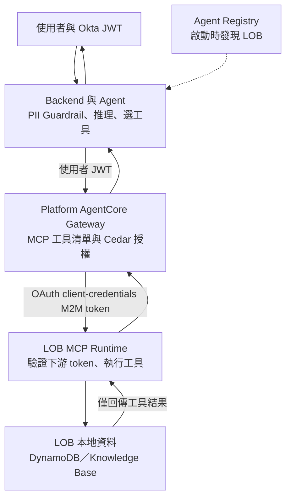

跨部門 Agent 常遇到一個兩難：把各業務線（line of business，LOB）的資料複製到中央，會模糊資料責任與部署界線；讓 Agent 直接跨帳號存取每套資料，又會把權限與 IAM 維運成本推給平台。AWS 在 2026 年 9 月 24 日發布的 [AgentCore Gateway 與 MCP 多帳號 walkthrough](https://aws.amazon.com/blogs/machine-learning/build-a-multi-account-ai-agent-with-agentcore-gateway-and-mcp/)，示範另一個切法：資料與工具留在 LOB account，Agent 與統一工具入口放在 platform account，請求只帶回工具產生的結果。

這是 AWS 的架構示範，不是 production 驗收證據。其[官方 sample repository](https://github.com/aws-samples/sample-amazon-bedrock-agentcore-banking-mcp-multi-account) 明確標註「Proof-of-concept demo — NOT for production use」，而且使用合成資料。最值得帶走的是信任邊界的分工：**使用者身分在 Gateway 的 Cedar policy 中授權；Gateway 對下游 LOB 使用另一組 M2M 憑證。** 兩條路徑不能混稱為 end-user delegated access。

## Hub-and-spoke 把資料所有權與 Agent 控制面分開

範例由四個 AWS account 組成：一個 platform account，加上 Retail Banking、Transaction Banking、Lending & Wealth 三個 LOB account。Platform account 執行 Strands Agent、AgentCore Gateway、Agent Registry 與 web application；每個 LOB 在自己的 account 執行 AgentCore Runtime 上的 MCP server，存取本地 DynamoDB 或 Lending & Wealth 的 Knowledge Base。範例列出 16 個工具；Gateway 以單一 MCP endpoint 對 Agent 提供工具發現與呼叫。

使用者問題先經 Okta 登入與 web backend。Backend 在輸入及輸出套用 Bedrock Guardrails 的 PII 處理，再把帶有使用者 JWT 的請求交給 AgentCore Runtime 上的 Agent。Agent 將 prompt 送給模型並決定工具需求，之後把原始使用者 JWT 放在 Gateway 請求的 `Authorization` header。JWT 含有 `sub`、群組與 audience 等 claims；Agent 轉送它，並不代表 Agent 自己完成授權判斷。

Gateway 用 MCP 語義搜尋與 `tools/list` 對外呈現已註冊 target 的工具。範例也在 Agent 啟動時查 Agent Registry，取得可用 LOB MCP server 的登錄資訊。這是兩個不同的責任：Registry 幫 Agent 找到有哪些 LOB 能力；Gateway 是 Agent 實際連接、發現工具並呼叫 target 的 MCP endpoint。新增 LOB 時，團隊要部署 MCP server、完成 target 與 Registry 設定；Gateway 的下一次工具清單查詢才會看到新工具。AWS 原文稱 Registry 為 Preview，採用前應確認其目前服務狀態與介面支援。

## 兩段身分流程：user JWT 到 Cedar，M2M token 到 LOB

Gateway 收到 user JWT 後，若已關聯 AgentCore Policy engine，便以 Cedar policy 評估工具動作。Gateway 可在路由前允許或拒絕每次工具呼叫；範例使用 ENFORCE 模式與 default-deny，policy 需明確 permit `tools/list`、特定讀取工具或其他允許的 action，也可明確 forbid 危險動作。這把 user-level 授權放在 Gateway，而非依賴模型或 prompt 判斷。

通過政策的請求會走第二條路徑：Gateway 向 AgentCore Identity 取得 OAuth 2.0 client-credentials access token，然後以該 M2M token 呼叫目標 LOB 的 MCP server。LOB Runtime 的 `customJWTAuthorizer` 依 Okta OIDC 設定驗證收到的 token；MCP server 再用自己的 runtime role 存取同帳戶內的 DynamoDB 或 Knowledge Base。這裡的 token 代表機器用戶端，不會自動攜帶終端使用者的 delegated 權限或資料列層級身分。

因此，這個 sample 的授權模型是「Gateway 用 inbound user JWT 做 Cedar 決策，再用 outbound M2M credential 呼叫 LOB」。AWS 提到 AgentCore Identity 另有 on-behalf-of（OBO）token exchange，可把使用者身分帶到下游，但同一篇文章也說此實作使用 M2M，原因是 sample 使用的 Okta developer account 不支援 OBO。若 LOB 必須自行做 per-user row-level access control，就得另行設計與驗證 OBO 或其他 delegation 流程；不能把本範例的 M2M 描寫成已完成 end-user delegation。

> **花花的工程提醒**
>
> Gateway 的 Cedar 判斷只有在請求確實經過 Gateway 時才是有效邊界。AWS 說明這個 sample 主要依賴 OAuth audience 驗證，並建議 production 將 LOB Runtime 的 `allowedWorkloadConfiguration` 限定為 Gateway ARN，要求 workload identity chain 包含該 Gateway，降低直接呼叫 Runtime 繞過 Cedar 的風險。

## 部署門檻不只是跑一次 `deploy.sh`

Sample 的 README 要求 AWS Organizations 下四個同組織的帳戶、四個 AWS CLI profiles、平台帳戶已開通 Bedrock 模型存取，以及各帳戶的 AgentCore 設定；另外需要 AWS CLI v2、Python 3.12+、Docker、Node.js 18+、CDK CLI、AgentCore CLI 和 Okta authorization server。指定 `us-east-1` 是 README 對模型存取的前提。首次部署由 `deploy.sh` 建立 CDK 與帳戶資源、準備範例資料、部署三個 MCP server、Gateway target、OAuth provider 與 Cedar policy、註冊 Agent Registry，最後部署 Agent 和 CloudFront／ECS web app。完成後仍要把部署產生的 CloudFront URL 回填 Okta redirect URI。AWS sample README 將完整部署估為約 25–35 分鐘；這是其示範環境的估計，不是部署 SLA。

文章中的端到端路徑還包含 Guardrails 的輸入與輸出檢查、工具執行 trace，以及清理腳本 `./cleanup.sh`。清理會刪除四個帳戶的 AgentCore 元件、Okta 設定、MCP deployments、CDK stacks 和 sample data；演練前要確認帳戶與 profile 指向，演練後也要核對刪除結果與仍在計費的資源。

更關鍵的是，README 的登入 demo 只有一位具有全部 16 個工具權限的使用者；Policy denial 範例則示範封鎖 `delete_customer`。這能展示「有政策可在 Gateway 阻擋工具」，卻不能證明不同使用者群組、租戶、記錄範圍或委派權限已經完整測試。資料留在 LOB account 也不等於資料完全不離開：工具結果會回到 platform account，進入 Agent 上下文並參與模型推理，因此輸出欄位、PII 清理、prompt injection、trace retention 與下游模型資料處理都必須列入資料流審查。

## 把參考架構推向正式環境，先補可驗證控制

AWS 的 production guidance 指向幾個具體工作：為 LOB Runtime 設定 `allowedWorkloadConfiguration`；依信任邊界使用不同 OAuth audience，避免 token 橫向重用；限制 Gateway 與 Runtime 的網路入口，評估 VPC、PrivateLink 與私有子網；為 Gateway 開啟 CloudWatch Logs data-plane logging，並為 CloudTrail 啟用 AgentCore Gateway data events；將 platform 與 LOB 帳戶的稽核資料集中到專用 logging account。Sample 的 README 也列出 WAF、自訂網域、監控告警、X-Ray、Secrets Manager 輪替與更多 Guardrails 作為待補項目。這些都是待驗證的控制設計，不是把建議欄位補上就自動取得安全保證。

落地前可要求每個 LOB owner 簽核暴露的 MCP tools、輸入輸出 schema、資料分類、runtime role 和 token audience；平台團隊則維護 Gateway target 變更審查、Cedar 測試案例、工具清單快照與版本化評測集。把允許、拒絕、逾時、IdP 失效、MCP server 不可用、工具 schema 變更與 Registry 暫時無法查詢都放進測試矩陣，並確認 trace 能把 user principal、Gateway policy decision、target、tool、M2M client 與結果串在一起，同時遮罩敏感欄位。

> **花花的判斷**
>
> 這個模式有價值的地方，是讓跨帳號整合建立在一致的 MCP 契約與明確的政策入口上，而不是把 LOB 資料搬進中央。它適合當多團隊平台的可部署起點；但只有在 user-to-policy 對應、Gateway-only workload 路徑、帳戶隔離、稽核與故障演練都被實際驗證後，才有資格討論 production readiness。

## 工程團隊可以怎麼採用

先挑一個低風險、唯讀的 LOB 工具，確認它的輸入 scope、資料最小化和輸出遮罩，再走完「登入 JWT → Agent Runtime → Gateway Cedar → M2M OAuth → LOB Runtime → 本地資料」的 trace。第二步建立至少兩種使用者角色與一個明確拒絕案例；如果下游需要每位使用者自己的資料權限，先把 OBO 路徑單獨做成驗證項目。最後才擴到寫入工具、更多帳戶及自動 onboarding，並把 target 加入、policy 更新、工具版本相容、告警、回復和清理納入營運手冊。

若要補上周邊治理脈絡，可接著讀[AI Agent 實戰指南](/blog/64-ai-agent-guide/)、[GitHub MCP 企業控制](/blog/87-github-mcp-enterprise-controls/)，以及[AgentCore Consent Portal 的 OAuth 身分流程](/blog/104-aws-agentcore-consent-portal/)；三者分別補充 Agent runtime、MCP 管理政策與 end-user token flow 的不同面向。

## 來源

- [AWS Machine Learning Blog：Build a multi-account AI agent with AgentCore Gateway and MCP](https://aws.amazon.com/blogs/machine-learning/build-a-multi-account-ai-agent-with-agentcore-gateway-and-mcp/) — 2026-09-24；架構、身份流程、部署與治理建議。
- [AWS sample repository：sample-amazon-bedrock-agentcore-banking-mcp-multi-account](https://github.com/aws-samples/sample-amazon-bedrock-agentcore-banking-mcp-multi-account) — README 的 PoC 聲明、前置需求、部署流程、demo 權限與 production considerations。
- [Amazon Bedrock AgentCore Gateway 文件](https://docs.aws.amazon.com/bedrock-agentcore/latest/devguide/gateway.html) — Gateway 的 MCP target 與整合能力。
- [AgentCore Runtime OAuth 與 workload identity 文件](https://docs.aws.amazon.com/bedrock-agentcore/latest/devguide/runtime-oauth.html) — `allowedWorkloadConfiguration` 可依 Gateway ARN 限制哪些 workload 能呼叫 Runtime。
- [AgentCore interface VPC endpoints 文件](https://docs.aws.amazon.com/bedrock-agentcore/latest/devguide/vpc-interface-endpoints.html) — 透過 AWS PrivateLink 私有連線到 AgentCore 資源。
