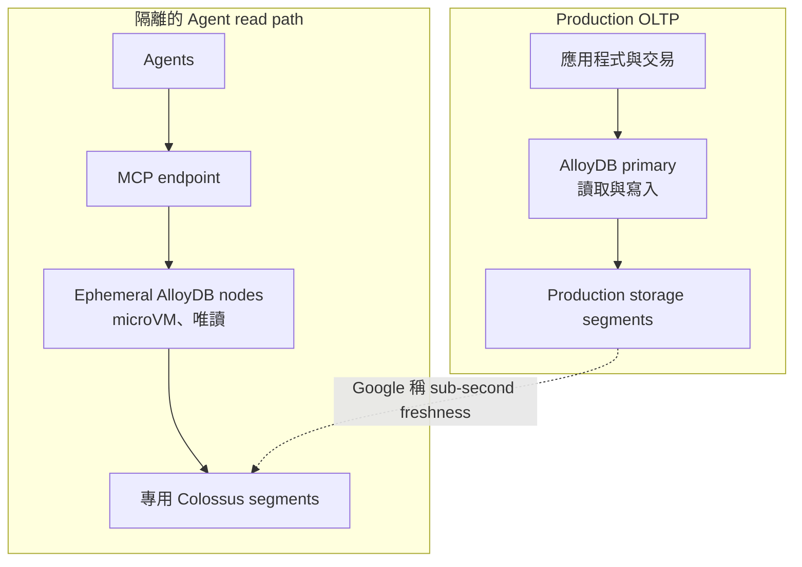

Agent 會在短時間內反覆查詢資料庫：每個推理步驟可能觸發多次 SQL、向量或全文搜尋，數個工作又可能同時湧入。讓這些流量直接進入 OLTP（線上交易處理）primary，會把不可預測的 Agent burst 變成正式交易系統的風險。Google Cloud 在 2026 年 9 月 24 日公布 AlloyDB for agents 架構，嘗試用臨時、唯讀的 AlloyDB 節點處理這類工作，讓 agent compute 與 production primary 分開。

關鍵設計不是「替 primary 多加讀取副本」，而是讓 Agent 工作負載使用獨立 microVM 計算節點與專用 Colossus storage segments，再按工作啟停節點。這個分離方向有工程價值；但數千節點、百萬 agents、次毫秒 I/O 與 primary 零影響，目前都應視為 Google 的架構和測試主張，而非獨立驗證過的普遍結果。

> **花花的一句話**
>
> 把 Agent 的突發讀取移出交易 primary，並讓讀取節點、網路路徑與儲存資源各有隔離邊界，才有機會同時兼顧資料新鮮度與 OLTP 穩定性。

## 架構要解決的是「共享資料，但不共享故障域」

Google 原文由資料庫工程副總裁 Amit Ganesh 與 Sailesh Krishnamurthy 撰寫，日期為 2026 年 9 月 24 日。它把 agentic database 的問題定義為三項同時成立：隔離、低延遲，以及在秒級啟動並可快速縮回零的計算擴展。這是 Google 提出的設計標準；該文沒有證明這是唯一可行標準。

AlloyDB 把 production 的交易節點留在預先配置的專用基礎設施上，再透過 Model Context Protocol（MCP）讓 Agent 連到獨立、短生命週期的 AlloyDB node pool。每個 agent node 是執行完整 AlloyDB for PostgreSQL 引擎的 microVM，具有唯讀權限；其讀取直接通往與 production 分開的 Colossus storage segments。Google 稱這些節點可讀到 sub-second freshness 的 production 狀態。網路與資料同步細節及一致性語意未在公開文章中完整說明，因此不應把「最新」解讀成任意交易隔離等級或同步讀保證。

上圖是依 Google 公開描述整理的概念圖，不代表已公開完整部署拓樸。MCP 是 Agent 與資料庫能力間的介面；它本身不會替資料庫使用者、SQL 權限、列層安全或工具授權做決策。實際部署仍要確認 Agent 身分如何映射到資料範圍，以及查詢是否會暴露不應供該 Agent 使用的欄位或資料列。

## 專用 segments 是隔離主張的核心

傳統讀取副本通常靠複製資料並提供獨立計算資源，隔離性較直觀，但建立副本與載入大量資料較慢，也可能為突發需求長時間支付閒置容量。共享儲存架構能快速增加計算節點，卻可能讓 primary 與讀取節點競爭同一儲存伺服器或頻寬。Google 描述的 AlloyDB 方案試圖拆開這兩種取捨：agent node 直接讀取 Colossus，而 Agent 專用 segments 在實體資料路徑上與 production segments 分開。

因此，「compute 獨立」不足以證明 primary 不受影響；還要檢查網路與 I/O 是否共用限額、儲存分段是否真的隔開、故障與維護事件是否有共同元件。Google 表示 Agent 流量不與 production 共用資料庫元件，並使用 Jupiter 網路與 Colossus 支援擴展。這些是供應商對其雲端內部實作的描述，外部使用者無法單從文章獨立稽核底層隔離。

## 讀取很新，仍不等於可以寫交易

公開資料把 agent nodes 描述為 read-only，並稱它們可讀取「up-to-the-second」或「sub-second freshness」的 production data。這適合查詢、檢索、情境分析與模擬：Agent 可以使用 PostgreSQL 的 SQL、索引、向量、全文與空間搜尋，也可把即時營運資料與 BigQuery 或 Spark lakehouse 資料聯查。

唯讀邊界同時也是功能邊界。Agent node 不能直接完成需要提交到 OLTP primary 的寫入，也不能把自身查詢視為正式交易寫入的一部分。若 Agent 要建立訂單、變更庫存、退款或更新客戶資料，應由具明確權限與驗證的應用服務走既有交易路徑；確認版本、授權、冪等性、衝突處理與稽核後，再提交副作用。這和 [Step Functions 與 AgentCore 的決策驗證案例](/blog/102-aws-step-functions-agentcore-validation/)所示的責任分離相通：Agent 的推理輸出不應自動等於交易授權。

「資料新鮮」也有界線。不到一秒的延遲不代表和某個特定 primary transaction 做了同步一致性讀取，也不說明跨查詢的 snapshot 是否一致。對庫存、帳務與風控等需要明確一致性語意的工作，團隊必須向 Preview 文件及服務團隊確認可見性、重試與交易邊界，再用應用層的版本檢查或寫入前驗證補足。

## 效能數字是 Google 自測，不是獨立 benchmark

Google 表示，它以大於可用 DRAM 的資料集執行並行索引查詢，將 agent nodes 從 1 個擴到 1,000 個，並觀察到：

- 1 到 10 個節點時，吞吐量從 3.9K 增至 41K QPS；擴展至 1,000 節點時，稱吞吐近線性增加到 3 million QPS，Colossus 提供超過 8 million IOPS。
- 在 1 到 1,000 節點的測試中，Google 稱 primary cluster 沒有可測量的效能下降。
- 另一個 2,100 節點的全表掃描測試，總掃描吞吐量超過 1 Tb/s。
- Google 依 Colossus 遠端讀取與架構主張 sub-millisecond I/O；產品文件也將此功能標示為 Preview。

這些指標都來自 Google 自行設計與執行的測試。公開文章沒有具名被比較的競品，雖描述另一種使用 object storage 與 shared block servers 的商用服務；它報告加入最多八個 read replicas 後吞吐不到 2 倍、四個副本後下降，primary throughput 下降超過 75%。因對手未具名、比較配置及完整測試程式沒有公開，這只能視為 Google 自行測試的 vendor comparison，不能當作獨立 benchmark 或所有共享儲存資料庫的代表結果。

目前也缺少外部可重跑的完整環境規格，例如節點硬體、區域、索引與查詢組成、併發模型、尾端延遲、快取條件、錯誤率、資料更新頻率，以及不同 workload 下的成本。QPS、IOPS 或掃描頻寬不能代替團隊自己的交易延遲與隔離驗證。

## 彈性計算能省閒置費，也帶來冷啟動問題

Google 描述 agent node 可在秒級啟動，並在工作結束後縮回零；費用按 agent-node 活躍秒數計算。這種方式適合流量尖峰短、平時節點閒置的 Agent 工作，避免先配置一整組常駐副本，只為等待下一次突發查詢。

然而 scale to zero 不等於請求沒有等待成本或工作成本。突發開始時的排程、連線建立、microVM 啟動和第一次查詢延遲尚需實測；一分鐘工作究竟需要幾個節點、請求是否排隊、節點是否共享或重用，也會影響延遲和帳單。公開文章稱按秒計費，但沒有提供足以推算特定工作負載總價的價格表或端到端成本模型。團隊還須納入模型 token、Agent orchestration、MCP gateway、網路傳輸、lakehouse 查詢與資料治理成本。

建議用自己的 trace 做容量與成本試算：記錄一項 Agent 任務的查詢數、併發峰值、節點活躍時間、冷啟延遲、P95/P99 查詢時間、被拒查詢與 primary 延遲。以固定讀取副本、primary 上的隔離配額和 agent node pool 三種方案，在同一資料集及相同查詢組合下比較，再評估尖峰保護換來的成本是否合理。

> **花花的工程提醒**
>
> Preview 的秒級啟動、縮到零與按秒計費仍須以實際冷啟、峰值併發、授權和帳單驗證；唯讀節點也不會取代正式交易路徑的權限與寫入驗證。

## 適合先評估的工作與導入檢查

這項設計最值得驗證的情境，是大量短生命週期 Agent 同時對同一組新鮮營運資料做唯讀查詢，而且 primary 的尾端延遲必須維持穩定。若流量平緩、讀取集小或已有成本可控的副本，新資料平台可能只增加整合與治理面積。若任務需要寫入、跨區災難復原保證或嚴格 snapshot 語意，公開架構說明不足以直接判斷是否符合需求。

申請 Preview 後，可用一個不會觸發正式副作用的受控流程先核對：

1. **存取控制：** MCP client 身分、資料庫 role、資料列與欄位權限如何傳遞？Agent 可否只讀授權租戶的資料？
2. **新鮮度與一致性：** 測量 primary commit 到 Agent 可見資料的 P50/P95/P99 延遲，確認跨查詢 snapshot、重試與複製延遲的語意。
3. **隔離故障測試：** 對 agent pool 施加尖峰與故障注入，同步觀察 primary 的鎖、CPU、網路、I/O、P99 latency 和錯誤率。
4. **交易邊界：** 確認 Agent node 的唯讀限制不可繞過，並驗證寫入只能由獨立授權服務執行。
5. **成本與啟動：** 記錄冷啟、閒置回收、每任務節點秒數、查詢排隊和失敗重試，和固定副本的全月成本比較。

Google 官方文件目前將 PostgreSQL for agents 標示為 Preview，指出需申請存取，且 Pre-GA 服務可能只有有限支援。功能成熟度、區域供應、SLA、限制與計價仍應以申請時的官方文件及合約為準。Google Cloud 的數字適合作為待驗證的容量假設，不適合直接拿來承諾 production SLO。

## 延伸閱讀與來源

若要補齊 Agent 工具、狀態與生命週期，可先讀[AI Agent 完整指南](/blog/64-ai-agent-guide/)；多租戶隔離可對照 [Benchling 如何隔離 Agent 產生的程式碼](/blog/117-benchling-agentcore-multitenant-code-execution/)。交易副作用的授權邊界則可接著讀前述 [Step Functions 與 AgentCore 決策驗證案例](/blog/102-aws-step-functions-agentcore-validation/)。

- Amit Ganesh、Sailesh Krishnamurthy，Google Cloud Blog，2026-09-24：[AlloyDB’s agentic database architecture](https://cloud.google.com/blog/products/databases/alloydbs-agentic-database-architecture) — 架構元件、隔離主張和 Google 自行執行的效能測試。
- Google Cloud Blog，2026-09-24：[AlloyDB delivers PostgreSQL for agents](https://cloud.google.com/blog/products/databases/announcing-postgresql-for-agents-in-alloydb) — Preview 公告、唯讀節點、功能範圍與客戶引言。
- Google Cloud Documentation：[PostgreSQL for agents in AlloyDB](https://docs.cloud.google.com/alloydb/docs/postgresql-agents-alloydb) — Preview 狀態與申請存取說明。
