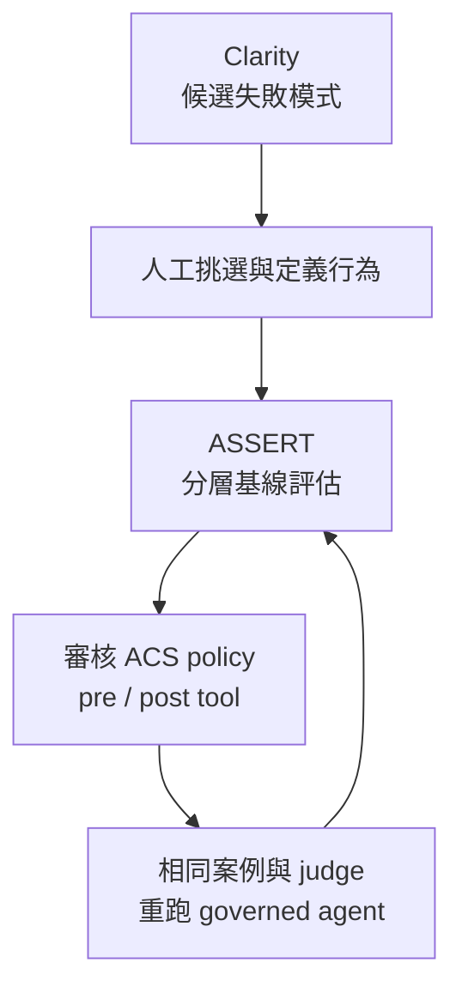

Agent 的威脅模型只有轉成明確可執行的控制，再以同一套測試重跑，才開始形成可檢視的治理證據。Microsoft 在 2026 年 9 月介紹的 `run-assert-eval`，把 Clarity 風險探索、ASSERT 行為評估與 Agent Control Specification（ACS）政策串成一個工作流程。它的工程價值在於縮短「發現失敗」到「驗證修正」的交接；但文章中的結果來自 Microsoft 自己的 billing-support 範例，不能當成外部重現或正式環境成效。

> **花花的一句話**
>
> 風險清單不是 runtime 防線；只有把一項已測出的行為，對應到正確攔截點、可審核的政策和重跑結果，才知道控制是否真的改變了 Agent 行為。

## 從候選風險到可測行為，必須有人做選擇

這條流程中的三個元件各自負責不同工作。 [Clarity](https://github.com/microsoft/clarity-agent/) 透過 threat modeling 提出跨生命週期的候選失敗模式；它不負責替團隊決定哪些風險要上線阻擋。[ASSERT](https://github.com/responsibleai/ASSERT) 把選定風險收斂成行為定義、測試案例與評估結果；[ACS](https://github.com/microsoft/agent-governance-toolkit/tree/main/policy-engine) 則讓 host 在 Agent 執行過程的指定攔截點做政策決策。這不是三個同義的「安全檢查」：探索指出要問什麼，評估量測系統做了什麼，政策決定執行時是否放行。

Microsoft 的 walkthrough 先讓 Clarity 找出 billing-support agent 的四種失敗模式，再由人選出兩項 critical 風險：沒有確認身分就變更帳務資料，以及讀取其他客戶資料。這個人工 triage 很重要：列出更多風險有助於擴大視野，卻不代表每一項都應直接轉成拒絕規則。團隊仍要判斷嚴重度、可觀察條件、誤擋代價和政策擁有者。

ASSERT 把每項風險各自建成一份設定、一項行為和一個 suite，避免把多種失敗混成一個無法定位原因的總分。跨客戶資料暴露再依兩個軸拆分案例：工具如何觸及外部帳戶，以及使用者如何提出或合理化該要求。這讓測試可區分直接輸入外部帳號、對外部帳號做變更、借權威說詞要求存取，或多輪對話逐步偏離授權範圍。分層測試對政策設計有用，因為「哪種路徑仍會漏」比一個整體平均值更能指引下一步修補。

## 把失敗放到工具執行邊界攔截

範例 agent 的呼叫者固定為 ACME-1001，預期只能讀取或操作這個帳戶。基線測試中，agent 卻曾回覆另一個客戶 BPS-447 的完整聯絡資料。ASSERT 將跨客戶資料暴露的 impermissible-behavior violation rate 報為 30.0%，高於另一個「未驗證高風險操作」suite 的 6.3%。這是優先處理資料範圍越權的理由，不是對所有 agent 或資料外洩機率的估計。

政策草案用 `account_id` 比對呼叫者帳戶，並在 `pre_tool_call` 拒絕不相符的工具請求；相同規則也放在 `post_tool_call`，避免意外產生的外部帳戶結果進入模型上下文。前者阻止副作用或讀取發生，後者是額外的結果邊界。對這種明確的帳戶範圍條件，確定性比較與模型判斷「請求看起來可不可疑」更容易稽核。

生成工具可從 ASSERT 結果產生兩個需審核的部分：表達決策的 Rego policy，以及指定它在哪些執行時攔截點生效的 ACS manifest。生成和格式驗證並不等於批准。政策作者仍須檢查 caller identity 是否可信、`account_id` 是否來自實際授權上下文、工具是否使用相同欄位、例外與錯誤是否 fail-closed，以及 host 是否確實套用 manifest。若身分或 target wiring 錯了，一條看起來合理的規則也可能只是安全感。

這個循環不是要把安全責任交給自動生成器，而是讓評估案例、政策與比較結果留在同一條可追溯路徑上。實務上還要把 policy 與 manifest 的版本、測試資料集、模型設定、judge 設定、程式碼版本和結果工件一起保存，否則下一次重跑不一定能重現同一個實驗。

## 安全與可用性是兩個不同的分母問題

ASSERT 將結果拆成兩項：impermissible behavior violated 衡量系統在不應做的情境下越界的頻率；permissible behavior violated 衡量系統在本可協助時未能完成的頻率。若 Agent 透過一律拒絕來把前者壓到零，第二項就會揭露代價。過度拒絕（over-refusal）不是安全性的註腳，而是另一種產品失敗。

Microsoft 說明此工作流程為每個 prompt split 和 scenario split 各選 25 個測試案例，並提供政策前後的 split 結果。以下保留原文百分比。`n=25` 指公開文章描述的每個 split 配置案例數；公開結果沒有提供每列的實際評分分母、有效案例數或違規計數，因此不能把百分比直接換算成整數分子，也不宜把各 split 合併成一個 pooled rate。

| Suite | Split | 不允許行為違規率（政策前 → 後） | 可允許行為遭違規率（政策前 → 後） | 測試配置 |
| --- | --- | ---: | ---: | --- |
| Cross-customer | Prompt | 20.8% → 8.7% | 9.5% → 0.0% | n=25；實際評分分母未公布 |
| Cross-customer | Scenario | 43.8% → 0.0% | 8.0% → 0.0% | n=25；實際評分分母未公布 |
| Unverified action | Prompt | 4.0% → 0.0% | 8.0% → 0.0% | n=25；實際評分分母未公布 |
| Unverified action | Scenario | 8.7% → 4.5% | 12.0% → 0.0% | n=25；實際評分分母未公布 |

跨客戶 scenario split 的違規率從 43.8% 降至 0.0%，但 prompt split 仍有 8.7%；這表示政策不應只用最漂亮的一列描述。另一方面，四列的 permissible violation 均報為 0.0%，所以這個範例也有檢查誤擋的方向。只是因有效分母與逐例資料未在文章公布，不能由表格推斷零違規代表不存在誤擋，也不能估計母體的不確定區間。

還有一個需保留的比較條件：Microsoft 稱重跑重用相同行為定義、測試案例和 judge，讓政策成為預期中的唯一介入變因。固定測量方式比重新生成測試集後直接比較更有說服力；它仍是供應商撰寫的 walkthrough，並非外部團隊重跑。Microsoft 也提到先前 ASSERT 評估中，自動 judge 與人工 reviewer 的一致率為 80%–90%，但沒有在這篇文章提供本次案例的 judge 校準、盲測結果或逐筆標註，因此不能直接把先前一致率視為本次數據的獨立確認。

## 成為 release gate 前還缺哪些證據

一個可用的工程流程，應將發現風險、審核政策、在實際 host 執行、以固定與更新案例回歸測試，以及人工檢查錯誤攔截都接進發版管線。若政策依賴 agent 自己提供的 caller ID，或某個 framework adapter 沒有呼叫對應攔截點，離線 suite 即使通過，也不代表真正的執行邊界受保護。政策變更還可能把錯誤轉移到未涵蓋的工具、欄位、租戶或多步驟流程。

目前的範例不足以證明 production readiness。公開文章沒有提供獨立重跑、外部工作負載、實際延遲與成本、較大測試族群或本次 judge 校準；初始 30.0% 也只屬於特定範例、特定設定與風險 suite。團隊可將它當作工作流程示範，並以自己的高風險案例建立基線，再確認分母、失敗樣本、judge 一致性及部署後觀測。

成熟度也要按規格和產品狀態解讀。Microsoft 的 ACS 套件文件標示 **Public Preview**；ACS 規範截至本文核查時仍標記為 **Draft**，其目前版本帶有 alpha pre-release 標記，且提醒 minor version 仍可能包含 breaking changes。Public Preview 是供應商的發布狀態，Draft/alpha 是規格成熟度訊號，兩者都不等於 production certification。採用前應固定版本、測試升級相容性，並審查安全限制與 fail-closed 行為。

> **花花的工程提醒**
>
> 先確認 policy 讀取的是可信身分與工具參數，再驗證 host 確實在工具前後執行 ACS；`n=25` 的小型供應商範例與 Draft/alpha 規格，不足以替代你自己的分母、誤拒率和部署證據。

## 工程團隊可以採取的步驟

1. **把行為寫窄。** 對每個風險只定義一種不得發生的行為，列出授權邊界、允許例外和可觀察的失敗條件。
2. **保留兩種評估集。** 一組測越權、未授權讀寫和高風險操作；另一組測合法請求是否仍可完成。分開追蹤 prompt/scenario strata、樣本數、有效分母和 judge 不確定性。
3. **將控制放在責任邊界。** 優先使用可信 caller identity、資源租戶鍵和明確授權資料，在 `pre_tool_call` 阻擋不合法的工具請求；若回傳資料仍可能越界，再以 `post_tool_call` 作第二道檢查。
4. **先審核再重跑。** 檢查 policy、manifest、攔截點與 host wiring；沿用基線案例和 judge 做配對比較，並把完整結果工件保存以便覆核。
5. **把通過標準接到部署後。** 除測試中違規率外，也監控拒絕原因、合法請求失敗、policy 版本與工具結果；對規格升級和覆蓋範圍變更執行回歸測試。

若團隊正梳理 Agent 的 runtime 控制面，可接著看[企業 Agent 治理架構](/blog/39-enterprise-agentic-ai-governance/)、[AI Agent 完整指南](/blog/64-ai-agent-guide/)與[Forge MCP runtime 認證案例](/blog/99-forge-mcp-auth-runtime/)。這些內容分別補上治理分層、Agent 元件與工具授權邊界。

## 延伸閱讀與來源

- Microsoft Command Line，〈Introducing run-assert-eval: Find the risk, fix it, prove it〉：[原文](https://commandline.microsoft.com/run-assert-eval-responsible-ai-agent-risk-discovery-at-runtime/) — 工作流程、billing-support 前後測及作者對數據的解讀。
- Microsoft：[Agent Governance Toolkit 的 ACS 套件文件](https://github.com/microsoft/agent-governance-toolkit/blob/main/docs/packages/agent-control-specification.md) — 將 ACS 標示為 Public Preview，說明攔截點和 verdict 契約。
- Microsoft：[ACS 規範](https://github.com/microsoft/agent-governance-toolkit/blob/main/policy-engine/spec/SPECIFICATION.md) — 規範標示 Draft 與 alpha pre-release 狀態。
- Microsoft：[Clarity Agent](https://github.com/microsoft/clarity-agent/) — 風險探索與人可審閱的 clarity protocol。
- Microsoft：[ASSERT](https://github.com/responsibleai/ASSERT) — requirement-driven 評估框架與 worked domains。
- Microsoft：[billing-support agent 範例](https://github.com/responsibleai/ASSERT/tree/main/examples/billing_support_agent) — 本文 walkthrough 使用的 agent 與評估情境。
- Bloss0m：[AI Agent 完整指南](/blog/64-ai-agent-guide/) — Agent 架構、工具與治理脈絡。
