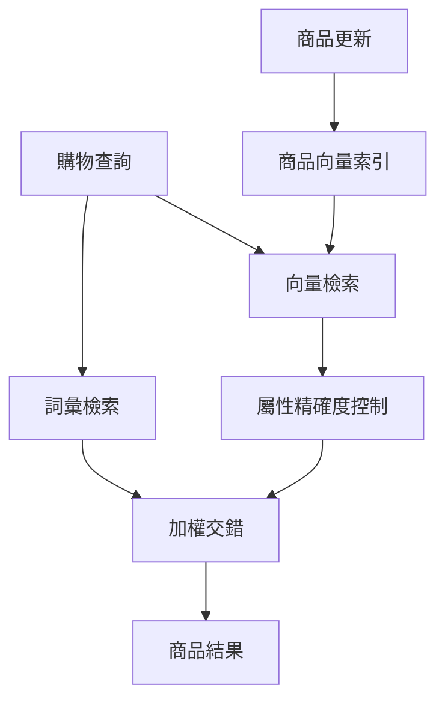

Target 的商品搜尋案例回答了一個常被簡化的問題：有了商品向量索引，還要不要保留關鍵字搜尋？Target 的答案是兩者並行，再用屬性限制向量結果，最後以線上實驗決定怎麼混合。這是一套**電商目錄檢索**架構，沒有生成答案的步驟；它不是生成式 RAG。本文根據 Target Data Sciences 團隊於 2026 年 9 月 25 日提交的 [技術報告 v1](https://arxiv.org/html/2609.31498v1)，分析架構選擇、證據強度，以及其他團隊可以帶走的評估方法。

> **花花的判斷**
>
> 向量搜尋負責補上「商品寫法和顧客說法不同」的召回缺口；商品型別、品牌、尺寸等條件則替它守住精確度。兩個環節要分開評估，不能把 embedding 相似度當成搜尋品質本身。

## 這不是把關鍵字換成向量

零售查詢從明確規格到開放探索都有。像品牌、尺寸、商品型號或「有機牛奶半加侖」這類查詢，詞彙和結構化欄位仍有很高價值；「冬天讓腳保持溫暖的東西」或拼錯的 `yoge mat`，則可能和商品標題沒有字面重疊。Target 同時執行詞彙與 dense（稠密向量）檢索：前者保留精確詞匹配、拼字修正、改寫和 facet 篩選等能力，後者用 query 與商品文字的語意表示找出不同措辭的候選。

報告描述的線上架構使用 Solr 倒排索引與 AlloyDB 上的 ScaNN ANN 索引，兩路結果交給 ranking service 合併；這是作者公開的實作細節，不代表每個團隊都應採用同一套產品。另一路商品索引流程會在新增或更新商品時產生向量，支援批次與串流更新。這種拆分讓查詢延遲路徑不必同步重算整份目錄。

此處的向量通道目的在補召回，不是取代詞彙通道。它也不是文件檢索後再交給大型語言模型作答的流程。如果你要比較文件型檢索與生成式系統，可從站上的 [企業 RAG 檢索架構指南](/blog/65-enterprise-rag-guide/) 和 [RAG 方法閱讀地圖](/blog/92-rag-method-foundation-reading-map/) 延伸；兩者的語料、成功條件和下游步驟都不同。

## 模型選擇：先用小模型，再讓零售資料教會它

Target 先用人工標註的 5,000 個電商查詢、每個查詢約 200 個商品，比較多個預訓練 encoder 的 NDCG。e5-large-v2 平均 NDCG 為 0.7825，e5-small-v2 為 0.7757，差距只有 0.0068。團隊選擇約 3,300 萬參數、384 維輸出的 e5-small-v2 作為微調起點，以較低推論成本換取接近的離線相關性。這一組人工相關性測試只用於選模型，不能和後續用互動資料標註的微調實驗直接對照。

接著，團隊把跨 Web 與行動裝置的匿名彙總互動資料整理成約 2,000 萬組 query–product 標籤，按類別和查詢頻率分層取樣。正例分數結合點擊、加入購物車和轉換，購買意圖較強的訊號權重較高；權重和判定門檻因商業機密未公開。負例包括曝光後完全沒有互動的商品，以及經常被取回但不是正例的相似商品。後者很重要：它讓模型不只學會「什麼看起來相關」，也學會區分容易混淆的近似品。

商品輸入由標題、品牌、item type、類別與可選的 highlights 組成，各欄位加上 marker token，訓練時再隨機遮掉欄位，降低模型對缺漏或噪音中繼資料的依賴。報告的消融結果顯示資料增加、hard negatives、欄位標記與描述欄位都能改善其離線排序；但部分表格逐列改動不只一項設定，作者也提醒應在同一張表內比較，不要把不同實驗表的數字當成單一控制實驗。

這個選模故事的重點不是「小模型一定最好」，而是**通用語意表示不等於購物意圖**。報告中的零樣本 e5 線上測試相對詞彙基線在各項指標都下降；經由 Target 自家互動標籤微調後，結果才轉正。若要再閱讀不同檢索架構如何選擇與衡量，可參考 [混合檢索與目錄索引的案例](/blog/95-weknora-architecture/)；它處理的是知識平台索引，並非同一個商品搜尋場景。

## 精確度控制：語意相近，不代表商品條件正確

純向量相似度可能找出語意接近、但不符合關鍵條件的商品。Target 的 precision-control service 以 NER 擷取明確的品牌、性別、尺寸等條件，再由 query classifier 推斷可能隱含的商品型別與類別，並提供商品型別、類別、品牌、性別和尺寸群組等篩選。報告亦描述敏感或含糊類別的分層限制，例如除非查詢明確要求，食品搜尋不應混入寵物用品。

在其向量檢索離線實驗中，沒有篩選時 Precision@1 為 0.890、Precision@10 為 0.836；NER 條件加上分類器推斷的 item type 與 category 後，分別升到 0.929 和 0.885。這些是作者在固定候選集上的結果，不是全站搜尋品質的獨立驗證。篩選有明確的代價：分類錯誤或含糊查詢可能把本來有用的商品也排除。報告承認仍有零結果，並把更自適應的 learned precision control 列為未來方向。

> **花花的工程提醒**
>
> 把屬性過濾做成可觀測的獨立階段，分別追蹤候選被哪個條件移除、空結果率和精確度；一個錯誤的硬條件，可能把 dense retrieval 找到的正確候選全數清空。

## RRF 與加權交錯：結果重疊少時要保留各自排序

Target 比較 reciprocal rank fusion（RRF）與 weighted interleaving（加權交錯）。RRF 依各清單中的排名分數加總，不必校準 BM25 分數與 cosine similarity，但同時出現在兩路的商品會獲得額外優勢。若詞彙與向量結果重疊很少，這種「清單一致」訊號有限。加權交錯則依兩路設定的全域權重逐位抽取各自目前排名最高的未重複商品，保留每一路內部排序，並讓兩路各自佔有一定版位。

這不是對 RRF 的普遍否定。Target 報告的是該系統兩路重疊偏低，並且在 A/B 測試中加權交錯表現較好。第一版微調模型搭配 RRF 時，點擊率與訂單轉換相對基線分別為 -0.85% 和 -1.20%；換成加權交錯後成為 +0.40% 和 +0.74%。團隊以逐輪調整權重的 explore-then-commit 實驗選出設定，權重數值未公開。其他目錄的兩路重疊率、排名品質和使用者偏好可能不同，仍須自行比較。

## 離線相關性和線上商業成效要分開看

論文有兩種不同目的的離線集合。第一種以人工評分的 5,000 個查詢、每題約 200 個候選商品選擇預訓練模型；第二種是超過 5,000 個未見過的查詢，以點擊、加入購物車和購買等交易互動形成 0–4 級標籤，使用 NDCG、MRR 評估排序，並以 Precision@K 分析篩選。後者固定每個查詢的候選池，量的是候選內排序，不是從完整商品目錄找回相關品的召回率。論文表示測試查詢與訓練、驗證查詢不重疊，但固定候選池的評估限制仍在。

線上部分則是與既有詞彙搜尋對照的四週 A/B 測試。Target 報告微調版加權交錯模型的點擊率相對提升 0.97%、每訪客加入購物車率提升 0.89%、訂單轉換提升 0.98%、每訪客需求金額提升 1.10%，相關性指標提升 0.21%；零結果搜尋相對減少約一半。這些是**Target 自行報告的相對變化**，不是百分點，也不是其他零售商可預期的提升。作者稱測試達統計顯著性（p<0.05），但未提供流量分母、完整分組協議或信賴區間；部分標籤門檻、指標權重及合併權重也未揭露。報告沒有附公開程式碼或資料集，目前也沒有獨立重現可供交叉驗證。

零結果下降的機制相當合理：詞面沒有命中的長尾、錯字或自然語句，仍可能透過向量通道找到候選。但「大約減半」是該產品目錄、查詢分布、篩選策略和 A/B 流量下的觀察；當屬性控制移除所有不合條件的候選時，混合搜尋仍會回傳零結果。它說明的是召回通道能補上某些失敗類型，不是零結果已被解決。

## 延遲與規模如何限制模型選擇

Target 報告稱，e5-small-v2 在 CPU 單機測試平均每查詢約 25 ms，線上 embedding service 的 p75/p95 約 25–30 ms，目標 p99 低於 50 ms。服務使用常見查詢 embedding 快取、自適應 micro-batching、TorchServe，以及 Kubernetes 水平擴縮；商品向量索引由 ScaNN 分片並透過非同步管線近即時更新。訓練約 2,000 萬組資料時使用 A100 GPU，線上推論則用 CPU。論文表示系統每天服務數百萬次搜尋，但這些規模與延遲都是作者的部署報告，不是獨立測量。

這也解釋了為何多 0.0068 NDCG 的大型模型沒有自動勝出：搜尋路徑的預算包含模型推論、向量查詢、精確度控制和後續排序，而不只有離線 encoder 分數。對自己的系統，應量測端到端尾延遲、快取命中率與索引新鮮度；單機平均延遲無法代表尖峰負載下的 p99。

## 團隊可以帶走的工程方法

1. 先按查詢錯誤類型切分需求：精確品牌與規格、同義詞、錯字、自然語句、長尾和空結果，不要以「是否採用向量」當成需求定義。
2. 把詞彙候選、dense 候選、屬性篩選與清單合併設為可分別消融和觀測的階段。標註哪些條件救回召回、哪些條件造成誤刪。
3. 使用與線上流量互補的評估：人工相關性可選初始模型，互動標籤可分析排序，線上隨機實驗才回答行為和商業指標是否改善。確保指標不只看點擊，也看轉換和空結果。
4. 將融合策略當作需要驗證的設計選項。先量測兩路重疊，再比較 RRF、加權交錯或其他融合方法，並明確記錄權重版本與流量條件。
5. 對外報告效果時附上基線、實驗期間、相對或絕對變化、流量規模、信賴區間與未公開設定。若無法揭露，應清楚限定結果只代表該團隊報告的場景。

## 來源與延伸閱讀

- Sonagara, Zhang, Singh, and Li, [Retail Product Search: A Practical Approach at Target](https://arxiv.org/html/2609.31498v1), arXiv:2609.31498v1, submitted 2026-09-25. 本文的數字、架構和測試描述均依該報告；分析中的泛化限制是依公開證據範圍所做的判讀。
- 延伸閱讀：[企業 RAG 檢索架構指南](/blog/65-enterprise-rag-guide/)、[RAG 方法閱讀地圖](/blog/92-rag-method-foundation-reading-map/)、[WeKnora 知識平台架構](/blog/95-weknora-architecture/)。這些連結提供檢索概念的對照，不表示商品搜尋等同 RAG。
