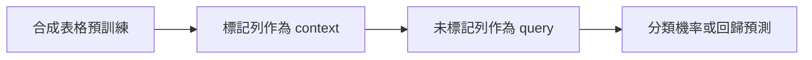

Kumo Tabular 想改變的不是「表格模型能不能預測」，而是每接到一個新資料集，團隊是否都得重新 fit、調參、部署一個專用模型。NVIDIA 的做法是先用大量人工生成的表格訓練模型，再把已標記資料列當作上下文，直接預測新列。它沒有消除訓練，而是把任務專屬的訓練步驟換成推論時的 in-context learning。

這個轉換值得測試，但目前最亮眼的榜單和速度數字來自 NVIDIA 自己的評估。更務實的問題是：你的資料能否落在它的表格假設內、上下文列是否代表未來資料，以及少掉的 fit/tune 是否足以抵銷模型推論與 GPU 成本。

> **花花的一句話**
>
> Kumo Tabular 不是「不用訓練的模型」；它是先學會合成表格的統計結構，再用少量有標籤的任務資料完成預測。

## 從每個資料集訓練，轉成每個資料集提供上下文

典型表格機器學習流程會為每個任務分出訓練與驗證資料，進行前處理、交叉驗證、模型選擇和超參數搜尋。這套流程成熟、可控，也能讓梯度提升樹充分利用特定資料集；代價是每個新問題都要重跑部分流程，並維護一個任務專屬模型。本站的 [Titanic 實作](/blog/37-kaggle-titanic-survival-prediction/)展示了小型資料表中，特徵處理、交叉驗證和 leaderboard 泛化如何彼此牽動。

Kumo Tabular 把分類或回歸任務表示成兩組列：有特徵和標籤的 context rows，以及只有特徵、等待預測的 query rows。模型輸出分類機率或回歸預測；[NVIDIA 的 API 文件](https://nvidia.github.io/structured-data-models/api/models.html)也展示了 context 與 query 的呼叫介面。依 [NVIDIA 的技術介紹](https://huggingface.co/blog/nvidia/kumo-tabular)，使用者不必為該資料集更新 Kumo 權重；但模型權重早已在人工表格上預訓練，這個任務仍要提供可用的標記上下文。

## 它如何把表格結構放進 Transformer

一般文字 Transformer 把 token 排成序列；表格模型還得處理「同一欄的值如何比較」、「一列內不同欄位如何組合」，以及「標記列如何幫助新列預測」。[NVIDIA 對 Kumo Tabular 架構的說明](https://huggingface.co/blog/nvidia/kumo-tabular)將這些關係拆為 cell、row 與 in-context 表示。

第一步，數值與類別值各自轉成 cell embedding；缺失值被特別表示，不要求先用單一估值填滿。第二步，模型交替做 column attention 與 row attention：前者在同一欄的列之間學習值的相對位置，例如 42 在該欄是常態或極端；後者學習同一列中的特徵交互。NVIDIA 說明 column attention 的成本隨列數線性成長，並以 row-level 表示壓縮後續處理。

第三步，context rows 彼此交換資訊，而 query rows 只讀取 context，不互相注意。這讓每筆預測不依賴其他 query rows 的排列或同批組合；context 的 key/value 也能在後續預測重用。模型再輸出分類機率，或用 999 個分位數形成回歸點估計與不確定性訊號。這些是架構設計說明，不等同於在任意長度表格上都已證明成本或校準良好。

## 合成表格預訓練教它什麼？

NVIDIA 表示，Kumo Tabular 的 Small、Medium、Large 版本分別看過約 3,500 萬、7,100 萬、1 億 3,700 萬張人工表格。生成器先抽取結構因果模型（Structural Causal Model, SCM）的設定與隨機因果圖，再為節點抽樣不同函數，產生數值或類別欄位和預測目標。生成後還會加入欄位相關、離群值、缺失、類別多樣性及厚尾回歸目標等情況，並丟棄缺乏可學訊號的樣本。

分類和回歸是分開訓練的模型，不是同一組權重切換任務即可互換。NVIDIA 也指出，單次 forward 原生處理最多 10 個分類類別；[程式庫 API](https://nvidia.github.io/structured-data-models/api/models.html)再用 error-correcting output codes 擴展到更多類別。這些邊界會影響模型選型與成本估算，不能只看「一個表格模型」的名稱。

這個訓練目標不是記住某一份真實企業資料，而是讓模型在大量不同生成機制中，學會如何從已標記列推測未標記列。推論時的標記資料因此像「告訴模型目前任務長什麼樣」的範例，而非再次反向傳播更新權重。

但合成多樣性不代表涵蓋真實世界所有結構。生成器的因果圖、函數族、缺失機制和資料範圍就是模型的先驗；若企業資料的結構偏離這些先驗，或 context 與 query 的分布不同，模型可能失準。NVIDIA 也明確提醒，資料遠超過訓練範圍或發生分布差異時，準確度可能下降；應在自己的 held-out 資料上檢查準確度與校準。

> **花花的工程提醒**
>
> 「沒有每個任務的 fit」不代表「沒有資料準備」。官方列出的原生欄位是數值與類別；文字、影像和時間戳仍需轉成特徵，而且時間欄位如何編碼會直接影響驗證結論。

## 四個 benchmark 的「第一名」應如何讀？

根據 [NVIDIA 發布的 benchmark 結果](https://huggingface.co/blog/nvidia/kumo-tabular)，Kumo Tabular 在 TabArena、BeyondArena、TALENT 和 ScoringBench 都列第一；[TabArena 專案](https://github.com/autogluon/tabarena)則提供該競賽的背景與 benchmark artifact。這些結果有參考價值，但各榜單的指標、測試資料與比較範圍不同；ELO、平均排名、log-loss 與回歸 RMSE 不可當成同一種準確率。它們也都是 NVIDIA 執行或彙整的比較，本文未找到獨立重跑。

| NVIDIA 報告的項目 | 對外數字或描述 | 閱讀時的界線 |
| --- | --- | --- |
| TabArena | ELO 1950，整體排名第一 | 以該榜單的設定與對手集合為準，不是所有業務表格的通用排名 |
| BeyondArena | ELO 1418，另報告 7.78% Improvability | 需按該 benchmark 的指標定義解讀，不能直接換算成準確率提升 |
| TALENT | 分類 accuracy、分類 log-loss、回歸 RMSE 的平均排名分別為 6.67、3.98、4.22 | 三個不同指標的排名，不是單一百分比 |
| ScoringBench | Large 與 Medium 平均排名第一、第二 | 聚焦預測分布；模型尺寸、任務和執行設定仍需對照原始結果 |

同一篇 [NVIDIA 的單張 RTX 6000 Pro 比較](https://huggingface.co/blog/nvidia/kumo-tabular)還稱，在 TabArena 評估中，Kumo 推論比 LimiX-2 快約 17 倍。這不是跨硬體、跨資料或端到端部署成本的保證；文章提供的是 NVIDIA 的測量敘述。採用前應固定模型版本、資料切分、batch/context 大小、warm-up、GPU 型號和計時範圍，並與自己已調校的梯度提升樹及 AutoML pipeline 比較。若想理解推論速度如何受硬體與測量口徑影響，可參考本站的 [模型硬體與基準測試標準](/blog/97-model-hardware-standard/)。

## 開放程式碼，不等於所有訓練材料都已公開

NVIDIA 公開了 [structured-data-models 程式庫](https://github.com/NVIDIA/structured-data-models)、[Kumo Tabular 權重與模型卡](https://huggingface.co/nvidia/Kumo-Tabular)，以及 [API 文件](https://nvidia.github.io/structured-data-models/api/models.html)。官方 repository 將 NVIDIA 撰寫的程式碼標為 Apache-2.0；模型權重使用另一份 OpenMDW 1.1 條款，不能把程式碼授權直接套用到權重。企業導入前，法務與模型治理人員仍需閱讀實際模型條款、版本與使用限制。

此外，NVIDIA 表示訓練配方與人工資料生成器將來會釋出；目前不能把「有權重、有推論程式」寫成「完整訓練流程可重現」。GitHub 的 benchmark 程式、資料集版本、Kumo checkpoint revision 與 NVIDIA 文章報告也應分開保存。要重現某次比較，至少需 pin 程式碼 commit、模型 revision、依賴、硬體與資料切分，避免未來的 `main` 或 Hub 權重更新改變結果。

## 什麼情況值得做自己的試驗？

可以先把 Kumo 當成候選模型，而非直接替換 production pipeline。建議採取一個小而有決策價值的試驗：

1. **固定任務與切分。** 分類、回歸、時間切分或群組切分各自建立未參與模型選擇的 held-out set；同一客戶或實體的資料不可不慎跨到 train 與 test。
2. **建立可信 baseline。** 比較現有模型、妥善調校的梯度提升樹或 AutoML，不只拿 Kumo 預設值與弱 baseline 對照。記錄 quality、校準、推論時間、記憶體和每批成本。
3. **測試上下文假設。** 改變 context rows 數量、類別數、缺失率與時間範圍；特別檢查 query 是否真的與 context 同分布，以及未來資料是否有概念漂移。
4. **核算完整生命週期。** 任務不再個別訓練可能減少 pipeline 維護，但推論仍需載入權重並處理上下文。對小型、低頻任務，簡單樹模型可能更便宜；對反覆出現且相似的任務，重用預訓練先驗才可能有利。

這些測試也能界定「免調參」真正替團隊省掉了哪段工作。它不會替代標籤品質、資料權限、錯誤成本與上線監控的設計，也不會自動證明生成資料已涵蓋業務族群。

## 核心問題不是排行榜，而是任務先驗能否轉移

Kumo Tabular 的技術主張清楚：將大量合成表格預訓練，換成推論時從標記 context rows 學習單一任務，並用表格結構化 attention 承接較大的列數。公開權重與程式讓工程團隊有機會自行試用；合成生成器和完整訓練配方尚未公開，獨立比較也仍缺席。

因此現在最合理的結論不是「AutoML 已被取代」，而是出現了一個值得納入同資料、同切分、同硬體預算比較的新候選。只有在自己的資料上確認預測品質、校準、漂移韌性、授權和總成本後，才能判斷免去任務訓練是否真的換來更簡單的生產系統。

## 延伸閱讀與來源

- [NVIDIA：Kumo Tabular 技術介紹與 benchmark 敘述](https://huggingface.co/blog/nvidia/kumo-tabular)
- [NVIDIA structured-data-models 原始碼與授權說明](https://github.com/NVIDIA/structured-data-models)
- [Kumo Tabular 權重與模型卡](https://huggingface.co/nvidia/Kumo-Tabular)
- [Kumo Tabular API 文件](https://nvidia.github.io/structured-data-models/api/models.html)
- [TabArena benchmark repository](https://github.com/autogluon/tabarena)
