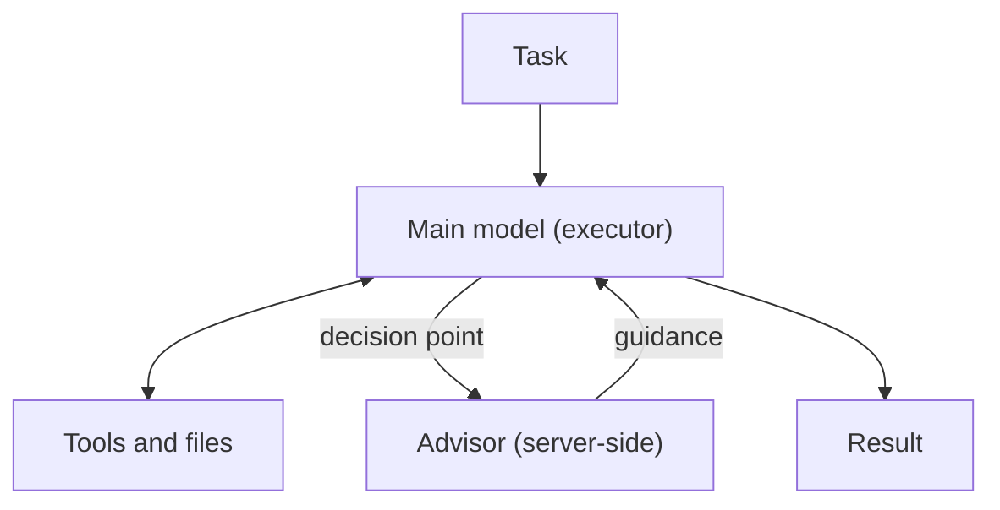

Claude Code 的 [Advisor 官方指引](https://code.claude.com/docs/zh-TW/advisor)提出一個看似直覺的想法：讓主要模型處理整段任務，只在計畫、重複錯誤或完成判斷等關鍵時刻，請另一個通常更強的模型提供建議。它不是把工作整包交給第二個 Agent，也不是每次提交程式碼前都必定觸發的審核閘門。

這個區別決定了你應該如何使用它。**Advisor 是主要模型可以選擇呼叫的第二意見；它增加判斷資源，卻沒有接管執行，也不會自動替你證明結果正確。**

> **花花的一句話**
>
> 第二個模型可以指出你可能漏看的路，但「有人看過」不等於「這條路已被驗證安全」。

## 一個執行者，一個只給建議的顧問

啟用 Advisor 後，Claude Code 的主要模型仍是 executor：它理解任務、呼叫工具、讀取結果、修改檔案並產生回覆。遇到它認為值得求助的時刻，主要模型會呼叫伺服器端 Advisor；顧問讀取對話並回傳建議，接著仍由主要模型決定如何繼續。



這和常見的「大型 orchestrator 拆工作、派給多個 worker」不同。Advisor 不負責執行工具或直接交付使用者答案；它的輸出回到主要模型，由 executor 吸收、質疑或依現有證據調整。若顧問的建議和檔案內容矛盾，或照做後失敗，Claude Code 文件表示主要模型會呈現衝突，而非無條件服從。

不過，這只是對話中的模型協作，不是獨立安全審查。顧問看的是同一段任務脈絡，最終採取哪個動作仍由主要模型控制；即使畫面顯示 `Reviewed`，也只表示顧問已檢視並提供可讀指引，不代表程式已通過測試、政策符合或修改正確。

## 最容易忽略的邊界：何時問，由模型決定

官方文件列出的典型時機包括：採用某個方案之前、同一錯誤反覆出現時，以及 Claude 準備宣告任務完成之前。但這些是模型傾向，不是固定 hook 或規則。你可以在提示中要求它先諮詢，Claude Code 卻沒有設定能強制每次呼叫或限制呼叫次數。

這代表 Advisor 不能單獨充當「合併前一定要第二模型核准」的控制。若團隊需要不可略過的檢查，應把它放在可稽核的 CI、測試、政策檢查或人工核准流程，而不是把提示式的模型行為當成 enforcement。

狀態訊息也要讀對：`Reviewed` 表示有收到顧問指引；`Declined` 表示顧問選擇不提供建議；`Unavailable` 表示呼叫失敗。後兩者不是任務失敗本身，但它們表示這次沒有得到可用的第二意見。重要任務應把這些狀態納入記錄，而不是只統計「Advisor 已開啟」。

## 它適合長任務，不一定適合每個請求

Advisor 最適合大部分輪次都偏例行、但少數決策會左右結果的長流程，例如大型重構、反覆失敗的除錯，或完成前需要重新檢查方案的任務。短問題幾乎沒有規劃空間，加入顧問可能只有額外等待與成本；若每一輪都需要最強模型，直接將主要模型切換到更強的版本反而比較明確。

| 機制 | 第二個或更強模型何時工作 | 適合解決的問題 |
| --- | --- | --- |
| Advisor | 主要模型在任務中途選擇的決策點 | 保留單一 executor，只為困難判斷補一份建議 |
| Subagent | 被委派的整個子任務期間 | 拆分可平行或邊界清楚的工作 |
| `opusplan` | 計畫模式使用較強模型，之後切回執行模型 | 希望先用較強模型規劃，再由另一模型執行 |
| `/model` | 從切換後的請求開始 | 任務全程都需要改用不同模型能力 |

如果你正在定義更完整的 Agent lifecycle，可先看[AI Agent 實戰指南](/blog/64-ai-agent-guide/)；若關心長任務在 durable runtime 裡如何保存 session、history 和 usage，可對照[Pydantic AI 的 durable MCP session 設計](/blog/109-pydantic-ai-v245-durable-mcp-sessions/)。Advisor 解決的是何時取得另一份模型建議，不取代這些執行與狀態管理設計。

## 完整對話會送到 Anthropic 端的顧問

官方指引明確說明：Advisor 在 Anthropic 基礎設施上以伺服器端方式執行；呼叫時會收到完整對話，包括工具呼叫與工具結果。對正在處理私有程式碼、內部 issue、客戶資料或機密文件的團隊，這不只是模型選擇，而是資料流與供應商邊界。

因此，啟用前要確認該工作階段是否允許把目前完整脈絡交給 Anthropic，以及工具結果中是否可能含有秘密、個資或其他不應送出的資料。這段說明本身不代表特定資料保留或訓練政策；要判斷 retention、合約和帳戶適用條件，仍須另外查閱組織實際採用方案的官方條款與資料處理文件。也要注意，Advisor 的可用性依賴 Anthropic API；官方目前列出 Amazon Bedrock、Claude Platform on AWS、Google Cloud Agent Platform 與 Microsoft Foundry 不支援此功能。供應商路由、功能旗標或模型配對一旦不同，實際行為也可能改變。

> **花花的工程提醒**
>
> 不要只問「我選了哪個顧問模型」，還要問「這次完整 transcript 裡有什麼」。顧問收到的不是一段抽象問題，而是包含工具歷程的任務脈絡。

## 「更便宜」必須用整個任務重新計算

顧問不是免費的旁觀者。每次呼叫都會讓顧問模型讀取對話，額外消耗其輸入與輸出 token；Claude Code 文件也指出，顧問每次都會重新處理完整 transcript，顧問本身的讀取不會在多次呼叫間重用快取。因此，任務愈長、顧問愈常被叫用，成本就愈不能只看主要模型的單價。還要一起衡量延遲與總 token。

Anthropic 在其[Advisor 策略文章](https://claude.com/blog/the-advisor-strategy)中，報告 Sonnet 搭配 Opus 顧問，在 SWE-bench Multilingual 比單獨 Sonnet 高 2.7 個百分點、每個 Agent 任務成本低 11.9%。這是廠商自行公布的特定評測，不是所有 Claude Code 工作的保證。方法註記顯示兩組配置並非只差一個 Advisor：單獨 Sonnet 使用 adaptive thinking，組合版本則使用建議的 coding system prompt 並關閉 thinking；測試涵蓋 300 個跨九種語言的問題、平均五次試驗。結果提供值得驗證的假說，但不能把差異全部歸因於 Advisor，也不能直接推算你的 repo 會省多少錢。

## 導入前做一個小型對照評估

最穩妥的開始方式，是挑選一批有明確完成條件的代表性任務，比較三種設定：主要模型單獨執行、主要模型加 Advisor，以及較強模型單獨執行。對每一組記錄：

1. 任務成功率與人工品質評分，而不只看模型是否說「完成」。
2. 主要模型與顧問各自的輸入／輸出 token、每個任務的總成本和完成時間。
3. Advisor 的呼叫次數、呼叫時機，以及 `Reviewed`、`Declined`、`Unavailable` 的比例。
4. 建議是否改變了計畫、工具使用或最終 patch；改變之後是否真的通過測試與人工 review。
5. transcript 是否包含不適合送到 Anthropic 的資料，以及如何處理這類任務。

評估時固定資料、工具、主要模型版本與任務完成標準；如果同時換 prompt、thinking 設定或執行環境，就把它們列為獨立變因。這樣才能回答真正的產品問題：Advisor 是否在你的任務上提高成功率，是否縮短返工，還是只多花 token、拉長延遲。

## 設定方式與實驗性提醒

官方文件目前提供三種設定方式：在工作階段輸入 `/advisor` 選擇或變更顧問；在設定檔設定持久的 `advisorModel`；或用 `--advisor` 只指定單一工作階段。例：

```text
/advisor opus
```

```sh
claude --advisor opus
```

可用模型配對與別名會隨 Claude Code 版本變動；像 `opus` 這類別名會解析到該版本內建的模型預設值，因此不要把今天的完整配對表寫死在團隊 SOP。可以在[官方即時相容性表](https://code.claude.com/docs/zh-TW/advisor#choose-an-advisor-model)確認目前支援組合。要停用可使用 `/advisor off`；若管理者要完全關閉此工具，官方文件另列環境變數 `CLAUDE_CODE_DISABLE_ADVISOR_TOOL=1`。

## 結語：把 Advisor 當作可量測的升級路徑

Advisor 的工程價值，在於不用讓更強的模型全程執行，也能讓主要模型在部分高影響決策點求助。它最重要的限制也正來自同一設計：何時求助由模型決定、建議仍由主要模型取捨、完整對話會送往伺服器端顧問，而且額外推理會增加成本。

所以，別把「加了第二模型」直接等同於「有雙重驗證」。先用自己的任務測量品質、成本、延遲、呼叫狀態和返工，再決定它適合哪些工作。若 Agent 已經進入研究或企業流程，也可延伸閱讀[Claude-shaped science：計算自動化與研究判斷](/blog/131-anthropic-claude-shaped-science-agentic-research-workflow/)，看看執行能力之外，哪些判斷仍需要人負責。

## 來源與延伸閱讀

- Anthropic, [使用顧問工具升級困難決策 — Claude Code Docs](https://code.claude.com/docs/zh-TW/advisor) — Claude Code Advisor 的行為、設定、相容性、資料流、計費與限制。
- Anthropic, [Escalate hard decisions with the advisor tool](https://code.claude.com/docs/en/advisor) — 英文版官方文件，供英文術語及版本細節交叉核對。
- Anthropic, [Advisor tool — Claude Platform Docs](https://platform.claude.com/docs/en/agents-and-tools/tool-use/advisor-tool) — Messages API 中 server-side advisor 的執行機制；API 參數不應直接假設適用於 Claude Code CLI。
- Anthropic, [The advisor strategy: Give agents an intelligence boost](https://claude.com/blog/the-advisor-strategy) — 廠商公布的 Advisor 評測結果及其測試設定。
