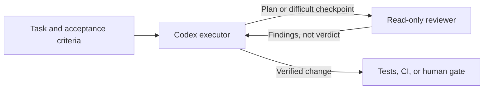

上一篇拆解 [Claude Code Advisor](/blog/133-claude-code-advisor-decision-points/)：讓主要模型在任務中途請另一個模型看一眼。那麼 GPT／Codex 有沒有相同做法？有，但官方功能不是一個包辦所有情境的 Advisor 開關，而是一組審查機制：`/review` 看程式差異、自訂 reviewer subagent 看計畫或問題、Auto-review 判斷越過權限邊界的操作；若要把顧問模型嵌進自己的 Agent 流程，Agents SDK 還提供 manager 呼叫 specialist 的組裝方式。

這個差異很重要。**「第二個模型給建議」、「另一個 Agent 審查 diff」和「審核一次權限請求」不是同一種工作**。選錯機制，可能以為程式已獲第二模型把關，實際上只是在確認某個 shell 命令是否能越過 sandbox。

> **花花的判斷**
>
> Codex 的第二意見不是單一按鈕，而是一套依審查對象分層的工具；先說清楚「要檢查什麼」，再選 reviewer。

## 先校正答案：Codex 確實能用不同模型做 `/review`

查核目前的 [Codex 官方 Code Review 文件](https://learn.chatgpt.com/docs/code-review)後，可以確認：Codex 的 `/review` 會啟動專用 reviewer，針對 Git checkout 中的未提交變更、指定 commit 或與 base branch 的差異，回報依優先度整理的發現，而且不會改動工作樹。文件也說明，可以在 `config.toml` 設定 `review_model`，讓這次審查使用不同於目前工作階段的模型。

這比「把同一段問題再問一次」更接近一個正式 review 入口，但它的觸發點仍是**明確開始審查**，範圍是選定的程式差異。它不等於主要 Agent 在任何任務中途自動覺得困難，就自行呼叫顧問；那種任務階段的第二意見，可以用自訂 subagent 或自行編排的 SDK 流程補上。

| 機制 | 審查對象與觸發點 | 最適合回答 | 不代表什麼 |
| --- | --- | --- | --- |
| Codex `/review` + `review_model` | 人啟動對本地 diff、commit 或 branch 的審查 | 這個改動有沒有明顯的 correctness、security 或測試風險？ | 不會自動在每個中途決策點啟動，也不是合併批准 |
| 自訂 reviewer subagent | 主 Agent 委派計畫、失敗原因或變更內容 | 有沒有被原執行者忽略的替代方案、假設或風險？ | 建議不是測試結果；subagent 不應替代 CI |
| Auto-review | 操作需要跨出既有 sandbox／approval 邊界時 | 這個特定動作依政策是否應被放行？ | 不是架構或程式品質審查，也不會擴大權限 |
| Agents SDK 的 advisor tool | 由應用程式定義呼叫時機 | 如何把第二意見納入自己的 Agent 產品流程？ | 不是 API 自動附帶的 Codex Auto-review |

把流程畫成一條線會更清楚：Codex 的主 Agent 繼續負責工作，reviewer 回傳發現；Auto-review 則只在權限升級時檢查那個具體操作，最後仍要靠測試或人工 gate 驗證結果。



## 用自訂 reviewer subagent，在重要節點請第二個模型看計畫

如果你要在動手前、同一個錯誤反覆出現時，或準備交付前取得另一個角度，Codex subagent 更適合。官方說明支援在 Codex 中使用平行 subagent，也可以把自訂 agent 放在個人 `~/.codex/agents/` 或專案 `.codex/agents/`。每個 agent 能有自己的模型、推理程度、sandbox 和任務指示；若沒有指定模型或推理設定，subagent 會沿用 parent agent 的設定。[官方 Subagents 指南](https://learn.chatgpt.com/docs/agent-configuration/subagents)也提供了 `pr_explorer`、`reviewer`、`docs_researcher` 的 PR 審查範例，其中 reviewer 是 read-only，聚焦 correctness、security 和測試風險。

例如在 `.codex/agents/reviewer.toml` 定義一個不改檔的 reviewer：

```toml
name = "reviewer"
description = "Read-only second opinion on plans and code changes."
model = "gpt-6.1-sol"
model_reasoning_effort = "medium"
sandbox_mode = "read-only"
developer_instructions = """
Review the supplied goal, plan, evidence, or diff independently.
Prioritize correctness, security, behavior regressions, and missing tests.
Return concrete findings with evidence and a recommended verification step.
Do not edit files or claim that an unrun test passed.
"""
```

這個範例使用官方文件目前列出的模型名稱；實際可用模型、推理選項及帳戶權限會變動，設定前要以你的 Codex 版本與組織政策為準。專案可再用一段清楚的任務指示安排檢查點：

```text
先整理目標、驗收條件和方案，不要改檔。請委派 reviewer 以唯讀方式檢查計畫，回報最可能失敗的假設、權限風險與一個替代方案。收到結果後，列出哪些建議採納或不採納及證據，再開始實作。完成後再讓 reviewer 只讀檢查 diff；最後由你執行測試並整理結果。
```

這是把審查放在長任務中的方式，不是讓 reviewer 接手整個工作。Codex 官方建議把 subagent 用在可清楚界定、彼此獨立的子任務，給它具體問題與預期輸出；太短或高度依賴前一步的工作留在主 Agent，通常更直接。[Subagents 文件](https://learn.chatgpt.com/docs/agent-configuration/subagents)

## 用 `/review` 審 diff，別把它當成合併按鈕

Codex `/review` 的優勢是範圍具體。你可以選擇對照 base branch、檢查未提交變更或檢查指定 commit；reviewer 會回報優先處理的發現，但不會改動工作樹。這很適合在實作後做獨立 diff review，尤其能讓審查者只聚焦改了什麼，而不必重讀整段任務歷史。[Codex Code Review 文件](https://learn.chatgpt.com/docs/code-review)

若希望審查模型不同於正在工作的模型，可在 `config.toml` 設定 `review_model`：

```toml
review_model = "YOUR_SUPPORTED_REVIEW_MODEL"
```

把 placeholder 換成目前 Codex 版本與帳戶支援的模型 ID。Code Review 也能用自訂指示設定全域審查重點與回報格式；例如優先找行為回歸、資料遺失和缺少邊界測試。若 review 結果需要在獨立對話處理，官方文件另列 `chatgpt.reviewDelivery = "detached"` 設定。這些是審查工作流的控制，不代表 reviewer 的結論已經被測試證實。

如果同一種判斷常常靠資深工程師口耳相傳，可以把可持續的規則放進 repo 的 `AGENTS.md`，並用 `## Code Review Rules` 標記，像是向後相容要求、不可跨越的資料界線、哪些例外可接受。OpenAI 的 Code Review 規則文章示範了規則如何貼近受影響程式碼、在 finding 裡指出對應規則；文中 98% 對 58.3% 的數字來自 OpenAI 自己設計的測試套件，應視為廠商內部評測，不是外部團隊的實際命中率。[Custom Code Review rules for Codex](https://developers.openai.com/blog/custom-code-review-rules-for-codex)・[AGENTS.md 官方指南](https://learn.chatgpt.com/docs/agent-configuration/agents-md)

## Auto-review 審權限邊界，不審你的設計品味

Codex 的 Auto-review 是最像「第二個 Agent 替某個決策把關」的正式功能，但它檢查的決策很特定：主 Agent 要執行一個本來需要 approval 的操作時，Codex 把請求交給另一個 reviewer agent，回傳放行或拒絕及理由。觸發情境包含 sandbox 外的命令、受阻的網路請求、允許根目錄之外的檔案修改，以及部分需要 approval 的 MCP／app tool call。[Auto-review 文件](https://learn.chatgpt.com/docs/sandboxing/auto-review)

互動式 approval 下，設定概念如下：

```toml
approval_policy = "on-request"
approvals_reviewer = "auto_review"
```

重點不是這兩行會讓 Codex「更有權限」。官方明確說 Auto-review 是 reviewer 替換人工處理 eligible approval 的方式，**不會擴大 sandbox、開啟額外網路或放寬檔案邊界**；一般已在 sandbox 允許範圍內的操作也不會逐一被它 review。它的 reviewer 評估的是具體準備執行的操作與政策，不是「這個重構是不是好設計」或「回答是不是正確」。而且它不是確定性的安全保證，不能取代合理的 sandbox、監控和組織政策。

因此，不要用 Auto-review 代替 `/review` 或程式測試。前者看權限升級的動作；`/review` 看程式差異；測試與 CI 才能對可機械驗證的條件提供穩定 gate。需要不可跳過的審查，應由 branch protection、CI 或人工批准實作，而不是只靠模型自行決定要不要再問一位 reviewer。

## 自己做 Agent 產品：把 advisor 做成 manager 可呼叫的工具

若你不是只在 Codex 裡用，而是在開發自己的 GPT Agent，OpenAI Agents SDK 提供更直接的架構：建立一個 specialist agent，讓主 Agent 把它作為 tool 呼叫。只要兩個 agent 分別設定 `model`，就能用一個較快的 executor 搭配另一個模型作 bounded consultation；manager 仍負責最終回答。官方把這種模式稱為「agents as tools」，與 handoff（把對話控制權交給專家）區分開來。[模型設定](https://developers.openai.com/api/docs/guides/agents/models)・[Orchestration and handoffs](https://developers.openai.com/api/docs/guides/agents/orchestration)

概念程式如下，模型 ID 請換成部署環境實際支援的選項：

```ts
import { Agent } from "@openai/agents";

const advisor = new Agent({
  name: "Advisor",
  model: "gpt-6.1-sol",
  instructions: "Review the supplied plan or evidence. Return risks, alternatives, and checks; do not execute tools.",
});

const executor = new Agent({
  name: "Executor",
  model: "gpt-6-luna",
  tools: [
    advisor.asTool({
      toolName: "consult_advisor",
      toolDescription: "Request a bounded second opinion on a consequential decision.",
    }),
  ],
});
```

這段程式只建立路由能力，**不保證** executor 一定會在每一個指定節點呼叫顧問。若某種操作必須先審查，應由你的應用程式在流程層建立不可跳過的 checkpoint；若是工具副作用，則在 tool boundary 執行 policy／approval。OpenAI 也明確提醒，Responses API 與 Agents SDK 專案不會自動繼承 Codex Auto-review；自建 harness 必須自己加入 review 與 enforcement。[Guardrails and human review](https://developers.openai.com/api/docs/guides/agents/guardrails-approvals)

## OpenAI 自己的案例，能證明什麼、不能證明什麼

OpenAI 描述 DevDay 2025 的交付時，提到工程師用 Codex 熟悉 Guardrails SDK codebase、定位問題，透過 CLI／IDE extension 修正，再用 Codex code review 找出尚未處理的 bug，也用同一套工作流整理 ChatKit sample apps。[Codex at DevDay](https://developers.openai.com/blog/codex-at-devday) 這是第一方工程案例，說明探索、實作、審查可以放在同一條交付路徑；它不是對照實驗，不能單憑這個案例推論 Codex review 的缺陷召回率或生產力提升幅度。

這些工具最有用的共同點不是「多一個模型就更可靠」，而是把 review 對象切得夠清楚：計畫、diff、權限請求分別交給適合的機制。想理解 subagent 如何成為更廣泛的 harness 元件，可接著看[Skills、Subagents、Commands 與 Hooks](/blog/29-agent-era-skills-subagents-commands-hooks/)；若要從 repo 規範、測試與可觀測性設計 Codex 工作環境，可讀[Harness Engineering：讓 Codex Repository 可讀、可驗證、可治理](/blog/11-harness-engineering/)；更完整的 Agent runtime 基礎則見[AI Agent 實戰指南](/blog/64-ai-agent-guide/)。

## 導入時，用自己的任務比較三個條件

不要把「reviewer 說沒問題」當作成功指標。挑一組有清楚驗收條件的真實任務，至少比較主模型單獨工作、主模型加 reviewer，以及較強主模型單獨工作。記錄：

1. 最終測試與人工驗收是否通過，而不是 Agent 是否宣稱完成。
2. reviewer 找出的真實缺陷數、誤報數，以及執行者採納後是否真的修正問題。
3. 顧問呼叫、`/review`、Auto-review 各自的次數與觸發原因，不把三種審查混成一個數字。
4. 每個任務總 token／費用、延遲、返工，以及 reviewer 模型不可用或超時時的處理方式。
5. 誰有權做最後決定；對部署、刪除、外部寫入或敏感資料，是否仍有 CI、sandbox 或人工 gate。

> **花花的工程提醒**
>
> 不同模型可以減少部分同源偏誤，卻不會自動提供獨立真相。審查結果要能指向 diff、測試或政策證據；無法驗證的建議就保留為待查，而不是當成通過章。

對一般 Codex 專案，一個務實的起點是三步：計畫或反覆失敗時，委派唯讀 reviewer subagent；patch 完成後跑指定 `review_model` 的 `/review`；跨 sandbox 的操作交給 Auto-review 判斷。最後仍以測試、CI 和人工責任收尾。如果你在打造自己的 Agent 產品，再用 Agents SDK 的 manager-as-tool 把顧問呼叫納入可觀測、可評測的流程。

## 來源與延伸閱讀

- OpenAI, [Subagents](https://learn.chatgpt.com/docs/agent-configuration/subagents) — Codex 自訂 subagent、模型繼承、唯讀 reviewer 設定與實例。
- OpenAI, [Code review](https://learn.chatgpt.com/docs/code-review) — `/review` 的範圍、唯讀結果、`review_model` 與審查工作流。
- OpenAI, [Auto-review](https://learn.chatgpt.com/docs/sandboxing/auto-review) — reviewer 如何審查 sandbox 邊界升級請求，以及權限與安全限制。
- OpenAI, [Custom Code Review rules for Codex](https://developers.openai.com/blog/custom-code-review-rules-for-codex) — 以 `AGENTS.md` 提供有範圍的審查慣例及廠商自評結果。
- OpenAI, [Orchestration and handoffs](https://developers.openai.com/api/docs/guides/agents/orchestration) 與 [Models and providers](https://developers.openai.com/api/docs/guides/agents/models) — Agents SDK 的 manager/specialist 模式和 per-agent model 設定。
- OpenAI, [Guardrails and human review](https://developers.openai.com/api/docs/guides/agents/guardrails-approvals) — 自建 API／SDK Agent 必須自行實作的審查與 enforcement 邊界。
- OpenAI, [How Codex ran OpenAI DevDay 2025](https://developers.openai.com/blog/codex-at-devday) — Codex 在 SDK 除錯、修補與 code review 的第一方工程案例。
