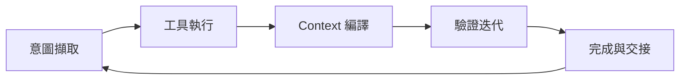

當同事問「我們要不要換更強的模型？」時，Parallel.ai 這篇 **23 分鐘閱讀量** 的科普文提供另一個問題：**你包在模型外面的生命週期管理夠不夠好？** 他們把 **Agent Harness** 定義成：管理 **context 全生命週期** 的架構——從意圖擷取、規格化、編譯、執行、驗證到持久化，**模型以外的一切**。

這不是「又一個 prompt 技巧」，而是讓預訓練 LLM **接上世界** 的軟體層。本文為 [閱讀地圖 13](/blog/13-harness-engineering-reading-map/) Phase 2（清單 **#8**），與 [LangChain 15](/blog/15-langchain-agent-harness-anatomy/)「由行為反推元件」互補：本篇偏 **定義、五步迴圈、堆疊釐清與 FAQ**，適合對外簡報或 onboarding。

---

原文出處：  
**Parallel.ai（2025）. What is an agent harness?**  
網址：<https://parallel.ai/articles/what-is-an-agent-harness>

---

### 背景：從「模型 + 聊天」到「編排 + Harness」

早期 ChatGPT 幾乎只有 **LLM + 對話介面**。今日進階助手背後通常是：

| 層 | 角色 |
|----|------|
| **Orchestrator** | 決定何時、如何多次呼叫模型（控制流） |
| **Harness** | 工具、記憶、長對話結構、驗證、持久化（能力與副作用） |
| **Model** | 推理核心 |

Parallel 強調：**實際效果往往取決於 orchestrator + harness，而不只是模型參數或訓練資料的邊際增益。** 這與 [Schmid 18](/blog/18-phil-schmid-agent-harness-2026/) 的 durability、[Terminal Bench 在 15](/blog/15-langchain-agent-harness-anatomy/) 的 harness 排名劇變，是同一敘事。

一位架構師在原文中的定義可濃縮為：

> Harness = 圍繞 LLM 的完整架構系統，管理 context 從 **intent capture → specification → compilation → execution → verification → persistence** 的全流程。

---

### 核心概念 1：Harness 為何出現（四類實務缺口）

當 Agent 被要求寫跨 session 的軟體、查 API、分析長文件、操作 UI 時，**裸 LLM** 暴露四類缺口：

#### 1. 記憶與 context 有限

標準 LLM 有固定 context window，每個 session 從零開始——Parallel 比喻像 **每天失憶的工程師**。Harness 用：

- 持久 log、摘要  
- 外部知識庫／向量庫  
- **Compaction**（與 Anthropic Claude Agent SDK 同族）

讓工作可跨多個 context window 延續。對照 [Anthropic 10](/blog/10-effective-harnesses-for-long-running-agents/) 的 initializer／coding agent 與 `claude-progress.txt`。

#### 2. 模型只能吐文字，但需要「動手」

Harness **監聽 tool-call 指令** → 暫停生成 → 執行搜尋／程式／API → 把結果塞回 context，彷彿模型自己「寫出」了觀測。這是 **給模型手與眼**。

#### 3. 缺乏結構化工作流

複雜任務需拆解、每步驗收。沒有結構時，輸出常 **表面合理、細看崩潰**。Harness 把意圖規格化、設 acceptance criteria、強制增量進度。

#### 4. 長地平線任務

Anthropic 工程文（Parallel 引用）：再強的 coding 模型，若無外部系統做 **專案初始化、進度追蹤、artifact 留給下一 session**，也難建好大型 app。Harness 填的是 **session 之間的膠水**。

---

### 核心概念 2：Harness 如何運作（五步迴圈）

1. **意圖擷取與編排協作**  
   使用者目標被捕捉；orchestrator 拆子任務或決定下一步 prompt；harness 供工具與當步 context。

2. **Tool call 執行**  
   模型輸出結構化 tool 請求 → harness **暫停**文字生成 → 在外部世界執行 → 結果回填。模型可對 **live data** 推理。

3. **Context 管理與記憶**  
   每輪前 **編譯工作用 prompt**：保留要點、摘要舊對話、避免 **context rot**（與 [LangChain 15](/blog/15-langchain-agent-harness-anatomy/) 的 isolation／reduction／retrieval 同題）。  
   常區分三層記憶（Parallel 整理）：

   | 類型 | 說明 |
   |------|------|
   | Working context | 當次呼叫模型的瞬時 prompt |
   | Session state | 當前任務的持久 log，任務結束可清 |
   | Long-term memory | 跨任務的知識庫／向量庫 |

4. **結果驗證與迭代**  
   格式檢查、測試、安全過濾；coding 常見 **write → test → fix** 無人迴圈。Harness 鼓勵 **一次一個子任務**，並在推進前 commit／更新 progress。  
   **Parallel 特別提醒**：盲目加「QA 子 Agent」可能更糟；較好讓 **主 Agent 自驗**，必要時才升級或重置。

5. **完成與交接**  
   存 artifact、progress、repo 狀態，讓 **專案有記憶**——即使下一個 LLM 實例是全新的。

**關鍵**：Harness **不改模型權重**；是架構層提升預訓練模型的問題解決能力。

---

### 核心概念 3：常見元件（檢查清單）

| 元件 | 職責 |
|------|------|
| 工具整合層 | 搜尋、DB、code sandbox、影像等；預設工具包 |
| 記憶與狀態 | 短／長期記憶、摘要、RAG 注入 |
| Context engineering | 隔離、壓縮、首輪 vs 後續不同 prompt |
| 規劃與分解 | initializer 建清單；coding agent 一次一 feature |
| Guardrails | 測試、schema、安全；coding 跑 unit test |
| 模組化 | 可插拔 perception／memory／reasoning |

**學術驗證（ICML 2025 遊戲 agent 論文，Parallel 引用）**：同一 GPT-4 級模型，加上 **perception + memory + reasoning** 模組的 harness，在多款遊戲 **勝率一致高於無 harness**——證明瓶頸常在 **周邊系統**，不在多訓練一點。

---

### 核心概念 4：實例與堆疊釐清

| 名稱 | Harness 角色 |
|------|----------------|
| **Claude Agent SDK** | Anthropic 稱 general-purpose harness；含 compaction |
| **LangChain DeepAgents** | 預設 prompt、規劃、虛擬檔案系統；「開箱 OS」 |
| **AutoGPT、Copilot X、Cursor** | 早期或產品化即含 rudimentary harness |
| **LM Evaluation Harness** | ⚠️ **評測 harness**，與 agent harness 不同語境 |

#### Harness vs Framework

- **Framework**（LangChain、LlamaIndex）：積木——tool 抽象、chain、agent loop。  
- **Harness**：**帶預設的完整 runtime**，常建立在 framework 上（DeepAgents 用 LangChain）。

#### Harness vs Orchestrator

- **Orchestrator**：**邏輯與控制流**——何時再呼叫模型、ReAct 迴圈。  
- **Harness**：**能力與副作用**——執行 tool、管理 IO、編譯 context。  
- 兩者 **並用**：orchestrator 說「再跑一步」；harness 確保那一步有工具與正確 prompt。

#### Harness vs Prompt engineering

Prompt engineering 是 **技巧**；harness 是 **含 prompt 決策在內的整體架構**（工具、記憶、迴圈、持久化）。

#### 多模型共用

Harness 可 **換模型** 而不重寫全系統；甚至 **model routing**（簡單步驟用小模型）。需調整的是各模型的 tool 語法與 prompt 格式細節。

---

### 核心概念 5：設計得當的效益

| 效益 | 機制 |
|------|------|
| 任務成功率 | 工具、記憶、除錯迴路補模型弱點 |
| 長任務一致性 | 中斷後載入 state，避免重複或放棄 |
| 資源效率 | 精準 context；知識圖／DB 外置推理可 **10–100×** 減 token（原文量級說法） |
| 能力擴展無需重訓 | Vision、Python、搜尋經 harness 接上 |
| 可靠性與安全 | 過濾、流程強制；harness 如 **引擎上的 governor** |

Parallel 的結論與產業口號一致：**「Harness makes or breaks the product」**——同一 LLM，harness 差異 = 使用者體驗差異。對照 [Fowler 14](/blog/14-martin-fowler-harness-engineering-review/)、[Ignorance 20](/blog/20-ignorance-ai-harness-playbook/)。

---

### FAQ 精選（原文要點）

| 問題 | 簡答 |
|------|------|
| 簡單 Q&A 需要 harness 嗎？ | 不一定；一但要多步、工具、跨 session，幾乎都需要（哪怕很薄） |
| Harness 工程 vs 傳統軟工？ | 借用模組、狀態、測試，但要處理 **非決定核心**、token 上限、幻覺 |
| 只適用文字 LLM？ | 概念可推到機器人、RL 的 environment wrapper |

---

### 與本系列其他文的對照

| 你想… | 讀哪篇 |
|--------|--------|
| 控制論與信任 | [Fowler 14](/blog/14-martin-fowler-harness-engineering-review/) |
| 元件與 Terminal Bench | [LangChain 15](/blog/15-langchain-agent-harness-anatomy/) |
| 組織級實戰 | [OpenAI 11](/blog/11-harness-enginnering/) |
| 2026 戰略與 durability | [Schmid 18](/blog/18-phil-schmid-agent-harness-2026/) |
| 業界 playbook 收斂 | [Ignorance 20](/blog/20-ignorance-ai-harness-playbook/) |
| Coding 配置面戰術 | [HumanLayer 21](/blog/21-humanlayer-skill-issue-harness/) |

---

### 啟示與建議

1. **對外溝通**：用「CPU / RAM / OS / App」類比（見 [18](/blog/18-phil-schmid-agent-harness-2026/)），再用本篇五步迴圈說明 OS 做什麼。  
2. **架構決策**：新功能先標註落在 **orchestrator** 還是 **harness**；避免兩邊都缺。  
3. **長任務預設**：progress 檔 + 驗證步 + 增量 commit，而不是無限加長 system prompt。  
4. **投資順序**：先讓 **單一 harness 路徑** 可 log、可評分（呼應 Schmid 的 hill climbing），再談換模型。

---

### 小結

Parallel.ai 文是 **教科書級定義文**：把分散在 Anthropic、LangChain、學術遊戲實驗裡的做法，收斂成 **生命週期 + 五步迴圈 + 堆疊詞彙**。它不取代 [10](/blog/10-effective-harnesses-for-long-running-agents/) 的實作細節或 [17](/blog/17-anthropic-parallel-c-compiler-agents/) 的極端壓測，但適合當團隊 **共同語言** 的第一份閱讀。

**編者判斷：** 堆疊類比便於對外溝通，但 Parallel.ai **未給可量化的 harness ROI**；實務上仍須對照 OpenAI 11 的驗證鏈，避免把五步迴圈當 checklist 而忽略領域約束。

---

### 系列導讀

- [閱讀地圖 13](/blog/13-harness-engineering-reading-map/)  
- [20 Ignorance.ai Playbook](/blog/20-ignorance-ai-harness-playbook/) · [21 HumanLayer](/blog/21-humanlayer-skill-issue-harness/)

---

原文出處：  
**Parallel.ai（2025）. What is an agent harness?**  
網址：<https://parallel.ai/articles/what-is-an-agent-harness>
