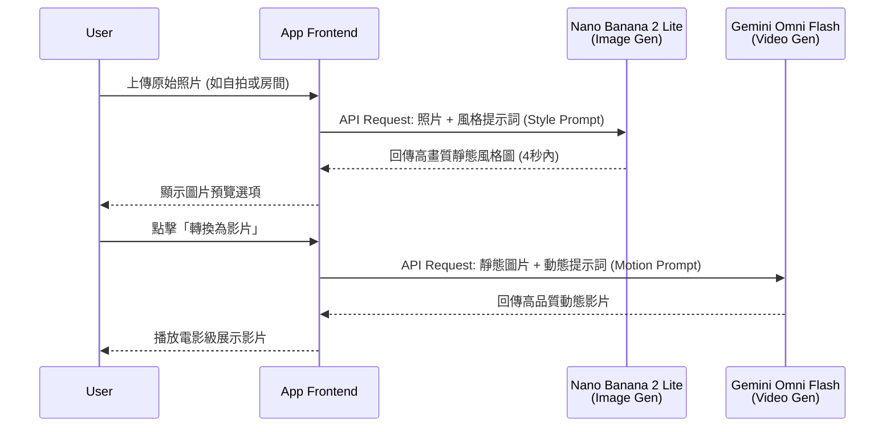

Google 同時發布 **Nano Banana 2 Lite** 與 **Gemini Omni Flash**，分別對準高吞吐圖像生成與對話式影片生成／編輯。兩者可以串成「先產圖、再產影片」的管道，但成熟度不同：前者主打正式可用的速度與成本，後者仍標示為 preview。

本文把官方規格、定價與限制分開整理。文中的速度、品質與成本敘述若未另註，均來自 Google 公布資料；正式導入前仍應以自己的提示詞、輸出解析度、失敗率與區域可用性重新驗證。

## 1. Nano Banana 2 Lite：先讀官方規格，再做自己的基準

**Nano Banana 2 Lite**（模型代號：`gemini-3.1-flash-lite-image`）定位於快速構思與高吞吐量管道。Google 建議仍使用第一代 Nano Banana（`gemini-2.5-flash-image`）的開發者評估升級，但是否划算仍取決於既有提示詞相容性、品質門檻與回歸測試結果。


### 核心優勢

*   **官方延遲數字**：Google 公布文字轉圖約 **4 秒**，適合列入互動原型與快速草圖的候選模型。
*   **官方價格**：1K 圖像為 **0.034 美元**；大量生成時還要把重試、審核、儲存與後處理成本算進去。
*   **品質主張**：Google 強調提示詞依從性、人物一致性與圖中文字能力；這些項目應用固定測試集自行驗證，不能只看官方 demo。

**API 調用範例 (Python)**：
```python
from google import genai
from PIL import Image
import io

client = genai.Client()

# 使用 Nano Banana 2 Lite 生成圖像
response = client.models.generate_content(
    model="gemini-3.1-flash-lite-image",
    contents="A futuristic cityscape at sunset, cinematic lighting"
)

# 獲取並儲存生成的圖像
for part in response.parts:
    if part.inline_data:
        image = Image.open(io.BytesIO(part.inline_data.data))
        image.save("output_nano_banana.png")
```

### 認識 Nano Banana 家族

Google 亦針對不同需求，將 Nano Banana 家族進行了明確的定位：


*   **Nano Banana 2 Lite (Gemini 3.1 Flash Lite Image)**：為「速度」而生，適合近乎即時、高吞吐量且對超低延遲有嚴格要求的工作流程。
*   **Nano Banana 2 (Gemini 3.1 Flash Image)**：Google 定位為兼顧畫質、延遲與成本的通用選項。
*   **Nano Banana Pro (Gemini 3 Pro Image)**：面向準確度優先、需要較多控制與推理的複雜任務。

目前，Nano Banana 2 Lite 已在 Google AI Studio、Gemini API 以及 Gemini Enterprise Agent Platform 上線，並同步推廣至包含 Google 搜尋 (AI Mode)、Gemini App、NotebookLM 等眾多消費者產品中。

## 2. Gemini Omni Flash：preview 能力與限制要一起看

在今年的 Google I/O 大會上，結合了 Gemini 多模態推理與影片生成編輯能力的 **Gemini Omni** 首度亮相。而現在，**Gemini Omni Flash** (`gemini-omni-flash-preview`) 已正式透過 Gemini API 與 Google AI Studio 開放給開發者預覽測試。

這款模型支援文字、圖像與影片輸入，以及影片生成與對話式編輯。Google 公布的價格為每生成一秒影片 **0.10 美元**（與 Veo 3.1 Fast 相同）；這只是生成費用，產品端仍需計入重試與內容審核。

### Omni Flash 的四大亮點

1.  **對話式影片編輯**：開發者與用戶可以使用自然語言來微調和編輯影片內容。
2.  **多模態參考 (Multimodal Referencing)**：結合圖像、文字與影片等多種輸入格式，藉此保持場景的控制力與高度一致性。
3.  **真實世界知識整合**：Omni 汲取了 Gemini 在歷史、生物學及敘事邏輯等領域的龐大知識庫，能夠建構出具備說服力的生動影片。
4.  **文字與動作同步**：只需透過簡單的提示詞，就能將文字或圖形直接與影片中的動作完美連結。

**API 調用範例 (Python)**：
```python
from google import genai

client = genai.Client()

# 上傳參考媒體（例如 Nano Banana 生成的圖片或一段基準影片）
# reference_media = client.files.upload(file="source_image.png")

# 使用 Gemini Omni Flash 進行影片生成或編輯
response = client.models.generate_content(
    model="gemini-omni-flash-preview",
    contents=[
        "Transform this scene to look like a watercolor painting, maintaining smooth motion.",
        # reference_media
    ]
)
```

### 當前預覽版的限制

值得注意的是，作為預覽版，Omni Flash 目前仍有一些限制：
*   官方預覽版目前最長約 **10 秒** 的影片。
*   Gemini API 尚未支援上傳音訊參考與場景延伸 (Scene Extension) 功能。
*   雖然 API 接受最長 3 秒的影片參考，但模型目前還無法完美處理。
*   在切換場景或平移鏡頭時的人物一致性仍有進步空間。

## 3. 串接判斷：先產圖，再產影片

Google 的 demo 採用一個容易理解的串接方式：先以 **Nano Banana 2 Lite** 產生靜態圖，再把圖像交給 **Gemini Omni Flash** 動畫化。搭配 **Interactions API** 可保留對話歷史與上下文，官方目前示範最多三次連續編輯。這是一種可測試的參考架構，不代表每種產品都應多加一道模型呼叫。

### 多模態管道時序架構 (Anywhere / Space Lift)

以下展示在 Anywhere 或 Space Lift 應用中，這兩個模型如何無縫協作的多模態管道架構：



### 官方 Demo 應用啟發

Google 也釋出了幾款 Demo 應用程式供開發者參考與 Remix：
*   **Anywhere**：上傳一張自拍照，APP 會使用 Nano Banana 2 Lite 將你瞬間置身於全球數十個知名地標；點擊圖像後，Omni Flash 則會將其轉換為動態場景影片。
*   **Space Lift**：一款室內設計 APP。上傳房間照片後，Nano Banana 2 Lite 會為你生成多種美學風格的設計概念；選定喜歡的風格後，點擊影片按鈕，Omni 就會呈現一段充滿電影感的房間展示影片。
*   **Omni Product Studio**：為電子商務而生，將 Nano Banana 2 Lite 生成的靜態產品圖，瞬間轉化為吸睛的電影級商品宣傳影片。

## 結語

Nano Banana 2 Lite 的價值主張相對清楚：更低的單張成本與較短等待時間。Gemini Omni Flash 則適合先以小流量試驗，尤其要追蹤 10 秒上限、參考媒體處理、人物一致性與每次成功輸出的實際成本。兩者串接前，先定義品質門檻與失敗時的回退路徑，比只比較標價更重要。

> **花花的一句話**
>
> 花花聽說有叫 Nano Banana 的東西，還以為是新口味的香蕉零食呢！結果是超快速的畫圖魔法，四秒鐘就能變出一張圖，連我都來不及吃完一口貓草喵！
>
> **花花的工程提醒**
>
> 導入生成式 AI 圖像與影片服務時，記得考慮到延遲（Latency）對使用者體驗的影響。像 Nano Banana 2 Lite 這樣的高速模型，非常適合用於需要即時回饋的互動式原型設計或草圖生成。

## 延伸閱讀

- 想看同一模型能力進入知識產品後的來源邊界，可讀 [NotebookLM 短影音摘要](/blog/33-google-notebooklm-ai-clips/)。
- 若評估的是企業平台而非單一 API，可對照 [Gemini Enterprise Agent Platform](/blog/68-gemini-enterprise-agent-platform/)。
- 若要進一步看多媒體 AI 的產品化取捨，可讀 [Google Cloud × 訊連科技](/blog/41-google-cloud-cyberlink-ai-multimedia/)。

*資料來源：[Google 官方部落格：Start building with Nano Banana 2 Lite and Gemini Omni Flash](https://blog.google/innovation-and-ai/models-and-research/gemini-models/gemini-omni-flash-nano-banana-2-lite/)*
