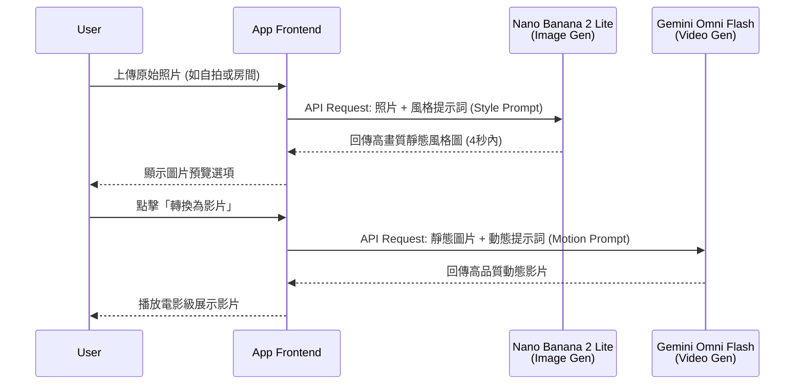

近期，Google 帶來了兩項震撼開發者社群的重大發布：**Nano Banana 2 Lite** 以及 **Gemini Omni Flash**。這兩款全新模型旨在讓開發者能以更快、更低成本的方式，進行創意實驗並將想法規模化。

無論您的工作流程需要生成成千上萬張圖像，還是進行多輪對話式的影片編輯，這兩款新模型都能幫助您加速開發迭代，並將無邊際的創意願景化為現實。本文將為您詳細解析這兩大技術的核心亮點與應用潛力。

## 1. Nano Banana 2 Lite：最快、最具成本效益的 Gemini 圖像模型

**Nano Banana 2 Lite** (模型代號：`gemini-3.1-flash-lite-image`) 專為需要快速構思、高吞吐量的開發管道所設計，在速度與成本上達到了前所未有的優勢。官方強烈建議目前仍在使用第一代 Nano Banana (`gemini-2.5-flash-image`) 的開發者，可以立即升級至 2 Lite 以獲得全面的效能提升。


### 核心優勢

*   **極致的生成速度**：在短短 **4 秒內**即可完成文字到圖像 (Text-to-image) 的生成，非常適合互動式原型設計和快速的視覺草圖繪製。
*   **驚人的成本效益**：生成 1K 解析度的圖像僅需 **0.034 美元**，對於專注於大量構圖、需要嚴格控制營運預算，或是低頻寬使用場景的開發團隊來說，是完美的選擇。
*   **不妥協的品質**：儘管極度追求速度，Nano Banana 2 Lite 依然保有可靠的提示詞依從性 (Prompt Adherence)、強大的人物一致性，以及清晰可讀的圖像內文字渲染能力。

**API 調用範例 (Python)**：
```python
from google import genai
from PIL import Image
import io

client = genai.Client()

# 使用 Nano Banana 2 Lite 生成圖像
response = client.models.generate_content(
    model="gemini-3.1-flash-lite-image",
    contents="A futuristic cityscape at sunset, cinematic lighting"
)

# 獲取並儲存生成的圖像
for part in response.parts:
    if part.inline_data:
        image = Image.open(io.BytesIO(part.inline_data.data))
        image.save("output_nano_banana.png")
```

### 認識 Nano Banana 家族

Google 亦針對不同需求，將 Nano Banana 家族進行了明確的定位：


*   **Nano Banana 2 Lite (Gemini 3.1 Flash Lite Image)**：為「速度」而生，適合近乎即時、高吞吐量且對超低延遲有嚴格要求的工作流程。
*   **Nano Banana 2 (Gemini 3.1 Flash Image)**：全能主力模型，在較低延遲的情況下提供高畫質，完美平衡效能與成本。
*   **Nano Banana Pro (Gemini 3 Pro Image)**：針對複雜、專業的使用案例進行優化，在「準確度高於速度」的任務中提供最強大的控制與進階推理能力。

目前，Nano Banana 2 Lite 已在 Google AI Studio、Gemini API 以及 Gemini Enterprise Agent Platform 上線，並同步推廣至包含 Google 搜尋 (AI Mode)、Gemini App、NotebookLM 等眾多消費者產品中。

## 2. Gemini Omni Flash：引領多模態影片編輯與生成

在今年的 Google I/O 大會上，結合了 Gemini 多模態推理與影片生成編輯能力的 **Gemini Omni** 首度亮相。而現在，**Gemini Omni Flash** (`gemini-omni-flash-preview`) 已正式透過 Gemini API 與 Google AI Studio 開放給開發者預覽測試。

這款模型能夠原生支援文字、圖像與影片輸入，並進行高畫質的影片生成與對話式編輯。其定價極具競爭力，每生成一秒影片僅需 **0.10 美元** (與 Veo 3.1 Fast 相同)。

### Omni Flash 的四大亮點

1.  **對話式影片編輯**：開發者與用戶可以使用自然語言來微調和編輯影片內容。
2.  **多模態參考 (Multimodal Referencing)**：結合圖像、文字與影片等多種輸入格式，藉此保持場景的控制力與高度一致性。
3.  **真實世界知識整合**：Omni 汲取了 Gemini 在歷史、生物學及敘事邏輯等領域的龐大知識庫，能夠建構出具備說服力的生動影片。
4.  **文字與動作同步**：只需透過簡單的提示詞，就能將文字或圖形直接與影片中的動作完美連結。

**API 調用範例 (Python)**：
```python
from google import genai

client = genai.Client()

# 上傳參考媒體（例如 Nano Banana 生成的圖片或一段基準影片）
# reference_media = client.files.upload(file="source_image.png")

# 使用 Gemini Omni Flash 進行影片生成或編輯
response = client.models.generate_content(
    model="gemini-omni-flash-preview",
    contents=[
        "Transform this scene to look like a watercolor painting, maintaining smooth motion.",
        # reference_media
    ]
)
```

### 當前預覽版的限制

值得注意的是，作為預覽版，Omni Flash 目前仍有一些限制：
*   目前僅支援生成最高 **10 秒** 的影片（更長時數即將推出）。
*   Gemini API 尚未支援上傳音訊參考與場景延伸 (Scene Extension) 功能。
*   雖然 API 接受最長 3 秒的影片參考，但模型目前還無法完美處理。
*   在切換場景或平移鏡頭時的人物一致性仍有進步空間。

## 3. 強強聯手：當 Nano Banana 2 Lite 遇上 Gemini Omni Flash

真正的魔法，發生在將這兩個模型串聯起來時！

開發者的最佳實踐是：首先使用 **Nano Banana 2 Lite** 作為極速圖像生成引擎，接著將該圖像作為參考輸入給 **Gemini Omni Flash**，將其動畫化成一部高畫質影片。搭配使用 **Interactions API** 進行多輪體驗，您還能保持對話歷史與上下文，讓用戶堆疊進行最多三次的連續編輯。

### 多模態管道時序架構 (Anywhere / Space Lift)

以下展示在 Anywhere 或 Space Lift 應用中，這兩個模型如何無縫協作的多模態管道架構：



### 官方 Demo 應用啟發

Google 也釋出了幾款 Demo 應用程式供開發者參考與 Remix：
*   **Anywhere**：上傳一張自拍照，APP 會使用 Nano Banana 2 Lite 將你瞬間置身於全球數十個知名地標；點擊圖像後，Omni Flash 則會將其轉換為動態場景影片。
*   **Space Lift**：一款室內設計 APP。上傳房間照片後，Nano Banana 2 Lite 會為你生成多種美學風格的設計概念；選定喜歡的風格後，點擊影片按鈕，Omni 就會呈現一段充滿電影感的房間展示影片。
*   **Omni Product Studio**：為電子商務而生，將 Nano Banana 2 Lite 生成的靜態產品圖，瞬間轉化為吸睛的電影級商品宣傳影片。

## 結語

Nano Banana 2 Lite 與 Gemini Omni Flash 的推出，不僅大幅降低了 AI 生成媒體的門檻，更為開發者提供了建構端到端 (End-to-end) 多媒體體驗的強大武器。無論是互動式設計、行銷素材生成，還是更複雜的創意工作流，這股由 Google 引領的生成式 AI 新浪潮，都值得每一位開發者親自體驗與探索。

---

*資料來源：[Google 官方部落格：Start building with Nano Banana 2 Lite and Gemini Omni Flash](https://blog.google/innovation-and-ai/models-and-research/gemini-models/gemini-omni-flash-nano-banana-2-lite/)*
