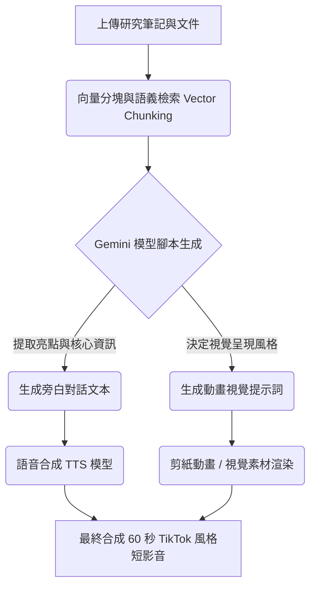

Google 的強大筆記與研究助理 **NotebookLM** 又迎來了一次重大進化！為了讓使用者能以更多元、更有趣的方式來吸收與整理研究資料，NotebookLM 正式推出一項全新功能：**將您的筆記與文件，一鍵轉化為類似 TikTok 風格的 60 秒直式 AI 短影音 (Short Video Overviews)**。

這項功能目前已經開始向 **Google AI Ultra** 以及 **Pro** 訂閱用戶推送，讓使用者可以根據上傳到應用程式中的來源素材（如 PDF、Google 文件、網站連結等），自動生成帶有語音旁白與豐富動畫的短影片。

## 核心亮點與特色：當 AI 遇上短影音

### 1. 多模態管道流程：背後的魔法
這項短影音功能的背後，是一套精密的多模態轉換管道。以下流程圖展示了 NotebookLM 是如何將冗長的文本轉換成生動的短影音：

### 2. 生動的視覺化呈現，打破枯燥文字
根據 Google 官方分享的範例（主題為澳洲歷史上著名的「鴯鶓戰爭 Emu War」），AI 能夠提取複雜的歷史事件，並自動配上帶有說服力的旁白解說。最令人驚豔的是，它還會自動生成**剪紙風格 (paper cutout-style)** 的 AI 藝術動畫來輔助說明。這徹底打破了傳統純文字閱讀的枯燥感，讓知識的吸收變得如同在社群媒體上滑短影音一樣輕鬆、直覺且有趣。

### 3. 高度客製化：透過提示詞「引導」你的影片
這個新功能並不是盲目地隨機生成。NotebookLM 賦予了使用者極大的控制權：您可以提供**自訂的主題與提示指令 (Steering Prompts)** 來引導 AI。
例如，如果您上傳了一份 100 頁的行銷報告，您可以指示 AI：「請專注於第三章節的競品分析，並用幽默的語氣製作成短片」，AI 就會根據您的指示進行精準萃取與生成。

一個高影響力的引導提示詞 (Steering Prompt) 應該包含**角色設定、開場白 (Hook)、語氣與結構限制**。以下提供幾個結構化範例供參考：

*   **知識科普與歷史內容**：
    > *"扮演一個語速極快、充滿活力的科學傳播者。開場使用一個挑戰傳統認知的驚人數據作為 Hook。整體語氣要幽默、甚至帶點諷刺，使用時下流行的短影音節奏。最後以一個懸念結尾，促使觀眾去了解更多細節。"*
*   **商業與科技分析**：
    > *"創建一個 60 秒的充滿能量的科技解說影片。請專注於這項新技術如何解決 [特定痛點]。使用專業且有衝擊力的語言，並要求視覺上強烈對比出『舊方法』與文件中的『新方法』的差異。"*

### 4. 完善的影片生態系：Cinematic 與 Explainer
這項全新的短影音生成功能，進一步擴展了 NotebookLM 原本就相當強大的多媒體轉換能力。在此之前，NotebookLM 的「Video」功能已經涵蓋了其他格式：
*   **電影感影片 (Cinematic videos)**：適合用來做沉浸式的敘事與故事講述。
*   **視覺化解說 (Visual explainers)**：提供結構化、全面性、圖表豐富的解說，適合深入理解複雜概念。
*   **AI Podcast (Audio Overview)**：生成兩位 AI 主持人的生動對談（此為純音訊功能）。

如今加入的 60 秒 TikTok 風格短影音，填補了「快速預覽」與「碎片化學習」的空白，形成了一個從深入研究到快速吸收的完整生態系。

## 誰最適合使用這項功能？應用場景解析

NotebookLM 的短影音功能不僅僅是個炫酷的玩具，它在實際應用中具有極大的潛力：

*   **學生與考生 (快速複習)**：在考試前，將課本章節或期末筆記轉換為一系列的 60 秒短片。大腦對於動態影像與聲音的記憶力往往優於死記硬背的文字，這能大幅提升複習效率。
*   **內容創作者 (一鍵產生素材)**：Youtuber 或知識型網紅可以將自己寫好的長篇腳本上傳，讓 NotebookLM 自動產出可用於 YouTube Shorts、TikTok 或 Instagram Reels 的精華預告片，極大地節省了剪輯與製作動畫的時間。
*   **職場專業人士 (會議準備與簡報)**：在參加冗長的會議前，或是需要向上級匯報厚重的專案報告時，將核心摘要轉化為 1 分鐘的視覺化短片，能讓所有人快速進入狀況。

## 如何生成您的專屬 AI 短影音？

如果您已經具備使用資格（Google AI Ultra 或 Pro 訂閱用戶），只需按照以下簡單的步驟即可體驗：

1.  開啟 **NotebookLM** 網頁版或應用程式。
2.  進入您想要操作的 **筆記本 (Notebook)**（確保裡面已上傳相關資料）。
3.  在畫面右側的 **「Studio（工作室）」** 欄位中，點選 **「Video（影片）」** 選項。
4.  在影片格式中選擇 **「Short（短片）」**。
5.  挑選您希望 NotebookLM 聚焦的主題，或是**自行輸入提示詞 (Prompts)** 來引導影片的重點與風格。
6.  點擊 **「Generate（生成）」** 按鈕，稍待片刻，專屬於您的 60 秒精華短片就大功告成了！

## 目前的支援與限制

需要留意的是，這項新功能**目前僅支援英文 (English)** 介面與生成內容。

對於尚未訂閱 Google AI Ultra 或 Pro 的**免費使用者**也不用太灰心，Google 已明確表示，這項功能在「不久的將來 (soon)」就會逐步開放給一般免費版的使用者體驗。

## 結語：Edutainment (教育娛樂化) 的新紀元

無論您是學生、研究人員，還是熱愛學習新知的內容創作者，NotebookLM 這項全新的「短影音」生成功能，都為我們展示了未來 **AI 教育與娛樂 (Edutainment)** 結合的無限潛力。知識不再被鎖在厚重的文件檔案裡，而是能以最流行、最符合現代人注意力長度的形式呈現。不妨趕緊打開您的 NotebookLM，讓 AI 為您的筆記注入全新的生命力吧！

---
*參考資料來源：[The Verge](https://www.theverge.com/tech/959778/google-notebooklm-ai-clips) 與各大科技媒體報導*
