今年的 Google Cloud Day Taipei 開發者技術專場，為我們帶來了滿滿的 AI 技術乾貨。大會不僅重申了 Google 致力於打造完整 AI 生態系的決心，更詳細解說了從底層基礎設施到高階 Agent 平台的戰略佈局。

以下為大家整理本次技術專場的四大核心亮點與深度架構解析。

---

## 1. 統一的 AI 技術架構 (Unified Stack)

Google 深知，真正的 AI 價值無法僅靠拼湊零散的模型來實現。因此，Google 提供了由上到下的完整「Unified Stack」架構。目前，全球已有超過 1,300 萬名開發者透過這套架構使用 Gemini 進行開發：

*   **底層硬體 (TPU v6)：** Google 展示了其專為 AI 工作負載設計的客製化晶片 TPU (Tensor Processing Unit)，在單位功耗下帶來了 4.2 倍的矩陣乘法運算效能提升，確保硬體與模型之間能達到完美的效能契合。
*   **資料雲端 (Data Cloud)：** 基於 BigQuery 的向量檢索與實時 CDC (Change Data Capture)，AI 應用程式能以毫秒級延遲存取最新業務數據。
*   **Agent 平台 (Agent Platform)：** 提供了全方位的開發環境，讓開發者能夠輕鬆地建構、運行與維運自動化的 AI Agent。

---

## 2. 選擇合適的 AI 模型：智慧、速度與成本的權衡

在模型選擇上，開發者永遠面臨著「智慧程度、反應速度、使用成本」這個不可能的三角。為此，Google 提供了多樣化的模型陣容，滿足不同場景的需求：

*   **Gemini 3.1 Pro：** 目前最進階的推理模型，專為複雜的工作流編排與多步驟規劃而最佳化。它能以極少的微調與系統 API 互動，完美彌合了「高階策略」與「底層自主執行」之間的差距。
*   **Gemini 3.5 Flash：** 專注於極致的運行速度與程式碼生成能力。它不僅在複雜的長期任務中表現出色，其「寫程式」的能力甚至超越了 3.1 Pro，是目前地表最強大的代理與寫碼模型。
*   **開源模型 Gemma 4：** 具備前所未有的單位參數效能。它提供了多種尺寸選擇：最小版本可在手機端流暢運行，中型版本適合在本地進行寫碼，最大版本則可在單一 GPU 上輕鬆擴展執行。

---

## 3. 重新定義 Agent：ADK 與專屬開發工具

大會中對 **Agent** 給出了明確的定義：有別於傳統軟體需要工程師寫死「演算法」，Agent 時代是賦予模型「工具 (Tools)」與「目標任務 (Task)」，由 AI 自主找出最佳的解決方案。

為此，Google 推出了一系列強大的開發者工具與協定：

### ADK (Agent Development Kit) 2.0 實戰範例
ADK 是用於建置 Agent 的核心 SDK。以下是使用 Python ADK 2.0 初始化一個 Agent、註冊 MCP 工具並指派 Task 的範例：

```python
from google_agent_kit import Agent, Task, mcp_tool

# 初始化 Agent，選用 Gemini 3.5 Flash 作為大腦
agent = Agent(
    name="MarketAnalyzer",
    model="gemini-3.5-flash",
    system_instruction="你是一個專業的市場分析助手，擅長分析數據並生成報表。"
)

# 使用裝飾器註冊一個 MCP 相容的唯讀工具
@mcp_tool(description="查詢指定夜市的實時人流量與熱門攤位資料")
def fetch_night_market_data(market_name: str) -> dict:
    # 實際對接底層大數據庫
    return {
        "market": market_name,
        "traffic_status": "high",
        "top_stalls": ["豪大大雞排", "阿宗麵線"]
    }

# 指派任務
task = Task(
    goal="為外國合夥人介紹饒河夜市的特色，並規劃一份包含熱門攤位的推薦路線。",
    output_schema={"recommendation_text": str, "suggested_route": list}
)

# 執行任務並輸出結果
response = agent.run(task)
print(response.content)
```

### 用 Markdown 描述 Skills
在 Google 體系中，Agent 的技能 (Skills) 可以直接用自然語言寫成 Markdown 檔案儲存：

```markdown
# Skill: NightMarketGuide
Description: 引導外國旅客體驗台灣夜市文化與點餐

## Process Steps
1. 調用 `fetch_night_market_data` 取得實時熱門攤位。
2. 檢查使用者是否有飲食禁忌（如不吃牛肉、全素）。
3. 產生一份包含中英文對照的點餐清單與夜市地圖引導。
```

---

## 4. 企業級 Agent 的生產環境管理

當好不容易建構出的 Agent 準備進入生產環境時，Google 提供了完備的治理與防禦閘道架構：

```mermaid
graph TD
    User([用戶/客戶端]) --> AGW[Agent Gateway 閘道器]
    AGW -->|驗證與權限控制| ART[Agent Runtime 執行環境]
    ART -->|查詢註冊狀態| AR[Agent Registry 註冊表]
    ART -->|使用身分憑證| AID[Agent Identity 身分標識]
    ART -->|執行具體任務| AgentFleet[Agent 智能體艦隊]
    AgentFleet <-->|A2A 協定| OtherAgents[其他業務 Agent]

    style AGW fill:#1e293b,stroke:#f59e0b,stroke-width:2px
    style ART fill:#0f172a,stroke:#3b82f6,stroke-width:2px
    style AgentFleet fill:#14532d,stroke:#22c55e,stroke-width:2px
```



*   **Agent Identity (身分認證)：** 部署到平台的所有 Agent 都會自動獲取一組基於 SPIFFE/SPIRE 標準的全新的專屬身分。這不僅確保了系統安全性，更保證了每一個 Agent 的行為都具備可追溯性與可稽核性。
*   **Agent Registry (註冊表)：** 集中管理所有的 Agent 列表、其擁有的 MCP 伺服器狀態與版本化端點。
*   **Agent Gateway (閘道器)：** 負責強制執行「輸入與輸出 (Ingress/Egress)」的存取政策，例如設定某個生成財務報告的 Agent 只能「唯讀」財務資料，防止其擅自修改。

---

## 結語

今年的 Google Cloud Day Taipei 清楚地宣示了：我們已經超越了單純「呼叫 LLM API」的時代，正式邁入以 **Harness (約束裝甲) 與平台工程 (Platform Engineering)** 為核心的軟體工程新紀元。

---
*參考資料：2026 Google Cloud Day Taipei 技術專場大會記錄*
