在近期舉辦的 Google Cloud 技術會議中，Google Cloud 台灣 AI 解決方案資深協理 Ben 與訊連科技 (Cyberlink) PM Phoebe 共同登台，為我們帶來了一場精彩的跨界對談。

這場會議的核心聚焦於「**生成式 AI 在多媒體領域的最新技術發展**」，以及企業究竟該如何將這些前瞻技術落地應用，進而提升內容創作效率與創造實際的商業價值。

以下為大家整理本次會議的精彩技術總結與架構拆解。

> **花花的一句話**
>
> 喵～生成式 AI 正在降低多媒體創作門檻，將強大的雲端技術轉化為貼近使用者的神隊友，讓創作不再是難事喔！
>
> **花花的工程提醒**
>
> 開發 AI 應用時，應評估技術落地難度與商業價值，將強大底層模型包裝為可控且易於操作的工具介面，才能真正解決使用者痛點。

## 第一部分：Google Cloud AI 技術發展與企業應用

### 生成式 AI 帶來的變革與企業挑戰

生成式 AI 正在全面降低多媒體創作的門檻。然而，企業在實際導入時往往會面臨四大考量：
1.  **著作權與法律風險：** 這是企業最擔憂的一環（針對此點，Google 提供了相應的 IP 保障機制）。
2.  **品牌形象一致性：** AI 生成的內容是否能維持企業一貫的視覺風格與品牌調性。
3.  **投資報酬率 (ROI)：** 導入 AI 技術的成本是否能帶來實質的業務增長。
4.  **上線潛在風險：** 模型在實際面對消費者時，是否會產生不可控的回覆或行為。

### Google Cloud 最新多媒體 AI 模型亮點

會中，Google Cloud 展示了其在多媒體生成領域的最新武器庫：

*   **Imagen 3：** 圖像生成品質獲得了大幅躍升，有效減少了過去常見的「AI 塑膠感」，能呈現出更自然、真實的貼圖與光影細節。
*   **Gemini Omni (Omni)：** 具備強大的物理世界理解能力。它可以透過真實世界的影像指令（例如畫面中的手指引導）來生成符合現實邏輯的內容，並且能精準維持人物角色的一致性（換裝、換背景但不換臉）。
*   **Veo (影片生成技術)：** 影片製作的門檻再次被打破！透過簡單的草圖與文字指示，Veo 就能快速生成高品質的動態影片。

## 第二部分：訊連科技實務落地應用

台灣多媒體影音軟體大廠「訊連科技 (Cyberlink)」正是底層技術應用化的最佳實踐者。其全新產品「**Promeo**」，這是一款專為中小企業與自媒體創作者打造的一站式影音圖文編輯利器。

### Promeo 的 AI Agent 架構設計

為了解決「使用者面對單一 AI 模型時往往不知如何下指令」的痛點，Promeo 導入了以 Gemini 為大腦的 AI Agent 協調架構：

```mermaid
graph TD
    User([創作者輸入自然語言]) -->|例如: 幫我的球鞋生成夏日海灘海報| Agent[Promeo AI Agent 大腦]
    Agent -->|解析語意與排版規劃| LLM((Gemini 3.5 Flash))
    Agent -->|調度生成任務| Generator[Task Router]
    
    Generator -->|呼叫 Google Imagen 3| ImgGen[生成沙灘背景]
    Generator -->|呼叫 訊連影像 SDK| EditEngine[去背、融合鞋子主體與陰影]
    Generator -->|呼叫 Gemini 文案工具| Copywriter[生成 '涼爽一夏' 廣告字]

    EditEngine --> Render[Promeo 渲染引擎]
    ImgGen --> Render
    Copywriter --> Render
    Render --> Finished[輸出最終行銷海報]

    style Agent fill:#1e293b,stroke:#f59e0b,stroke-width:2px
    style Render fill:#0f172a,stroke:#3b82f6,stroke-width:2px
```



### 數據交換格式：Layout & Asset Pipeline
當 AI Agent 收到指令後，會利用 Gemini 輸出結構化的 layout JSON，傳遞給訊連科技底層的渲染引擎：

```json
{
  "project_id": "promo_summer_2026",
  "canvas": {
    "width": 1080,
    "height": 1920
  },
  "background": {
    "generator": "google-imagen-3",
    "prompt": "sunny beach, soft waves, realistic cinematic lighting, high-res texture"
  },
  "layers": [
    {
      "layer_id": "product_subject",
      "type": "image_foreground",
      "source_url": "user_uploaded_sneaker.png",
      "adjustments": {
        "auto_background_removal": true,
        "shadow_projection": "soft_downward"
      }
    },
    {
      "layer_id": "headline_text",
      "type": "text",
      "content": "涼爽一夏，步步精彩",
      "style": {
        "font_family": "Noto Sans TC",
        "font_size": 72,
        "color": "#FFFFFF",
        "position": {"x": 540, "y": 400}
      }
    }
  ]
}
```

### 商業價值與市場願景

對於資源有限的「一人公司」或小型團隊來說，Promeo 就像是一位專屬的**數位行銷顧問**。它能幫助創作者利用 AI 快速產出符合節慶氛圍或促銷活動的高品質行銷素材，加速商業變現的腳步。

## 核心結論

這場對談完美展示了 AI 生態系中「基礎設施」與「應用服務」的絕佳互補：**Google Cloud** 提供了強大、安全且具備高度控制力的多模態生成式 AI 底層技術；而**訊連科技**則發揮其產品設計實力，成功將這些生硬的技術轉化為貼近終端使用者需求的創新應用。

*參考資料：Google Cloud 技術會議 - 訊連科技技術落地對談記錄*
