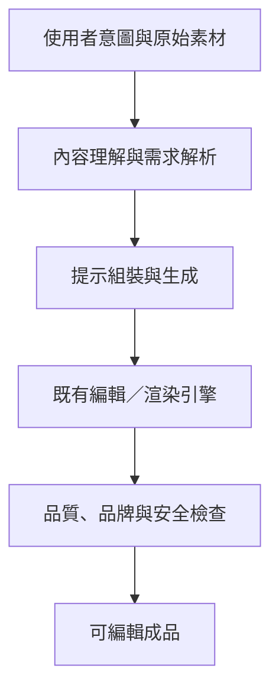

這篇文章源自 Google Cloud 技術活動中對多媒體生成式 AI 的討論。重新查核後，最值得保留的不是一份推測性的產品架構，而是訊連科技如何把模型能力轉成可量測的編輯流程，以及公開案例仍沒有回答哪些問題。

Google Cloud 的[訊連科技客戶案例](https://cloud.google.com/customers/cyberlink?hl=en)提供了可核對的產品成果，但它是供應商客戶故事，文中的成效數字應視為訊連科技回報，而非獨立第三方測試。

> **花花的判斷**
>
> 多媒體 AI 的產品差異不只來自生成模型，更來自前處理、提示組裝、資產保真、渲染與人工修正是否形成可測量的工作流。

> **花花的工程提醒**
>
> 客戶案例能證明產品方向，不能取代自己的資料集與驗收。角色一致性、品牌合規與完成時間都要在目標素材上重測。

## 公開資料能確認的兩項應用

官方案例描述了兩個具體流程：

1. **影片自動剪輯**：訊連科技在 2025 年中推出自動剪輯功能，以 Gemini 2.5 Flash Lite 理解匯入的原始影片，再產生包含字幕與背景音樂的短片。案例宣稱可在一分鐘內完成短片編輯。
2. **影像風格轉換**：流程先以 Gemini 2.5 Flash 分析照片與使用者意圖，再把整理後的提示交給 Imagen。訊連科技回報，超過 85% 的輸出符合其品質標準。

這兩個數字都有清楚的歸屬：它們是案例中的廠商回報。公開頁面沒有說明測試樣本數、素材分布、失敗定義或人工修正比例，因此不能直接推廣成所有多媒體工作負載的普遍效能。

## 公開資料沒有證明的事

原稿曾把活動內容延伸成 Promeo 的 Gemini Agent、Task Router、Imagen 與渲染引擎內部資料格式。官方案例並未公開這套編排，也沒有提供對應 JSON schema，所以這些內容已移除。

較穩妥的說法是：多媒體產品通常需要把理解與生成模型接到既有編輯引擎，但訊連科技實際如何路由任務、保存圖層與處理重試，仍屬未公開資訊。除非有技術文件或程式碼，不能把合理推論寫成產品事實。

## 可供產品團隊採用的參考流程

下面是根據公開成果整理的**通用參考架構**，不是訊連科技內部實作：

每一段都應有自己的驗收方式：

- **理解**：場景、人物、商品與意圖是否辨識正確。
- **生成**：輸出是否保持主體特徵、構圖與品牌限制。
- **渲染**：圖層、字幕、比例與格式是否仍可編輯。
- **審查**：版權、敏感內容、品牌一致性與人工修正成本。

## 導入前應補的四種證據

供應商案例回答「做得到嗎」，採用評估還要回答「在我們的素材上值得嗎」：

1. 以自家素材建立代表性測試集，而不是只看精選 demo。
2. 同時記錄成功率、完成時間、推論成本與人工修正分鐘數。
3. 將模型更新與提示變更納入版本管理，避免品質漂移無法追查。
4. 保留可編輯輸出與人工覆寫能力，不讓模型成為不可逆的最後一步。

## 延伸閱讀與來源

- 想理解多模態模型差異，可接著讀 [大型語言模型架構比較](/blog/76-big-llm-architecture-comparison/)。
- 若工作流會自主選工具或執行多步任務，再參考 [AI Agent 完整指南](/blog/64-ai-agent-guide/)與 [企業 AI Agent 安全](/blog/43-enterprise-ai-agent-security/)。
- 主要來源：[CyberLink: Boosting productivity and creativity for visual content creation with AI](https://cloud.google.com/customers/cyberlink?hl=en)。本文於 2026 年 8 月 29 日查核；成效數字均以「廠商回報」呈現。
