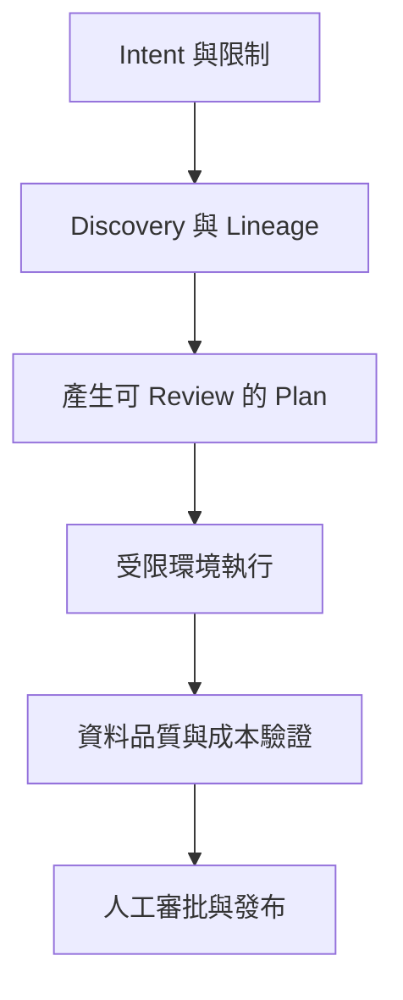

Google Cloud 在 2026 年 5 月公開 [Data Agent Kit](https://cloud.google.com/blog/products/data-analytics/data-agent-kit-brings-data-skills-and-tools-to-your-ide-or-cli)，定位是能整合進 VS Code、Claude Code、Codex、Gemini CLI 與其他開發環境的開源資料工程／資料科學工具集合。它不是一個名為「Data Agent」的單體模型，也不只是 VS Code extension；官方架構由 agentic Skills、Model Context Protocol（MCP）tools、plugins 與 extensions 組成。

原始產品文章展示從資料 discovery、自然語言分析、Spark／BigQuery／dbt pipeline、模型訓練，到 incident diagnosis 與 Git-based recovery 的完整情境。這些是官方展示能力，不等於任何資料環境都能自動且安全完成。Data Agent Kit 截至 2026-08-09 仍標示 preview，企業導入應把它視為可評估的 harness components，而非可直接接管 production 的 autonomous operator。

> **花花的一句話**
>
> Data Agent Kit 把資料平台的知識與工具帶進 Agent 工作環境，但不會把資料治理責任一起自動化掉。

> **花花的工程提醒**
>
> Agent 產生的 SQL、pipeline 與修復 PR 都只是 proposal；執行前仍要驗證權限、成本、資料品質、lineage 與可回復性。

## 正確定位：一組可組合的 Data Harness

官方 repository 把 Data Agent Kit 描述成「central hub」，目前主要索引產品別 extensions、MCP configurations、builder tools、evaluation 與 monitoring。核心元件可以這樣理解：

### Agentic Skills：把資料工程做法變成按需指引

Skills 封裝 query optimization、ML best practices、ELT、data validation、data drift、governance 與 troubleshooting 等領域流程。它們降低通用模型每次重新猜測平台做法的成本，也避免把所有說明一次塞進 system prompt。

Skill 是程序知識，不是權限。它可以告訴 Agent 如何檢查 BigQuery query plan，卻不應自動取得 production dataset 的 write access。

### MCP tools：將資料平台能力暴露成受控工具

MCP 連接 BigQuery、AlloyDB、Cloud Storage 等服務，讓 Agent 查詢 metadata、執行分析或建立 artifact。真正的安全邊界仍由 IAM、service account、dataset policy、VPC 與 audit log 決定。

每個 tool 應限制：允許的 project／dataset、read/write scope、query bytes、timeout、concurrency，以及需要人工批准的 DDL/DML 或部署動作。

### Plugins 與 extensions：把能力放進使用者既有工作環境

Data Agent Kit 支援 IDE 與 CLI，不要求工程師一直切換到獨立聊天產品。這能降低手動複製 schema 的 context-window tax，但也擴大 local credential、extension supply chain 與 prompt injection 的攻擊面。安裝來源、版本 pinning 與更新政策必須進入平台治理。

## 一條 intent-driven 資料工作流如何被拆解

Google 的金融詐欺示例從 Cloud Storage 原始交易開始，要求建立 Spark notebook、寫入 Iceberg／BigQuery、用 dbt 清理與 join、訓練模型，最後把 inference 結果寫入 Spanner。這種 prompt 不是一個 tool call，而是多階段 plan：

在 production 中，每個階段都需要自己的 acceptance evidence：

- Discovery：資料 owner、classification、freshness 與 lineage。
- Plan：輸入輸出 contract、預估掃描量、失敗與 rollback 策略。
- Execution：隔離 project、最小權限 credential、資源與時間上限。
- Validation：row count、null、duplicate、schema、distribution drift 與業務規則。
- Release：reviewer identity、artifact digest、deployment record 與 post-deploy monitor。

## Conversational Analytics 的能力與限制

官方稱 Data Agent Kit 使用與 Conversational BigQuery／Looker 相同方向的 Gemini natural-language-to-SQL 技術，協助 profile、search、query 與 visualize datasets。這改善探索速度，但 NL2SQL 仍可能：

- 選錯同名 table、時間欄位或 join key。
- 忽略 row-level security 與 semantic-layer 定義。
- 生成高掃描成本或資料外洩風險的 query。
- 產出語法正確、業務語意錯誤的結果。

因此應先對 curated semantic layer 或 read replica 開放，使用 dry run／cost estimate、query allowlist、row limit 與敏感欄位 masking。高影響分析應保存 SQL、parameter、dataset snapshot 與結果 provenance。

## Incident diagnosis 與 recovery 不等於全自動修復

官方展示讓 Agent 分析 pipeline failure、草擬並測試修復，再透過 Git workflow recovery。較安全的責任分解是：

1. Read-only diagnostic tool 收集 log、job metadata 與近期 deployment。
2. Agent 提出 root-cause hypothesis，附上支持與反證。
3. 在 isolated branch／project 執行 patch 與 regression tests。
4. 由 policy 決定是否需要 data owner、security 或 on-call approval。
5. Deployment system 執行已批准 artifact，而不是讓聊天 session 直接改 production。
6. 驗證 recovery 指標，失敗則回退並保留 incident timeline。

「能開 PR」與「可以自動 merge／deploy」是兩個不同風險等級。Preview 工具應從前者開始。

## Artifact 與可用狀態

官方 [GoogleCloudPlatform/data-agent-kit](https://github.com/GoogleCloudPlatform/data-agent-kit) repository 可公開存取，提供 starter pack、產品別 extensions／plugins、MCP servers、agent evaluation 與 monitoring 的入口；Google Cloud 發布頁則列出 VS Code Marketplace、VSX、CLI 與 Claude Code plugin 的安裝路徑。

但 repository 是快速演進中的整合 hub，個別元件可能有不同 license、release cadence、preview status 與 required APIs。導入時不能只記錄「Data Agent Kit version」，而要產生 component bill of materials：

- Plugin／Skill／MCP server 的 repository、commit 或 package version。
- 使用的 Google Cloud APIs、IAM roles 與 regions。
- Model、tool 與資料處理費用上限。
- Evaluation dataset、expected output 與 rollback owner。
- 每個 preview dependency 的退出方案。

## 適合與不適合的導入情境

優先試用：有成熟 IAM、data catalog、CI 與 sandbox，且大量工作是重複的 discovery、query、notebook scaffold 或 incident triage。

暫緩：資料 owner 不清、production credential 共用、沒有成本 guardrail、缺乏資料品質測試，或期待 Agent 直接替代資料工程 review。此時加入更多 tool 只會把既有治理缺口放大。

## 90 天導入順序

1. **前 30 天：read-only。** 只做 catalog search、query suggestion 與 documentation，建立失敗案例集。
2. **31–60 天：sandbox execution。** 開放非 production project，加入 query budget、schema test 與人工 review。
3. **61–90 天：bounded PR workflow。** 允許產生 pipeline／dbt／notebook PR，但 deploy 仍由既有 CI/CD 與 owner approval 執行。
4. 依正確率、節省時間、重工、成本與 incident 指標決定是否擴大權限。

更完整的治理框架可讀 [Enterprise AI 平台治理](/blog/39-enterprise-agentic-ai-governance/)；工具協議邊界見 [MCP 2026-07-28](/blog/34-model-context-protocol-mcp/)；若要理解 Skills 與 Harness 的關係，可接著看 [Harness Engineering 導覽](/blog/13-harness-engineering-reading-map/)。

## Primary sources

- [Google Cloud Blog：Data Agent Kit brings data skills and tools to your IDE or CLI](https://cloud.google.com/blog/products/data-analytics/data-agent-kit-brings-data-skills-and-tools-to-your-ide-or-cli)
- [GoogleCloudPlatform/data-agent-kit](https://github.com/GoogleCloudPlatform/data-agent-kit)
- [Google Cloud Agentic Data Cloud](https://cloud.google.com/data-cloud)
- [Model Context Protocol](https://modelcontextprotocol.io/)
