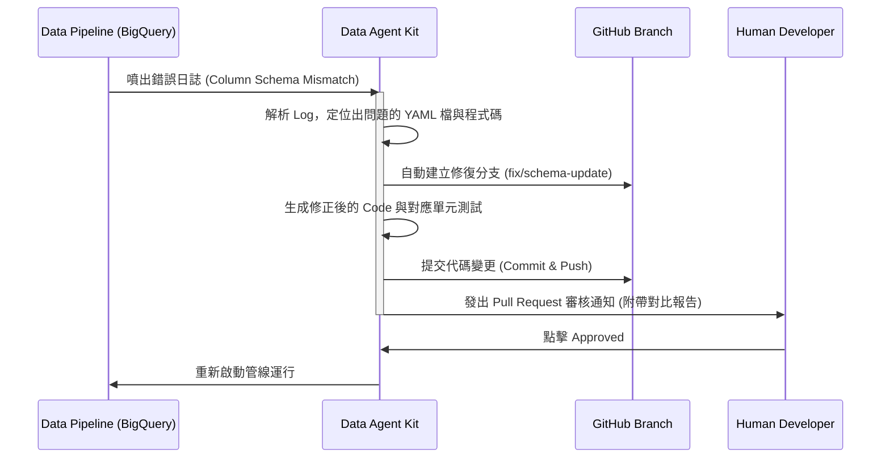

在資料驅動的時代，資料科學家與資料工程師肩負著將海量數據轉化為商業價值的重任。然而，在日常工作中，他們卻面臨著許多令人沮喪的摩擦與效率低下的問題。

在近期的技術會議上，講者深入探討了這些開發痛點，並正式介紹了一款有望改變遊戲規則的全新解決方案——**Data Agent Kit**。

---

## 當前資料團隊的開發痛點

講者指出，現今的資料從業人員經常被以下三大問題困擾：
*   **過多的上下文切換：** 開發者往往需要同時開啟數十個瀏覽器分頁（如 Jupyter Notebook、BigQuery 控制台、dbt 文件等）。
*   **工具被動且缺乏整合：** 開發者必須手動配置所有底層環境與大量的樣板程式碼 (Boilerplate)。
*   **時間分配嚴重失衡：** 資料科學家有 **80% 到 90%** 的時間都在清理資料與處理 schema 不匹配的錯誤。

---

## 解決方案：Data Agent Kit 隆重登場

為了解決上述痛點，團隊推出了 **Data Agent Kit（公開預覽版）**。這是一個主要作為 VS Code 擴充套件（支援 Cursor 等編輯器）的**主動式 AI 代理 (AI Agent)**，旨在與 BigQuery、Spark 等雲端大數據架構進行無縫串接。

### 核心自動化流程：管線錯誤修復與自癒 (Self-healing Pipeline)

當管線發生無預警錯誤時（例如上游資料庫的欄位 Schema 突然變更），Data Agent Kit 能自主執行完整的「故障排除與代碼修復」流程：



---

## 技術實戰：YAML 配置與代碼自癒

### 1. 管線定義 YAML 檔
Data Agent Kit 使用結構化的 YAML 定義資料管道的來源、轉換器與輸出目標：

```yaml
pipeline:
  name: credit_card_fraud_detection
  version: 2.0
  source:
    type: bigquery_table
    dataset: retail_transactions
    table: raw_payment_events  # 原本欄位為 txn_id
  transformation:
    - step: clean_nulls
      engine: pyspark
      script_path: ./transform/clean_data.py
  sink:
    type: bigquery_table
    dataset: gold_analytics
    table: fraud_predictions
```

### 2. PySpark 代碼自癒範例
當上游資料庫將 `txn_id` 重新命名為 `transaction_identifier` 時，Data Agent Kit 會診斷出錯誤，並自動產生修正代碼的 PR：

```diff
# transform/clean_data.py 的自癒修正對比
- # 原本的寫法，因為 txn_id 不存在而報錯
- df_clean = df.filter(df["txn_id"].isNotNull())
+ # Data Agent Kit 自動修正：對接新 Schema 欄位
+ df_clean = df.filter(df["transaction_identifier"].isNotNull())
```

---

## Data Agent Kit 的五大實戰功能

*   **全局搜尋與知識目錄 (Universal Search & Knowledge Catalog)：**
    開發者無需一開始就費力撰寫 SQL 語法。只要使用自然語言搜尋所需資料，Agent 就會自動顯示資料來源、血緣關係 (Lineage)，以及它與其他資料表的關聯方式。
*   **對話式分析 (Conversational Analytics)：**
    直接在 IDE 中用白話文詢問：「哪種商家類別最容易發生詐欺？」Agent 便能自動生成並執行複雜的 SQL，分析出結果並直接繪製圖表。
*   **自動化故障排除與自癒：**
    如上圖所示，自動抓取 Log、建立分支、提交代碼並部署。
*   **模型訓練與自動對比：**
    Agent 能夠主動尋找合適的資料集、進行特徵工程，自動訓練並比較不同的模型（如 Random Forest 與 XGBoost），計算出 AUC 曲線。

---

## 結論與獲取方式

Data Agent Kit 目前已在 VS Code Marketplace 與 OpenVSX 上架，提供開源 GitHub 儲存庫。它的問世代表著資料工程師與科學家不再需要將時間浪費在處理 Schema 損壞的瑣事上，透過 **Harness Engineering** 的思維，把品質把關交給自動化的 AI 代理，真正釋放資料團隊的生產力。

---
*參考資料：Data Agent Kit 技術研討會大會記錄*
