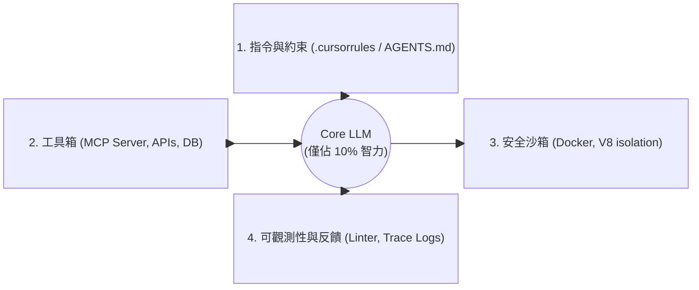
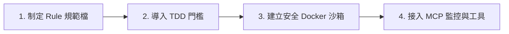

在 AI 輔助開發工具（如 Cursor、GitHub Copilot、Claude Code 等）席捲全球的今日，軟體開發的門檻與速度達到了前所未有的高度。然而，當任何人都能透過幾句對話產出成百上千行程式碼時，軟體工程的核心價值與開發生命週期 (SDLC) 究竟發生了什麼變化？

2026 年 5 月，由 Google 卓越工程師 **Addy Osmani**、**Shubham Saboo** 與 **Sokratis Kartakis** 共同撰寫了長達 50 頁的重磅白皮書：**《The New SDLC With Vibe Coding》**。

這份白皮書並非單純描述 AI 的神奇，而是以嚴謹的工程視角，為整個科技產業指明了未來軟體工程的轉型方向。為了讓您免去閱讀 50 頁英文學術 PDF 的時間，本文將為您進行最全面、最硬核的導讀，並附上具體的架構與實戰建議。

---

## 導讀目錄
1. **AI 時代的開發痛點：打字變快了，系統卻更脆弱？**
2. **光譜的兩端：Vibe Coding vs. Harness Engineering**
3. **90% 的勝負在「護欄」：Model + Harness 核心框架**
4. **重構 SDLC：四大階段的壓縮與重新配置**
5. **AI 時代工程師的必修課：三大核心技能轉型**
6. **團隊實踐指南：如何帶領團隊告別「憑感覺寫 Code」**

---

## 1. AI 時代的開發痛點：打字變快了，系統卻更脆弱？

白皮書首先提出了一個令人深思的現象：**「軟體開發的瓶頸已不再是敲擊鍵盤的速度 (Typing Speed)，而是定義規格 (Specification) 與驗證產出 (Verification) 的能力。」**

當開發者過度依賴 AI 生成程式碼，卻缺乏系統化的約束與測試時，整個軟體生命週期會出現嚴重的「消化不良」：
*   **技術債爆炸**：AI 傾向於寫出「當下能動」但缺乏長遠規劃的程式碼，導致架構迅速腐爛。
*   **測試空洞化**：AI 生成的測試往往只覆蓋 Happy Path，遺漏了邊界條件與安全漏洞。
*   **上下文崩塌**：模型一旦失去上下文，就會開始產生幻覺，而人類開發者因為沒有逐行審查，根本無從 Debug。

這也是為什麼 Google 專家們呼籲，軟體工程必須從隨興的開發模式，升級為系統化的**裝甲工程 (Harness Engineering)**。

---

## 2. 光譜的兩端：Vibe Coding vs. Harness Engineering

白皮書將當前 AI 開發實務定義為一道光譜。理解這道光譜的定位，是每個工程團隊的首要任務：

| 比較維度 | Vibe Coding (直覺式編碼) | Harness Engineering (裝甲工程) |
| :--- | :--- | :--- |
| **定義** | 憑直覺與簡單提示詞 (Prompts) 讓 AI 生成程式碼，並在出錯時手動複製貼上報錯訊息。 | 在嚴密的「上下文與約束系統」中，將 AI 作為確定性的實作引擎。 |
| **核心流程** | Prompt $\rightarrow$ Code $\rightarrow$ Run $\rightarrow$ Debug (手動) | Spec $\rightarrow$ Constraints $\rightarrow$ Sandbox Run $\rightarrow$ Auto-feedback Loop |
| **測試機制** | 幾乎沒有，或僅依賴人工點擊測試。 | 測試驅動開發 (TDD) 與嚴格的單元測試門檻。 |
| **爆炸半徑** | 無法控制，AI 可能隨意修改無關檔案。 | 被沙箱化 (Sandboxed) 與 API 權限極大限制。 |
| **適用場景** | 黑客松、快速原型 (MVP)、個人玩具專案。 | 企業級系統、金融支付、高安全性基礎設施。 |

### 工作流的底層差異

以下流程圖詳細對比了兩者在軟體生命週期中的執行邏輯：

```mermaid
graph TD
    subgraph Vibe Coding [Vibe Coding 工作流]
        A1[自然語言 Prompt] --> B1((AI 模型))
        B1 --> C1[產生程式碼]
        C1 -.->|手動複製到專案| D1[運行測試/人工點擊]
        D1 -->|噴錯| E1[把錯誤貼回給 AI]
        E1 --> B1
        D1 -->|好像會動| F1[部署上線]
    end

    subgraph Harness Engineering [Harness Engineering 工作流]
        A2[寫明規格 Spec & 系統約束] --> B2[定義自動化測試 TDD]
        B2 --> C2((AI Agent))
        C2 --> D2[沙箱隔離環境執行]
        D2 --> E2{測試與 Linter 驗證}
        E2 -->|失敗| F2[自動抓取 CLI 錯誤反饋給 Agent]
        F2 --> C2
        E2 -->|成功| G2[人類開發者 PR 審查]
        G2 -->|Approved| H2[自動化 CI/CD 部署]
    end

    style Vibe Coding fill:#2d131a,stroke:#ff477e,stroke-width:2px
    style Harness Engineering fill:#0d2319,stroke:#2ec4b6,stroke-width:2px
```

---

## 3. 90% 的勝負在「護欄」：Model + Harness 核心框架

白皮書中最重要的核心技術框架為：**Agent = Model + Harness**。

許多團隊在導入 AI 時，耗費巨大資源在挑選、微調模型上。然而白皮書指出，底層的大型語言模型 (LLM) 只決定了 10% 的基本智力；**決定一個 AI Agent 能否在真實世界中穩定交付程式碼的，是另外 90% 的 Harness (約束裝甲/外掛護欄)。**

### Harness 的四大支柱解析

#### ① 指令與約束 (Instructions & Constraints)
這不是普通的 System Prompt，而是具體的規格檔案（如 `.cursorrules`、`AGENTS.md`）。它強行約束了：
*   **架構模式**：例如「必須使用 Clean Architecture，禁止在 Controller 層直接呼叫資料庫」。
*   **語言限制**：例如「必須開啟 TypeScript 的 strict 模式，禁止使用 any」。

#### ② 工具與協定 (Tools & MCP)
透過 **Model Context Protocol (MCP)**，將 Agent 的手腳束縛在安全的 API Gateway 內。Agent 不能任意執行 Shell 指令，而是只能透過標準的工具（如 `read_file`、`run_test`）與環境互動。

#### ③ 安全沙箱 (Sandboxed Execution)
AI 寫出來的 Code 必須在完全隔離的沙箱環境（例如 Docker 容器或 WebAssembly 沙箱）中執行編譯與測試，防止惡意或失控的程式碼破壞開發者本機或生產伺服器。

#### ④ 自動化反饋與可觀測性 (Automated Feedback & Observability)
這是「自動除錯」的核心。當沙箱執行出錯時，Harness 會將 Standard Error、Linting 錯誤或編譯日誌自動格式化，作為精準的上下文回傳給 Agent，實現「自我修正 (Self-correction)」。

---

## 4. 重構 SDLC：四大階段的壓縮與重新配置

在傳統的軟體開發生命週期中，時間大多花在「寫程式碼」與「手動除錯」上。白皮書指出，在新的 SDLC 中，各階段的佔比與執行方式將被重新分配：

```mermaid
gantt
    title 傳統 SDLC vs AI-Era Harness SDLC 時間分配對比
    dateFormat  X
    axisFormat %d
    
    section 傳統 SDLC
    需求與系統設計          :active, des1, 0, 30
    編碼與實作 (Writing)   :crit, des2, 30, 70
    測試與品質驗證 (QA)    :des3, 70, 90
    部署與運維             :des4, 90, 100
    
    section Harness SDLC
    需求設計與規格定義 (Spec) :active, a1, 0, 45
    AI 自動化實作 (AI Coding) :crit, a2, 45, 55
    測試工程與沙箱驗證 (TDD)  :a3, 55, 85
    審查與自動化部署          :a4, 85, 100
```

### 變革解析

1.  **需求與設計階段（時間拉長，權重增加）**：
    開發者必須花費更多時間撰寫清晰、無歧義的 Spec 與架構說明書。因為「AI 讀不懂模糊的指令」，高質量的輸入是獲得高質量程式碼的唯一途徑。
2.  **實作階段（極度壓縮）**：
    原本需要耗費數周的 Coding 過程，被壓縮至數天甚至數小時。AI 代理在 Harness 的約束下快速產出骨架程式碼。
3.  **測試與驗證（轉型為核心）**：
    開發者的工作重心轉移到設計「嚴密的測試網」。你不需要自己寫 Code，但你必須寫出能完美捉住 AI Bug 的測試案例。
4.  **部署與運維（自動化與審計）**：
    引入 Agent Gateway 監控所有外部 API 呼叫，並對 AI 生成的變更進行法庭級的日誌審計。

---

## 5. AI 時代工程師的必修課：三大核心技能轉型

如果您想在 AI 時代保持無可取代的競爭力，白皮書建議您立刻開始培養以下三項核心能力：

### ① 上下文工程 (Context Engineering)
這不僅僅是「寫提示詞」，而是**管理模型的注意力機制**。
*   你必須知道什麼時候該餵給 AI 哪些程式碼片段（避免過多無關資訊導致模型注意力渙散）。
*   學習利用 MCP 伺服器動態檢索最相關的 API 文件與專案上下文。

### ② 測試驅動規格 (Test-Driven Specification)
你將不再是「Code 的撰寫者」，而是「規則的制定者」。
*   必須精通如何先寫出行為規範 (Spec) 與單元測試，再讓 AI 根據測試去填充實作（TDD）。
*   學習利用 Assertions 來限制 AI 的輸出邊界。

### ③ 系統架構與集成設計 (System & Integration Design)
AI 最不擅長的是「全局規劃」與「跨模組設計」。
*   人類工程師的價值將建立在：如何設計鬆耦合 (Loosely coupled) 的微服務架構，讓 AI 代理可以被侷限在單一微服務中安全地折騰，而不會影響整體系統。

---

## 6. 團隊實踐指南：如何帶領團隊告別「憑感覺寫 Code」

如果您的團隊目前正處於混亂的「Vibe Coding」階段，時常因為 AI 生成的程式碼而噴出預期外的 Bug，請參考以下由 Google 專家推薦的轉型步驟：

1.  **第一步：在專案根目錄建立嚴格的約束檔案**
    在專案中建立 `.cursorrules` 或 `AGENTS.md`，明文規定專案的依賴庫、禁止使用的語法（如禁止 `eval`、禁止未經封裝的 `fetch`）與目錄結構。
2.  **第二步：拒絕無測試的合併請求 (PR)**
    在 CI/CD 中加入門檻：所有 AI 生成的 PR，必須包含對應的測試案例，且測試覆蓋率不能下降。
3.  **第三步：將 AI 的執行環境徹底隔離**
    使用沙箱工具（如 Docker 或開源的 Agent Sandbox 環境）執行 AI 產生的程式碼，保護本地開發環境的乾淨與安全。

---

## 結語：軟體工程並未消失，它只是變得更高級

Google 的這份 50 頁白皮書給了我們一個極具啟發性的結論：**AI 並不會消滅軟體工程師，但它會消滅那些只會複製貼上程式碼的人。**

當「寫程式」這件事被 AI 徹底商品化、平價化之後，人類在**系統架構設計、邊界約束定義、以及嚴格的品質把關 (Verification)** 上所展現的智慧，將會比以往任何時候都更加珍貴。

從今天起，讓我們告別「憑感覺 (Vibe)」的程式設計，開始著手打造專屬於您團隊的「約束裝甲 (Harness)」，擁抱真正的 Harness Engineering 時代！

---

*參考文獻：Addy Osmani, Shubham Saboo, Sokratis Kartakis (May 2026). \"The New SDLC With Vibe Coding\". Google Whitepaper.*
