Siri AI 已進入 **iOS 27 開發者測試**，但不宜把單篇 hands-on 當成正式版承諾。Apple 在 2026 年 6 月的官方資料中表示，新功能先提供開發者測試，之後才會向支援裝置、設定為英文的使用者推出 beta，更多語言則陸續擴展。

The Verge 的 David Imel 以一個月使用經驗整理了螢幕感知、個人上下文與跨 App 動作的實例。這些觀察很適合回答「互動可能往哪裡走」，但無法單獨回答正式版何時可用、第三方 App 會支援多少，或每個地區與語言是否具備相同能力。

本文因此分成兩層：先看媒體實測呈現的使用情境，再用 Apple 官方文件確認開發者現在能實作的介面與 beta 邊界。

> **花花的一句話**
>
> 新 Siri 會看畫面、找個人資料，還能請 App 幫忙做事；不過 beta 就像還在學走路的小貓，先看清楚它現在真的會什麼喵！🐾
>
> **花花的工程提醒**
>
> 先盤點 App Intents、App Entities、Spotlight 索引與 schema；需要畫面上下文時，再把可見內容與 entity 關聯。功能仍在測試，請把 SDK 可用性與實機回歸測試納入發布條件。

## 先釐清狀態：開發者測試不等於全面公開版

在評測中，David Imel 把 iOS 27 比作當年的 **Snow Leopard (OS X 10.6)**：重點較偏向系統重構、效能與可靠度，而不是大量介面變動。他觀察到：
*   **基礎效能提升**：App 啟動速度加快、照片搜尋結果更精準、AirDrop 傳輸更穩定。
*   **通訊功能升級**：訊息 App 支援行內回覆，以及 RCS 訊息的端到端加密。
*   **視覺優化**：Liquid Glass 介面細節更加精緻，特別是邊界與文字的易讀性大幅提升。

這些屬於評測者在測試版本上的觀察，不應外推成所有裝置的保證。Apple 官方目前確認的是：Siri AI 已供 Apple Developer Program 測試，消費者 beta 將在稍後推出，且初期有裝置、語言與地區條件。

## 核心亮點：從「App 導向」轉變為「意圖導向 (Intent-driven)」

傳統的手機使用邏輯是：
> **打開 App $\rightarrow$ 在介面中點擊 $\rightarrow$ 完成任務**。

而 Siri AI 承諾的未來是：
> **直接說出你想做什麼 $\rightarrow$ Siri 自動調度底層資訊與 App $\rightarrow$ 完成任務**。

David Imel 分享了兩個具體使用場景；以下結果代表他的測試環境，不是成功率承諾：

### 實戰場景一：音樂會演出順序查詢
他想確認一場長達四小時的免費音樂會中，他最喜歡的樂團何時上場。活動網頁上並未標明順序。他直接下拉螢幕對 Siri 詢問：*「這些樂團的表演順序是什麼？」*
Siri 閃爍著全新設計的炫彩光環，在背景自主抓取了網頁資訊、搜尋網路，並在幾秒鐘後給出了正確答案。使用者完全不需要在瀏覽器標籤頁之間跳轉，也不需要去翻樂團的 Instagram 貼文。

### 實戰場景二：Email 自動轉行事曆
在開發者大會 (WWDC) 期間，他對 Siri 說：*「幫我把 WWDC 的簡報行程加入行事曆。」*
Siri 自動在背景掃描他的電子郵件、解析郵件中的文字，並一鍵在 Apple Calendar 中自動建立了 6 個時間完全正確的活動。

> 「這真的稍微改變了我的大腦化學反應。」David 寫道。現在他遇到任何問題，第一反應不再是開啟瀏覽器搜尋，而是下拉螢幕直接用鍵盤輸入 prompt 讓 Siri 去解決。

## 現存的瓶頸與挫折：自然語言的模糊地帶

儘管 Siri AI 在許多複雜任務上表現如同魔法，但當它撞上「語意牆」時，依然會讓人感到挫折：

1.  **螢幕感知 (Onscreen Awareness) 的關鍵字依賴**：
    當他看著演唱會售票網頁對 Siri 說：「提醒我票開賣時去買」，Siri 僅僅建立了一個名為「提醒我票開賣時去買」的純文字提醒。他必須精確地說「幫我買**這個**網頁的票」，Siri 才會理解要讀取螢幕內容。
2.  **動詞關聯性不足**：
    要求 Siri "route"（規劃路線）到某個地址有時會完全沒反應，但改說 "direct"（導航）卻能完美觸發。這對於標榜「自然語言互動」的 AI 來說，依然存在 keyword-speak 的影子。
3.  **生態系壁壘 (Ecosystem Lock-in)**：
    目前 Siri AI 的完整能力僅限於 Apple 自家應用程式（郵件、簡報、行事曆、備忘錄）。如果朋友是在 Telegram 上傳送聚會時間，Siri 因為沒有權限讀取 Telegram 的資料，就會完全失效。

## 開發者可驗證的介面：App Entities、App Intents 與 Spotlight

Apple 官方文件指出，第三方 App 要讓內容與動作進入 Siri AI，需要以 App Intents 框架描述能力；實作哪些介面取決於 App 的資料與使用情境，而不是一套保證「完美接入」的開關：

```mermaid
graph TD
    subgraph App Data Layer [App 資料層]
        A[App 數據: 播放清單/食譜/聯絡人] -->|封裝為| B(Entities 實體)
    end

    subgraph App Action Layer [App 行動層]
        C[App 功能: 播放/儲存/刪除] -->|封裝為| D(Intents 意圖)
    end

    subgraph Apple Intelligence
        E[Siri 語義解析層 Semantic Layer] <-->|理解 Context| B
        E <-->|執行 Action| D
    end

    style Apple Intelligence fill:#1e1e24,stroke:#a855f7,stroke-width:2px
```

*   **App Entities**：描述 App 內可被系統理解與查找的資料類型，例如照片、食譜或播放清單。
*   **App Intents**：描述 App 可執行的動作，例如播放、儲存或刪除。
*   **Spotlight 與 donations**：索引 entity、捐贈使用者實際做過的動作與內容，協助系統檢索與消除模糊指令。
*   **Schemas 與 transferable types**：以系統可理解的契約描述資料與動作，並在跨 App 流程中移動內容。
*   **Onscreen context**：將畫面中的 view、user activity 或其他可見內容與 App Entity 關聯，讓「這張照片」之類的指涉有可解析的對象。

> **⚠️ 注意**：相關 API 與系統功能仍可能在 beta 期間變更。不要只完成型別宣告；還要測試索引更新、權限拒絕、模糊參數、跨 App 傳遞與高風險動作的確認流程。

## 還不能從實測推出的結論

實測可以證明某些路徑在特定版本與帳號上曾成功，卻不能直接推出三件事：

1. **第三方覆蓋率**：Apple 提供整合介面，不代表 Gmail、Telegram 或其他大型 App 一定採用，也不能由商業模式猜測其最終決策。
2. **正式版成功率**：自然語言改一個動詞就失敗，正好說明 beta 仍需量測任務完成率、澄清次數與錯誤動作率。
3. **跨區域一致性**：Apple 已明示初期裝置與語言條件；各地功能與推出時程應以當地官方頁面為準。

## 結論：把它當成需要驗證的系統介面

Siri AI 的重要轉變，是把螢幕內容、個人上下文、網路知識與 App 動作放進同一個協調層。對使用者，這可能減少在 App 之間搬運資訊；對開發者，真正的工作是把資料、動作、權限與確認流程做成可測試的系統契約。

現階段最穩健的判斷不是「革命已完成」，而是：互動方向已清楚、開發介面已可準備，但一般使用者可用性、第三方採用與任務可靠度仍要等 beta 與正式版資料驗證。

## 延伸閱讀與來源

- 用 [AI Agent 完整指南](/blog/64-ai-agent-guide/) 對照 Siri 的規劃、工具、記憶與評測邊界。
- 再讀 [DoorDash Ask Assistant 架構](/blog/51-doordash-ask-assistant-architecture/)，比較作業系統助理與交易型 Agent 如何處理確定性動作。
- Apple 官方：[Siri AI 產品與可用性公告](https://www.apple.com/newsroom/2026/06/apple-introduces-siri-ai-a-profoundly-more-capable-and-personal-assistant/)、[Apple Intelligence and Siri AI 開發文件](https://developer.apple.com/documentation/appintents/apple-intelligence-and-siri-ai)
- 媒體實測：[The Verge — Siri AI is already changing how I use my iPhone](https://www.theverge.com/tech/964714/siri-ai-public-beta-preview-ios-27-hands-on)
