```mermaid
graph TD
    subgraph App Data Layer [App 資料層]
        A[App 數據: 播放清單/食譜/聯絡人] -->|封裝為| B(Entities 實體)
    end

    subgraph App Action Layer [App 行動層]
        C[App 功能: 播放/儲存/刪除] -->|封裝為| D(Intents 意圖)
    end

    subgraph Apple Intelligence
        E[Siri 語義解析層 Semantic Layer] <-->|理解 Context| B
        E <-->|執行 Action| D
    end

    style Apple Intelligence fill:#1e1e24,stroke:#a855f7,stroke-width:2px
```

隨著 **iOS 27 首個公開測試版 (Public Beta)** 的正式發布，科技媒體與開發者們終於能一窺 Apple 語音助理的終極型態。

The Verge 的資深編輯 David Imel 在使用了一個月後，發表了一篇極具啟發性的實測報告：**《Siri AI is already changing how I use my iPhone》**。他指出，雖然這只是一個「預覽版」，且許多第三方 App 的支援仍需等待秋季正式版推出，但這一次，Siri AI 已經展現出顛覆性的人機互動潛力。

本文將為您拆解這篇評測的核心細節，看看這款「新 Siri」究竟強在哪裡、面臨哪些瓶頸，以及開發者們該如何應對。

---

## iOS 27：聚焦效能的「雪豹」升級，但 Siri 是唯一主角

在評測的開頭，David Imel 指出 iOS 27 整體而言更像當年的 **Snow Leopard (OS X 10.6)** 升級——沒有太多花哨的新介面，而是專注於系統底層的重構與加速。
*   **基礎效能提升**：App 啟動速度加快、照片搜尋結果更精準、AirDrop 傳輸更穩定。
*   **通訊功能升級**：訊息 App 支援行內回覆，以及 RCS 訊息的端到端加密。
*   **視覺優化**：Liquid Glass 介面細節更加精緻，特別是邊界與文字的易讀性大幅提升。

然而，在這場以「穩健」為主的升級中，**Siri AI (作為 Opt-in Beta 開放)** 毫無疑問是唯一的焦點。

---

## 核心亮點：從「App 導向」轉變為「意圖導向 (Intent-driven)」

傳統的手機使用邏輯是：
> **打開 App $\rightarrow$ 在介面中點擊 $\rightarrow$ 完成任務**。

而 Siri AI 承諾的未來是：
> **直接說出你想做什麼 $\rightarrow$ Siri 自動調度底層資訊與 App $\rightarrow$ 完成任務**。

David Imel 分享了兩個令人驚艷的真實使用場景：

### 實戰場景一：音樂會演出順序查詢
他想確認一場長達四小時的免費音樂會中，他最喜歡的樂團何時上場。活動網頁上並未標明順序。他直接下拉螢幕對 Siri 詢問：*「這些樂團的表演順序是什麼？」*
Siri 閃爍著全新設計的炫彩光環，在背景自主抓取了網頁資訊、搜尋網路，並在幾秒鐘後給出了正確答案。使用者完全不需要在瀏覽器標籤頁之間跳轉，也不需要去翻樂團的 Instagram 貼文。

### 實戰場景二：Email 自動轉行事曆
在開發者大會 (WWDC) 期間，他對 Siri 說：*「幫我把 WWDC 的簡報行程加入行事曆。」*
Siri 自動在背景掃描他的電子郵件、解析郵件中的文字，並一鍵在 Apple Calendar 中自動建立了 6 個時間完全正確的活動。

> 「這真的稍微改變了我的大腦化學反應。」David 寫道。現在他遇到任何問題，第一反應不再是開啟瀏覽器搜尋，而是下拉螢幕直接用鍵盤輸入 prompt 讓 Siri 去解決。

---

## 現存的瓶頸與挫折：自然語言的模糊地帶

儘管 Siri AI 在許多複雜任務上表現如同魔法，但當它撞上「語意牆」時，依然會讓人感到挫折：

1.  **螢幕感知 (Onscreen Awareness) 的關鍵字依賴**：
    當他看著演唱會售票網頁對 Siri 說：「提醒我票開賣時去買」，Siri 僅僅建立了一個名為「提醒我票開賣時去買」的純文字提醒。他必須精確地說「幫我買**這個**網頁的票」，Siri 才會理解要讀取螢幕內容。
2.  **動詞關聯性不足**：
    要求 Siri "route"（規劃路線）到某個地址有時會完全沒反應，但改說 "direct"（導航）卻能完美觸發。這對於標榜「自然語言互動」的 AI 來說，依然存在 keyword-speak 的影子。
3.  **生態系壁壘 (Ecosystem Lock-in)**：
    目前 Siri AI 的完整能力僅限於 Apple 自家應用程式（郵件、簡報、行事曆、備忘錄）。如果朋友是在 Telegram 上傳送聚會時間，Siri 因為沒有權限讀取 Telegram 的資料，就會完全失效。

---

## 開發者的功課：Entities (實體) 與 Intents (意圖)

要讓第三方 App 完美接入 Siri AI，開發者必須在 iOS 27 SDK 中實作兩大核心架構：

*   **Entities (實體)**：代表 App 內所包含的數據類型（如照片、食譜、播放清單）。這讓 Siri 知道它能在該 App 中提取什麼樣的個人上下文 (Personal Context)。
*   **Intents (意圖)**：代表 App 能執行的操作（如播放、儲存、刪除）。
*   **優勢**： Matthew Cassinelli (Shortcuts 前身 Workflow 的成員) 指出，這套架構能讓「利基型的小 App」在使用者甚至沒有手動開啟它的情況下，被 Siri 動態調度出來（例如問「我上周在會議上認識了誰？」，Siri 會調用 LookBack: Contacts History App 的資料）。

> **⚠️ 注意**：雖然開發者目前可以開始編寫這些代碼，但由於 iOS 27 SDK 仍在測試階段，第三方 App 在秋季正式版發布前，是無法對一般用戶推送 Siri AI 功能更新的。

---

## 科技巨頭的博弈：Google 會支援 Siri 嗎？

評測中提出了一個極具破壞性的問題：**「像 Google 這類依靠廣告營收的巨頭，會有動力全力支援 Siri AI 嗎？」**

如果 Siri 能夠直接在手機最上方顯示 Gmail 裡的行程或信件重點，使用者就沒有必要打開 Gmail App，Google 也就失去了展示廣告與獲取流量的機會。

不過，David Imel 認為，**「消費者選擇權 (Consumer Choice)」**會逼得 Google 妥協。如果一個信箱 App (如 Spark) 因為支援 Siri AI 而變得極度好用，而 Gmail 堅持不支援，用戶就會轉投其他 App 的懷抱。此外，Google 自身也在推行 AI Overviews (AI 彙整)，顯示整個產業都在朝著「去 App 化、去網頁化」的直接解答時代邁進。

## 結論：未來已來，但仍需等待

這款在 iOS 27 中登場的 Siri AI，不再是過去那個只會講冷笑話或設定計時器的語音助手，而是逐漸演變為一個**能夠穿梭於作業系統中的 AI Agent**。

雖然在公測版中依然存在語意理解偏差與第三方 App 缺位的狀況，但它無疑已經為未來的「無縫 AI 日常」打下了最堅實的底座。今年秋季 iOS 27 正式版上線後，當無數開發者實作完 Entities 與 Intents，我們將迎來 iPhone 互動史上最大的一次革命。

---
*參考資料來源：[The Verge - Siri AI is already changing how I use my iPhone](https://www.theverge.com/tech/964714/siri-ai-public-beta-preview-ios-27-hands-on)*
