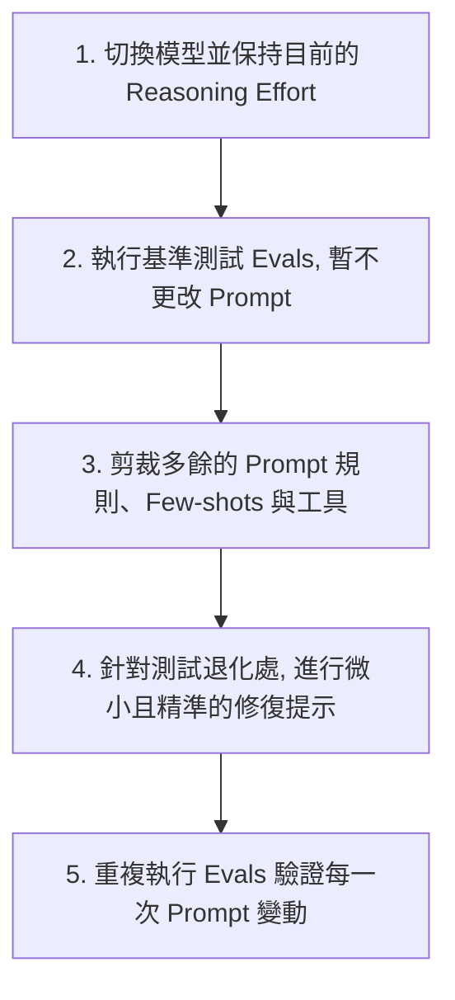

過去幾年，AI 開發者社群形成了一套約定俗成的「Prompt Engineering (提示詞工程) 密技」：在 System Prompt 裡塞滿幾十個 Few-shot 範例、詳細定義每一個思考步驟、並瘋狂使用 `ALWAYS`、`NEVER` 等字眼強制模型遵循規則。

然而，隨著 OpenAI 最新一代旗艦推理模型 **GPT-5.6 Sol** 的發布，官方發布了一份顛覆性的開發指引：**《Prompting guidance for GPT-5.6 Sol》**。這份指引宣告了軟體開發正式從單純的 Prompting，跨越到以系統化約束、工具及沙箱建構為核心的 **Harness Engineering (裝甲工程/護欄工程)** 時代。

官方在指引中用震撼的數據證明：**在內部 Coding-agent 的評估中，將 System Prompt 精簡化，不僅能減少 41% ~ 66% 的 Token 消耗、降低 33% ~ 67% 的 API 費用，更讓最終的任務評估分數 (Evaluation Scores) 提升了 10% ~ 15%！**

這意味著，過往堆疊 Prompt 的開發方式已被徹底顛覆。面對 GPT-5.6 這類具備強大 System 2 推理能力的角色，開發者必須學會以 Harness Engineering 為核心的全新人機協作哲學。

---

## 1. 核心哲學：Less is More (簡化 Prompt 反而更聰明)

為什麼 prompt 越長，模型反而表現越差？

GPT-5.6 是一台具備高強度邏輯推演能力的「推理引擎」。當你在 Prompt 中寫入過多相互衝突的細節、多餘的步驟指示時，反而會限制模型的自我規劃能力，甚至造成模型運行的不穩定。

### 官方推薦的「精簡化 (Trim)」清單
*   **刪除重複規則**：同一個規則不需要在 prompt 中以不同換句話說的方式重複強調。
*   **刪除無效範例**：如果 Few-shot 範例沒有實質改變模型行為，全部刪掉。
*   **刪除模型已具備的直覺**：不需要教模型「如何使用工具」、「如何一步步思考 (Let's think step by step)」，這些是它的本能。
*   **刪除無關工具**：只曝露當前任務百分之百會用到的 Tools。

### 必須保留 (Keep) 的內容
*   **最終期望的結果 (User-visible Outcome)**。
*   **成功標準與終止條件 (Success Criteria & Stopping Conditions)**。
*   **安全、權限與商業邏輯邊界**。

---

## 2. 結果導向 (Outcome-first) 與明確的終止條件

GPT-5.6 擅長「尋路」。開發者應該向它描繪「終點長什麼樣子」，而不是規定它「左腳走完換右腳」。

### ❌ 避免使用的 Prescriptive Prompt (步驟規定法)
> 「第一步，呼叫 API-A。第二步，比對資料。第三步，將結果填入表單。第四步，詢問用戶是否滿意...」

###  推薦使用的 Outcome-first Prompt (結果定義法)
```plaintext
解決用戶的問題（端到端）。

成功標準（Success Criteria）：
- 根據現有帳戶憑證與政策做出資格判斷。
- 在回應前完成所有允許的系統動作。
- 回傳資料格式：[completed_actions, customer_message, blockers]。
- 若缺少必要憑證，僅詢問缺失的最小必要欄位。
```

### 設定終止條件 (Stopping Conditions)
為了防止 Agent 陷入無限 Tool 呼叫的死循環，我們必須在 prompt 中加入對稱的停止規則：
```plaintext
用最少且有用的 Tool Loops 解決問題，但不要讓「減少 Loop」的優先級高於「正確性」或「資料計算」。
每次獲得結果後，評估是否已能回答核心問題，若可以則立即停止並回覆。
```

---

## 3. 全新 API 參數 text.verbosity 與長度控制

GPT-5.6 在預設情況下比 GPT-5.5 更加 concised（簡潔）。以往大家在 prompt 裡寫「請簡短回答 (Be concise)」來節省 token 的作法，在 GPT-5.6 中可能導致模型回覆過於殘缺。

為了更標準化地控制模型回覆的詳細程度，OpenAI 在 API 中引入了最新的 **`text.verbosity`** 控制參數：
*   **API 參數**：可設定為 `low`、`medium` 或 `high`。
*   **精確裁剪指令**：若在 Prompt 中有特殊長度需求，應明確指示模型哪些資訊必須「保留」，哪些可以「刪除」，例如：

```plaintext
先說結論。保留支持結論所需的必要證據、重大警告以及下一步動作。
優先裁剪引言、重複描述、通用的安慰話語，以及非必要的背景說明。
```

---

## 4. 革命性新功能：程式化工具呼叫 (Programmatic Tool Calling, PTC)

這是官方指引中首次亮相的重大功能。**Programmatic Tool Calling (PTC)** 允許模型將一系列工具調用，編譯成一段可在沙箱內程式化執行的工作流，用以處理大批量的數據。

### PTC 與傳統直接工具呼叫 (Direct Tool Calling) 的差異

| 比較維度 | 直接工具呼叫 (Direct Tool Calling) | 程式化工具呼叫 (Programmatic Tool Calling, PTC) |
| :--- | :--- | :--- |
| **執行機制** | 模型每一步決定呼叫一個 Tool，回傳後由模型思考下一步。 | 模型一次性生成代碼，程式化地遍歷、過濾多個 Tool 的結果。 |
| **適用場景** | 需要高度「語義判斷」、單次執行、或需要人類審核 (HITL) 的操作。 | 數據過濾、合併 (Join)、排序、去重、或大批量記錄聚合 (Aggregation)。 |
| **Token 消耗** | 每一步都需要 LLM 推理，消耗大量 Context Token。 | 中間繁雜的過濾與計算在程式碼端完成，僅將最終結果丟回給 LLM。 |

### 如何在 Prompt 中宣告 PTC 邊界？
官方警告：不要只寫「請高效使用 PTC」這種空話，必須明確定義手腳交接：
```plaintext
僅在「紀錄縮減與去重」階段使用 Programmatic Tool Calling。
僅允許呼叫唯讀的 search_database 工具。
將過濾後的結果壓縮並回傳為 [evidence_schema] 格式。
Transient 錯誤重試上限為 2 次。完成後，將控制權交還給直接模型進行語義決策。
```

---

## 5. 自主權與審核邊界 (Autonomy & Approval Boundaries)

GPT-5.6 Sol 的主動性 (Proactivity) 極強，一旦給它工具，它會極具侵略性地自主往後推動任務。因此，開發者必須在 prompt 中劃分清楚「安全區」與「紅線區」：

```plaintext
【授權與審核政策】
- 針對「查詢、閱讀、診斷、分析與規劃」任務：授權自主執行，Inspect 相關檔案並直接報告結果。
- 針對「寫入、修改、修復」任務：授權在本地磁碟與非破壞性沙箱環境中自主執行並執行驗證，無需詢問。
- 針對「外部寫入、刪除資料、交易付款、擴大範疇」任務：必須暫停並要求人類確認。
```
這能讓 AI 助理流暢運作，而不會在讀取檔案或執行本地排版等安全操作時頻繁中斷問你「我可以看這個檔嗎？」。

---

## 6. 工具路由與依賴驗證 (Tool Routing & Prerequisites)

當多個工具具有相依性時，官方強調必須在 Prompt 中指明檢索與探索的「前置條件」，防止模型憑直覺跳過必要步驟：

```plaintext
在執行任何動作前，先完成必要的探索、檢索與驗證步驟。
不要因為最終目標看似明顯，就跳過前置檢查。
```

此外，針對 Grounding 任務，應嚴格限制檢索預算：
*   先進行一次寬鬆關鍵字搜尋。
*   只有在缺少必要實體（ID、日期、源代碼）或需要做窮盡對比時，才允許進行第二次搜尋。

---

## 7. 最佳化 Reasoning Effort (推理心智投入) 設定

推理模型的一大特點是可以調整其思考時間。官方提供了非常具體的調整 baselines：
*   **Low**：適用於延遲極度敏感、且任務較為單一的工作。
*   **Medium**：最平衡的預設起點。
*   **High / XHigh**：只有在 Evals 測試中證實有明顯品質回報時才開啟。
*   **Max**：保留給最硬核、品質至上的極端任務（如複雜架構分析），**千萬不要全域預設開啟**。

> 💡 **官方秘訣**：在考慮調高 Reasoning Effort 之前，請先檢查你的 Prompt 是否漏掉了「成功標準」、「工具路由規則」或「驗證迴圈」。提示詞本身的邏輯缺陷，是無法單純靠拉長思考時間來彌補的。

---

## 8. 先驗證再交付 (Check Work Before Finishing)

官方強烈建議：**給予 GPT-5.6 可以自我驗證的 Tools，並在 Prompt 中將驗證列為必要步驟。**

```plaintext
【驗證指南】
完成程式碼修改後，必須執行以下驗證：
1. 針對變更邏輯執行 Targeted tests。
2. 執行 Linter 與類型檢查 (Type checks)。
3. 針對受影響的 Package 進行 Build checks。
若無法執行上述驗證，必須在 Final answer 中明確說明原因。
```

---

## 9. 官方推薦的系統 Prompt 結構

白皮書最後提供了一個適應 GPT-5.6 系列模型的標準系統 Prompt 結構骨架：

```markdown
Role: [定義模型的角色與上下文背景]

Personality: [定義語氣、專業度與協作風格]

Goal: [用戶可見的最終目標產出]

Success criteria: [在回答前必須滿足的具體物理標準]

Constraints: [政策、安全性、業務邏輯與副作用限制]

Tools: [哪些工具可用、何時用、禁止用什麼]

Output: [結構、長度、格式與語言要求]

Stop rules: [何時該重試、何時該退回、何時該向人類求助或停止]
```

---

## 10. 官方推薦的應用遷移五步驟工作流

如果想將現有使用舊版 GPT 的應用程式無痛遷移至 GPT-5.6 Sol，建議遵循以下工作流：



*注意：不要一次性重寫整個 Prompt Stack。否則你將無法區分行為變化是來自於模型、Reasoning 設定，還是 Prompt 本身的變動。*

---

## 結論：AI 開發進入「放權與護欄」的新常態

GPT-5.6 Sol 的 Prompt 指引告訴我們一個明確的趨勢：**大模型正在從被動的「代碼翻譯機」轉變為擁有高度規劃能力的「虛擬工程師」。**

面對這樣的模型，寫太長、太死板的 Prompt 只會適得其反。未來的 AI 開發不再是單純的 Prompt工程，而是**「輕量 prompt 定義結果、嚴密 Harness 設定護欄、PTC 優化批量運算、自動化評估測試驗證」**的系統性 Harness Engineering (裝甲工程)。

現在就去精簡您專案裡的 Prompt，體驗 15% 的效能提升與 60% 的 Token 節省吧！

---
*參考資料來源：OpenAI 2026 開發者指南 [Prompting guidance for GPT-5.6 Sol](https://developers.openai.com/api/docs/guides/prompt-guidance-gpt-5p6)*
