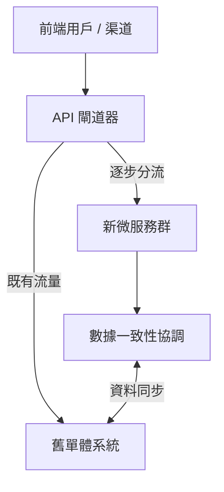

這場由擁有 25 年以上金融與雲端架構經驗的 **AWS ProServ（專業服務）** 資深顧問所帶來的演講，主題為：

> **《Decompose with Care: Architecture Patterns, Engineering Best Practices, and Hard Lessons from a Banking System Modernization Project》**
> （謹慎拆解：銀行系統現代化專案的架構模式、工程最佳實踐與慘痛教訓）

這不是「微服務教戰守則」的理想版，而是一場極具實戰價值的 **踩坑與填坑** 分享：當你必須在真實資金、真實用戶與遺留系統交織的場域中現代化，技術架構只是工具，真正決定成敗的是領域邊界、合約機制與工程紀律。

以下為針對該演講內容的整理與深度架構解析。亦可與本站金融落地系列相互參照：[金融業 GenAI 平台工程](/blog/38-financial-genai-platform-engineering/)、[Enterprise Agentic AI 治理](/blog/39-enterprise-agentic-ai-governance/)。

> **花花的一句話**
>
> 拆解龐大的舊系統就像在跑滾輪上換零件一樣刺激！喵～只要設定好邊界和合約，我們就能一步一步安全地搬上雲端，不怕搞砸囉！🐾
>
> **花花的工程提醒**
>
> 在進行單體架構微服務化或雲端遷移時，善用 Strangler Fig 模式與多層 Facade，並落實 Contract-First 與 Mock-First 的開發紀律以確保核心業務零中斷。

## 專案背景：「在飛奔的飛機上換引擎」

專案目標清楚，但難度極端：協助一家東南亞領先銀行，將運行多年的 **單體（Monolith）全通路銀行平台**，重構並遷移至 AWS 上的雲端原生微服務架構。

之所以被稱為「在飛奔的飛機上換引擎」，原因有三：

1. **真實資金與龐大用戶**：服務超過 **2000 萬** 真實活躍用戶，日交易量大，不容許任何資金差錯。
2. **零中斷過渡**：新舊切換全程必須維持 100% 業務連續性，不能影響現行營運。
3. **複雜的新舊交織**：銀行內部有大量無法控制的遺留 upstream / downstream 系統，新系統必須與之長期共存並協同。

這三點把問題從「怎麼拆服務」拉高成「怎麼在不可停機的金融環境中，安全地演進系統」。

## 四大核心挑戰一覽

演講者把痛點收斂成四條主線：

| 挑戰 | 核心問題 | 解法關鍵詞 |
| --- | --- | --- |
| 1. 鎖定需求 | 一句話合約、部門衝突、晚期否決 | 全關係人早期介入、驗收標準、權威簽核 |
| 2. 服務邊界 | 切太細或太粗都災難 | Bounded Context、避免 Over-Decomposition |
| 3. 新舊共存 | 長期並行、資料一致性 | Strangler Fig、三層 Facade |
| 4. 交付速度 | AI 加速寫碼後審查與整合成為瓶頸 | Contract-First、Mock-First、小 MR、結對編程 |

## 挑戰一：如何精準鎖定「客戶需求」？

許多技術人員常輕忽需求階段，但金融系統的需求往往一開始極其模糊——深挖後像「魔術帽拉彩帶」般越拉越長。這正是後續重工爆炸的根源。

### 痛點現象

- 合約上起初只有「一句話需求」，細節確認就拖延 **3 週**。
- 業務、前後端、資安等部門給出的需求互相衝突。
- 功能剛上線就湧入 **10 多個** Change Requests。
- Core Banking APIs 與前端同步修改，規格持續漂移（*Loss in translation*）。
- 資安與企業架構（EA）在後期才介入，直接否決已開發好的架構。

### 解法與最佳實踐

> 「從第一天起，就把所有會對專案結果產生影響的關係人（Stakeholders）拉進來。」

- **全關係人早期介入**：業務、前端、Ops、資安、核心銀行團隊一起確認功能性與非功能性需求（NFRs：安全性、效能、可觀測性），提早過關（*Clear gates early*）。
- **規格／合約先於 LLD**：不要急著寫 Low-Level Design。先建立 User Story 與極其詳盡的 **Acceptance Criteria（驗收標準）**。
- **AI 輔助交叉檢查**：用 Amazon Q 等工具快速比對需求文件中的漏洞與矛盾，效率遠超人工。
- **權威簽核（Authoritative Sign-off）**：要有具決策權的人對最終需求簽字負責，避免無休止的口頭變更。

> **編者補充：** AI 能加速找出矛盾，但無法替代「誰要為規格負責」。若沒有簽核人，文件再完整也只是可被推翻的草稿。

## 挑戰二：微服務邊界該「在哪裡切」？

將單體拆成微服務時，切得太細或太粗都是災難。

### 痛點現象

以「資金轉帳（Fund Transfer）」為例，牽涉 Customer、Account、Limits、Schedule 等概念。若一開始就把每個概念拆成獨立微服務，維護、部署與整合測試成本會瞬間失控。

### 解法與最佳實踐

> 「當你還不確定時，先不要過度拆分。寧可先維持較大的服務邊界。」

- **善用限界上下文（Bounded Context）**：這是 DDD 的核心——在同一個邊界內，像 *Customer* 這類詞彙只能有唯一、無歧義定義。
- **警惕過度微服務化（Over-Decomposition）**：若一個服務只有 100 行業務邏輯，卻有 1000 行樣板程式碼，絕對得不償失。每多一個服務，團隊就多一層維護與測試稅。

演講者坦言：專案初期拆了 **5–6 個** 微服務，後期在版本控制與整合測試上吃足苦頭。邊界切分不是品味問題，而是可營運性問題。

## 挑戰三：新舊系統如何安全共存？

現代化不是一次性切換。新舊系統必須並行相當長一段時間。

### Strangler Fig（絞殺者）模式

不要試圖一次替換所有功能，而是以 API 閘道器逐步把流量導向新服務：

### 專案採用的「三層外觀架構」（3-Tier Facade）

1. **API Gateway 層**：動態分流與路由。
2. **Edge Service / BFF 層**：針對 App、網銀等渠道做優化與結果聚合。
3. **Cross-cutting Service 層**：對必須同時訪問新舊系統以確保強一致性的邏輯（例如 Limit Check）進行協調，避免分散式一致性災難。

這裡的重點不是「把 Facade 做漂亮」，而是：**把高風險一致性衝突集中在可治理的協調層**，而不是讓每個微服務各自「順便」碰舊系統。

## 挑戰四：如何用工程實踐真正提升交付速度？

引入 AI 輔助開發後，程式碼產生速度極快；此時 **Code Review** 與 **整合測試** 反而成為新瓶頸。打字變快，系統並不會自動變更穩。

### 解法與最佳實踐

- **合約優先（Contract-First）**：先定義 OpenAPI / Swagger / GraphQL Schema，把合約當作 Source of Truth。合約確立後，可用 AI 自動生成 Mock API 與測試案例。
- **擋板優先（Mock-First）**：後端先提供 Mock，讓前端提早整合；把整合難題提前暴露，避免專案後期的整合地獄。
- **第一天就建 CI/CD**：即使只有幾行程式碼，也要把自動化測試與安全掃描架好，並隨專案演進持續優化。
- **用 AI 做防錯與快速審查**：以 Prompt 範本／Steering Docs 規範 AI 輸出品質。
- **小步快跑，限制 MR 大小**：AI 一次產出幾千行會讓人工審查崩潰；必須強制小顆粒度 MR。
- **結對編程（Pair Programming）**：在編寫當下完成審查，消除 MR 堆積瓶頸。

這與本站常談的 [Harness Engineering／Vibe Coding 護欄](/blog/49-the-new-sdlc-with-vibe-coding/) 是同一條邏輯：AI 加快生成後，規格、驗證與審查必須同步升級，否則只是更快製造風險。

## 效益總結：改良前後對照

| 指標維度 | 改良前痛點 | 改良後成效 |
| --- | --- | --- |
| 重工比例（Rework） | 需求頻繁變更，後期才發現不符資安規範 | 減少 **40%–70%** 重工 |
| UAT 時間 | 後期才暴露前後端整合與規格不符 | 測試時間縮短 **30%–50%** |
| 部署與整合風險 | 新舊並行混亂、測試環境不穩 | 以 Mock-First 與 API 飄移檢測提早發現變更 |
| 程式碼審查效率 | AI 產出導致 MR 嚴重堆積 | 以結對編程與小 MR 解開瓶頸 |

數字很有說服力，但仍須留意：**這些成效建立在早期 stakeholdering、合約與邊界紀律之上**；若只抄 Mock-First 或 CI/CD，卻不處理需求簽核與過度拆分，效益未必可複製。

## 可複用檢查清單

若你也在做金融級現代化，可先自問：

1. **第一天是否已把資安、EA、Ops、核心銀行與業務拉進決策場？**
2. **有沒有可簽字的 Acceptance Criteria，而不是口頭故事？**
3. **服務邊界是依 Bounded Context，還是依「類別看起來很乾淨」？**
4. **新舊流量是否經由可回退的 Gateway 分流，而不是 Big Bang cutover？**
5. **強一致性衝突是否集中在 Cross-cutting 協調層？**
6. **合約、Mock、測試、安全掃描是否先於大量程式碼？**
7. **MR 是否小到人類審得完？AI 產出有沒有 Steering Docs？**

## 關鍵結語

> 「AI 雖然能幫你在一小時內寫出 1000 行程式碼，但它也能在同一時間製造出 1000 行 Bug。真正的現代化，考驗的是你對業務邊界的精準掌握，以及嚴格的工程紀律。」

這場演講深刻揭示：在金融級系統現代化中，微服務與 AWS 只是手段；**清晰的領域邊界（DDD）、合約優先的溝通機制，以及自動化測試與 CI/CD 的工程紀律**，才是讓這艘大船在風浪中完成換裝、且不沉沒的關鍵。

謹慎拆解，不是拆得更慢，而是把風險拆到可治理、可回退、可驗證的單位。
