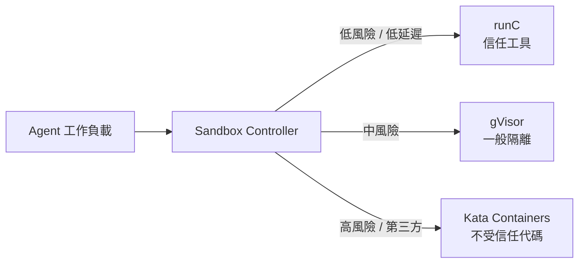

本場沙龍由 **AWS 解決方案架構師 HC** 與 **幣託集團（Bito Group）運維經理 Michael** 共同主講。主軸很清楚：

> **企業如何利用 Kubernetes（AWS EKS）架構，安全、合規且低成本地部署多租戶 AI Agent 平台。**

這不是「再掛一個 LLM API」的故事，而是把企業導入 Agent 時最常卡住的問題——**管理、治理、成本與安全監控**——放到可落地的平台工程語境中拆解。亦可與本站 [Enterprise Agentic AI 治理](/blog/39-enterprise-agentic-ai-governance/)、[企業 AI Agent 安全](/blog/43-enterprise-ai-agent-security/) 相互參照。

> **花花的一句話**
>
> 喵～把每個 AI 小幫手都關在專屬的安全沙箱裡，就不怕牠們調皮搗蛋啦！在 EKS 上打造多租戶環境，既安全又省錢呢！🐾
>
> **花花的工程提醒**
>
> 在 Kubernetes 上部署多租戶 AI Agent 平台時，必須嚴格區分隔離層級（如使用 gVisor 或 Kata Containers 等沙箱），並搭配 Network Policy 與動態擴縮容 (KEDA) 來兼顧資安與成本。

## 議程總覽

| 階段 | 主講 | 重點 |
| --- | --- | --- |
| 1. AI Agent 趨勢與安全挑戰 | HC | Fintech／容器／AI 背景；OpenClaw、Hermes 熱度；OWASP LLM Top 10 紅線 |
| 2. 多租戶隔離與沙箱技術 | HC | 四層隔離；runC／gVisor／Kata；Sandbox Controller 混搭 |
| 3. 幣託 BitoClaw 實戰 | Michael | 金管會監管下的自建平台、EKS、KEDA、Pod Identity |
| 4. 總結與資源 | HC | 賦能員工優於追最新模型；部署參考資源 |

## 一、開場：AI Agent 爆發與企業隱憂

HC 專注於金融科技（Fintech）、容器化與 AI/ML。開場先用 GitHub stars 增長曲線說明 **OpenClaw** 與 **Hermes Agent** 的高人氣，再立刻把氣氛拉回企業現場：Agent 好用，但部署後要面對四大挑戰——

1. **管理**：誰能建立、啟用、停用哪些 Agent？
2. **治理**：工具權限、資料邊界、稽核軌跡如何定義？
3. **成本**：閒置算力、Token、共享基礎設施如何控管？
4. **安全監控**：Prompt Injection、惡意程式、資料外洩如何偵測與隔離？

### OWASP LLM Top 10 視角下的安全紅線

分享中特別提到企業最常踩到的紅線：

- **Prompt Injection（提示詞注入）**
- **Malware（惡意軟體）進入執行環境**
- **敏感資料隔離（Data Isolation）不足**

關鍵提醒是：模型能力愈強，愈不能假設「使用者提示詞是善意的」。企業若沒有把執行環境、網路權限與資料平面切開，Agent 很快會從生產力工具變成攻擊面放大鏡。

> **編者補充：** SaaS Agent 可以解決啟動速度，卻往往解決不了「資料絕對不能外洩」的合規門檻。金融與受監管產業通常必須先回答隔離問題，再談功能炫技。

## 二、多租戶隔離：從物理到 API 的四個層級

HC 將企業多租戶隔離收斂為四層，實務上幾乎都要「分層疊加」而非只選一層：

| 層級 | 典型手段 | 能擋什麼 | 限制 |
| --- | --- | --- | --- |
| 物理隔離 | 獨立 Cluster | Blast radius 最大分離 | 成本最高、維運複雜 |
| 邏輯隔離 | Namespace | 資源配額、RBAC 邊界 | 仍可能共用節點與核心 |
| 容器隔離 | Pod／Runtime | 行程與檔案系統邊界 | 共用 kernel 時風險仍在 |
| API 隔離 | Gateway、Policy、Identity | 呼叫面與憑證暴露面 | 無法單靠 API 擋住惡意程式執行 |

結論很務實：**信用等級不同的工作負載，隔離強度也應不同。** 內部受信任工具、一般業務 Agent、與執行不受信任第三方程式碼的 Agent，不該共用同一套 Runtime 假設。

## 三、Sandboxed Runtimes：runC、gVisor、Kata 怎麼選？

這是本場技術含量最高的一段。重點不是「永遠選最安全的」，而是依風險、延遲與成本做混搭。

| 技術運行環境 | 安全隔離強度 | 啟動延遲（效能） | 記憶體開銷（成本） | 適用場景 |
| --- | --- | --- | --- | --- |
| **runC** | 較弱（共用核心） | 極快（微秒級） | 極低 | 內部受信任的工具呼叫 |
| **gVisor** | 中等（用戶空間核心） | 中等 | 中等 | 需防範一般漏洞的阻隔 |
| **Kata Containers** | 極強（MicroVM） | 較慢（150ms+） | 較高 | 執行不受信任的第三方代碼 |

進一步解法是透過 Kubernetes 的 **Sandbox Controller**，讓平台能依工作負載類型靈活混搭不同 Runtime，在安全與效能之間取得平衡。

這裡的 trade-off 很直接：你可以把所有東西都跑在 Kata 上換取最高隔離，但會付出啟動延遲與記憶體代價；若全用 runC，則成本與速度漂亮，卻可能扛不住不受信任程式碼的攻擊面。

## 四、幣託實戰：為什麼要自建 BitoClaw？

Michael 從幣託背景切入：這是台灣老牌加密貨幣交易所，受金管會監管，對資安與合規（含洗錢防制）要求極高。

### 導入 AI 的真實痛點

- **人力瓶頸**：繁瑣運維例行公事卡住專家產能
- **知識落差**：Know-how 散落在人、文件與群組
- **工具孤島**：交易、市場情報、內部系統彼此不通
- **合規硬需求**：資料絕對不能外洩

因此他們拒絕了「資料風險偏高」的純 SaaS 方案，選擇在 **AWS EKS** 上以 OpenClaw 與 Hermes 為基礎，自建多租戶 AI Agent 平台——**BitoClaw**。

### BitoClaw 平台架構重點

| 面向 | 做法 | 價值 |
| --- | --- | --- |
| 應用技術棧 | 前端 Next.js；後端 Go（CHI）；部署於 EKS | 可控、可擴充、可觀測 |
| GitOps／自動化 | ArgoCD | 部署一致性與可回放 |
| 成本控制 | KEDA（HTTP 觸發）Scale-to-Zero | 無使用時縮容至零 |
| 模型存取 | Pod Identity 連 AWS Bedrock | 降低 API 金鑰外洩風險 |
| 網路防線 | Network Policy 預設阻斷非授權流向 | 最小連線原則 |
| 權限 | RBAC 最小權限 | 降低橫向擴散 |
| 審計與觀測 | 導入 LLM 可觀測性平台（如 Langfuse 類工具）與 Grafana | 完整呼叫追蹤、審計與系統可觀測性 |

### 量化成果

- **首次部署**：約 **20 分鐘**
- **後續啟用**：員工透過 Slack 喚醒 Agent，約 **3 分鐘** 開箱即用
- **能力整合**：將 Spot Trading、市場情報等專業 **Skills** 納入平台
- **合規敘事**：兼顧資安與法遵（分享中提到對齊外部監管與合規要求，以及金管會規範情境）

這條路徑的核心不是「模型換得更快」，而是：**把 Agent 放進受監管企業真正能上線的執行與治理邊界裡。**

不過仍須留意：Scale-to-Zero 與 3 分鐘冷啟用對內部工具很好用；若場景是延遲極度敏感的前台交易路徑，仍要另外評估預熱與可用性代價。

## 五、總結：自建 Agent 平台真正在買什麼？

HC 收斂到一句很穩的核心思維：

> **企業自建 AI Agent 的價值，不在於追求最新模型，而在於在安全的環境下賦能員工。**

### 可帶回團隊的檢查清單

1. 你們的 Agent 工作負載有沒有依信用等級分級，而不是一體適用 runC？
2. 隔離是否同時覆蓋 Cluster／Namespace／Pod／API，而不是只喊網路封鎖口號？
3. 模型憑證是長期 API Key，還是短期 Identity（如 Pod Identity）？
4. 無流量時能不能 Scale-to-Zero？有流量時觀測與審計是否完整？
5. 資料外洩風險能否過得了內部資安與監管敘事，而不只是「看起來很 AI」？

## 相關來源

| 來源 | 說明 |
| --- | --- |
| [BitoClaw Platform](https://bitoservice.com/) | 幣託 BitoClaw 官方介紹：多租戶 AI 員工工作台、EKS／KEDA 彈性擴展與企業安全隔離 |
| [OpenClaw](https://github.com/openclaw/openclaw) | 開源個人／團隊 AI Agent 專案 |
| [Hermes Agent](https://github.com/NousResearch/hermes-agent) | Nous Research 開源 Agent 框架 |
| [OWASP Top 10 for LLM Applications 2025](https://genai.owasp.org/resource/owasp-top-10-for-llm-applications-2025/) | LLM／Agent 應用常見安全紅線 |
| [Kubernetes Agent Sandbox](https://github.com/kubernetes-sigs/agent-sandbox) | Kubernetes Sandbox Controller／隔離工作負載相關專案 |

## 關鍵結語

這場沙龍把企業 Agent 平台拆成兩半：一半是 **HC 的隔離與沙箱技術地圖**，一半是 **幣託用 EKS 把合規、成本與員工體驗同時做起來的實戰路徑**。

對受監管產業而言，真正的敲門磚往往不是更強的模型，而是：

- 多租戶隔離做得到
- 沙箱強度選得對
- 憑證與網路權限管得住
- 閒置成本壓得下
- 啟用體驗快到員工願意用

先把這五件事做對，AI Agent 才有機會從 Demo 變成企業級生產力基礎設施。
