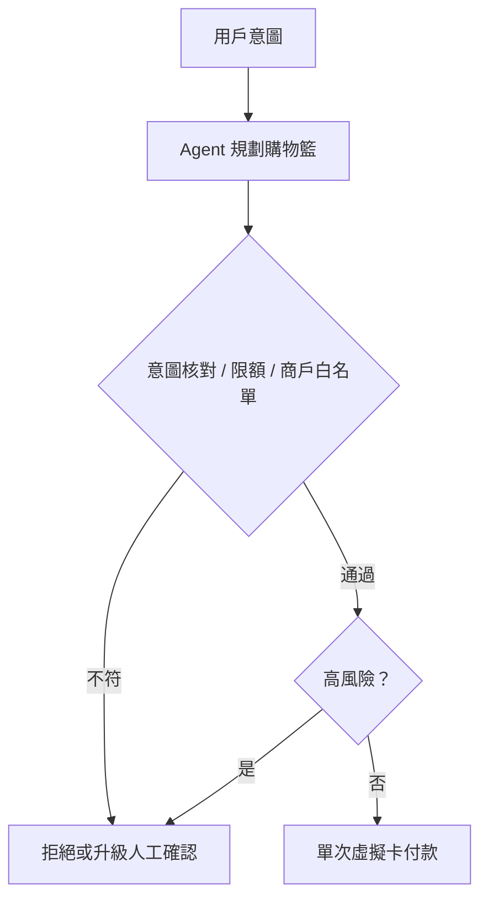

這場演講由 **Amazon 代表** 與 **TapPay 副總經理 Joseph** 共同分享，探討兩條彼此呼應的戰線：

1. Amazon 如何把生成式 AI 導購助理（原名 **Rufus**，現為 **Alexa for Shopping**）做成可規模化的轉換引擎
2. TapPay 如何運用亞馬遜技術，把零售從「聊天推薦」推向真正能代客結帳的 **主動式電商（Agentic Commerce）**

核心不是「AI 會不會聊天」，而是：**AI 能不能在低延遲前提下簡化決策，並在嚴格金融控管下安全地花錢。**

本文的 TapPay 架構、延遲與 Open Beta 狀態來自現場議程筆記；[AWS Summit Taipei 議程](https://aws-summit-2026-jane.s3.ap-northeast-1.amazonaws.com/aws_summit_taipei_2026_jane.html)可確認「導購機器人在 Strands Agents 與 Amazon Bedrock AgentCore 實作」場次及講者。Amazon 產品規模與 AgentCore 控制則另外用第一方資料核對。未公開的投影片與量測方法，不視為已獨立驗證。

> **花花的判斷**
>
> Agentic Commerce 的關鍵不是自動下單，而是把意圖核對、金額上限、一次性憑證與可撤銷授權設計成付款流程的一部分。

> **花花的工程提醒**
>
> 實作 Agentic Commerce (主動式電商) 時，應將意圖核對、單次虛擬卡生成與金額上限管理內建於結帳 Agent 的工作流中，以確保自動化交易的金融安全性。

## 議程總覽

| 區塊 | 焦點 | 關鍵訊息 |
| --- | --- | --- |
| Amazon Alexa for Shopping | 導購痛點與轉換 | Lens、評論摘要、尺碼、對話式推薦、Buy for Me |
| 架構抉擇 | 單 Agent vs 多 Agent | First Token 控制在 3–5 秒 |
| TapPay Agentic Commerce | 主動代理採購 | 意圖前端介入，完成結帳與付款 |
| 安全防線 | AI 被授權花錢 | 單次虛擬卡、意圖核對、MFA、限額與商戶白名單 |

亦可對照本站 [DoorDash Ask Assistant 架構](/blog/51-doordash-ask-assistant-architecture/)：同樣強調 Agent 執行與確定性／安全邊界，而非把所有商業動作直接丟給模型。

## 一、Amazon Alexa for Shopping：把購物摩擦拆掉

Amazon 分享其生成式 AI 導購助理如何針對真實消費痛點設計功能，並以更短決策路徑拉高轉換率。

### 五大功能如何對上痛點

| 功能 | 解決什麼 | 怎麼做 |
| --- | --- | --- |
| **Amazon Lens（以圖搜圖）** | 不知道商品名稱 | 拍照即可找對應或相似商品 |
| **Review Summary（評論摘要）** | 評論太多讀不完 | LLM 自動整理正／負特點 |
| **Size Recommendation（尺碼推薦）** | 亞太／歐／美尺碼混亂 | 結合評論訊號（如「版型偏小」）與個人檔案 |
| **Ask Rufus（對話式導購）** | 需求表達複雜 | 記住偏好（如配偶喜歡的顏色）後精準推薦 |
| **Buy for Me（無貨代買）** | 自營無貨仍想買 | 在虛擬 VM 用 headless browser 前往品牌官網代下單寄送 |

**Buy for Me** 特別值得注意：這已超出「給連結」，而是 Agent 在隔離執行環境中代表用戶完成跨站操作。能力很強，但爆炸半徑也更大——後文 TapPay 的支付控管，幾乎是同一類能力在金融側必要的對偶解法。

### 2025 年營運成果：官方數字與議程數字分開看

- **顧客規模**：Amazon 表示 Rufus 在 2025 年協助超過 **3 億名顧客**研究、比較與購買商品。
- **增量銷售**：Amazon 另稱其 AI 導購在同年帶來近 **120 億美元增量銷售**。
- **轉換率**：議程提到相較傳統搜尋流程提升約 **60%**；本文未找到公開方法與基準，故保留為 speaker-reported figure。

[Alexa for Shopping 官方介紹](https://www.aboutamazon.com/news/retail/alexa-for-shopping-ai-assistant)支持顧客規模，[AWS 對外方案公告](https://www.aboutamazon.com/news/aws/aws-agentic-shopping-assistant-retailers)支持增量銷售數字；兩者都沒有證明 120 億美元是由單 Agent 架構單獨造成。較穩健的判讀是：導購能力已具規模，但架構與商業結果之間仍缺少公開歸因資料。

## 二、關鍵架構抉擇：放棄多 Agent，保住 3–5 秒

依議程分享，這套購物方案採用 **Amazon Bedrock AgentCore**，並做了一個對互動體驗重要的決定：

> **放棄多 Agent（Multi-Agent）設計，改採單 Agent（Single Agent）架構。**

理由非常產品導向：多 Agent 協作雖可能提升任務精準度，但頻繁互相呼叫會把延遲推到 **30–60 秒**。電商場景中，用戶很難為一個搜尋／推薦流程等半分鐘。

議程表示團隊因此選擇 **可串流回應的單 Agent（Single Agent）架構**，把 **首字回應時間（First Token）** 壓在 **3–5 秒** 內。這是場次報告的架構與量測值，不代表所有 Alexa for Shopping 路徑都使用同一拓樸或延遲門檻。

> **編者補充：** 這不是否定多 Agent，而是提醒 trade-off——協調精度 vs 體感延遲。電商這種「幾乎瞬時決策」場景，延遲常比多一層專責 Agent 更致命。若任務屬後台規劃、稽核或長流程，多 Agent 仍可能合理。

## 三、TapPay：從聊天機器人到 Agentic Commerce

Joseph 提出更前移的零售觀念：不要只在消費者已經挑商品時才出現，而要在 **購物意圖（Intention）剛萌芽** 時就介入，並盡可能幫使用者走到結帳完成。

### 傳統導購 vs 主動式電商

| 比較項目 | 傳統導購機器人 | 主動式電商（Agentic Commerce） |
| --- | --- | --- |
| **介入時機** | 消費者主動搜尋、挑選時 | 購物意圖剛出現的最前端 |
| **任務範疇** | 推薦商品、丟購買連結 | 拆解意圖、匹配規格、**完成結帳與付款** |
| **用戶體驗** | 仍須手動跳轉電商網站結帳 | AI 代理人一站式完成任務 |

### 實踐三大要素

1. **工具與資源（Tools）**
   給 AI「手和腳」：金流錢包、搜尋 API、商家服務串接，使其能真正執行購買。
2. **穩定的工作流（Workflow）**
   建立檢查與驗證機制，確保買對東西、結帳與付款順利。
3. **穩定的執行環境（Runtime）**
   採用 Amazon Bedrock AgentCore，支撐高併發與高安全性。

這三要素幾乎可對應到企業 Agent 平台的共通結構：**Tools × Workflow × Runtime**。少任何一塊，系統就容易停在 Demo——會聊、不會買，或會買但不安全。

## 四、五大未來應用場景

| 場景 | 用戶怎麼說／做 | Agent 做什麼 |
| --- | --- | --- |
| 定期自動採購 | 「貓砂快沒了」類消耗節奏 | 依喜好與消耗自動補貨；依反饋調整規格（例如貓不愛吃某罐頭） |
| 客製化旅遊規劃 | 天數、預算、同行人數 | 串接訂房、訂餐廳、門票（如 AsiaYo、FunNow） |
| 拍照空間搭配 | 上傳客廳照片 | 分析風格與尺寸，推薦裝飾品 |
| 預算制驚喜禮物 | 每月固定 500–1000 元 | 依日常習慣自動挑選並寄送 |
| 精準送禮 | 分析與朋友的互動 | 推薦真正「送進心坎」的節日禮物 |

這些場景共同點是：價值不只在推薦品質，而在 **把意圖轉成可執行的交易閉環**。也因此，下一節的安全控管不是附加功能，而是產品能不能上線的前提。

## 五、AI 自動購物的安全防禦線

Joseph 強調：一旦賦予 AI「花錢的能力」，必須假設模型會幻覺、會越權、會為了「達成任務」走捷徑。以下四道 TapPay 防線來自議程分享；公開的 [AgentCore payments 核心概念](https://docs.aws.amazon.com/bedrock-agentcore/latest/devguide/payments-concepts.html)可獨立支持 scoped payment session、支出上限、憑證隔離與活動追蹤，但不等於驗證 TapPay 的每個產品實作。

### 四道控管

1. **單次性虛擬卡（One-time Virtual Cards）**
   每次交易產生一次性虛擬卡片，用完即廢，降低重複盜刷風險。
2. **購物籃與意圖核對（Intent Validation）**
   檢查購物車是否真符合用戶初始意圖——例如防止 AI 為了拿贈品，順便買下昂貴主機。
3. **雙重認證（MFA）**
   偵測金額異常或高風險行為時，必須經用戶手動驗證才放行。
4. **嚴格限額管理**
   支援單筆上限、單月上限，以及允許消費的商戶名單（Merchant Allowlist）。

這套設計的產品哲學很清楚：**Agent 可以自主，但不能失控。** 自主完成任務，與「無限制地代為支出」，中間必須有可配置、可稽核、可中斷的金融邊界。

### Open Beta 現況

依議程所述，該主動式電商系統於 **2026 年 4 月** 開啟 Open Beta，並串接：

- **FunNow**（訂餐廳）
- **AsiaYo**（訂宿）
- **誠品線上**（生活百貨）
- **比比昂 Bibian**（跨境電商）

這份商家與 Beta 狀態未在本文找到可公開交叉驗證的 TapPay 產品頁，讀者不應把它當成持續有效的可用性清單。開放商家、限額與意圖核對規則，仍會直接決定 Agent 的「爆炸半徑」。

## 結構化摘要

- **Amazon 的實踐：** Alexa for Shopping 透過以圖搜尋、評論摘要、尺碼推薦、對話式導購與無貨代買縮短決策路徑；**單 Agent + 3–5 秒首字回應** 是議程分享的工程取捨，不是增量銷售的公開因果證明。
- **Agentic Commerce 是下一代：** 從被動搜尋推薦，走向「意圖萌芽即介入、並可自主完成採購與結帳」；需要 Tools、Workflow、Runtime 三者齊備。
- **安全與控管是核心：** 當 AI 能真的花錢，商家／平台的核心價值更在於提供可控金融環境——單次虛擬卡、額度、意圖核對與 MFA，才是讓主動式購物可上線的軌道。

## 關鍵結語

這場演講把電商 Agent 的下一階段講得很直白：

> **低延遲決定用戶願不願意用；安全控管決定系統能不能讓它花錢。**

Amazon 公開了生成式導購的使用規模與增量銷售估計，也提醒架構選擇必須服務體感；TapPay 的議程案例則把故事推進到「主動結帳」，並用支付護欄回答最危險的問題——**AI 有錢包之後，誰來畫紅線？**

當導購從「給建議」變成「代執行」，勝負將愈來愈不在模型嘴甜，而在 Runtime、工作流與支付護欄是否經得起真實金錢與真實用戶。

接著可閱讀 [AWS × HoyaBit Bedrock AgentCore](/blog/56-aws-hoyabit-bedrock-agentcore/)，比較另一個正式環境 AgentCore 案例；也可回到 [AI Agent 實戰指南](/blog/64-ai-agent-guide/)，檢查工具權限、人工確認與失敗回復是否完整。

## 主要來源

- [AWS Summit Taipei 2026 議程](https://aws-summit-2026-jane.s3.ap-northeast-1.amazonaws.com/aws_summit_taipei_2026_jane.html)
- [Amazon：Alexa for Shopping](https://www.aboutamazon.com/news/retail/alexa-for-shopping-ai-assistant)
- [Amazon：Agentic Shopping Assistant for retailers](https://www.aboutamazon.com/news/aws/aws-agentic-shopping-assistant-retailers)
- [AWS Docs：AgentCore payments core concepts](https://docs.aws.amazon.com/bedrock-agentcore/latest/devguide/payments-concepts.html)
- [AWS Docs：AgentCore payments IAM roles](https://docs.aws.amazon.com/bedrock-agentcore/latest/devguide/payments-iam-roles.html)
