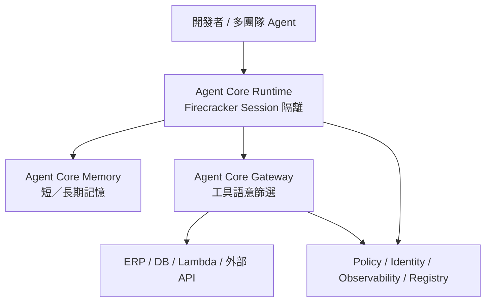
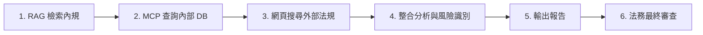

這份議程由 **AWS** 與台灣首家金管會合規登記的加密貨幣交易所 **HoyaBit** 共同呈現，主題為：

> **「在 AWS 上打造企業級 AI Agent」**

主軸並不是再展示一次炫技 Demo，而是直面企業最難跨越的那一步：把 AI Agent 從 **POC（概念驗證）** 真正推上 **Production（正式生產環境）**——同時處理延遲、高並發、安全治理與工具集成。

現場一方面介紹 AWS 的 **Amazon Bedrock Agent Core** 解法；另一方面由 HoyaBit 分享雙軌實踐：

- **對外**：把自然語言 AI Agent 深度整合進 App，降低 Web3 交易門檻
- **對內**：把 AI 定位為「企業大腦」，解放工程師非核心工作

亦可與本站 [Amazon × TapPay Agentic Commerce](/blog/55-amazon-tappay-agentic-commerce/)、[EKS 多租戶 AI Agent 沙箱](/blog/54-eks-multitenant-ai-agent-sandbox-bitoclaw/)、[Enterprise Agentic AI 治理](/blog/39-enterprise-agentic-ai-governance/) 對照閱讀。

> **花花的一句話**
>
> 喵嗚！把 AI 變成企業的最強大腦，不只可以幫忙處理交易，還能幫工程師省下超多時間！跟著 AWS 的腳步一步步上線，真棒！🐾
>
> **花花的工程提醒**
>
> 將 AI Agent 推向 Production 環境時，可評估採用 Amazon Bedrock Agent Core 解決方案，並專注解決高並發延遲、工具權限治理與長效記憶體 (Memory) 管理等核心挑戰。

## 議程總覽

| 段落 | 重點 | 帶走什麼 |
| --- | --- | --- |
| 1. 趨勢與痛點 | Agent 演進與 POC→Production 四大挑戰 | 先對準效能／擴展／安全／治理 |
| 2. Bedrock Agent Core | Runtime、Memory、Gateway、治理服務 | 平台能力地圖 |
| 3. HoyaBit 對外／對內實踐 | 語音交易 App、企業大腦 | 受監管場景如何落地 |
| 4. 平台架構與設計經驗 | 合約審查工作流、Before／After | 先梳理流程，再談模型 |

## 一、企業導入 Agentic AI 的趨勢與痛點

### Agent 發展三階段

| 階段 | 時間感 | 特徵 |
| --- | --- | --- |
| 問答模式 | 早期 | Copy-Paste，被動生成內容 |
| 工具融合 | 約 2025 | LLM 結合外部工具（如 MCP Server），進入真實工作場景 |
| 自主協作 | 約 2026（當前） | 朝向自主、能完整協助人類工作的 Agent 時代 |

分享中亦引用 Gartner 預測：到 **2028** 年，約 **1/3** 的生成式 AI 將嵌入企業系統，**15%** 的日常工作將由 Agentic AI 協助完成。數字是方向訊號；對企業更關鍵的是——嵌入系統之後，誰負責效能、擴展、安全與治理？

### 從 POC 到正式環境的四大痛點

多數團隊在 Demo 日很漂亮，一進正式環境就卡住。議程把痛點收斂成四條：

1. **效能（Performance）**
   Latency 是否夠低？使用者能不能接受回應節奏？
2. **可擴展性（Scalability）**
   能否支撐萬人同時在線與高並發 Session？
3. **安全性（Security）**
   Agent 一旦能存取企業機敏資料與內部工具，攻擊面如何控管？
4. **治理（Governance）**
   跨團隊開發多個 Agent 時，如何統一管理、驗證與授權？

> **編者補充：** 這四項幾乎是企業 Agent 平台的「最低及格線」。只優化 Prompt 或換更大模型，通常無法同時回答這四題；需要的是 Runtime、Identity、Policy 與觀測能力組成的平台層。

## 二、AWS 解法：Amazon Bedrock Agent Core 技術棧

AWS 以 **Agent Core** 對應上述痛點。可把它理解成一組「讓 Agent 可上線、可擴展、可治理」的平台能力，而不是單一聊天 API。

### 1）Agent Core Runtime：可隔離、可託管的執行層

| 能力 | 說明 | 對哪個痛點 |
| --- | --- | --- |
| **Session 隔離** | 底層採 **Firecracker microVMs**，運算、記憶體、檔案系統做物理隔離 | 安全／多租戶 |
| **MCP Server 託管** | 支援大模型存取企業 ERP、資料庫等外部系統 | 工具集成 |
| **多種部署** | Container 映像（ECR）或 Zip（S3），自動產生 Endpoint | 從 POC 到部署 |
| **生命週期** | 預設支援約 **2500** 並發 Session；閒置 **5 分鐘**暫停 CPU（不計費但保留狀態與檔案），**15 分鐘**後回收；最長可連續運行約 **8 小時** | 成本／擴展 |

重點不在「能不能跑 Agent」，而在：**每個 Session 有清楚的隔離邊界與生命週期計費模型**，讓正式環境的成本與安全敘事說得通。

### 2）Agent Core Memory：短期狀態 × 長期偏好

- **短期記憶**：記錄單次對話與 Session 狀態
- **長期記憶**：異步提取對話內容，轉成語意儲存——例如用戶買票偏好靠窗座位

這讓 Agent 不只「這一輪答得對」，而能跨 Session 記住可複用的偏好與事實。不過長期記憶也帶來治理議題：記了什麼、誰能讀、能否遺忘，都需納入資安與合規設計。

### 3）Agent Core Gateway：工具很多，但不要一次全塞進 Context

Gateway 負責介接外部 API 或 AWS Lambda，並具備 **語意搜尋（Semantic Search）**：

> 即使後端有數百個工具，也只篩出當下最需要的工具帶入 Context，避免上下文溢出與效能下降。

這點對正式環境極其關鍵。工具目錄愈長，愈容易同時打中兩顆地雷：Token 成本上升，以及模型選錯工具。Gateway 把「工具發現」從 Prompt 硬塞，升級成可檢索的系統能力。

### 4）安全與治理服務：讓多團隊 Agent 可管

| 服務 | 作用 |
| --- | --- |
| **Policy** | 動態評估 Agent 是否具備調用外部工具的權限 |
| **Identity** | 完整入站（Inbound）與出站（Outbound）身分驗證 |
| **Observability** | 開箱即用監控，串接 CloudWatch 或 Dashboard，追蹤 Memory、Identity、Gateway 軌跡 |
| **Registry** | 透過 Console、SDK、API 統一管理多團隊 Agent |
| **CLI** | 提供範本，協助開發者更快從 POC 部署到生產 |

一句話收斂：

> **開發者專注業務邏輯；平台負責託管、隔離、授權與觀測。**

這正是後文 HoyaBit「導入平台前後」對照表想證明的組織效益。

## 三、HoyaBit 實踐：合規 Web3 交易所的 AI 雙軌

### 背景

HoyaBit 是金管會合規登記的台灣虛擬資產交易所。在受監管產業導入 Agent，產品目標與風險邊界都與一般消費 App 不同：既要降低使用門檻，又必須保留人類最終確認與稽核能力。

### 對外：AI 語音驅動 App

使用者可直接用語音下達指令，例如：

> 「我想買一顆比特幣」

系統由 AI 自動產生交易訂單，使用者只需做最終的 **Human-in-the-loop** 確認即可完成。價值在於：

- 省去在繁瑣 Web3／Crypto UI 中尋找買賣、充值、鏈上劃轉的學習曲線
- 把複雜操作轉成自然語言意圖
- **仍保留人類確認**，避免 Agent 直接對資金路徑失控

這與「完全自動下單」不同：它是 **意圖理解 + 訂單預填 + 人類放行**，更符合受監管交易場景。

### 對內：AI 企業大腦

對內則把 AI 用於：

- 跨部門溝通加速
- 合規法規查詢
- 系統分析與知識整理

目標是解放工程師的非開發時間，把團隊產能集中回核心建設。對外降門檻、對內提產能，構成同一套平台能力的兩個出口。

## 四、HoyaBit AI 平台：工作流設計與 Before／After

### 以「合約審查 Agent」為例的工作流

受監管產業很適合用工作流說明「哪些步驟該規則化、哪些步驟才需要 Agent」：

這條鏈路的關鍵，不只是多了 LLM，而是：

1. 先有可檢索的內規與資料
2. 再用 MCP 連內部系統
3. 外部法規補充後做風險彙整
4. **最後仍回到法務審查**

Agent 負責加速與彙整，不取代最終責任節點。

### 為什麼需要 AI 平台？Before vs After

為了避免研發把大量精力耗在環境部署、安全控制、系統監控等非核心工作，HoyaBit 建立了基於 Bedrock Agent Core 的平台：

| 功能／職責 | 導入平台前 | 導入平台後 |
| --- | --- | --- |
| **開發者核心專注點** | 除了核心邏輯，還要處理部署、工具調用、日誌等 | 專注 Agent 核心業務邏輯與權限配置（YAML） |
| **系統部署與託管** | 自行處理 CI/CD、Container 封裝、環境建置 | 平台自動處理 CI/CD、ECR 推送、自動產生 Endpoint |
| **安全與治理** | 手動寫防護碼，難跨團隊統一 | 以 Policy & Identity 動態評估工具權限並提供隔離 |
| **可觀測性與評估** | 自行串監控，難追完整軌跡 | 內建 Observability 與 Evaluation，自動收集 Log／Metrics |

平台的本質，是把「每個專案重做一遍的基礎設施稅」變成共享能力。

### Mars 的關鍵建議：先梳理流程，不要先選模型

> HoyaBit AI 團隊負責人 **Mars** 的建議：
> 導入 AI 的首要任務 **不是先選模型，而是先梳理業務流程**。搞清楚哪些關卡適合 Rule-based（規則引擎），哪些關卡需要 AI Agent。同時，一開始切忌直接做宏大的平台規劃，建議從小規模 POC 開始迭代，明確記錄 Before／After 的成本與時間節省指標（例如：人力從 2 小時縮短至半小時審查），才能成功推動企業 AI 轉型。

這段幾乎是整場最值得帶走的組織方法論：

1. **流程分層**：規則引擎 vs Agent，不要全塞給模型
2. **由小做大**：先 POC，再平台化
3. **用指標說話**：Before／After 的時間與成本，比口號更能推動轉型

## 可帶回團隊的檢查清單

1. 你們卡住的是 Prompt，還是 Latency／並發／安全／治理這四題？
2. Agent 執行是否有 Session 級隔離，而不是共用一個長生命週期進程？
3. 工具是一次全塞 Context，還是經 Gateway／語意檢索動態挑選？
4. 入站與出站 Identity、工具 Policy 是否可動態評估？
5. 觀測能否回放 Memory、Gateway、工具呼叫完整軌跡？
6. 對外資金／交易路徑是否保留 Human-in-the-loop？
7. 是否已用 Before／After 指標證明 POC 值得平台化？

## 關鍵結語

這場 AWS × HoyaBit 議程把企業級 Agent 的故事講得很完整：

> **模型讓 Agent 會做事；Agent Core 這類平台能力，才讓 Agent 敢在正式環境做事。**

- 對 AWS 而言，答案是 Runtime 隔離、Memory、Gateway 工具治理，以及 Policy／Identity／Observability／Registry 組成的控制面
- 對 HoyaBit 而言，答案是對外語音交易降低門檻、對內企業大腦提升產能，並用平台把開發者從基礎設施稅中解放出來
- 對所有想做企業 AI 轉型的團隊而言，Mars 的提醒最實用：**先梳理流程與指標，再談模型與宏大平台**

從 POC 走到 Production，比拼的往往不是誰先接上最新模型，而是誰先把效能、擴展、安全與治理，做成團隊真能共用的平台能力。
