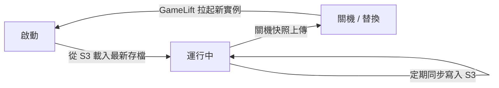
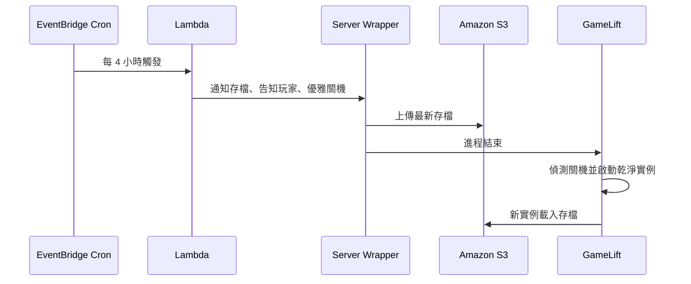

這是一場充滿實戰乾貨的架構分享。議程主題為：

> **從 K8s 遷移到 Amazon GameLift：Palworld 幻獸帕魯多人遊戲伺服器架構**

主講分為兩段：

- **前半**：AWS 專員介紹 Amazon GameLift 託管服務
- **後半**：Pocketpair 平台工程師 **ヤマウチ・ケイゴ（Keigo Yamauchi）** 分享 Palworld 官方伺服器從 Kubernetes 遷移到 GameLift 的設計與踩坑

核心命題很尖銳：雲端運算本質是臨時、可拋棄的（Ephemeral），但 Palworld 的遊戲世界卻高度持久（Persistent）。要在託管架構上跑 24/7 世界，必須把「計算可替換」與「狀態不可丟」徹底拆開。

本文的 Palworld 拓樸、更新時間、世界規模與故障案例來自 Keigo Yamauchi 在 TGDF 2026 的議程分享；[TGDF 2026 官方網站](https://2026.tgdf.tw/)可確認活動脈絡。GameLift 的壓測、服務地點、Spot 與 UDP ping beacon 則用 AWS 第一方資料核對。沒有公開投影片支持的 Pocketpair 細節，本文一律視為 speaker-reported case evidence，而不是通用的 GameLift 保證。

亦可對照本站談企業平台化的文章，例如 [AWS × HoyaBit Bedrock AgentCore](/blog/56-aws-hoyabit-bedrock-agentcore/)——同樣是把基礎設施稅交給平台，讓團隊專注核心邏輯；只是這裡的核心是遊戲世界存檔，而非 Agent 工作流。

> **花花的一句話**
>
> 喵～原來幻獸帕魯的伺服器是這樣搬家的！把遊戲狀態和運算拆開，就像花花把罐罐和玩具分開收納一樣，這樣就算雲端機器換了，我們的帕魯也不會不見喔！
>
> **花花的工程提醒**
>
> 雲端運算本質上是可拋棄的 (Ephemeral)，但在處理持久化 (Persistent) 工作負載如遊戲世界時，務必將「狀態」外部化，並善用生命週期適配器來確保伺服器的優雅啟動與關閉。

## 議程總覽

| 段落 | 重點 | 帶走什麼 |
| --- | --- | --- |
| GameLift 高階介紹 | 託管比喻、彈性、成本、更新效率 | 為何考慮離開自建／自管 K8s |
| Palworld 遷移設計 | 狀態外部化、Adapter、Exactly One、監控串接 | 持久世界上託管的設計原則 |
| 三大故障案例 | Terraform Drift、假健康 Fleet、Ping 失效 | 遷移後真正會踩的坑 |
| Key Takeaways | 四條啟示 | 可複用的平台工程檢查清單 |

## 第一部分：Amazon GameLift 服務高階介紹

### 1. 什麼是託管服務？買車 vs 叫計程車

講者以生活比喻說明 Managed Service：

| 模式 | 比喻 | 你要負責什麼 |
| --- | --- | --- |
| 自建伺服器 | 買車 | 養車、換零件、保養、維修——大量運維精力 |
| 託管服務 | 叫計程車／租車 | 專注「目的地」：遊戲開發與設計；車輛保養與駕駛交給 AWS |

重點不是「自己完全不用懂基礎設施」，而是把重複且高風險的運維負擔，轉成可預期的平台能力與 SLA。

### 2. GameLift：為即時多人遊戲打造的 purpose-built 服務

GameLift 定位為專為多人連線、低延遲、即時（Real-time）遊戲設計的服務。分享中提到的實績與能力包括：

#### 極端壓力測試

依 [AWS 公開壓測](https://aws.amazon.com/blogs/gametech/amazon-gamelift-achieves-100-million-concurrently-connected-users-per-game/)，GameLift Servers 測試約 **1 億同時連線用戶（CCU）** 的極限場景，並達成：

- 每秒增加約 **10 萬** 名玩家
- 每分鐘啟動超過 **9,000 個新運算實例**

這是 AWS 的服務壓測，不是 Palworld 的實際流量或單一部署保證。對多數團隊更實用的，是後面「按 Session 縮放」與 Spot 中斷處理等日常運維能力。

#### 全球化部署與成本優勢

| 面向 | 重點 |
| --- | --- |
| 部署地點 | Region 與 Local Zone 支援範圍會調整，應查 [GameLift Servers service locations](https://docs.aws.amazon.com/gameliftservers/latest/developerguide/gamelift-regions.html)，不要依賴文章中的固定數量 |
| 成本 | instance、作業系統、地區與網路費用各自計價；遷移前要以實際 Session 密度做試算 |
| 配對 | 可搭配 **FlexMatch**，但 queue、fleet 與 location 仍需明確配置 |
| 延遲量測 | 官方提供各 hosting location 的 UDP ping beacon，供玩家端取得較貼近遊戲流量的 RTT |

#### 多重成本優化

1. **依 Session 自動縮放（Auto-scaling）**
   傳統常以 CPU／記憶體縮放；但多人遊戲中，CPU 可能仍低、Session 卻已滿，必須開新機器。GameLift 能針對 **Session 數量** 縮放，更贴近遊戲真實瓶頸。

2. **Spot 實例安全託管**
   [AWS 文件](https://docs.aws.amazon.com/gameliftservers/latest/developerguide/fleets-spot.html)表示 Spot 相較 On-Demand 可能節省約 **70–90%**，但容量可被回收，通常只有兩分鐘中斷通知。GameLift 會避開高風險 instance type，工作負載仍須自行設計存檔、drain 與備援 fleet。

3. **Graviton（ARM）實例**
   提供高性價比運算選項。

#### 更新效率（議程報告）

- 過去更新／發 Patch：約 **40 分鐘甚至 1 小時**
- 後來縮短到約 **8 分鐘**
- 當年目標：全球部署縮到 **5 分鐘內**

對正式營運的遊戲而言，部署窗口縮短不只是工程爽感，而是事故修復與活動上線的反應速度。

## 第二部分：Palworld 遷移實戰——持久世界如何住進拋棄式運算

Keigo Yamauchi 拆解官方伺服器從 K8s 遷到 GameLift 的核心難題與解法。

### 1. 核心衝突：Ephemeral Compute × Persistent World

| 雲端本質 | Palworld 現實 |
| --- | --- |
| 基礎設施臨時、可拋棄 | 世界高度持久，進度絕對不能丟 |
| 實例可隨時替換 | 伺服器 24/7 運行；崩潰／斷線立刻影響玩家 |

議程提供的世界規模感：

- 每個伺服器最多約 **128** 個玩家基地
- 約 **1000** 隻帕魯（生物）
- 需要持續運行，且 **絕對不能遺失世界進度（State）**

於是設計原則被收斂成一句話：

> **計算是可拋棄的，但狀態（存檔）不是。**

### 2. 四大關注重點

#### ① 狀態外部化（Externalize State）

為了讓運算實例隨時可替換，存檔必須剝離到外部 **Amazon S3**：

存檔再分成三層防護：

| 類型 | 用途 |
| --- | --- |
| **Active Save** | 目前玩家遊玩的存檔點 |
| **Snapshots** | 故障時歷史回滾 |
| **Exports** | 開發調查、共享或 debug |

這不只是「備份」，而是讓世界狀態成為一等公民，運算變成可替換的執行器。

#### ② 生命週期轉譯（Translate Life Cycle）

GameLift 有既定生命週期協定（宣告 Ready、結束 Session、回報健康度等）。為了避免大改遊戲本體，Pocketpair 做了輕量 **Adapter／Wrapper**：

- Wrapper 負責與 GameLift 溝通
- 遊戲本體不必大幅重構
- 保留遷移彈性與後續換平台空間

這是經典 **Adapter Pattern**：用薄適配層吸收平台差異，而不是讓業務核心耦合託管 API。

#### ③ 確保「永遠只有一個」世界實例（Exactly One）

Palworld 每個伺服器世界必須唯一。做法包括：

- 將單一 Fleet 容量限制為 **1**；實例異常消失時，GameLift 自動重建
- **防止競態（Race Conditions）**：重建時若多實例同時讀寫同一 S3 存檔，可能損壞檔案——因此在外部做併發抑制與冪等操作
- **每 4 小時 graceful 重啟計畫**：

重點在於：規則不是寫在文件裡希望大家遵守，而是用自動化主動維護「永遠只有一個世界」。

#### ④ 串接既有監控資產

遷移時把 GameLift 指標接到既有 **CloudWatch、Slack 告警、Grafana**，讓維運不必整套重學工具。這常被低估，卻直接決定遷移後的組織摩擦成本。

## 第三部分：遷移後三大實戰故障案例

### 案例 1：Terraform 狀態漂移（Drift）

| 項目 | 內容 |
| --- | --- |
| **問題** | CI/CD 自動更新並發布新映像後，運維執行 Terraform 出現未預期 Drift，程式碼與雲端實際狀態不一致 |
| **原因** | 自動發布直接改了運行中的 Container Digest，Terraform State 不知情 |
| **解法** | 在 Terraform 明確使用 **Digest（而非 Tag）** 鎖定映像，並寫回 Terraform 控制，讓每次 apply 趨近 **0 drift** |

啟示：映像「漂」一下看似小事，但在 IaC 世界會直接變成信任危機——你以為 apply 是宣告式收斂，實際上每次都在追落後的真相。

### 案例 2：無聲的 Fleet 故障（顯示 Healthy 卻無法連線）

| 項目 | 內容 |
| --- | --- |
| **問題** | 儀表板綠燈／健康，但玩家完全無法加入 |
| **原因** | 傳統監控只看「實例是否存活」；實例內的遊戲進程／Game Session 其實已崩潰 |
| **解法** | 改監控 **不變量（Invariant）**：活躍 Game Session 數量與玩家人數。基礎設施健康卻沒有活躍 Session，就視為異常並自動觸發重建 |

> **編者補充：** 「機器活著 ≠ 服務正確」。對 Agent 平台、遊戲伺服器、交易系統都一樣——要監控業務不變量，而不只是 VM／Pod 心跳。

### 案例 3：Ping 值與延遲測量失效

| 項目 | 內容 |
| --- | --- |
| **問題** | 遷移後，玩家用戶端在社群伺服器列表無法再用傳統 ICMP Ping 測延遲 |
| **原因** | 原本用戶端的 ICMP 測量目標與遷移後 hosting location 不再匹配；ICMP 也未必代表實際 UDP 遊戲流量 |
| **解法** | 用戶端改向該區域 **GameLift UDP Ping Beacon** 做 RTT 測試，並保留 ICMP fallback |

[AWS 的 UDP ping beacon 文件](https://docs.aws.amazon.com/gameliftservers/latest/developerguide/reference-udp-ping-beacons.html)說明 UDP 更貼近多數遊戲流量，同時也建議大量 UDP ping 失敗時使用 ICMP fallback。因此正確做法不是宣稱 GameLift 一律封鎖 ICMP，而是讓探測目標、協定與 fallback 都跟著平台遷移。

## 結論：四大啟示（Key Takeaways）

Keigo Yamauchi 收斂出四條可複用原則：

1. **狀態外部化（Externalize State）**
   計算與狀態徹底分離——把持久服務放到拋棄式託管架構上的黃金法則。

2. **善用適配器（Adapter Pattern）**
   用輕量 Wrapper 轉譯生命週期，不必大改遊戲程式碼即可對接新平台。

3. **用運維設計維護規則**
   「永遠只有一個實例」這類約束，不要只靠設定檔與人治；要用 Lambda、併發抑制、冪等流程主動維護。

4. **保留既有資產**
   Log、指標、告警盡量接到原有維運介面，大幅降低團隊適應成本。

### 可帶回團隊的檢查清單

1. 你們的「世界／Session／租戶狀態」是否已外部化到可靠儲存？
2. 平台生命週期是否有 Adapter，而不是侵入核心邏輯？
3. Exactly One／唯一寫入者，是否有自動化防競態，而不只是文件規範？
4. 監控看的是基礎設施心跳，還是業務不變量？
5. IaC 是否用不可變 Digest 鎖定發布物，避免 Drift？
6. 用戶端健康檢查／延遲探測，是否仍假設舊網路行為（如 ICMP）？

## 關鍵結語

這場 Palworld 遷移分享，把多人遊戲後端最難的一句話講清楚了：

> **雲端給你的是可拋棄的算力；玩家要的是不可拋棄的世界。**

GameLift 提供的是專為即時多人遊戲打造的彈性、成本與更新效率；Pocketpair 真正解題的地方，則是用狀態外部化、Adapter、Exactly One 自動化與既有監控資產，把「持久世界」安全地放進「臨時運算」裡。

遷移成功與否，往往不取決於能不能把容器跑在新平台上，而取決於：存檔會不會壞、規則會不會破、監控會不會騙人、玩家會不會在你以為一切正常時突然連不進來。

若要把這些原則帶回一般平台工程，可接著讀[部署前模擬](/blog/25-deployment-simulation/)，建立故障與回復演練；也可比較[AWS × HoyaBit Bedrock AgentCore](/blog/56-aws-hoyabit-bedrock-agentcore/)，觀察不同工作負載如何把基礎設施責任交給託管平台。

## 主要來源

- [TGDF 2026 官方網站](https://2026.tgdf.tw/)
- [AWS：GameLift 1 億 CCU 壓測](https://aws.amazon.com/blogs/gametech/amazon-gamelift-achieves-100-million-concurrently-connected-users-per-game/)
- [AWS Docs：GameLift Servers service locations](https://docs.aws.amazon.com/gameliftservers/latest/developerguide/gamelift-regions.html)
- [AWS Docs：GameLift Spot fleets](https://docs.aws.amazon.com/gameliftservers/latest/developerguide/fleets-spot.html)
- [AWS Docs：GameLift UDP ping beacons](https://docs.aws.amazon.com/gameliftservers/latest/developerguide/reference-udp-ping-beacons.html)
