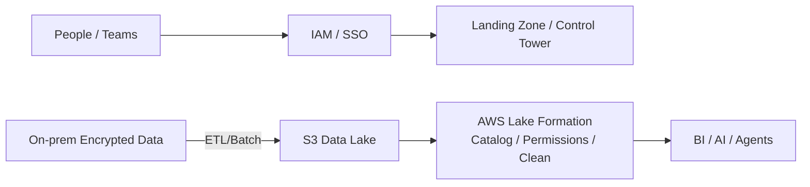
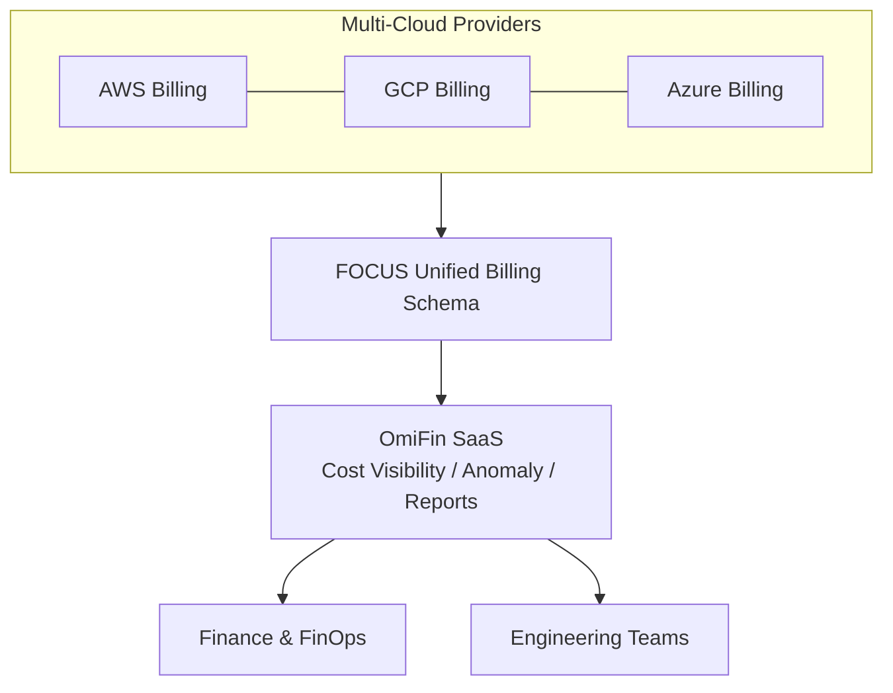

本篇為針對演講錄音的詳細整理。主題為：

> **《AI Agent 時代的企業治理新課題：從創新應用到可控管的營運模式》**
> 主講：**伊雲谷數位科技（eCloudvalley）企業解決方案架構師 Elmer**

核心觀點很直接：**AI 應用與雲端資源（Token、運算）成本呈指數型上升**；若缺乏治理，創新很快會變成失控的支出與資安風險。解法不是「封印創新」，而是把「花在哪裡、誰能花、怎麼花得安全」做成平台化能力。

> **花花的一句話**
>
> 喵！AI 應用越來越多，花錢就像流水一樣快！我們要用 OmiFin 和 MAIAH 建立好規矩，讓 AI 代理人乖乖聽話，這樣才能一邊創新一邊省下買罐罐的錢喔！
>
> **花花的工程提醒**
>
> 導入 AI 應用時，應儘早將成本治理 (FinOps) 與代理人治理 (Agent Governance) 納入架構，建立 Guardrails 限制 Token 用量與存取權限，避免創新淪為失控的維運災難。

## 核心摘要（Summary）

兩條治理主線：

1. **雲端財務治理 FinOps** —— 把多雲帳單與用量變成可視、可量化、可優化、可持續運作的體系（eCloudvalley：**OmiFin**）。
2. **AI Agent 治理** —— 對企業內部多個 Agent 做統一管理、審查與控管，避免 Token 浪費與資安外洩（eCloudvalley：**MAIAH Platform**）。

> 不是反對嘗試，而是要在「安全、合規、成本可控」的前提下擴張。

## 1. 講師背景（Speaker Bio）

- Elmer，eCloudvalley 企業解決方案架構師
- 經歷：醫療資訊工程師、臺北市政府教育局設計師、建置中心資訊組長（首次接觸 AWS）
- 證照：AWS 系列、PMP、個資法相關證照

## 2. 治理與合規（Governance & Compliance）

Elmer 以維基與 RIMA（風險資訊安全框架）闡述：

- **治理（Governance）**：把事情「做對」——決策、方向、監督
- **合規（Compliance）**：把「對的事情」做好——遵循、執行

### PPT 雲端治理模型（People / Process / Cloud & Platform）

- **People（人）**：AWS IAM 權限控管；規模化採 **Landing Zone / Control Tower**
- **Process / Cloud & Platform（流程/技術）**：地端資料加密傳輸至 **S3**，用 **AWS Lake Formation** 做數據治理（統一格式、權限、清洗）



## 3. FinOps 與 OmiFin：把成本花在刀口

### 3.1 AWS Well-Architected（WA）六大支柱

- 卓越營運、永續發展、安全性、可靠性、效能效率、成本優化
其中「卓越營運」是上雲第一步；**FinOps 的重點不是一味省錢，而是「有省錢（台語諧音）」＝把錢花在會創造價值的地方。**

### 3.2 FinOps 的四個時間框架

1. 了解（Inform）：了解用量與成本
2. 量化（Quantify）：轉為商務指標
3. 優化（Optimize）：持續做成本最佳化
4. 持續運作（Operate）：制度化治理、避免回彈

### 3.3 eCloudvalley OmiFin 平台

- **定位**：一站式多雲帳單與成本可視化管理
- **特色**：
  - 無綁定限制：不需綁定任何雲帳號平台或代理商
  - **SaaS 託管於 AWS**：無須維護地端或自管 VM
  - **支援 FOCUS 標準**：採開放的雲端計費資料格式，統一不同雲商的帳單欄位、加速審查



## 4. AI Agent 治理與 MAIAH Platform

### 4.1 企業導入 AI 的四大挑戰

1. 場景挖掘：找對應用場景
2. 模型可用性與部署：地端 vs 雲端、是否二次訓練
3. 人才短缺：缺 AI 整合與運維人才
4. 員工認知：對 AI 工具安全邊界不足

### 4.2 eCloudvalley MAIAH Platform（Multi‑AI Agent Hub）

- **BYOA（Bring Your Own Agent）**：把自研 AI/Agent 納入統一運維（健康、使用量、Token 消耗）
- **內建審查機制（Guardrails & Governance）**：
  - Guardrails 安全防護網：過濾輸入/輸出敏感內容
  - 行為審查（CI/CD 整合）：Agent 上線需走審查流，杜絕私自上架
  - **Token 額度控管**：限制上下文長度與總花費，避免「無上限燃燒」
- **架構安全性**：建立在 **AWS 安全框架**，強化資料與執行環境合規

```mermaid
flowchart LR
  subgraph MAIAH[MAIAH Platform]
    Reg[Agent Registry] --> Mon[Health / Usage / Token]
    Mon --> Guard[Guardrails (PII / Policy)]
    Guard --> Gate[CI/CD Gate\nReview / Approve / Deploy]
    Gate --> Limits[Token Limits / Quotas]
  end
  BYOA[BYOA: Internal Agents / LLM Apps] --> MAIAH
  MAIAH --> Corp[Enterprise Users / Apps]
```

## 5. OmiFin × MAIAH：雙平台對照

| 平台 | 核心解決痛點 | 主要特色功能 |
| --- | --- | --- |
| **OmiFin** | 多雲帳單繁雜、成本難監控 | 不綁代理商、SaaS 免維護、支援 **FOCUS** 統一帳單格式 |
| **MAIAH Platform** | AI Agent 缺管理、Token 失控、資安風險 | **BYOA** 統一監控、內建 **Guardrails**、串接 **CI/CD** 上架控管 |

## 可帶回團隊的檢查清單

1. 你們的雲端費用是否能以 **FOCUS 格式**做跨雲比對與異常檢測？
2. FinOps 是否有「了解→量化→優化→持續運作」的節奏，而非一次性專案？
3. 企業內 Agent 是否有 **登錄、審查、上架、監控、下架** 的全生命周期治理？
4. 是否設有 **Token/上下文** 額度與用途白名單，避免成本失控與外洩風險？
5. 資料治理是否落在 **Lake Formation** 等平台能力，而非各隊自訂？
6. 權限是否由 **IAM / Landing Zone / Control Tower** 統一管理？

## 關鍵結語

> **創新要快，花錢要準，風險要可控。**
> OmiFin 讓團隊看清楚「錢花哪裡」並持續優化；MAIAH 把「誰能花、怎麼花、花得多安全」制度化。
> 當 FinOps 與 Agent 治理變成平台能力，AI 才能在企業裡「越用越放心、越用越值回票價」。
