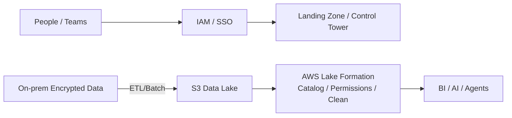
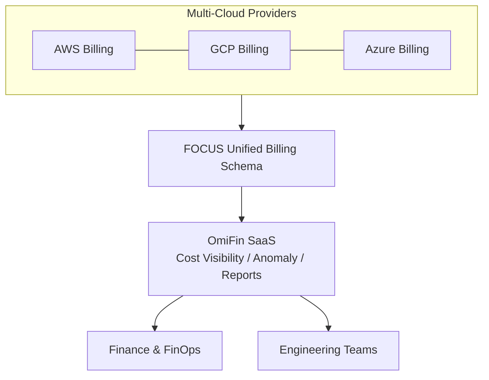

本篇為針對演講錄音的詳細整理。主題為：

> **《AI Agent 時代的企業治理新課題：從創新應用到可控管的營運模式》**
> 主講：**伊雲谷數位科技（eCloudvalley）企業解決方案架構師 Elmer**

核心問題很直接：Agent 一旦增加使用者、工具與長上下文，Token、模型 API 和運算支出都可能快速成長；若缺乏歸屬、上限與追蹤，團隊難以判斷哪些成本真的產生價值。解法不是停止實驗，而是把「花在哪裡、由誰使用、如何安全執行」做成可持續營運的控制面。

本文以演講錄音作為 OmiFin 與現場論述的來源，並在 2026 年 8 月 29 日用 FOCUS、FinOps Foundation、AWS 文件與 MAIAH 公開產品頁交叉查核。找不到公開產品文件的細節會明確標示為講者說法，不視為獨立驗證。

> **花花的一句話**
>
> FinOps 回答技術支出是否產生價值；Agent Governance 則回答誰能讓 Agent 做什麼，以及每一步能否被追蹤與限制。
>
> **花花的工程提醒**
>
> 導入 AI 應用時，應儘早將成本治理 (FinOps) 與代理人治理 (Agent Governance) 納入架構，建立 Guardrails 限制 Token 用量與存取權限，避免創新淪為失控的維運災難。

## 核心摘要（Summary）

兩條治理主線：

1. **雲端財務治理 FinOps** —— 把多雲帳單與用量變成可視、可量化、可優化、可持續運作的體系（eCloudvalley：**OmiFin**）。
2. **AI Agent 治理** —— 對企業內部多個 Agent 做統一管理、審查與控管，避免 Token 浪費與資安外洩（eCloudvalley：**MAIAH Platform**）。

> 不是反對嘗試，而是要在「安全、合規、成本可控」的前提下擴張。

## 1. 講師背景（Speaker Bio）

- Elmer，eCloudvalley 企業解決方案架構師
- 經歷：醫療資訊工程師、臺北市政府教育局設計師、建置中心資訊組長（首次接觸 AWS）
- 證照：AWS 系列、PMP、個資法相關證照

## 2. 治理與合規（Governance & Compliance）

Elmer 以維基與 RIMA（風險資訊安全框架）闡述：

- **治理（Governance）**：把事情「做對」——決策、方向、監督
- **合規（Compliance）**：把「對的事情」做好——遵循、執行

### PPT 雲端治理模型（People / Process / Cloud & Platform）

- **People（人）**：AWS IAM 權限控管；規模化採 **Landing Zone / Control Tower**
- **Process / Cloud & Platform（流程/技術）**：地端資料加密傳輸至 **S3**，用 **AWS Lake Formation** 做數據治理（統一格式、權限、清洗）



## 3. FinOps 與 OmiFin：把成本花在刀口

### 3.1 AWS Well-Architected（WA）六大支柱

- 卓越營運、永續發展、安全性、可靠性、效能效率、成本優化
其中「卓越營運」是上雲第一步；**FinOps 的重點不是一味省錢，而是「有省錢（台語諧音）」＝把錢花在會創造價值的地方。**

### 3.2 FinOps 的三個循環階段

[FinOps Foundation](https://www.finops.org/framework/phases/)將循環分為三個階段，而不是四個：

1. **Inform**：理解用量、成本、分攤與業務價值。
2. **Optimize**：找出架構、用量、費率與授權的改善機會。
3. **Operate**：讓工程、財務與業務共同執行並持續量測結果。

「量化」仍是重要活動，但應貫穿三個階段，不是官方框架中的獨立第四階段。

### 3.3 eCloudvalley OmiFin 平台

依講者簡報，OmiFin 被定位為多雲帳單與成本可視化平台，並主張 SaaS 託管、供應商中立與 FOCUS 資料支援。由於目前沒有找到可公開核對的 OmiFin 產品文件，這些項目應在採購或 PoC 階段要求供應商用實際介面、匯入格式與合約條款證明。

[FOCUS 1.3 規範](https://focus.finops.org/docs/specification/v1-3/sections/introduction/)本身可以獨立確認：它定義供應商中立的帳單資料欄位、指標與詞彙，用來降低跨雲成本資料正規化的負擔。但「支援 FOCUS」不等於每個欄位、版本與驗證器都完整相容，仍要確認 conformance 範圍。



## 4. AI Agent 治理與 MAIAH Platform

### 4.1 企業導入 AI 的四大挑戰

1. 場景挖掘：找對應用場景
2. 模型可用性與部署：地端 vs 雲端、是否二次訓練
3. 人才短缺：缺 AI 整合與運維人才
4. 員工認知：對 AI 工具安全邊界不足

### 4.2 eCloudvalley MAIAH Platform（Multi‑AI Agent Hub）

[AWS Marketplace 的 MAIAH 公開頁面](https://aws.amazon.com/marketplace/pp/prodview-hcf72l523y7a2)可確認集中管理 Agent、工具、MCP server、使用者、RBAC、觀測、用量與成本等定位；[MAIAH Governance 頁面](https://aws.amazon.com/marketplace/pp/prodview-qwdqllmp4izkc)則列出集中監控、風險控制、成本管理與稽核能力。

演講另外描述了 BYOA、輸入輸出 guardrails、Token 額度與上線審查。這些功能與公開定位一致，但 CI/CD 閘門、支援的匯入形式與限制仍應在實際版本中驗證，不宜只從簡報推定。

```mermaid
flowchart LR
  subgraph MAIAH[MAIAH Platform]
    Reg[Agent Registry] --> Mon[Health / Usage / Token]
    Mon --> Guard[Guardrails (PII / Policy)]
    Guard --> Gate[CI/CD Gate\nReview / Approve / Deploy]
    Gate --> Limits[Token Limits / Quotas]
  end
  BYOA[BYOA: Internal Agents / LLM Apps] --> MAIAH
  MAIAH --> Corp[Enterprise Users / Apps]
```

## 5. OmiFin × MAIAH：雙平台對照

| 平台 | 核心解決痛點 | 主要特色功能 |
| --- | --- | --- |
| **OmiFin** | 多雲帳單繁雜、成本難監控 | 不綁代理商、SaaS 免維護、支援 **FOCUS** 統一帳單格式 |
| **MAIAH Platform** | AI Agent 缺管理、Token 失控、資安風險 | **BYOA** 統一監控、內建 **Guardrails**、串接 **CI/CD** 上架控管 |

## 可帶回團隊的檢查清單

1. 你們的雲端費用是否能以 **FOCUS 格式**做跨雲比對與異常檢測？
2. FinOps 是否持續循環「Inform → Optimize → Operate」，並在各階段量化結果，而非只做一次成本盤點？
3. 企業內 Agent 是否有 **登錄、審查、上架、監控、下架** 的全生命周期治理？
4. 是否設有 **Token/上下文** 額度與用途白名單，避免成本失控與外洩風險？
5. 資料治理是否落在 **Lake Formation** 等平台能力，而非各隊自訂？
6. 權限是否由 **IAM / Landing Zone / Control Tower** 統一管理？

## 關鍵結語

FinOps 與 Agent Governance 互補，但不能互相取代。前者需要把技術支出連回業務價值；後者則要限制 Agent 的身分、權限、資料與動作。採用任何平台之前，都應要求可重現的權限測試、成本歸屬、稽核紀錄與停用流程。

## 延伸閱讀與來源範圍

- 先讀 [Enterprise Agentic AI 治理](/blog/39-enterprise-agentic-ai-governance/)建立控制面全貌，再用 [金融業生成式 AI 平台工程](/blog/38-financial-genai-platform-engineering/)對照評測與營運證據。
- 若要把治理要求變成上線決策，可接著看 [Agentic AI 平台契約](/blog/93-agentic-ai-platform-contract/)。
- 方法與規範：[FinOps Framework](https://www.finops.org/framework/)、[FOCUS 1.3](https://focus.finops.org/docs/specification/v1-3/sections/introduction/)、[AWS Well-Architected 六大支柱](https://docs.aws.amazon.com/wellarchitected/latest/framework/the-pillars-of-the-framework.html)。
- 產品公開資料：[MAIAH](https://aws.amazon.com/marketplace/pp/prodview-hcf72l523y7a2)、[MAIAH Governance](https://aws.amazon.com/marketplace/pp/prodview-qwdqllmp4izkc)。OmiFin 功能細節僅來自本次演講紀錄，尚未取得可公開交叉核對的產品文件。
