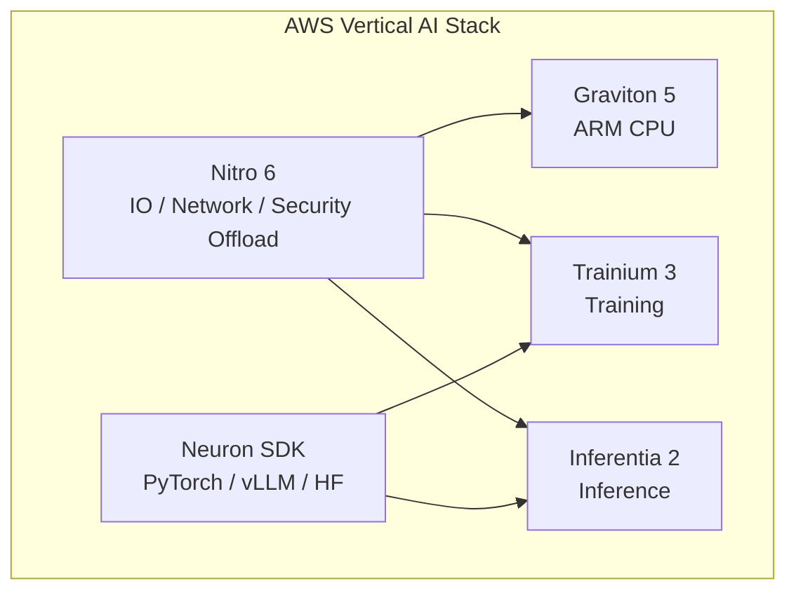
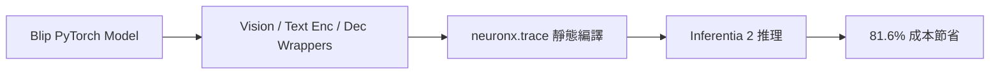

這場由 **AWS 的 Howard** 與 **Tomofun（Furbo）的 Ricky** 聯手帶來的分享，從硬體底層的自研晶片設計，一路貫穿到企業應用的巨額成本優化實戰。

核心命題只有一句：

> **AI 時代的算力瓶頸，往往不是「有沒有 GPU」，而是軟硬體能否協同優化。**

亦可對照本站 [FinOps × Agent 治理](/blog/58-ecloudvalley-omifin-maya-governance/) 與 [HoyaBit Bedrock Agent Core](/blog/56-aws-hoyabit-bedrock-agent-core/)——前者談成本治理平台，本篇則談「換對晶片、寫對程式、架對基礎設施」如何直接砍掉帳單。

---

## 議程快速摘要

| 主軸 | 內容 | 關鍵數字 |
| --- | --- | --- |
| **AWS 策略** | 自研晶片（Trainium 訓練、Inferentia 推理、Graviton CPU、Nitro 虛擬化）+ Neuron SDK 軟體棧 | Llama 2 Token 成本降 55%、吞吐量 4× |
| **Tomofun 實踐** | Furbo AI 訂閱服務將 Blip 移植到 Inf2，並優化 Auto Scaling | **砍掉 81.6%（近 82%）AI 運算成本** |

---

## 議程總覽

| 階段 | 主講 | 核心主題 | 關鍵亮點 |
| --- | --- | --- | --- |
| 上半場 | Howard（AWS） | AWS 自研晶片生態系與未來藍圖 | Annapurna Labs、Nitro 6、Graviton 5、Trainium 2/3、Inf2、Neuron SDK |
| 下半場 | Ricky（Tomofun） | Inferentia 2 降本實戰 | Furbo 寵物保姆、Blip 移植、AMI 冷啟動優化 |

---

## 上半場：AWS AI 自研晶片深度剖析（Howard）

Howard 深入探討 AWS 十多年來深耕自研晶片的歷程，核心研發來自內部 **Annapurna Labs**。AWS 的晶片哲學是：

> **不只看晶片本身，而是從基礎設施、伺服器、虛擬化到晶片進行整體垂直優化。**

### 1. AWS 自研晶片家族進展

| 產品 | 定位 | 重點 |
| --- | --- | --- |
| **Nitro 6** | 虛擬化／網路／安全卸載 | 將底層 IO 卸載至自研晶片，保留 **100%** CPU 資源給用戶 |
| **Graviton 5** | ARM CPU | 2026 年 6 月正式 GA（C9、M9 系列家族） |
| **Trainium 3 (Trn3)** | 訓練晶片 | 預計 2026 下半年推出；台積電 **3 奈米（TSMC N3）** 製程；單機高達 **20TB** HBM 頻寬與容量 |
| **NeuronLink & Neuron Switch（第 3 代）** | 晶片互聯 | 可將上百顆 Trainium 融合成單一超大型虛擬運算機；大模型訓練中被評為「最被低估的技術」 |
| **Inferentia 2 (Inf2)** | 推理晶片（2022 發表） | 極高性價比；ByteDance、Airbnb、Autodesk 等為活躍客戶 |

#### Inferentia 2 實測亮點

- **Llama 2**：Token 成本降低 **55%**，吞吐量提升 **4 倍**
- **Autodesk**：預測成本節省 **25%**

### 2. Neuron SDK 軟體生態

為降低開發者門檻，AWS 提供 **Neuron SDK**（類似 NVIDIA CUDA 生態）：

| 面向 | 內容 |
| --- | --- |
| **框架整合** | 支援 PyTorch Lightning、vLLM、Hugging Face |
| **原生 PyTorch** | 與 PyTorch 深度原生整合進入 Beta，預計 2026 下半年正式釋出 |
| **Neuron Kernel Interface (NKI)** | 類似 Triton/CUDA 的 Kernel 介面，讓效能工程師直接控制底層記憶體存取與算子編譯 |
| **Neuron Explorer** | 與 VS Code 整合的效能分析工具，剖析晶片間同步狀態 |

硬體再強，若軟體棧門檻太高，企業仍會卡在 POC。Neuron SDK 的價值，就是把「自研晶片」變成開發者能接得住的推理平台。

---

## 下半場：Tomofun（Furbo）AI 降本實戰（Ricky）

**Tomofun** 總部位於台灣，旗下 **Furbo** 寵物攝影機在美國智慧寵物相機市佔率超過 **90%**。為解決百萬用戶產生的龐大即時運算費用，團隊進行將 AI 推理移轉至 Inf2 的嘗試。

### 1. AI 運算痛點

**Furbo Dog Nanny（寵物保姆服務）** 是訂閱制服務，利用 AI 影像與聲音偵測狗的行為：

- 吃喝、嘔吐、癲癇、哭嚎、火災警報等  
- 累計拯救超過 **萬隻** 寵物

但成本壓力極大：

| 項目 | 數據 |
| --- | --- |
| 核心模型 | **Blip**（AI Caption 影像描述） |
| 原運行環境 | 傳統 GPU 實例（如 G4dn） |
| 成本佔比 | 佔公司 **20%** AWS 總成本 |
| 月費規模 | 近 **10 萬美元** |

單一模型吃掉兩成雲端帳單，這正是 FinOps 與架構優化必須正面對決的場景。

### 2. 核心技術：Blip 模型移植到 Inf2

Inf2 是專用 ASIC 晶片，不像 GPU 那麼「寬容」——**輸入與輸出形狀（Shape）需要預先固定**。移植步驟如下：

#### ① 模型封裝（Model Wrapping）

將 Blip 三個核心模組分別用 Python 寫成自定義 Wrapper：

- Vision Encoder  
- Text Encoder  
- Text Decoder  

重新定義適合 Inf2 介面的 I/O。

#### ② 編譯與追蹤

使用 `neuronx.trace()` 進行靜態編譯，將 PyTorch 模型轉成 Inf2 可執行的二進位格式。

> 編譯過程需花費約 **2–3 小時**——這是 ASIC 推理的「前期投資」，換取運行期大幅降本。

#### ③ 壓測優化

經反覆測試，在 **8 Workers × 8 Concurrency** 配置下達到最佳效能平衡。

**最終成果：砍掉 81.6%（近 82%）的運算成本。**

### 3. Auto Scaling 基礎建設優化：AMI 燒錄 Docker 鏡像

實際生產環境中，AI 推理流量波動大，需要 Auto Scaling。但 Tomofun 遇到另一個痛點：

| 項目 | 原狀 | 優化後 |
| --- | --- | --- |
| Docker 鏡像大小 | **3.6GB** | 燒錄進自定義 **AMI** |
| 冷啟動（Cold Start） | 拉取鏡像需 **9 分鐘** | 開機無需網路拉取，省下 **2 分鐘** |
| 效能提升 | — | 冷啟動效能提升 **15%** |

**做法**：將 3.6GB Docker 鏡像直接燒錄在自定義 AMI 裡。EC2 開機時不必再透過網路拉取，直接啟動推理服務。

這是「神來一筆」的架構修改：降本不只來自換晶片，也來自 **縮短擴容時的時間稅**——對即時寵物警報這類場景，2 分鐘延遲可能就是產品體驗與 SLA 的差別。

### 4. Tomofun 未來技術規劃

- **持續壓榨晶片**：目前 CPU 使用率約 **80%**、NeuronCore 約 **60%**；若優化至極致，預計還能再省 **10%–15%** 成本  
- **擴展模型範圍**：將更多 **Multimodal（多模態）** 與 **10B 以下 LLM** 部署至 Inf2

---

## 相關資源（簡報投影片後段分享）

- **AWS 技術部落格**：由 Tomofun 林正信（Tibo）、Ray 與 AWS Howard 共同撰寫，含詳細架構與程式碼說明  
- **Tomofun 技術部落格**：更多 AI、後端與前端開發實務  
- **Tomofun 職缺招募**：前端、後端、App、韌體工程師

---

## 可帶回團隊的檢查清單

1. 你們最貴的單一 AI 模型，佔總雲端成本多少？是否有明確 FinOps 指標？  
2. 推理工作負載是否評估過 **Inf2／Graviton** 等 purpose-built 硬體，而不只盯 GPU？  
3. ASIC 推理是否接受 **Shape 固定、編譯前置** 的工程代價？  
4. Auto Scaling 的瓶頸是算力，還是 **鏡像拉取／冷啟動**？  
5. 是否考慮將大型 Docker 鏡像 **預燒進 AMI**，縮短擴容時間？  
6. Neuron SDK 生態（PyTorch 原生、NKI、Explorer）是否已納入技術雷達？

---

## 關鍵結語

> **晶片決定天花板，軟體決定能不能摸到天花板，架構決定擴容時會不會掉下來。**

- **AWS** 用 Nitro、Graviton、Trainium、Inferentia 與 Neuron SDK，把「從晶片到機架」的垂直整合做成可複製的 AI 計算系統  
- **Tomofun** 用 Blip 移植、壓測調參、AMI 燒錄，把 Furbo 的 AI 訂閱服務從「GPU 燒錢」變成「Inf2 可持續營運」

當百萬用戶的即時推理壓在帳單上，**81.6% 的成本節省**不是小數點遊戲，而是產品能否規模化的生死線。軟硬體協同優化，正是 AI 時代企業必須補上的一堂實戰課。
