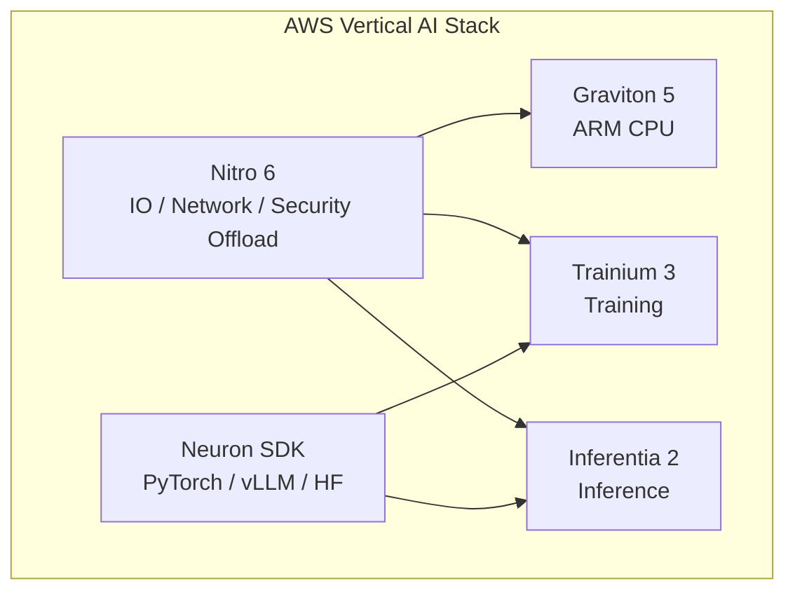
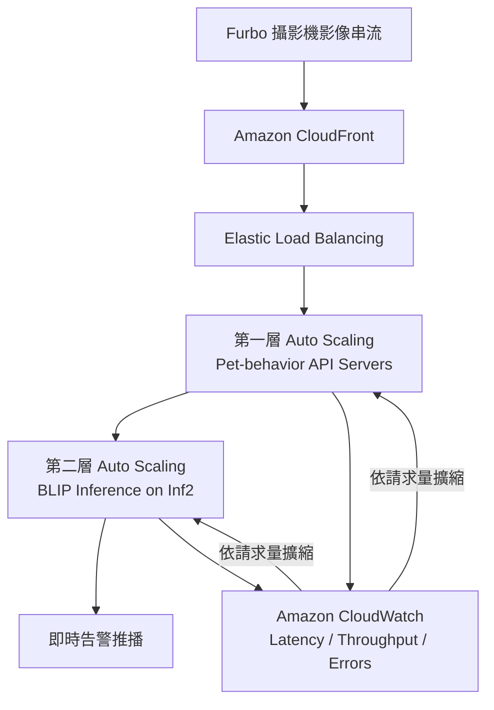
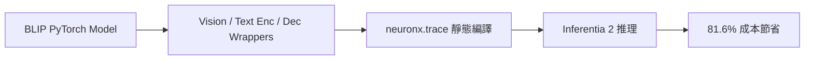

這場由 **AWS 的 Howard** 與 **Tomofun（Furbo）的 Ricky** 聯手帶來的分享，從硬體底層的自研晶片設計，一路貫穿到企業應用的巨額成本優化實戰。

核心命題只有一句：

> **AI 時代的算力瓶頸，往往不是「有沒有 GPU」，而是軟硬體能否協同優化。**

亦可對照本站 [FinOps × Agent 治理](/blog/58-ecloudvalley-omifin-maiah-governance/) 與 [HoyaBit Bedrock AgentCore](/blog/56-aws-hoyabit-bedrock-agentcore/)——前者談成本治理平台，本篇則談「換對晶片、寫對程式、架對基礎設施」如何直接砍掉帳單。

### 原文出處

本場演講整理之外，Tomofun 與 AWS 亦在官方技術部落格發布完整架構與程式碼說明：

- **AWS Machine Learning Blog**：[Cost effective deployment of vision-language models for pet behavior detection on AWS Inferentia2](https://aws.amazon.com/tw/blogs/machine-learning/cost-effective-deployment-of-vision-language-models-for-pet-behavior-detection-on-aws-inferentia2/)
- **共同作者**：Tomofun 林正信（Tibo）、Ray；AWS Howard

以下內容已依該文補充 **兩層 Auto Scaling 架構**、**GPU／Inf2 混合路由**、**Wrapper 程式碼範例** 與 **壓測方法**。

> **花花的一句話**
>
> 喵～狗狗的攝影機 Furbo 變聰明又變省錢了！選對晶片、寫對程式，就像花花找到最舒適的紙箱一樣，直接把運算成本砍掉八成，太厲害啦！
>
> **花花的工程提醒**
>
> AI 推理成本優化不僅是應用層的問題。透過軟硬體協同優化（如將模型移植至 Inferentia 晶片），搭配 AMI 冷啟動優化與自動擴展策略，能顯著降低巨額算力成本。

## 議程快速摘要

| 主軸 | 內容 | 關鍵數字 |
| --- | --- | --- |
| **AWS 策略** | 自研晶片（Trainium 訓練、Inferentia 推理、Graviton CPU、Nitro 虛擬化）+ Neuron SDK 軟體棧 | Llama 2 Token 成本降 55%、吞吐量 4× |
| **Tomofun 實踐** | Furbo AI 訂閱服務將 BLIP 移植到 Inf2，並優化 Auto Scaling | 演講現場 **81.6%**；[AWS 官方技術文](https://aws.amazon.com/tw/blogs/machine-learning/cost-effective-deployment-of-vision-language-models-for-pet-behavior-detection-on-aws-inferentia2/) 記載 **83%** 成本降幅 |

## 議程總覽

| 階段 | 主講 | 核心主題 | 關鍵亮點 |
| --- | --- | --- | --- |
| 上半場 | Howard（AWS） | AWS 自研晶片生態系與未來藍圖 | Annapurna Labs、Nitro 6、Graviton 5、Trainium 2/3、Inf2、Neuron SDK |
| 下半場 | Ricky（Tomofun） | Inferentia 2 降本實戰 | Furbo 寵物保姆、BLIP 移植、AMI 冷啟動優化 |

## 上半場：AWS AI 自研晶片深度剖析（Howard）

Howard 深入探討 AWS 十多年來深耕自研晶片的歷程，核心研發來自內部 **Annapurna Labs**。AWS 的晶片哲學是：

> **不只看晶片本身，而是從基礎設施、伺服器、虛擬化到晶片進行整體垂直優化。**



### 1. AWS 自研晶片家族進展

| 產品 | 定位 | 重點 |
| --- | --- | --- |
| **Nitro 6** | 虛擬化／網路／安全卸載 | 將底層 IO 卸載至自研晶片，保留 **100%** CPU 資源給用戶 |
| **Graviton 5** | ARM CPU | 2026 年 6 月正式 GA（C9、M9 系列家族） |
| **Trainium 3 (Trn3)** | 訓練晶片 | 預計 2026 下半年推出；台積電 **3 奈米（TSMC N3）** 製程；單機高達 **20TB** HBM 頻寬與容量 |
| **NeuronLink & NeuronSwitch（第 3 代）** | 晶片互聯 | 可將上百顆 Trainium 融合成單一超大型虛擬運算機；大模型訓練中被評為「最被低估的技術」 |
| **Inferentia 2 (Inf2)** | 推理晶片（2022 發表） | 極高性價比；ByteDance、Airbnb、Autodesk 等為活躍客戶 |

#### Inferentia 2 實測亮點

- **Llama 2**：Token 成本降低 **55%**，吞吐量提升 **4 倍**
- **Autodesk**：預測成本節省 **25%**

### 2. Neuron SDK 軟體生態

為降低開發者門檻，AWS 提供 **Neuron SDK**（類似 NVIDIA CUDA 生態）：

| 面向 | 內容 |
| --- | --- |
| **框架整合** | 支援 PyTorch Lightning、vLLM、Hugging Face |
| **原生 PyTorch** | 與 PyTorch 深度原生整合進入 Beta，預計 2026 下半年正式釋出 |
| **Neuron Kernel Interface (NKI)** | 類似 Triton/CUDA 的 Kernel 介面，讓效能工程師直接控制底層記憶體存取與算子編譯 |
| **Neuron Explorer** | 與 VS Code 整合的效能分析工具，剖析晶片間同步狀態 |

硬體再強，若軟體棧門檻太高，企業仍會卡在 POC。Neuron SDK 的價值，就是把「自研晶片」變成開發者能接得住的推理平台。

## 下半場：Tomofun（Furbo）AI 降本實戰（Ricky）

**Tomofun** 總部位於台灣，旗下 **Furbo** 寵物攝影機在美國智慧寵物相機市佔率超過 **90%**。為解決百萬用戶產生的龐大即時運算費用，團隊進行將 AI 推理移轉至 Inf2 的嘗試。

### 1. AI 運算痛點

**Furbo Dog Nanny（寵物保姆服務）** 是訂閱制服務，利用 AI 影像與聲音偵測狗的行為：

- 吃喝、嘔吐、癲癇、哭嚎、火災警報等
- 累計拯救超過 **萬隻** 寵物

但成本壓力極大：

| 項目 | 數據 |
| --- | --- |
| 核心模型 | **BLIP**（AI Caption 影像描述） |
| 原運行環境 | 傳統 GPU 實例（如 G4dn） |
| 成本佔比 | 佔公司 **20%** AWS 總成本 |
| 月費規模 | 近 **10 萬美元** |

單一模型吃掉兩成雲端帳單，這正是 FinOps 與架構優化必須正面對決的場景。

AWS 官方文亦指出，Tomofun 面臨的挑戰是雙重的：

1. 在數十萬台裝置規模下，維持 **always-on、即時** 的寵物行為監控成本效率
2. 在不大幅重寫已針對 PyTorch 優化的 **BLIP** 程式碼前提下完成遷移

### 2. 生產架構：兩層 Auto Scaling 與 GPU／Inf2 混合路由

依 [AWS 技術部落格](https://aws.amazon.com/tw/blogs/machine-learning/cost-effective-deployment-of-vision-language-models-for-pet-behavior-detection-on-aws-inferentia2/)，Furbo 的寵物行為偵測服務採 **兩層 Auto Scaling** 設計：



**流程重點：**

1. **Webcam 互動**：攝影機擷取畫面後，經 CloudFront 與 ELB 進入第一層 API Auto Scaling Group
2. **模型推理**：API 層處理請求後，將影像轉送至第二層推理 Auto Scaling Group；容器內載入以 Neuron SDK 編譯的 BLIP 元件
3. **混合後端**：早期僅路由至 GPU 容器；遷移後 API **可在 GPU 與 Inf2 後端之間即時切換**，上游 API 與下游告警邏輯無需改動
4. **指標驅動擴縮**：CloudWatch 監控延遲、吞吐量、錯誤率；因各實例類型吞吐量已透過壓測建立基準，擴縮可直接依 **影像請求量** 驅動

這種設計讓 Tomofun 能在維持高可用性的同時，把成本較低的 Inf2 推理納入正式流量，而不必一次性切斷 GPU 路徑。

### 3. 核心技術：BLIP 模型移植到 Inf2

Inf2 是專用 ASIC 晶片，不像 GPU 那麼「寬容」——**輸入與輸出形狀（Shape）需要預先固定**。依 AWS 官方文，BLIP 由 **Image Encoder、Text Encoder、Text Decoder** 三元件組成；Tomofun 採 **模組化拆分 + 輕量 Wrapper**，不改動預訓練邏輯，僅調整 I/O 介面以符合 Neuron 要求。

#### ① 隔離原始子模組（以 Text Encoder 為例）

先以薄封裝包住原始子模組，讓 `forward` 只回傳主要 tensor，便於 trace 與編譯：

```python
class TextEncoder(torch.nn.Module):
    def __init__(self, model):
        super().__init__()
        self.model = model

    def forward(self, input_ids, attention_mask, encoder_hidden_states, encoder_attention_mask):
        output = self.model(
            input_ids=input_ids,
            attention_mask=attention_mask,
            encoder_hidden_states=encoder_hidden_states,
            encoder_attention_mask=encoder_attention_mask,
            return_dict=False,
        )
        return output[0]
```

#### ② Wrapper 適配 Neuron I/O

`torch_neuronx.trace()` 需要 **tensor tuple** 作為輸入與輸出。Wrapper 扮演適配層，盡量不重寫模型本體：

```python
class TextEncoderWrapper(torch.nn.Module):
    def __init__(self, model):
        super().__init__()
        self.model = TextEncoder(model)

    @classmethod
    def from_model(cls, model):
        wrapper = cls(model)
        wrapper.model = model
        return wrapper

    def forward(self, input_ids, attention_mask, encoder_hidden_states, encoder_attention_mask, return_dict):
        output = self.model(input_ids, attention_mask, encoder_hidden_states, encoder_attention_mask)
        return (output,)
```

**編譯與部署分工：**

- **Compile**：直接用原始子模組 `model.text_encoder.model`
- **Deploy**：用 `TextEncoderWrapper` 載入編譯後的 `.pt` 檔並格式化 I/O

#### ③ 編譯與追蹤（`torch_neuronx.trace`）

AWS 文示範的三步驟流程：

1. 以預期 shape／dtype 準備 pseudo input
2. 呼叫 `torch_neuronx.trace()` 編譯
3. 以 `torch.jit.save()` 儲存 Neuron 優化後的 TorchScript artifact

```python
inputs = (
    torch.ones((1, 8), dtype=torch.int64),
    torch.ones((1, 8), dtype=torch.int64),
    torch.ones((1, 577, 768), dtype=torch.float32),
    torch.ones((1, 577), dtype=torch.int64),
)
encoder = torch_neuronx.trace(
    model.text_encoder.model,
    inputs,
    compiler_args="--auto-cast-type fp16 --logfile log-neuron-cc.txt",
)
torch.jit.save(encoder, os.path.join(directory, "text_encoder.pt"))
```

部署時載入編譯產物：

```python
models.text_encoder = TextEncoderWrapper.from_model(
    torch.jit.load(os.path.join(directory, "text_encoder.pt"))
)
```

> 編譯過程需花費約 **2–3 小時**——這是 ASIC 推理的「前期投資」，換取運行期大幅降本。Vision Encoder、Text Decoder 亦採相同模組化流程獨立編譯，再串接成完整推理管線。

#### ④ 壓測與並發調校

Tomofun 模擬真實 Furbo 工作負載，對每段影像串流發送如「狗是否在吠叫？」「是否在玩耍？」「是否在啃家具？」等查詢。AWS 文指出：

- **Inf2.xlarge**（1 顆 Inferentia2、32GB 記憶體）可支撐所需吞吐量並維持低延遲
- 比較基準為遷移前的 **GPU On-Demand** 部署成本
- 演講現場最佳平衡為 **8 Workers × 8 Concurrency**；當 server thread 不足時，增加 client concurrency 會讓延遲快速上升，需透過壓測找出 **延遲—成本** 甜蜜點

**最終成果：** 演講現場 **81.6%**；[AWS 官方技術文](https://aws.amazon.com/tw/blogs/machine-learning/cost-effective-deployment-of-vision-language-models-for-pet-behavior-detection-on-aws-inferentia2/) 記載相較 GPU On-Demand 降幅 **83%**，且未犧牲效能。



### 4. Auto Scaling 基礎建設優化：AMI 燒錄 Docker 鏡像

實際生產環境中，AI 推理流量波動大，需要 Auto Scaling。但 Tomofun 遇到另一個痛點：

| 項目 | 原狀 | 優化後 |
| --- | --- | --- |
| Docker 鏡像大小 | **3.6GB** | 燒錄進自定義 **AMI** |
| 冷啟動（Cold Start） | 拉取鏡像需 **9 分鐘** | 開機無需網路拉取，省下 **2 分鐘** |
| 效能提升 | — | 冷啟動效能提升 **15%** |

**做法**：將 3.6GB Docker 鏡像直接燒錄在自定義 AMI 裡。EC2 開機時不必再透過網路拉取，直接啟動推理服務。

這是「神來一筆」的架構修改：降本不只來自換晶片，也來自 **縮短擴容時的時間稅**——對即時寵物警報這類場景，2 分鐘延遲可能就是產品體驗與 SLA 的差別。

### 5. Tomofun 後續方向（依演講分享）

依演講分享的後續方向，並對照 [AWS 官方文](https://aws.amazon.com/tw/blogs/machine-learning/cost-effective-deployment-of-vision-language-models-for-pet-behavior-detection-on-aws-inferentia2/)：

- **持續壓榨晶片**：目前 CPU 使用率約 **80%**、NeuronCore 約 **60%**；若優化至極致，預計還能再省 **10%–15%** 成本
- **擴展模型範圍**：將更多 **Multimodal（多模態）** 與 **10B 以下 LLM** 部署至 Inf2
- **音訊事件偵測**：如吠叫辨識等音訊工作負載遷移至 Inf2
- **AWS Deep Learning Containers（DLC）**：納入路線圖，以預建容器簡化依賴管理與推理工作流

## 相關資源

| 資源 | 說明 |
| --- | --- |
| [AWS ML Blog：Pet behavior detection on Inferentia2](https://aws.amazon.com/tw/blogs/machine-learning/cost-effective-deployment-of-vision-language-models-for-pet-behavior-detection-on-aws-inferentia2/) | 完整兩層架構、BLIP Wrapper／編譯程式碼、壓測與 83% 降本數據 |
| [AWS Neuron 文件](https://awsdocs-neuron.readthedocs-hosted.com/) | Inferentia2 開發、編譯與部署參考 |
| [BLIP 論文（arXiv:2201.12086）](https://arxiv.org/pdf/2201.12086) | Bootstrapping Language-Image Pre-training 原始架構 |
| [Furbo 官網](https://furbo.com/) | 產品與 AI 功能介紹 |
| Tomofun 技術部落格 | 更多 AI、後端與前端開發實務 |
| Tomofun 職缺招募 | 前端、後端、App、韌體工程師 |

## 可帶回團隊的檢查清單

1. 你們最貴的單一 AI 模型，佔總雲端成本多少？是否有明確 FinOps 指標？
2. 推理工作負載是否評估過 **Inf2／Graviton** 等 purpose-built 硬體，而不只盯 GPU？
3. ASIC 推理是否接受 **Shape 固定、編譯前置** 的工程代價？
4. Auto Scaling 的瓶頸是算力，還是 **鏡像拉取／冷啟動**？
5. 是否考慮將大型 Docker 鏡像 **預燒進 AMI**，縮短擴容時間？
6. Neuron SDK 生態（PyTorch 原生、NKI、Explorer）是否已納入技術雷達？

## 關鍵結語

> **晶片決定天花板，軟體決定能不能摸到天花板，架構決定擴容時會不會掉下來。**

- **AWS** 用 Nitro、Graviton、Trainium、Inferentia 與 Neuron SDK，把「從晶片到機架」的垂直整合做成可複製的 AI 計算系統
- **Tomofun** 用 BLIP 移植、壓測調參、AMI 燒錄，把 Furbo 的 AI 訂閱服務從「GPU 燒錢」變成「Inf2 可持續營運」

當百萬用戶的即時推理壓在帳單上，**八成以上的成本節省**不是小數點遊戲，而是產品能否規模化的生死線。若你想看完整架構圖與可複製的 Wrapper／編譯程式碼，建議直接閱讀 [AWS 官方技術文](https://aws.amazon.com/tw/blogs/machine-learning/cost-effective-deployment-of-vision-language-models-for-pet-behavior-detection-on-aws-inferentia2/)。軟硬體協同優化，正是 AI 時代企業必須補上的一堂實戰課。
