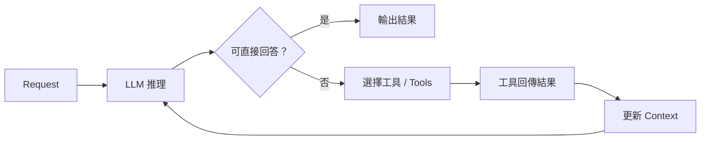
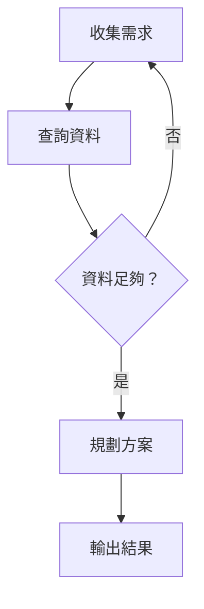
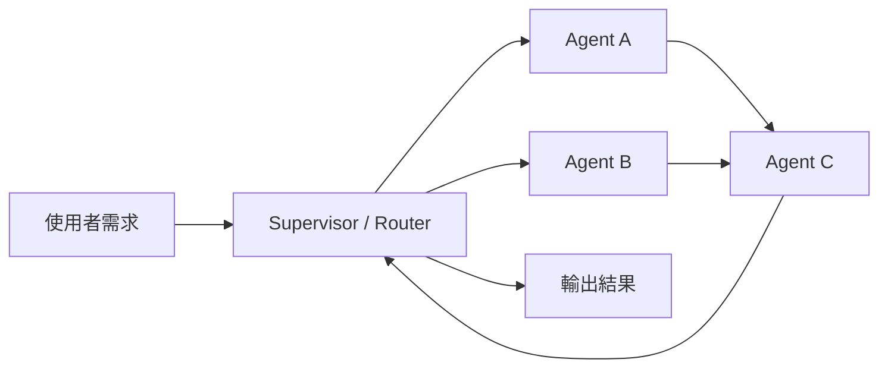
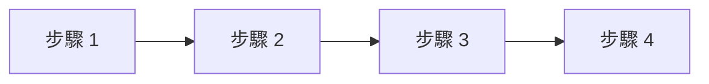
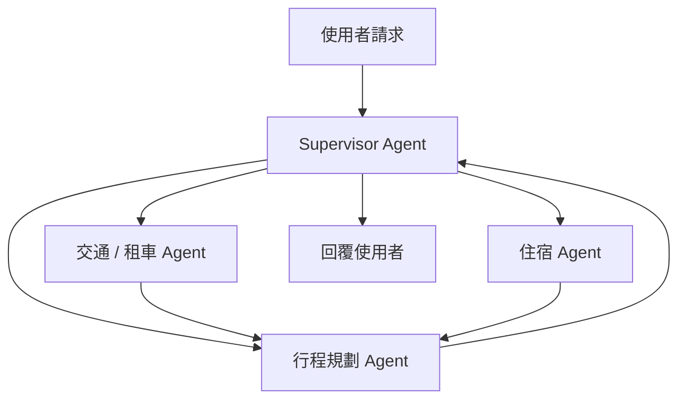

這場分享分成兩條很清楚的主線：

1. **技術架構篇**：由 AWS 雲端支援工程師拆解 **Multi-Agent** 系統的核心設計模式  
2. **商業應用篇**：由 **Super 8（雲發互動科技）創辦人暨執行長 Brian Chen** 分享企業導入 AI Agent 的實際痛點，並首度發表基於 **AWS Agent Co** 打造的產品 **Ora（Agentic AI OS）**

如果說前半段在回答「**多代理人系統到底該怎麼設計**」，那後半段回答的就是「**怎麼把這些能力真的交到企業內部非技術人員手上**」。

> **花花的判斷**
>
> 讓非技術人員建立 AI 員工，會把治理前移：角色描述、資料範圍、可用工具、核准流程與監控必須在建立時就成為產品的一部分。

這不只是另一場談 Agent 的架構課，而是試圖把企業常見的兩個斷點接起來：

- 架構上：如何讓多個 Agent 不打架、不亂花 token、不陷入死循環  
- 產品上：如何讓不懂 Harness、Cloud Code、Codex 的業務使用者，也能真的建立與部署可用的 AI 員工

亦可與本站 [AWS × HoyaBit Bedrock Agent Core](/blog/56-aws-hoyabit-bedrock-agent-core/)、[EKS 多租戶 AI Agent 沙箱](/blog/54-eks-multitenant-ai-agent-sandbox-bitocloud/)、[FinOps × AI Agent Governance](/blog/58-ecloudvalley-omifin-maya-governance/) 一起對照閱讀。

---

> **花花的工程提醒**：設計 Multi-Agent 系統時需選擇合適的協調模式（如 Graph、Swarm 或 Workflow），並將治理前移，在建立 AI 角色時即定義好資料邊界與可用工具，以降低維護風險。

## 議程摘要（Executive Summary）

本場議程可濃縮成一句話：

> **企業級 Multi-Agent 的價值，不只在模型變聰明，而在於它是否有可定義的協調模式、可治理的執行環境，以及讓業務人員可直接使用的產品介面。**

上半場，AWS 從 **Single Agent 的基本決策循環** 出發，逐步展開為 **Graph、Swarm、Workflow** 三種協調模式，並延伸到 **Session 狀態、資安、A2A 協定、記憶共享與工具治理** 等核心問題。

下半場，Super 8 則把這些平台能力落成一個更偏產品的答案：**Ora**。它的目標不是讓每家公司都去學寫 agent framework，而是讓業務人員像寫「徵才 JD」一樣，用自然語言在兩分鐘內招募、訓練、部署自己的 AI 員工，並送上 **Slack、Microsoft Teams、LINE、Messenger** 等通訊管道。

---

## 議程總覽

| 段落 | 主題 | 關鍵問題 | 帶走什麼 |
| --- | --- | --- | --- |
| 1 | 單一 Agent 與 Multi-Agent 基礎 | 為什麼單一 Agent 不夠？ | 任務分派、角色邊界、溝通機制 |
| 2 | 三大協調模式 | 怎麼避免 token 浪費與死循環？ | Graph／Swarm／Workflow 適用場景 |
| 3 | AWS Agent Co 平台組件 | 如何把 Session、安全與 Tool 管理平台化？ | Runtime、Harness、Gateway、Policy、Memory |
| 4 | Super 8 Ora 實戰 | 如何降低企業 AI 導入門檻？ | JD 招募模式、Builder/Evaluator、Multi-channel Deployment |

---

## 一、Single Agent 的基本決策循環

在正式談 Multi-Agent 前，講者先回到最基本的 **Single Agent loop**。

這個循環的本質是：

1. 請求進來  
2. LLM 先嘗試理解與推理  
3. 若無法直接回答，就呼叫工具  
4. 工具輸出結果後回填 Context  
5. 再次交給 LLM 推理，直到得出結論

這套模式在任務單純時很好用；但一旦進入複雜業務場景，問題就來了。

---

## 二、為什麼需要 Multi-Agent？

### 單一 Agent 的限制

當業務複雜度上升，單一 LLM 常會同時碰到三個瓶頸：

1. **任務過於多工**：一個模型要兼顧規劃、搜尋、執行、審查、輸出  
2. **上下文過大**：所有角色與資料都往同一個 context 塞，成本與錯誤率一起上升  
3. **邊界模糊**：很難界定哪個決策該由哪個模組負責

因此 Multi-Agent 的核心價值，不只是「多放幾個模型」，而是透過 **專職分工** 創造更高的商業價值。

### Multi-Agent 設計時必須回答的三個問題

| 問題 | 真正含義 |
| --- | --- |
| **任務分派（Routing）** | 這個需求該交給誰處理？ |
| **角色定義（Role Boundaries）** | 每個 Agent 的職責到哪裡為止？ |
| **溝通機制（Communication）** | Agent 與 Agent 之間怎麼傳遞訊息與結果？ |

多代理人系統真正難的，從來不是「能不能叫很多模型一起做事」，而是能不能 **把誰該做什麼、做完怎麼交接、何時該停下來** 寫成可靠的系統規則。

---

## 三、三大協調模式（Orchestration Patterns）

為了引導 LLM 推理，避免 token 浪費或陷入無限死循環，系統必須定義協調路徑。這場演講把 Multi-Agent 常見編排模式收斂成三種：

### 1. Graph（圖形模式）

Graph 模式適合 **拓撲圖（Topology）** 結構，特別是那些需要依條件回跳、重新運算、重試或分支判斷的流程。

#### 適用場景

- 需要多輪判斷與重試的業務流程  
- 某個節點失敗後，要回到前面補資料  
- 規則不是完全線性，而是有條件分支

#### 優點

- 決策路徑可明確建模  
- 適合可視化與觀測  
- 比完全自由的 agent hand-off 更容易治理

#### 代價

- 流程設計成本較高  
- 若分支非常多，拓樸會快速變複雜

---

### 2. Swarm（群體模式）

Swarm 模式不預設固定拓撲，**由 LLM 動態決定交棒對象**。這種模式較接近「團隊合作」，而不是預先畫好的 BPMN 流程。

#### 適用場景

- 任務型態差異大，無法事先定義固定路徑  
- 希望保留較高彈性，讓 LLM 動態決定協作順序  
- 子代理人之間可能互相詢問與交接

#### 核心風險

因為 hand-off 是動態的，**最怕陷入無限轉手**。  
因此必須設置：

- **Hand-off 限制**
- **最大步數**
- **角色白名單**
- **終止條件**

否則系統會進入「你問我、我問他、他再問回你」的昂貴死循環。

---

### 3. Workflow（工作流模式）

Workflow 最適合 **行為單一且線性的場景**，例如：

> 搜尋商品 → 加入購物車 → 結帳 → 付款

#### 適用場景

- 任務流程明確  
- 步驟間依賴關係固定  
- 合規或稽核要求強，不能讓 LLM 自由跳動

#### 優點

- 最容易治理與除錯  
- 成本較可預期  
- 非常適合與 rule-based 系統混搭

#### 缺點

- 彈性最差  
- 不適合高不確定性的開放型任務

---

## 四、Agent 與 Agent 如何溝通？

Multi-Agent 系統除了編排本身，另一個核心就是 **通訊模式**。

### 1. 共享第三方媒介

最常見做法是透過：

- 外部資料庫  
- 物件儲存  
- 佇列  
- 文件系統

讓 Agent 在共享媒介上交換資料。

#### 優點

- 解耦  
- 可追蹤  
- 好做審計與重播

#### 缺點

- 延遲較高  
- 系統設計較像非同步整合，而非對話式協作

### 2. 直接溝通：A2A（Agent-to-Agent）Protocol

更直接的作法是使用 **A2A 協定**。  
Agent 可讀取對方在：

> `.well-known/agent.json`

下公開的 schema，動態得知：

- 對方提供哪些工具  
- 如何呼叫  
- 需要什麼輸入格式  
- 會回傳什麼輸出格式

這讓 Agent 之間的互動更像「服務發現 + 工具發現」，而不是硬編碼串接。

---

## 五、旅行社案例：Supervisor + Sub-Agents

演講中用旅行社作為 Multi-Agent 實戰例子，非常直觀。

### 角色分工

- **Supervisor Agent**：旅行社主代理人，負責接收客戶請求與整體調度  
- **Sub-Agents**：  
  - 交通接駁／租車  
  - 住宿安排  
  - 行程規劃

子代理人之間也可以直接溝通，最後再由主代理人彙整答案回給使用者。

這個案例非常適合用來理解：

- **Supervisor** 適合做路由與結果彙整  
- **Sub-Agent** 適合承接專職能力  
- 有些資料（例如住宿偏好）不只對住宿 Agent 有用，也可共享給租車或行程 Agent

---

## 六、如何利用 AWS 環境建構 Multi-Agent 系統

上半場的第二個重點，是 AWS 如何用 **Amazon Bedrock + Agent Co** 把底層託管做成平台能力。

### AWS Agent Co 核心組件

| 元件 | 功能 | 解決什麼問題 |
| --- | --- | --- |
| **Runtime System** | 類似 Lambda，但最長可執行約 8 小時，並能依 Session ID 維持上下文 | 長任務、Session 狀態維護 |
| **Harness** | 以低程式碼／設定方式快速配置記憶、工具與安全 | 降低底層工程門檻 |
| **Model Integration** | 原生整合 Bedrock 基礎模型、Fine-tuned 模型與 SageMaker 自訓模型 | 模型接入一致化 |
| **Identity** | 基於 Amazon Cognito 進行身分與 token 交換 | 安全憑證與身份驗證 |
| **Gateway** | 整合 Lambda、外部 API，甚至把其他 Agent 視為 Tool | 工具治理與整合 |
| **Registry** | 管理工具與 Agent 資產，避免團隊重複開發 | 組織級資產治理 |
| **Policy** | 控管權限、限制工具使用、防範 Prompt Injection | 安全與授權 |
| **Memory** | 共享偏好與跨 Agent 記憶 | 多代理人共享上下文 |
| **Observability & Evaluation** | 監控執行時間、成功率、輸出品質 | 可觀測性與品質治理 |

### Runtime System：不是短命函式，而是可維持 Session 的執行層

對 Multi-Agent 系統來說，最常見痛點之一就是 **Session 管理**。

如果不用託管環境，團隊往往得自己處理：

- 會話狀態儲存  
- 歷史對話掛載  
- 多代理人上下文同步  
- 隔離與權限邊界

而 Runtime System 這類能力，讓開發者不必每次都重新實作：

- Session ID 對應上下文  
- 長時間任務執行  
- 執行狀態持續存在

這一點與傳統純 Lambda 型架構最大的差異，就是它比較像 **為 Agent 設計的長生命週期 Runtime**。

### Gateway：把 Tool 與 Agent 都當成可治理資產

Gateway 的一個重要概念是：

> **其他 Agent 也可以被視為 Tool。**

這讓系統可以：

- 將某些專職 Agent 暴露成可呼叫能力  
- 透過 Gateway 做授權、觀測與封裝  
- 不必每次都在 prompt 裡描述一堆工具細節

這種設計讓 Multi-Agent 不只是「大家互相聊天」，而是更接近 **可治理的企業服務編排**。

---

## 七、傳統自建架構 vs AWS Agent Co 託管架構

演講中很明確對比了兩種開發方式。

### 不使用 Agent Co

若完全自行搭建，通常會需要：

- ECS / Lambda 微服務  
- DynamoDB 或其他儲存做 Session 管理  
- 自寫 token 與記憶邏輯  
- 自處理安全隔離  
- 自建 observability 與 evaluation

這樣當然能做，但一旦處理不當，就很容易發生：

- Session 混亂  
- Tool 權限外洩  
- Prompt Injection 風險擴大  
- 不同團隊重複造輪子

### 使用 Agent Co

則是把：

- 狀態維護  
- 安全隔離  
- 身分驗證  
- 工具治理  
- 觀測與評估

交給平台層，讓開發者主要專注於 **商業邏輯**。

這種差異，本質上就是：

> **你是想經營 Agent 產品，還是想先經營一整套 Agent 基礎設施？**

---

## 八、Super 8 的商業實踐：Ora（Agentic AI OS）

如果說前半場的問題是「怎麼做出一個好的 Multi-Agent 系統」，後半場 Super 8 回答的是：

> **怎麼讓企業裡不懂程式的人，也能真的用起來。**

### 企業落地 AI Agent 的真實痛點

Brian Chen 指出，多數企業並不是不想導入 AI，而是卡在這幾個現實問題：

1. **資安與隱私疑慮**  
2. **高程式開發門檻**  
3. **非技術人員無法理解 Agent 開發概念**  
4. **即使有需求，也很難把構想快速落地成可運行產品**

對工程師來說，Harness、Cloud Code、Codex 這些概念或許熟悉；但對業務人員來說，這些詞彙本身就是門檻。

---

## 九、Ora：把建構 Agent 變成「招募新員工」

Super 8 推出的 **Ora**，定位非常鮮明：

> **Agentic AI OS**

它要做的事情，不是讓使用者學會 agent framework，而是讓建構 AI Agent 像 **招募員工** 一樣自然。

### 1. JD 招募模式：自然語言就是配置介面

使用者不需要寫 YAML、程式碼或 prompt workflow。  
只要用自然語言描述：

> 「我需要一個會做什麼工作的 AI 員工」

Ora 就會透過問答方式補齊資訊，並在約 **兩分鐘內** 建構完成。

這是一個很重要的產品設計轉向：

- 對技術人員來說，是把 agent spec 抽象成自然語言  
- 對業務人員來說，是把軟體配置轉譯成「職務說明書（JD）」

### 2. 技能訓練：像幫新員工上工一樣補能力

建立完成後，使用者可再透過：

- 拖拉  
- 上傳資料  
- 配置工具

為 AI 員工補上技能。

也就是說，Ora 把 agent lifecycle 從：

> 設計 → 開發 → 整合 → 部署

轉成更像：

> 招募 → 訓練 → 配裝 → 上線

這讓非技術人員更容易理解，也更容易在組織內擴散。

---

## 十、Ora 背後的技術核心

Brian 並沒有把 Ora 包裝成「純 UI 魔法」，而是明確指出其背後仍是多代理人與平台能力的組合。

### Builder Agent

根據使用者給出的 **Job Description（JD）**：

- 自動規劃所需能力  
- 生成對應的 Agent 結構  
- 決定需要的工具與行為模式

### Evaluator Agent

在 Builder 生成後，Evaluator 會檢查：

- 這個 Agent 是否符合預期  
- 是否缺少必要技能  
- 是否需要補充工具或限制

這等於讓 Ora 內部自己也採用了某種 **Multi-Agent Builder / Evaluator 模式**。

### Multi-Tenant Resource Management

若要進企業，單一 Agent 做得再漂亮都不夠；還必須回答：

- 租戶之間如何隔離？  
- 不同部門如何分開？  
- 權限如何控管？  
- 資料如何保護？

Ora 強調其底層執行階段完全跑在 **AWS Agent Co** 上，承接企業級的安全與隔離需求。

### Multi-Channel Deployment

另一個很關鍵的產品面，是部署出口。

訓練完成後，AI 員工可一鍵部署到：

- **Slack**
- **Microsoft Teams**
- **LINE**
- **Messenger**

這表示 Ora 不只是在做 agent builder，更是在做 **企業內部 AI 勞動力的交付層**。

---

## 十一、這場分享真正想傳達什麼？

我認為這場議程最值得帶走的，不只是 AWS 與 Super 8 分別講了什麼，而是兩者拼起來後，對企業 AI 落地形成了一條完整路徑：

### 第一層：Multi-Agent 不是多放幾個模型，而是要有協調秩序

- Graph：適合需要回跳與分支判斷的拓樸流程  
- Swarm：適合高彈性、動態 hand-off 的開放任務  
- Workflow：適合線性、可治理、可稽核的業務流程

### 第二層：Agent 要上正式環境，平台能力比 prompt 技巧更重要

要能落地，就必須回答：

- Session 如何維護？  
- Tool 如何託管？  
- Identity 如何交換？  
- Memory 如何共享？  
- Policy 如何限制？  
- 評估與觀測如何做？

### 第三層：真正的產品化關鍵，是把技術語言翻譯成人話

Ora 最聰明的地方，不只是底層用 AWS Agent Co，而是它把：

- Agent spec  
- tool config  
- runtime deployment

全部翻譯成業務人員聽得懂的：

- JD  
- 技能訓練  
- AI 員工部署

這一層翻譯，才是企業 AI 真正能擴散的關鍵。

---

## 可帶回團隊的檢查清單

1. 你們現在的需求，真的需要 Multi-Agent，還是單一 Agent + workflow 就夠？  
2. 若要做 Multi-Agent，角色邊界是否明確？誰負責路由、誰負責執行、誰負責彙整？  
3. 你們選的是 Graph、Swarm，還是 Workflow？為什麼？  
4. Agent 之間的溝通，是經共享媒介，還是採 A2A 協定直接發現與對接？  
5. Session、Memory、Tool、Policy、Identity 是否已平台化，而不是專案各自重做？  
6. 若最終使用者是業務部門，你們有沒有把 agent 建構流程翻譯成他們能理解的介面？  
7. 多租戶、通訊平台部署與審查流程，是否已納入產品化設計？

---

## 關鍵結語

這場 AWS × Super 8 的分享，其實把企業 Agent 落地拆成了兩個必須同時成立的條件：

> **一邊是系統設計要能協調多個 Agent；另一邊是產品設計要能讓人真的用得起來。**

對 AWS 來說，答案是：

- 用 **Graph / Swarm / Workflow** 把多代理人協調模式說清楚  
- 用 **Agent Co** 把 Runtime、Memory、Gateway、Identity、Policy 與 Observability 做成託管能力

對 Super 8 來說，答案則是：

- 把 Agent 變成可被「招募」與「訓練」的 AI 員工  
- 把技術門檻藏在平台底下  
- 把部署出口放進企業真正在用的聊天與協作工具裡

Multi-Agent 的下一步，可能不在於誰做出更複雜的拓樸圖，而在於誰先把這些能力做成 **可治理、可部署、可理解、可擴散** 的企業產品。
