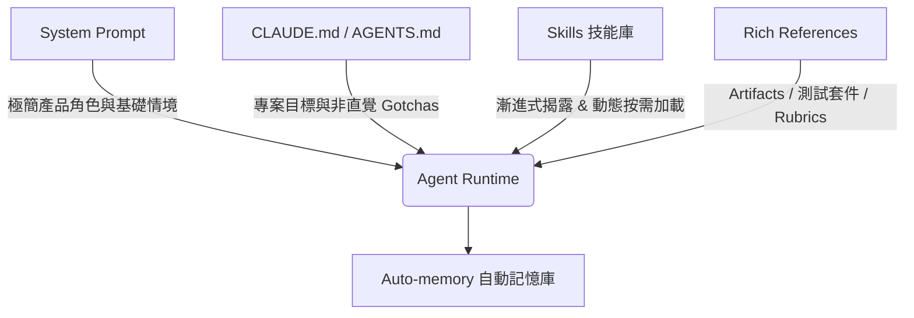

在開發 AI Agent 或使用 AI 程式碼輔助工具時，開發者通常非常關注輸入給 AI 的 Prompt。然而，當我們發送訊息給 Claude 時，使用者輸入的 Prompt 其實只佔整體 Context（上下文）的一小部分。系統提示詞（System Prompt）、技能（Skills）、`CLAUDE.md` 專案指引與歷史記憶，構成了絕大部分的模型上下文。這套構建上下文的學問被稱為 **[Context Engineering（上下文工程）](https://www.anthropic.com/engineering/effective-context-engineering-for-ai-agents)**，它對 AI Agent 的最終產出品質與執行效率起著決定性作用。

與針對單一任務的 Prompt 不同，Context 通常是跨多個請求通用載入的，因此難以做到極度具體。隨著 AI 模型本體能力的快速演進，Context Engineering 的設計法則也迎來了重大變革。Anthropic 技術團隊的 Thariq Shihipar 最近披露：在面對 Claude Opus 5 與 Claude Fable 5 等新一代模型時，Anthropic **刪除了 Claude Code 超過 80% 的 System Prompt**，而在內部程式碼基準測試（Coding Evaluations）中沒有產生任何可測量的品質損失。

本文將深度解析 Anthropic 在開發 Claude Code 過程中所總結的最新 Context Engineering 工程經驗，幫助架構師與開發者為新一代大模型打造更精簡、高能且不綁手綁腳的 AI Agent 系統。

> **花花的判斷**
>
> 漸進式揭露（Progressive Disclosure）是 AI Agent 邁向長任務處理的核心關鍵。Context Engineering 已從「將規則填滿 System Prompt」進化為建構一套結合動態工具加載、語意參考（Artifacts / Rubrics）與自動記憶（Auto-memory）的動態 Harness 體系。

## 為什麼舊法則失效？解除 Claude 的約束枷鎖（Unhobbling Claude）

在早期模型能力較弱時，開發團隊為了防止模型做出毀滅性行為（例如無故刪除檔案或撰寫過於冗長的註解），通常會在 System Prompt 或 `CLAUDE.md` 中塞入大量強硬的約束規則。例如舊版 Claude Code 的 System Prompt 中曾包含以下硬性規定：

> *「在寫程式時：預設不寫任何註解。絕不撰寫多段落的 Docstring 或多行註解區塊——最多一行短註解。除非使用者明確要求，否則不要建立規劃、決策或分析文件——請直接在對話內容中工作，不要產生中間檔案。」*

這種極端防禦性的提示詞雖然避免了早期模型的極端壞狀況，但在實際工程場景中卻帶來了嚴重的後副作用。當 Anthropic 團隊檢視內部工程師使用 Claude Code 的對話紀錄（Transcripts）時，發現情境中經常充斥著互相衝突的指令。例如，System Prompt 寫著「禁止新增註解」，但使用者的請求卻是「請補充適當的文檔說明」，或者某個載入的 Skill 要求「符合團隊文檔規範」。

當這些衝突的指令同時堆疊在上下文時，Claude 必須花費額外的思考 Token（Reasoning Tokens）去權衡這些互相矛盾的提示，才能決定最終行動。

隨著 Claude 5 世代模型的自主判斷與情境理解能力提升，Anthropic 發現這些硬性防衛機制不再是必須。相反地，只要解除這些過度約束（Unhobbling），模型就能根據周遭程式碼的風格、命名習慣與註解密度，自主做出符合情境的最佳決策。在新版 System Prompt 中，這段繁複的禁令被簡化為一句優雅的指引：

> *「撰寫與周遭程式碼風格一致的程式：符合其註解密度、命名規範與慣用語法。」*

## Context Engineering 的六大新舊法則對比（Then and Now）

Anthropic 團隊將上下文工程的演進歸納為六個關鍵轉變：

| 範疇 | 舊時代法則 (Then) | Claude 5 世代新法則 (Now) |
| :--- | :--- | :--- |
| **行為約束** | 給予僵化硬性規則 (Give rules) | 信賴模型自主判斷 (Let Claude use judgement) |
| **工具使用** | 在 Prompt 中提供大量呼叫範例 (Give examples) | 優化工具介面與參數型別設計 (Design interfaces) |
| **上下文加載** | 預先將所有指引一次填滿 (Put it all upfront) | 採用漸進式揭露與按需加載 (Use progressive disclosure) |
| **指令強調** | 在多處重複強調同個指令 (Repeat yourself) | 保持簡潔並收斂至 Tool Description (Simple tool descriptions) |
| **專案記憶** | 手動維護 `CLAUDE.md` 記憶庫 (Memory in CLAUDE.md) | 啟用自主記憶機制 (Auto-memory) |
| **需求規格** | 使用簡單 Markdown 規劃文字 (Simple specs) | 提供動態 Artifacts、代碼與 Rubrics 參考 (Rich references) |

### 1. 給予僵化規則 → 信賴模型判斷
過往為了避開最壞狀況而設下的強硬指示（例如限縮註解行數、禁止產生檔案），會限制模型在複雜情境下的靈活性。新一代模型具備極佳的內容辨識與風格遷移能力，給予高層次的方向引導比細微的防衛性規則更能發揮模型潛能。

### 2. 提供大量範例 → 優化介面設計
以往訓練 Agent 使用 Tool 的黃金法則是在提示詞中寫入大量的 JSON / XML 呼叫範例。但在 Claude 5 世代，過多的範例反而會把模型的思考鎖死在示範的狹窄空間中。現在的最佳實踐是專注於 **Tool 介面本身的設計**。例如在待辦事項工具（Todo Tool）中，直接將 `status` 欄位定義為 `pending`、`in_progress` 與 `completed` 的列舉型別（Enum），模型就能憑藉型別語意自動掌握正確的狀態轉化邏輯。

### 3. 前端一次性載入 → 漸進式揭露 (Progressive Disclosure)
早期 Claude Code 會把程式碼審查（Code Review）與測試驗證的詳細步驟直接塞入 System Prompt，導致對話開頭就佔用大量 Context。現代 Agent 應採用 **漸進式揭露** 架構：
- **Deferred Loading（延遲加載工具）**：藉由 `ToolSearch` 機制，Agent 可以在需要時才動態搜尋並載入進階工具定義。
- **動態技能樹**：將複雜的規範與檢驗流程拆分為獨立的 Skill 檔案，由 Agent 根據對話進度按需讀取。

> **官方評測數據**：在內部 Coding Agent 測試中，刪除 System Prompt 中 80% 的長篇說明與 Few-shot 範例後，**任務成功率提升了 14%，上下文 Token 消耗降低 62%**。

## 1. 為什麼要對 Prompt 進行「減重 (Pruning)」？

### 4. 重複強調指令 → 簡潔的工具說明
舊型模型容易遺忘開頭的指示，促使開發者在 System Prompt 與 Tool Description 中重複撰寫相同的規則。新模型具備極強的情境保持能力，重複指令只會造成 Token 浪費。開發者應將工具相關的指示統一收斂至 Tool Description，並刪除 System Prompt 中的重複說明。

### 5. 手動記憶 → 自動記憶系統 (Auto-memory)
以往過度依賴開發者手動觸發指令（如 `#` 熱鍵）將經驗寫入 `CLAUDE.md`。現在 Claude Code 已具備 **Auto-memory** 功能，能在跨 Session 互動中自動識別、提取並保存與專案及開發者偏好相關的持久記憶。

### 6. 簡單規格文字 → 豐富動態參考 (Rich References)
除了文字 Markdown 之外，Claude 5 世代能處理更複雜的參考資源（References）：
- **HTML Artifacts**：比起純文字描述或截圖，直接提供 HTML 介面原型能讓模型產出精確度極高前端代碼。
- **測試套件與參照 Codebase**：直接提供完整的測試案例或特定語言的範例實作，讓模型進行高品質的 Porting。
- **動態驗證規準（Rubrics）**：定義 API 設計良莠的評估指標（Rubrics），並結合動態工作流生成專門的 Verifier Agent 進行品質把關。

> **花花的工程提醒**
>
> 當模型能力提升後，過多的微觀限制（Micro-rules）反而會引發多餘的推理開銷。工程團隊應使用 `claude doctor`（`/doctor` 命令）動態健檢 `.claude` 與 `CLAUDE.md`，將特定流程移入按需加載的 Skills 中。

## 如何重新組裝你的 Context 階層體系

當我們套用 Anthropic 的最新實踐來整理專案的 Context 時，整體層次應如下分工：

1. **System Prompt**：緊密綁定產品形態，說明 Agent 的基礎定位與環境權限。如果是使用現成 Agent 工具，儘量不要隨意擴充 System Prompt。
2. **`CLAUDE.md` / `AGENTS.md`**：保持極致輕量！僅列出專案核心目標與**非直覺的代碼坑點（Gotchas）**（例如「所有型別定義必須集中於單一檔案」）。切勿陳述 Agent 透過目錄結構就能目測知道的常識。
3. **Skills（技能庫）**：封裝團隊特定的經驗、實作規範與特定工具流程。長技能應進行模組化拆分，利用漸進式揭露減少無謂載入。
4. **References（參考資源）**：在對話中善用 `@` 引用核心規格、測試套件與動態 Artifacts，為模型提供高保真的執行依據。

## 總結與工具建議：體驗 `claude doctor`

如果你的團隊在過去一年累積了大量的提示詞規範、`CLAUDE.md` 守則與自訂技能，現在正是進行「減法工程」的最佳時機。Anthropic 在 Claude Code 中推出了全新的命令行工具 `claude doctor`（在對話中輸入 `/doctor` 命令），能自動掃描並診斷專案中的 `.claude` 設定、技能與 `CLAUDE.md`，指出過度約束、重複指令或可精簡的區塊。

透過簡化上下文、信任模型的自主推理判斷，並結合漸進式揭露的動態 Harness 結構，我們能打造出回應更迅速、Token 成本更低且執行成功率更高的全新世代 AI Agent。

## 延伸閱讀與參考來源

- 原始文章：[Anthropic Blog: The new rules of context engineering for Claude 5 generation models](https://claude.com/blog/the-new-rules-of-context-engineering-for-claude-5-generation-models) (By Thariq Shihipar)
- 提示詞指引：[A Field Guide to Claude Fable: Finding Your Unknowns](https://claude.com/blog/a-field-guide-to-claude-fable-finding-your-unknowns)
- 核心架構：[Anthropic Engineering: Effective Context Engineering for AI Agents](https://www.anthropic.com/engineering/effective-context-engineering-for-ai-agents)
- 本站導讀：[AI Agent 完全指南](/blog/64-ai-agent-guide/)
- 本站導讀：[走入 Agent 時代：拆解 Cursor / Claude Code / Codex 的四大核心基石](/blog/29-agent-era-skills-subagents-commands-hooks/)
- 本站導讀：[Anthropic 最新研究：代理寫程式 (Agentic Coding) 的現狀與領域專業的持續價值](/blog/26-anthropic-agentic-coding-expertise/)
- 本站導读：[無知 AI Harness Playbook: AGENTS.md vs CLAUDE.md](/blog/20-ignorance-ai-harness-playbook/)
