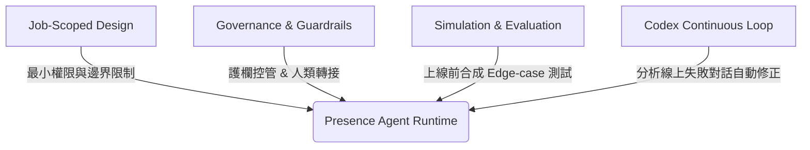

OpenAI 於 2026 年 7 月 22 日正式對外發表全新的託管式企業 AI 代理平台——**[OpenAI Presence](https://openai.com/index/introducing-openai-presence/)**。這並非一套開放給一般消費者自製聊天機器人的 DIY 工具，而是專為大型企業高風險、高流量核心業務（如客戶服務、理賠處理、HR 諮詢與 IT 服務台）所設計的治理型 AI Agent 平台。

隨著生成式 AI 從「對話框文字輸入」跨入「代理自動化執行」，企業在部署 Agent 時面臨的最嚴峻挑戰莫過於：**可靠性、安全合規與邊界控管**。OpenAI Presence 的推出，標誌著 OpenAI 在 Enterprise AI 戰略上的一大轉折——從單純提供 API 模型的供應商，進化為提供全流程安全護欄、模擬測試與專家託管部署的 Agent 平台。

本文將深度解析 OpenAI Presence 是什麼、其四大核心技術架構，以及企業該如何看待這套新型態的 AI 代理治理模式。

> **花花的判斷**
>
> OpenAI Presence 的推出標誌著 Enterprise AI 從「對話框聊天」走向「託管式高風險工作流治理」。企業要的不是無所不能的神仙 Agent，而是單一職責（Job-scoped）、具備嚴格護欄、模擬測試與 Codex 自動持續優化的合規 AI 隊友。

## 1. OpenAI Presence 是什麼？產品定位與 Dogfooding

**OpenAI Presence** 是一套由 OpenAI 官方與全球系統整合商夥伴共同說服、建構與運行的託管式企業 AI Agent 平台。它支援語音（Voice）與文字對話（Chat）雙模態，能在實時對話中安全地呼叫企業內部 API 系統。

為了驗證 Presence 平台的可靠度，OpenAI 在發布當日同時宣布：**OpenAI 已將 Presence 部署於自家產品的官方客服**，推出了針對英語使用者的 **AI Phone Support（AI 電話客服）**。該系統能實時處理 ChatGPT 及各項 OpenAI 服務的查詢，驗證了平台在極高併發與複雜業務語境下的運作能力。

與傳統開放式 Chatbot 不同，Presence 的部署採取 **Limited General Availability (Limited GA)** 模式。OpenAI 派遣前線部署工程師（Forward Deployed Engineers, FDEs）深耕企業現場，確保每一個上線的 Agent 都通過嚴格的架構驗證。

## 2. 四大核心技術與治理架構

OpenAI Presence 能夠勝任高風險企業工作流，關鍵在於其圍繞「安全與治理」打造的四大架構支柱：

### 1. Job-Scoped 單一職責設計（Job-Scoped Design）
Presence 反對建造「無所不能」的泛用型 Agent。每一個 Presence Agent 在設計之初都有極為明確的任務邊界（如「僅處理帳務退費」或「僅管理團體保險理賠」）。系統僅賦予 Agent 完成該特定任務所需的最小 API 存取權限與知識範疇，從源頭杜絕越權操作與目標偏移。

### 2. 嚴格治理、護欄與人類升級轉接（Governance & Guardrails）
平台提供靈活的授權控制面板。管理者可精確設定 Agent 的自主行動等級（Autonomy Levels）、哪些高敏感動作（如大規模退款或外部發信）必須觸發人類審批（Human-in-the-loop），並建立即時安全護欄。當 Agent 遇到歧義或超出處理範疇時，系統會順暢地將脈絡轉接（Escalate）至人工客服團隊。

### 3. 上線前模擬與自動化評測（Simulation & Evaluation）
在真正上線面對真實客戶前，Presence 提供了合成模擬引擎。系統能模擬數以千計的極端邊界狀況（Edge Cases）與對抗性測試，自動評估 Agent 的政策合規性、回應準確度與安全表現，確保符合 enterprise-grade 驗證標準。

### 4. 基於 Codex 的 Post-Launch 對話持續改進環路（Continuous Loop via Codex）
傳統 Agent 上線後，修復邊界錯誤往往需要工程團隊手動剖析 Log 並改寫程式碼。Presence 導入了基於 **OpenAI Codex** 的自動化優化機制：
- 系統自動監控線上記錄與人類轉接案例。
- Codex 分析對話中發生的政策摩擦與知識缺口，主動提出 Prompt 或代碼修補建議（Propositions）。
- 人類團隊在沙箱環境中驗證測試後，一鍵核准發布，實現 Agent 的持續自癒與進化。

> **花花的工程提醒**
>
> 開發企業級 Agent 系統時，切忌將所有邏輯與權限一次性放開。應借鏡 Presence 的設計：將權限限制在 Job-scoped 邊界、實作非同步人類審批流程，並在上線前建立包含 Edge-case 模擬與自動化評測（Evals）的驗證體系。

## 3. 對企業與 AI 工程師的啟示

OpenAI Presence 的誕生，揭示了未來企業 AI 落地的新標準：

1. **從「能力展現」轉向「可靠性驗證」**：模型的基礎 Reasoning 能力已足夠強大，企業關注的焦點從「模型能不能寫程式」轉向「如何確保 Agent 每次執行都 100% 合規」。
2. **FDE 與專家協作模式成為主流**：高風險 AI 工作流很難單靠 SaaS 訂閱自建完成，結合 FDE 前線工程師與專業顧問的協作部署將是落地常態。
3. **建立內建測試與自癒閉環**：優秀的 Agent 系統必須包含預先的 Simulation 工具與上線後的 Codex 修正機制，讓 Agent 隨企業業務邏輯動態演進。

## 總結

OpenAI Presence 展示了企業級 AI 代理成熟形態的縮影。透過 Job-scoped 邊界、健全的治理護欄、模擬測試與 Codex 動態優化，OpenAI Presence 為企業將 AI Agent 導入高價值、高風險商業場景奠定了堅實基礎。

## 延伸閱讀與參考來源

- 官方發布公告：[OpenAI: Introducing OpenAI Presence](https://openai.com/index/introducing-openai-presence/)
- 本站導讀：[Enterprise AI Agent 治理與安全合規架構](/blog/39-enterprise-agentic-ai-governance/)
- 本站導讀：[OpenAI 官方 GPT-5.6 Prompting 指南實戰](/blog/72-openai-gpt-5-6-prompting-rules/)
- 本站導讀：[Claude 5 世代的 Context Engineering 新法則](/blog/71-context-engineering-claude-5/)
- 本站導讀：[AI Agent 完全指南](/blog/64-ai-agent-guide/)
