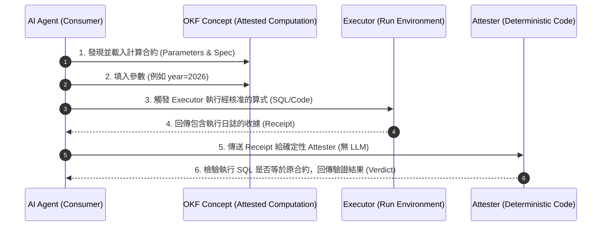

在 2026 年 6 月 Google Cloud 正式發表 [Open Knowledge Format (OKF) v0.1](/blog/24-open-knowledge-format/) 規範後，這套標榜「簡單到只需要 `cat` 和 `git clone`」的 Markdown+YAML 知識表示標準迅速吸引了 AI 基礎設施領域的目光。

然而，當企業開始大規模讓自主 Agent（Autonomous Agents）持續讀取、撰寫與維護知識庫時，一個致命的問題浮出水面：**「當知識庫裡的內容絕大多數是由 AI Agent 自動生成時，消費端（其他 Agent 或人類）究竟憑什麼信任這些資料？又該如何確認其中的數字是透過正確邏輯計算出來的？」**

在無人在意的角落中，Google Cloud 團隊默默在官方 GitHub 倉庫 ([GoogleCloudPlatform/knowledge-catalog](https://github.com/GoogleCloudPlatform/knowledge-catalog/blob/main/okf/SPEC.md)) 推出了 **OKF v0.2 規格更新**。

這不僅僅是一次常規的版本迭代，而是一次將**出處 (Provenance)、信任 (Trust)、生命週期 (Lifecycle)** 與 **可驗證計算 (Attested Computation)** 提升為第一等公民的重磅架構升級。本文對照 OKF v0.2 與 v0.1，整理核心差異與落地工程價值。

> **花花的一句話**
>
> 喵～以前 OKF 只是幫 Agent 把資料整理乾淨，現在 v0.2 還幫資料貼上了身分證、保鮮期與數學檢驗標章！讓 Agent 再也不怕讀到過期或被模型亂編的幻覺資料囉！🐾
>
> **花花的工程提醒**
>
> 升級至 v0.2 時，請特別注意 `timestamp` 與 `# Citations` 的遷移。透過引入 `Attested Computation` 搭配確定性驗證腳本 (Attester)，可以徹底消除 RAG 在財務與關鍵數據計算上的模型幻覺問題。

## 1. 核心動機：當知識庫改由 AI 持續維護

在 v0.1 時代，OKF 解決的是「如何用乾淨的 Markdown 結構打破資料庫 Schema、指標與 Runbook 的知識孤島」。

到了 v0.2，設計團隊提出了一個非常深刻的觀察：**當前的知識庫不再是「寫一次供人類閱讀」，而是「由 AI Agent 持續撰寫與維護」**。當知識庫中大多數概念 (Concepts) 都是由機器生成時，消費端 Agent 必然會提出 5 個關鍵質問：

1. **Provenance（出處）**：這份文件是根據哪些原始資料或數據源產生的？
2. **Trust（信任度）**：我該給予這份知識多少信任比重？
3. **Freshness（新鮮度）**：裡面的資訊現在還適用嗎？
4. **Lifecycle（生命週期）**：這是當前最新版本，還是已被棄用的廢案？
5. **Attestation（計算證明）**：文件裡出現的財務或統計數字，確實是用我們規範的算式跑出來的嗎？

OKF v0.2 正是為了在不增加複雜 SDK 或中心化 Schema Registry 的前提下，回答這 5 個問題。

## 2. 破壞性變更 (Breaking Changes)：v0.1 到 v0.2 的遷移

OKF v0.2 總體上保持向下相容，但包含了兩項為了語義嚴謹性而進行的**破壞性改動**：

| 變革項目 | OKF v0.1 舊規範 | OKF v0.2 新規範 | 遷移理由與優勢 |
| :--- | :--- | :--- | :--- |
| **時間與行為者** | 前置 YAML 使用單純字串 `timestamp: '2026-05-28'` | 升級為結構化 `generated: { by: ..., at: ... }` | 清楚區分「誰生成的 (Actor)」與「何時生成的」，符合審計要求。 |
| **引用資料出處** | 放在正文底部的 `# Citations` Markdown 清單 | 提升為前置 YAML 第一等公民 `sources` 家族 | 讓 Agent 無需解析正文文本即可從 YAML 抽取出處與聲譽訊號。 |

### 程式碼範例對比

#### v0.1 舊版格式：
```markdown
---
type: Metric
title: Income Statement
timestamp: '2026-05-28T22:53:05Z'
---

# Definition
Income statement reports revenue.

# Citations
- https://wiki.acme/finance/revenue-recognition
```

#### v0.2 新版格式：
```markdown
---
type: Metric
title: Income Statement
status: stable
generated: { by: reference_agent/gemini-2.5-pro, at: 2026-06-20T22:53:05Z }
verified: { by: human:ahormati, at: 2026-06-25T09:00:00Z }
stale_after: 2026-12-31
sources:
  - id: rev-policy
    resource: https://wiki.acme/finance/revenue-recognition
    title: Revenue recognition policy
    author: team:finance-fpa
    last_modified: 2026-04-02
---

# Definition
Income statement reports revenue, computed by [revenue computation](https://github.com/GoogleCloudPlatform/knowledge-catalog).
```

## 3. 增量創新 (Additive Changes)：四大核心家族解析

OKF v0.2 引入了數個全新的屬性家族，大幅強化了 Agent 檢索時的決策品質：

### 3.1 Provenance 與「聲譽訊號 (Credibility Signals)」

在 `sources` 陣列中，OKF v0.2 允許記錄客觀的信譽訊號，而非儲存主觀的 "Trust Score"：
* `author`: 遵守 Actor 規範（`human:<id>`, `<producer>/<version>`, `process:<id>`）。
* `usage_count`: 在 `usage_window` 時間視窗內該資源被使用的次數（例如 Dashboard 瀏覽量或 Query 執行次數）。
* `last_modified`: 原始資料源最後修改的日期（獨立於 concept 寫入時間 `generated.at`）。

> **設計哲學**：OKF 不在文件中寫死「這份資料信用分數 85 分」，因為信用是主觀且會過期的。OKF 記錄客觀的傳播與修改訊號，由消費端 Agent 依據自己的規則動態推算信任度。

### 3.2 信任分級與生命週期 (Trust Tiers & Lifecycle)

* `verified`: 記錄人工核實或模型確認 `verified: { by: "human:ahormati", at: "2026-06-25" }`。
* `status`: 可標註 `draft`, `stable`, `deprecated` 等狀態。
* `stale_after`: 標註過期時間（例如 `2026-12-31`）。當當前時間超過 `stale_after` 時， Agent 在檢索時會發出警告或拒絕直接採用。

## 4. 重磅突破：Attested Computation（可驗證計算）

這是 OKF v0.2 最令人驚豔的創新——為了解決 LLM 在處理 SQL、財務報表與統計數字時經常「胡言亂語」的問題，v0.2 引入了全新概念類型 `type: Attested Computation`。



### 為什麼需要分開 `verified` 與 `attestation`？

白皮書明確指出了兩者的本質區別：
1. **`verified`（定義驗證）**：確認這個**算式與定義**是否符合公司當前政策。這是文件級別的、較慢的、並且記錄在 OKF 檔案中。
2. **`Attestation`（執行證明）**：確認「**單次執行**」所產生的數字，確實是用經核准的算式跑出來的，而不是模型瞎編的。這是每次呼叫時在運行時 (Runtime) 進行的，**不儲存在 OKF 檔案中**。

這種設計實現了「模型僅能傳遞參數，無法擅自篡改 SQL/算式」的零信任架構！

## 5. OKF v0.2 對企業 AI 基礎設施的啟示

從 OKF v0.1 到 v0.2 的演進，反映出 Google Cloud 團隊在推進 Enterprise AI Agent 時累積的實戰經驗：

1. **從文字檢索走向合約檢索**：未來的 RAG 不再只是搜尋「文字片段」，而是搜尋包含執行權限、參數約束與無 LLM 確定性驗證腳本的「計算合約」。
2. **輕量極致的結構**：完全不需要笨重的中心化 Metadata Server，靠 Git 版本的 `.md` 與 YAML 就能完成多系統間的知識同步。

如果你正在為團隊規劃 Agentic RAG 或企業級知識庫，OKF v0.2 絕對是一個非常值得借鏡與直接導入的開放標準。

### 延伸閱讀與內部資源

如果你希望深入研究 AI 時代下的系統架構與 Context 管理，推薦閱讀：
* [OKF 是什麼：Google 讓 AI Agent 讀懂企業知識的格式](/blog/24-open-knowledge-format/)
* [Claude 5 時代的 Context Engineering 實戰指南](/blog/71-context-engineering-claude-5/)

## 參考文獻 / 原始白皮書網址 (References & Source Specification)

- **OKF v0.2 官方規格書**: Google Cloud Platform. "Open Knowledge Format (OKF) Specification v0.2". GitHub Repository: [https://github.com/GoogleCloudPlatform/knowledge-catalog/blob/main/okf/SPEC.md](https://github.com/GoogleCloudPlatform/knowledge-catalog/blob/main/okf/SPEC.md)
- **OKF 專案主頁**: Google Cloud Platform. "Knowledge Catalog". [https://github.com/GoogleCloudPlatform/knowledge-catalog](https://github.com/GoogleCloudPlatform/knowledge-catalog)
