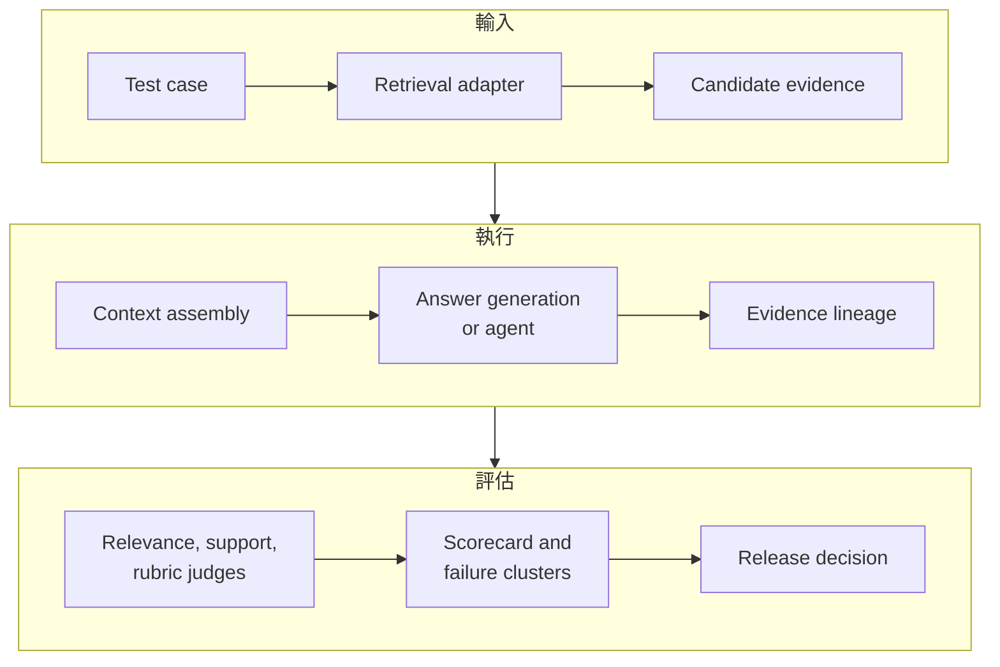

[上一篇入口文章](/blog/84-trec-rag-2026-agent-first-evaluation/) 說明了 TREC RAG 2026 為什麼值得注意：它把 Retrieval 與 Retrieval-Augmented Generation 拆成兩個互補任務，並用 RAGDoll 把 relevance、nuggets、citation support 與 metrics 串起來。這篇往前再走一步，回答一個更實作的問題：如果今天要為企業 RAG 建一套類似的 evaluation harness，資料要怎麼留、每一步要怎麼量、Agent 要怎麼 trace，最後又要怎麼決定能不能上線？

先界定本文的證據邊界。[TREC RAG 2026 官方頁面](https://trec-rag.github.io/) 定義了 2026 的兩項任務、ClimbMix-400b corpus、時間線與工具入口；[RAGDoll](https://github.com/castorini/RAGDoll) README 則公開了 prompt materialization、UMBRELA-style relevance judging、Nuggetizer、citation support 與 metrics 的介面。下面的資料模型、scorecard 與 production gate 是 Bloss0m 的工程設計建議，不是官方宣布的企業標準，也不是對 2026 結果的預測。官方頁面截至 2026 年 8 月 9 日仍把 results and judgments 標為 TBD。

> **花花的判斷**
>
> 真正成熟的 RAG 評測，不是把所有東西壓成一個分數，而是讓每個分數都能沿著 evidence lineage 回到一次具體的檢索、閱讀、生成與判斷。

## 先把 harness 想成一個資料管線

很多團隊把 evaluation 寫成一個批次 script：讀取問題、呼叫 RAG API、把答案交給 LLM judge、最後輸出 CSV。這樣很快，但不耐用。當 index、prompt、model 或 Agent tool 改變時，你很難知道分數變化來自哪裡；當單一答案出錯時，也無法重建當時模型到底看到了什麼。

比較穩健的抽象，是把 harness 當成一條有版本的資料管線：



每一層都應該有清楚的輸入、輸出與失敗狀態。這不代表每個團隊都要建一套很重的 workflow engine，而是不要讓中間資料只存在 memory、console log 或一次性 notebook 裡。

## 一、資料模型：先定義什麼叫「同一次評測」

### Test case 不只是一個問題字串

最小的 test case 可以包含 `case_id`、`narrative`、`language`、`expected_answer`，但企業場景還需要把 evidence 與治理條件寫出來。以下是概念 schema，不是 TREC 官方格式：

```json
{
  "case_id": "policy-expiry-017",
  "narrative": "What happens when the customer policy expires?",
  "required_evidence": ["policy-v3-expiry"],
  "allowed_sources": ["policy-store"],
  "forbidden_sources": ["draft-policy-store"],
  "expected_nuggets": [
    {"id": "expiry-window", "importance": "vital"},
    {"id": "renewal-action", "importance": "important"}
  ],
  "answer_policy": "abstain-if-no-authoritative-source",
  "risk_class": "high"
}
```

這裡最重要的不是欄位名稱，而是把「答案應該引用什麼」與「答案不可以引用什麼」分開。只有 `expected_answer`，沒有 `required_evidence`，你很難分辨模型是用另一個碰巧正確的來源回答，還是確實遵守了企業的 authoritative-source policy。

### Retrieval run 要保留候選集合，而不是只留 top result

一個 Retrieval run 至少要保存：

- `run_id`、`case_id`、`query` 與 query rewrite；
- retriever、reranker、index snapshot 與 filter version；
- 每個 candidate 的 `document_id`、`passage_id`、rank、score 與 source metadata；
- 被 ACL、freshness 或 source policy 過濾掉的候選數量；
- retrieval latency、error、timeout 與 retry。

只留第一名文件，會讓很多診斷消失。若正確文件排在第 17 名，答案模型只拿到 top-5，那是 ranking 或 cutoff 問題；若正確文件根本不在候選集合，才是 ingestion、query 或 index 問題。兩者的修法不同。

### Answer run 要保留句子與引用的關係

RAGDoll 的 support assessment 以 answer rows 為起點：答案由句子組成，每個句子帶有 citation references，而 references 再映射到 document IDs。[RAGDoll 的官方範例](https://github.com/castorini/RAGDoll) 也展示了先 resolve references 到 passage text，再進行 support judgment 的流程。

企業 harness 應保留類似的結構：

```json
{
  "case_id": "policy-expiry-017",
  "run_id": "rag-hybrid-agent-v3",
  "references": ["policy-v3-expiry"],
  "answer": [
    {
      "sentence_id": 0,
      "text": "The policy enters the renewal window 30 days before expiry.",
      "citations": [0]
    }
  ],
  "trace_id": "trace-8f2a"
}
```

這種句子級結構比「答案底下列五個來源」更有用，因為它可以把每一個 claim 對應到一個或多個 passage，進一步檢查 full support、partial support 或 no support。若產品 UI 不適合顯示句子級 citation，也不代表 evaluation layer 可以省略這個關係。

### Judgment record 要同時保存原始與解析結果

Judge 的輸出不應只有 `score: 0.82`。至少保存：

- judge name、model、prompt version、temperature 或 sampling 設定；
- input answer、citation passage、nugget 或 rubric；
- raw response、解析後 label、parser status 與錯誤原因；
- human review flag 與 adjudication 結果；
- judgment timestamp 與 evaluation code version。

原始輸出能幫你重查 parser bug，也能讓之後換 aggregation formula 時不用重新呼叫昂貴的 judge。RAGDoll README 中的 raw events、parsed judgments、support assignments 與 metrics 分層，正好說明為什麼不要只保存最後聚合值。

## 二、執行管線：先固定輸入，再逐層產生 artifacts

### Step 0：建立 run manifest

同一個 `run_id` 應該能指出整套實驗設定。可以從下面這種 manifest 開始：

```json
{
  "run_id": "rag-2026-08-09-hybrid-agent-v3",
  "corpus_snapshot": "internal-docs-2026-08-01",
  "topic_set": "enterprise-rag-eval-v2",
  "retriever": "hybrid-bm25-vector@4.1",
  "reranker": "reranker@2026-07",
  "parser": "document-parser@2.8",
  "agent_skill_version": "search-read-answer@3.2.1",
  "model": "model-version-pinned",
  "judge": "support-judge@1.4",
  "metrics_version": "scorecard@2"
}
```

Manifest 的目的，是把原本散落在環境變數、prompt 檔、Docker image、notebook 與手動命令裡的設定收斂成可以比較的物件。任何一項會影響輸出的變更，都應產生新的 run ID；不要為了方便把新結果覆蓋在舊目錄裡。

### Step 1：先跑 Retrieval-only

Retrieval-only run 的用途，是回答「必要 evidence 是否進入候選集合」。它可以是 lexical、vector、hybrid 或 agentic search，但第一輪最好固定 query set、corpus、index 與 top-k，只比較一個變因。

保存的中間結果應包括：

1. 原始 narrative 與送進 retriever 的 query。
2. query rewrite、filter、tenant scope 與時間條件。
3. 完整候選清單，而不只是送進模型的 context。
4. 每個 candidate 的 rank、score、source version 與 evidence eligibility。
5. timeout、empty result、permission denial 與 fallback。

如果 retrieval-only 已經找不到 required evidence，就先不要調 prompt。生成模型沒有看過的文件，不可能靠更長的 system prompt 補回來。

### Step 2：再跑 context assembly

Context assembly 是常被忽略的中間層。它至少處理：deduplication、passage ordering、token budget、source priority、版本衝突與 citation indexing。這層應輸出一個可儲存的 context manifest：

```json
{
  "case_id": "policy-expiry-017",
  "context_id": "ctx-42",
  "selected_passages": [
    {
      "passage_id": "policy-v3-expiry#p12",
      "position": 0,
      "tokens": 148,
      "source_version": "v3",
      "citation_index": 0
    }
  ],
  "removed_duplicates": 2,
  "truncated_passages": 0,
  "token_budget": 4096
}
```

沒有這份 manifest，你看到 answer 變差時，無法知道是 reranker 變差，還是 context assembler 把最重要的 passage 截掉。

### Step 3：生成答案，並保留 Agent 的每一步

對單次 RAG，保存 final context 與 model response 已經能解決一部分問題；對 Agentic RAG，還要保存每一個 tool call。最小的 trace event 可以長這樣：

```json
{
  "trace_id": "trace-8f2a",
  "step": 3,
  "state": "read-evidence",
  "tool": "search_documents",
  "input": {"query": "policy expiry renewal window"},
  "output": {"document_ids": ["policy-v3-expiry"]},
  "latency_ms": 182,
  "tokens": {"input": 740, "output": 96},
  "stop_reason": null
}
```

建議至少區分這些 state：`plan`、`search`、`read`、`verify`、`compose`、`abstain`、`error` 與 `finish`。每個 state 要有明確的進入條件與退出條件，否則「Agent 自己覺得完成」會成為無法分析的黑盒子。

### Step 4：resolve references，再做 support judgment

RAGDoll 的公開流程先把答案中的 document IDs resolve 成 judge 可以讀取的 passage，再對每個 sentence-citation pair 做 support judgment。概念上的管線是：

```text
answer rows
  -> resolve references
  -> resolved answer with segments
  -> sentence/citation judge
  -> parsed judgments
  -> support assignments
  -> topic/run metrics
```

README 中的 support labels 包含 Full Support、Partial Support、No Support，以及 missing、failed 或 unparseable 狀態。這個順序很重要：如果 judge 直接讀完整文件集合，它可能使用答案沒有引用的資訊；如果 judge 只看 citation text，又可能無法判斷句子是否偷換了範圍。要固定 judge 看到的輸入邊界。

### Step 5：產生 metrics 與 failure clusters

聚合 metrics 之前，先保存 topic-level rows。不要只輸出整個 run 的平均值，因為平均值會掩蓋高風險問題。例如 95% 的低風險查詢都正確，仍可能有 5% 的跨租戶洩漏；一個 global average 不應把它沖淡。

每一個 case 至少應能被標記成：

- retrieval miss；
- ranking／filter failure；
- context truncation 或 duplication；
- missing nugget；
- unsupported claim；
- citation mismatch；
- stale／conflicting source；
- abstention failure；
- tool timeout／retry loop；
- judge parse 或 artifact failure。

這些 labels 是維修索引、prompt、policy、tool runtime 與 evaluation code 的橋樑。

## 三、Metrics：不要讓一個分數代替整個系統

### Retrieval metrics：候選集合是否足夠？

常見的 Retrieval 指標包括 Recall@k、Precision@k、MRR 與 nDCG。它們各自回答不同問題：

- **Recall@k：** 必要 evidence 有多少比例在 top-k 出現？適合先檢查 coverage。
- **Precision@k：** top-k 中有多少是相關文件？適合觀察噪音與 token 浪費。
- **MRR：** 第一個 relevant result 排得多前？適合需要快速找到 authoritative source 的查詢。
- **nDCG：** 不同 relevance 等級與排名是否合理？適合相關性不只二元的場景。

但這些數字不能直接代表答案品質。Retrieval recall 很高，仍可能因為 context budget、版本優先序或 generation policy 產生錯誤。建議加一個 evidence sufficiency 層：對每個 test case 標記「答案所需的 vital evidence 是否已進入 final context」，不要只看它是否在原始候選集合裡。

### Nugget metrics：答案覆蓋了哪些必要資訊？

Nugget 是比整段答案更細的評測單位。對每個 nugget，可以記錄 `support`、`partial_support`、`missing` 與 importance。這讓團隊可以區分：答案只漏掉一個次要背景，還是漏掉一個會改變決策的 vital condition。

如果 nugget 是由模型自動產生，必須保存 generation prompt、model version 與人工抽樣。自動 gold generation 不是免費真相；它本身是需要 calibration 的 judge stage。RAGDoll README 同時提供 Nuggetizer create、agentic-create、assign 與 metrics 的不同步驟，這種分層正適合拿來做人工校準。

### Citation support：句子與來源是否真的對得上？

Citation coverage 可以先回答「應該有 citation 的句子是否都有 citation」，但還不夠。更實用的 support score 要看：

1. citation 是否指向正確 document ID 與版本；
2. passage 是否包含句子所需的事實；
3. 答案是否增加 passage 沒有說的因果、時間或範圍；
4. 同一句是否需要多個來源才能完整支援；
5. 引用的來源是否在回答者的授權範圍內。

因此，建議同時保存 citation coverage、full support rate、partial support rate、no support rate 與 reference resolution failure rate。不要把 partial support 當成 full support，也不要讓無法解析的 citation 靜默變成 0 分而失去原因。

### Answer quality 與 abstention

Correctness、completeness、fluency 與 helpfulness 可以作為答案層的評估，但高風險企業系統還要量測 abstention quality：

- 沒有 authoritative evidence 時，是否拒絕回答？
- 有衝突版本時，是否指出衝突而不是選一個看起來順的版本？
- 問題超出 source scope 時，是否不會利用相鄰但不允許的資料補答案？
- 需要人工核准時，是否把狀態送進 review queue？

一個能在未知時正確停下來的系統，可能比一個在所有問題上都產生完整句子的系統更適合企業。這不是把 abstention 當成越多越好，而是把「知道何時不能回答」納入可觀察的產品行為。

### Safety 與 operations

離線 benchmark 通常不會自動覆蓋企業的安全與運營條件。至少另外建立：

| 面向 | 需要量測的問題 | 典型失敗 |
| --- | --- | --- |
| Authorization | 檢索、cache、citation page 是否遵守 identity scope？ | cross-tenant leakage |
| Freshness | 撤回、更新、過期文件多久停止影響答案？ | stale policy citation |
| Prompt injection | 文件中的指令是否被當成資料而非控制訊息？ | retrieval-to-tool hijack |
| Latency | P50／P95 是否能符合互動 SLO？ | agent retry tail |
| Cost | model、embedding、rerank、tool 與 judge 的成本是多少？ | quality gain below cost |
| Reliability | timeout、partial outage、rate limit 是否可恢復？ | empty answer or loop |

這些項目不應等到 production incident 後才加入 scorecard。它們應該與 answer quality 同時進入 release review。

## 四、RAGDoll 介面可以怎麼映射到自己的 harness？

[RAGDoll 的 workflow](https://github.com/castorini/RAGDoll) 可以當作一個 reference implementation，而不是需要原封不動複製的產品。它的幾個公開介面可以這樣理解：

### `materialize`：先把 judge 看到的東西固定下來

RAGDoll 可以 materialize UMBRELA、nugget 與其他任務的 prompt-task JSONL，讓團隊在真正執行前檢查 system prompt、instruction、query 與 candidates。企業 harness 也應該先產生 immutable task manifest，再執行模型，這樣 prompt 變更不會悄悄混進同一批結果。

### UMBRELA-style judging：把 relevance 從答案抽離

輸入是 query 加 candidates，輸出是 relevance judgments。企業可以把它放在 retrieval stage，先確認 candidate set 的品質，再決定是否進入 generation。注意這仍然是 judge-based measurement，應用人工樣本確認 judge 對 domain terminology、否定句與時間條件的理解。

### Nuggetizer：把長答案拆成可覆蓋的 rubric

Nuggetizer path 讓回答需求變成一組資訊單位，再對 submitted answer 做 assignment 與 metrics。對長篇研究摘要、政策比較或多步驟操作說明，這比只請 judge 評整篇答案更容易定位漏掉的部分。

### Support：把引用解析成 sentence-level evidence

Support assessment 的核心是先 resolve references，再判斷 sentence against citation。這個順序可以直接移植到企業系統：答案輸出的 citation 不只是一個 URL，而應該能解析到受控的 document version、passage 與 authorization check。

### Arena comparison：只在輸入可比時比較

RAGDoll 的 pairwise comparison 會對 shared qids 做比較，也記錄 task、judgment 與 pairwise outputs。企業比較兩個 RAG run 時，也要先確保它們使用同一批 cases、同一個 source scope 與相容的 answer policy。不同 test set、不同 abstention policy 或不同引用顯示方式混在一起，排名沒有意義。

## 五、Judge 校準：自動評分不是免人工

### 先固定 judge contract

Judge prompt 應明確說明：它可以看到哪些 passage、是否可以使用外部知識、如何處理矛盾來源、Full／Partial／No Support 的邊界、無法解析時要回傳什麼，以及輸出 schema。prompt version 要進 manifest，raw response 要保留。

### 用分層樣本做 human calibration

不必人工重看每一筆，但要固定抽樣策略：

- 每個 risk class 抽樣；
- 對 high-score 與 low-score 兩端抽樣；
- 抽樣 partial support、no support 與 parser failure；
- 抽樣不同語言、來源類型、文件長度與 Agent path；
- 每次 judge 或 prompt 更新後重跑 calibration set。

如果模型 judge 與人類在 easy cases 一致，卻在 policy exception 或 multi-hop case 分歧，global average 會掩蓋這個問題。應該保留 disagreement cluster，並把它轉成新增 test case 或更新 rubric 的輸入。

### 把不確定性留在結果裡

Judge 輸出不是自然定律。報告中應保留 sample size、人工一致性、未解析比例、judge version 與未決 case。沒有這些 metadata，`0.86 support` 看起來很精確，卻不知道它是 10 筆還是 100,000 筆，也不知道有多少筆其實無法判斷。

> **花花的工程提醒**
>
> Judge 可以降低人工成本，不能消除人工責任。越高風險、越新穎、越容易出現版本衝突的案例，越需要保留人工校準與可重看的原始 evidence。

## 六、把 Agent trace 變成 production 診斷工具

### Trace 不只是 token log

對 Agentic RAG，最有價值的 trace 欄位通常不是「模型用了多少 token」而已，而是 decision context：

- 當前 goal 與子問題；
- 已知 evidence、未知 evidence 與待驗證 claim；
- 為什麼選這個 tool 或 query；
- tool 回傳了多少 candidate，哪些被採用或拒絕；
- 是否發生 query rewrite、retry、fallback 或 context compaction；
- stop condition、未完成的 subgoal 與 abstention reason。

這些資料可以讓你回答「Agent 為什麼繼續搜尋」與「它為什麼相信這張 evidence card」。若 trace 只記錄 tool name 與 latency，仍不足以診斷錯誤決策。

### 把 trace 與 evidence lineage 接起來

每個 trace event 都應能連到 `case_id`、`run_id`、`context_id`、`passage_id` 與 `citation_index`。這樣一個錯誤答案可以反向查：

```text
answer sentence
  -> citation index
  -> passage and source version
  -> context assembly decision
  -> agent read/search event
  -> retrieval candidate and query
  -> corpus and index snapshot
```

這條路徑就是 evidence lineage。它能把「模型幻覺」拆成更精確的分類：檢索沒有找到、Agent 讀錯、context 丟失、citation builder 對錯，或生成自行擴張了結論。

### 設計明確的 Agent budget

Agent 進入 production 前，至少要有：最大步數、最大 wall-clock、最大 tool cost、每個 tool 的 timeout、重試上限、同一 query 的重複抑制，以及找不到 authoritative evidence 時的停止策略。這些不是限制 Agent 智慧，而是把失敗變成可預期的狀態。

## 七、從 offline score 到 production gate

一個實際的 release gate 可以分三層：

### Gate A：Evidence correctness

- required evidence 的 coverage 達標；
- high-risk cases 不得有未授權 source；
- citation resolution failure 低於明確門檻；
- stale 或 conflicting source 有可觀察處理；
- retrieval miss 與 context miss 已分開統計。

### Gate B：Answer behavior

- vital nuggets 的 coverage 達標；
- full／partial／no support 分布可接受；
- unsupported claim 與 citation mismatch 維持在風險容忍度內；
- no-answer、conflict 與 abstention case 不得以流暢幻覺通過。

### Gate C：Operations and safety

- P95 latency 符合互動 SLO；
- 每次請求的 model、embedding、rerank 與 tool cost 在預算內；
- timeout、rate limit 與 partial outage 有 fallback；
- prompt injection、ACL leakage、cross-tenant access 測試通過；
- index freshness、刪除同步與 cache scope 有監控。

這三層不應被壓成一個加權平均後才做決定。若有一個高風險安全 gate 失敗，即使 answer score 很高，也應該阻擋上線。

## 八、最小可行的落地順序

如果團隊目前只有一個 RAG endpoint，可以依照以下順序逐步增加複雜度：

1. 建立 50–100 個分層 test cases，加入 required evidence、risk class 與可接受 abstention。
2. 對同一批 cases 保存完整 Retrieval candidates、final context、answer sentences 與 citations。
3. 先做人類標註的小型 gold set，再導入 LLM judge，並保存 raw response。
4. 將 Retrieval、support、nugget、answer、safety 與 operations 分成不同 metrics。
5. 加入 run manifest、corpus snapshot、prompt version 與 evaluation code version。
6. 先建立 lexical／vector／hybrid baseline，再一次只加入一個 Agent capability。
7. 用 failure clusters 排序下一個工程投資，而不是直接追逐更大的模型或更長的 Agent trajectory。

在這個順序中，Agentic RAG 是後來加入的變因，而不是評測 harness 的前提。若 baseline 的 evidence lineage 還不存在，先加入 Agent 只會讓錯誤更難追。

## 什麼時候不該使用這套方法？

不是所有知識任務都需要完整的 Agent-first harness。若產品只是低風險、短答案、單一 authoritative database lookup，簡單的 deterministic tests、schema validation 與 latency checks 可能更適合。過度引入 LLM judge、nugget generation 與多步 trace，會增加成本與維護面積。

相反地，當系統具備長答案、多來源證據、版本衝突、工具呼叫、高風險權限或需要解釋「為什麼這樣回答」時，evidence lineage 與分層 metrics 就很值得投資。判斷標準不是「Agent 很新」，而是系統的錯誤是否已經無法由單一 end-to-end score 診斷。

## 最後的工程判斷

TREC RAG 2026 的重要性，不在於它提供一個可以直接搬進企業的唯一分數，而在於它展示了如何把 retrieval、evidence construction、grounded answer、citation support 與 system comparison 分成可檢查的工作流。RAGDoll 進一步把 prompts、raw events、resolved references、support assignments 與 metrics 具體化，讓「評測」更接近一個可以版本化的資料管線。

企業真正要帶走的做法是：先固定 corpus、topic set、index、prompt、model、judge 與 Agent skill，再保存 candidate evidence、final context、sentence-level citations 與完整 trace。接著用 evidence、answer、safety、operations 四條軸做 release decision。若 Agent 的額外步驟沒有帶來可測量的 evidence coverage 或 failure recovery 改善，就不應只因為流程更複雜而稱它更智慧。

閱讀入口：[TREC RAG 2026：RAG 評測為何開始加入 Agent](/blog/84-trec-rag-2026-agent-first-evaluation/)。架構背景可接著看 [Enterprise RAG 完整指南](/blog/65-enterprise-rag-guide/) 與 [AI Agent 指南](/blog/64-ai-agent-guide/)；若要比較動態搜尋與迭代讀取，再看 [Agentic RAG：Vector Search Meets Agent Reasoning](/blog/07-agentic-rag/)。

## Sources

- [TREC RAG 2026 official track page](https://trec-rag.github.io/)
- [RAGDoll evaluation runner, schemas, and workflow](https://github.com/castorini/RAGDoll)
- [TREC RAG 2026 agent skills](https://github.com/TREC-RAG/trec-rag-skills)
