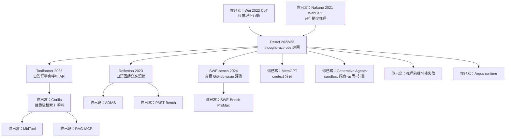

**建議把本頁加入書籤。** [論文精讀總覽](/paper-reading/) 已有三條 PATH：方法底座、檢索系統、Agent 系統。第三條從 OSReward 起跳，是進階混編清單。若你剛把 ReAct 家族讀完，還缺一張**脊椎圖**說明那些經典如何接到站上 2025–26 的精讀——本頁就是那張圖。

這不是新的論文精讀，也不取代各篇筆記裡的六個 Paper Essence 問題。它只回答：節點怎麼連、控制點改在哪、下一篇該點哪一條連結。

> **花花的一句話**
>
> ReAct 不是把模型變聰明，是把「只想」和「只做」縫成同一條軌跡；後面的葉子都還長在縫口上，不是把縫口拆掉重做。

> **花花的工程提醒**
>
> 不要把後來的排行榜分數寫回 2023／2024 經典。ReAct 的 few-shot 迴圈不是 Argus runtime；Toolformer 的 next-token API 不是 MidTool；SWE-bench 的 1.96% 是協議，不是天花板。

## 九十秒心智模型

1. **CoT**（Wei et al., 2022）= 只推理、不碰環境。**WebGPT**（Nakano et al., 2021）= 能行動、少有明確的語言推理。**ReAct 是匯流**：同一條軌跡裡交替 thought、action、observation。
2. 從 ReAct 往下，控制點裂成四條：**工具怎麼被學會**（Toolformer）、**經驗怎麼跨 trial 寫進記憶**（Reflexion）、**真實倉庫上什麼算成功**（SWE-bench）、**有限 context 怎麼被分頁**（MemGPT）。
3. 站上 2025–26 精讀是**葉子**，繼承其中一個控制點，不是把經典作廢。SWE-Bench ProMax 的 41.2%、後來的 Letta 產品數字，都不得回填進 2023／2024 的表。
4. 同名家族不等於同一層契約：few-shot ReAct ≠ Argus runtime；Toolformer 單次 API 插入 ≠ MidTool mid-training；SWE-bench 1.96% 是協議，不是模型能力上限。

CoT 與 WebGPT 都已有站上筆記；本頁只把它們連上，不重寫脊椎。

## 脊椎圖

圖中「你已寫」在正文裡讀成「站上已有精讀」。MemGPT 是原圖完成後才加上的第四個 ReAct 子節點：它走的是 **context 分頁／記憶控制平面**，不在最初那張草圖裡。

## 怎麼走這張圖

### 路徑 A · 最快：ReAct 再加一個孩子

1. [ReAct](/paper-reading/24-react-interleaved-reasoning-acting/)：先抓住 thought–action–observation 契約。
2. 依你現在卡住的點，只選**一個**孩子：工具 → [Toolformer](/paper-reading/25-toolformer-self-supervised-api-calls/)；跨 trial 記憶 → [Reflexion](/paper-reading/27-reflexion-verbal-reinforcement/)；真實 issue 評測 → [SWE-bench](/paper-reading/26-swe-bench-github-issue-evaluation/)；context 分頁 → [MemGPT](/paper-reading/28-memgpt-context-as-memory-paging/)。
3. 停。葉子等你真的需要那個控制點再讀。

### 路徑 B · 經典脊椎：24 → 25 → 26 → 27 → 28

依站上精讀編號把經典脊椎讀完：[ReAct](/paper-reading/24-react-interleaved-reasoning-acting/) → [Toolformer](/paper-reading/25-toolformer-self-supervised-api-calls/) → [SWE-bench](/paper-reading/26-swe-bench-github-issue-evaluation/) → [Reflexion](/paper-reading/27-reflexion-verbal-reinforcement/) → [MemGPT](/paper-reading/28-memgpt-context-as-memory-paging/)。這條路建立方法底座，不代替 [論文精讀總覽的 Agent 系統路徑](/paper-reading/#reading-paths)——那條從 OSReward 起跳，混的是 runtime、安全與評測。

### 路徑 C · 從工作選葉子

| 你的工作卡住的點 | 先讀這片葉子 | 它繼承的控制點 |
| --- | --- | --- |
| 工具怎麼教、schema 太多 | [Gorilla](/paper-reading/35-gorilla-llm-connected-with-massive-apis/)（目錄級祖先）→ [MidTool](/paper-reading/23-midtool-agentic-tool-use/)、[RAG-MCP](/paper-reading/04-rag-mcp/) | Toolformer → Gorilla：訓練／檢索＋呼叫／路由側的工具使用 |
| 失敗後要記住、分數是不是真的來自經驗 | [ADIAS](/paper-reading/20-adias-issue-centric-agent-optimization/)、[PAST-Bench](/paper-reading/16-past-bench-recursive-self-improvement/) | Reflexion：跨 trial 的經驗怎麼被寫下 |
| 多人沙盒裡記憶如何支撐計畫與社會行為 | [Generative Agents](/paper-reading/36-generative-agents-interactive-simulacra/)（記憶線祖先）對照 [MemGPT](/paper-reading/28-memgpt-context-as-memory-paging/) | 觀察–反思–計畫 memory stream ≠ 單 agent OS 分頁 |
| 真實倉庫、大型重構還能不能算成功 | [SWE-Bench ProMax](/paper-reading/22-swe-bench-promax/) | SWE-bench：什麼算 coding 成功 |
| 長任務要 runtime、權限與回滾 | [Argus](/paper-reading/10-argus-agentic-runtime/) | ReAct 的迴圈 ≠ 可部署控制平面 |
| 搜尋了卻沒讀證據就回答 | [推理之前就可能失敗](/paper-reading/15-before-reasoning-fails/) | ReAct 能 search，但不保證 read-before-final |

## 節點一覽：控制點、一句話、不要誤讀

| 節點 | 改動的控制點 | 一句話 | 連結 | 不要誤讀 |
| --- | --- | --- | --- | --- |
| CoT | 提示裡要不要寫出中間推理 | 只推理、不碰環境 | [站上已有精讀](/paper-reading/29-chain-of-thought-prompting/) | 祖先；凍結 prompt，不是會動的 Agent |
| WebGPT | 要不要用瀏覽器行動來回答 | 能行動、少有明確語言推理 | [站上已有精讀](/paper-reading/30-webgpt-browser-assisted-qa/) | 祖先；瀏覽指令不是 ReAct thought |
| ReAct | 下一步是對自己說話，還是碰世界 | 把 thought 加進 action space，與 observation 交錯 | [站上已有精讀](/paper-reading/24-react-interleaved-reasoning-acting/) | few-shot 迴圈不是 Agent runtime |
| Toolformer | 訓練字串要不要插入一次 API 呼叫 | 用未來 token 損失過濾自監督工具使用 | [站上已有精讀](/paper-reading/25-toolformer-self-supervised-api-calls/) | next-token API ≠ MidTool mid-training |
| Gorilla | 巨大 API 目錄上如何檢索並呼叫 | 用 APIBench＋RAT 把文件檢索寫進微調，降低幻覺 | [站上已有精讀](/paper-reading/35-gorilla-llm-connected-with-massive-apis/) | 目錄級檢索＋呼叫 ≠ MCP 產品契約；也不等於 MidTool |
| Reflexion | 失敗後語言經驗寫進哪裡 | 凍結權重，把口語回饋寫進短記憶再開下一 trial | [站上已有精讀](/paper-reading/27-reflexion-verbal-reinforcement/) | 多次重試不是參數學習 |
| SWE-bench | 什麼算 coding 成功 | 真實 GitHub issue + 測試通過才算 resolve | [站上已有精讀](/paper-reading/26-swe-bench-github-issue-evaluation/) | 1.96% 是協議，不是天花板 |
| MemGPT | 有限 context 裡誰決定進出頁 | 把 prompt 當 RAM、外部記憶當 disk，用函式分頁 | [站上已有精讀](/paper-reading/28-memgpt-context-as-memory-paging/) | 原圖沒有這一節；不是企業 ACL 記憶層，也不是 Letta 產品數字 |
| Generative Agents | 多 agent 沙盒裡記憶如何支撐計畫 | 觀察寫入 memory stream、週期反思、檢索後規劃；25 人在 Smallville 互動 | [站上已有精讀](/paper-reading/36-generative-agents-interactive-simulacra/) | 記憶線祖先；不是 MemGPT 單 agent 分頁，也不是生產 runtime |
| MidTool | 工具 affordance 何時教 | 把 grounding 與 execution 提前放進 mid-training | [站上已有精讀](/paper-reading/23-midtool-agentic-tool-use/) | 葉子，不是 Toolformer 的同一份損失過濾器 |
| RAG-MCP | 太多 tool schema 時怎麼挑 | 先檢索候選 schema，再讓執行模型呼叫 | [站上已有精讀](/paper-reading/04-rag-mcp/) | 葉子；檢索不是授權 |
| ADIAS | 修復進度以什麼為索引 | 用 issue 帳本記住修過什麼、哪個介入失效 | [站上已有精讀](/paper-reading/20-adias-issue-centric-agent-optimization/) | 葉子；不是 Reflexion 的短緩衝 |
| PAST-Bench | 分數變好是不是因為保留經驗 | 用 persistence on／off 配對，分開 task score 與機制證據 | [站上已有精讀](/paper-reading/16-past-bench-recursive-self-improvement/) | 葉子；測的是評測裝置，不是新的記憶演算法 SOTA |
| SWE-Bench ProMax | 大型多語言重構的分母 | 改評測單位，不是同一套 2,294 題上模型進步了 41 點 | [站上已有精讀](/paper-reading/22-swe-bench-promax/) | 葉子；41.2% 不得寫回 SWE-bench 原表 |
| 推理前就可能失敗 | search 之後、final 之前有沒有 read | 證據前的程序失敗，不是讀完 gold 仍答錯 | [站上已有精讀](/paper-reading/15-before-reasoning-fails/) | 葉子；Read-Gate 不是 retrieval 品質的替代品 |
| Argus | 長任務的控制平面 | 權限、verifier、rollback；不是更長的 prompt | [站上已有精讀](/paper-reading/10-argus-agentic-runtime/) | 葉子；ReAct 迴圈不是這份 runtime |

## 本頁刻意不做的事

- **不取代六個 Paper Essence 問題。** 每篇精讀仍要自己回答：論文解決什麼、舊方法差在哪、核心技術想法、一個輸入怎麼走完、標題主張靠哪筆證據、主張在哪裡停住。本頁只定向。
- **不重寫脊椎。** CoT 與 WebGPT 的 2026 筆記已接上表列與節點；本頁仍只定向。
- **不改寫論文庫的 agent-systems 路徑。** 那條路徑仍從 OSReward 起跳，混 runtime、安全與評測。本頁是方法底座的脊椎，不是第四種 path type。
- **不把後來數字回填經典。** 證據、作者主張、Bloss0m 判斷仍分層寫在各篇精讀裡。

讀法本身若還不熟，可搭配 [高效學術論文閱讀：三遍掃描法](/blog/08-efficient-paper-reading-three-pass/)。若要從產品架構而不是論文家族進入 Agent，改走 [AI Agent 完整指南](/blog/64-ai-agent-guide/)。

## 使用方式

- **從論文精讀總覽進來**：三條 PATH 仍在；若你要的是 ReAct 家族怎麼接到葉子，停在本頁再點連結。
- **從某一篇經典精讀進來**：文內若寫「閱讀地圖」，即指 [本頁](/blog/91-agent-method-foundation-reading-map/)。
- **要讀英文版**：同一篇地圖在 [English](/en/blog/91-agent-method-foundation-reading-map/)。

## 參考

- [論文精讀總覽](/paper-reading/)（含三條 PATH；Agent 系統路徑見 [#reading-paths](/paper-reading/#reading-paths)）
- [Wei et al., 2022, Chain-of-Thought Prompting](https://arxiv.org/abs/2201.11903)
- [Nakano et al., 2021, WebGPT](https://arxiv.org/abs/2112.09332)
- 站內方法文：[三遍掃描法](/blog/08-efficient-paper-reading-three-pass/)
- 另一張導覽（Harness 部落格，不是論文家族）：[Harness Engineering 導覽](/blog/13-harness-engineering-reading-map/)
