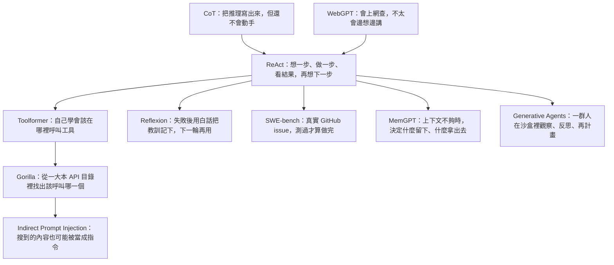

**建議把本頁加入書籤。** [論文閱讀總覽](/paper-reading/) 已有三條閱讀路徑。若你剛讀完 ReAct 相關論文，想知道各篇方法如何銜接、下一篇該讀哪篇，本頁提供一張關係圖與三種閱讀路線。

這不是新的論文筆記，也不取代各篇筆記裡的六個 Paper Essence 問題。它只回答：節點怎麼連、控制點改在哪、下一篇該點哪一條連結。

> **花花的一句話**
>
> ReAct 不是把模型變聰明，而是讓推理、行動與環境回饋出現在同一條軌跡中。後續工作分別補上工具學習、記憶、評測與安全，沒有改變這個基本迴圈。

> **花花的工程提醒**
>
> 論文庫的 Agent 系統路徑現在先讀方法基礎，不再從 OSReward 起跳。後來的排行榜分數也不能回填到 2023／2024 經典：ReAct 的 few-shot 迴圈不等於 Argus runtime，Toolformer 的 next-token API 學習不等於 MidTool，SWE-bench 的 1.96% 則是當時方法在該評測協議下的結果，不是能力天花板。

## 九十秒心智模型

1. **CoT**（Wei et al., 2022）= 只推理、不碰環境。**WebGPT**（Nakano et al., 2021）= 能行動、少有明確的語言推理。**ReAct 是匯流**：同一條軌跡裡交替 thought、action、observation。
2. ReAct 之後的研究分別回答四個問題：**工具怎麼被學會**（Toolformer）、**經驗怎麼跨 trial 寫進記憶**（Reflexion）、**真實倉庫上什麼算成功**（SWE-bench）、**有限 context 怎麼被分頁**（MemGPT）。
3. 工具路線可從 **Toolformer** 接到 **Gorilla**：前者學習何時呼叫工具，後者處理大型 API 目錄的檢索與呼叫。接著讀 **Indirect Prompt Injection**，理解工具或檢索回傳進入 prompt 後帶來的安全風險。記憶路線則由 **Reflexion、MemGPT、Generative Agents** 分別處理跨次嘗試、context 分頁與多 agent 記憶。
4. 論文庫 [Agent 系統路徑](/paper-reading/#reading-paths) 現在與本頁同序：先讀方法基礎，再按需求閱讀 2025–26 延伸研究。後續結果不能回填到較早論文，例如 SWE-Bench ProMax 的 41.2% 與後來的 Letta 產品數字，都不屬於 2023／2024 的實驗表。
5. 同名家族不等於同一層契約：few-shot ReAct ≠ Argus runtime；Toolformer 單次 API 插入 ≠ MidTool mid-training；SWE-bench 1.96% 是協議，不是模型能力上限。

CoT 與 WebGPT 都已有站上筆記；本頁只說明它們與後續方法的關係，不重複各篇內容。

## 方法關係圖

圖中的每個節點都有站內筆記，因此不再重複標示「站上已有精讀」。MemGPT 是後來補入這張圖的節點：它處理 context 不足時，哪些內容留在 prompt、哪些移到外部記憶。

## 怎麼走這張圖

### 路徑 A · 最快：ReAct 再加一篇

1. [ReAct](/paper-reading/24-react-interleaved-reasoning-acting/)：先抓住 thought–action–observation 契約。
2. 依你現在卡住的點，只選**一篇**後續論文：工具學習 → [Toolformer](/paper-reading/25-toolformer-self-supervised-api-calls/)；跨 trial 記憶 → [Reflexion](/paper-reading/27-reflexion-verbal-reinforcement/)；真實 issue 評測 → [SWE-bench](/paper-reading/26-swe-bench-github-issue-evaluation/)；context 分頁 → [MemGPT](/paper-reading/28-memgpt-context-as-memory-paging/)。
3. 先停在這裡；等工作真的遇到下一個問題，再讀對應的延伸研究。

### 路徑 B · 完整方法路徑：CoT → WebGPT → ReAct → … → Generative Agents

依 [論文精讀總覽的 Agent 系統路徑](/paper-reading/#reading-paths) 依序閱讀：

1. 推理與行動基礎：[CoT](/paper-reading/29-chain-of-thought-prompting/) → [WebGPT](/paper-reading/30-webgpt-browser-assisted-qa/) → [ReAct](/paper-reading/24-react-interleaved-reasoning-acting/)。
2. 工具與安全：[Toolformer](/paper-reading/25-toolformer-self-supervised-api-calls/) → [Gorilla](/paper-reading/35-gorilla-llm-connected-with-massive-apis/) → [Indirect Prompt Injection](/paper-reading/42-indirect-prompt-injection/)。
3. 評測與記憶：[SWE-bench](/paper-reading/26-swe-bench-github-issue-evaluation/) → [Reflexion](/paper-reading/27-reflexion-verbal-reinforcement/) → [MemGPT](/paper-reading/28-memgpt-context-as-memory-paging/) → [Generative Agents](/paper-reading/36-generative-agents-interactive-simulacra/)。

讀完這十篇即可建立方法底座。OSReward、Argus 等 2025–26 延伸研究，等遇到相應的評測或 runtime 問題再開。

### 路徑 C · 依工作選下一篇

| 你的工作卡住的點 | 建議下一篇 | 它延伸的問題 |
| --- | --- | --- |
| 工具怎麼教、schema 太多 | [Gorilla](/paper-reading/35-gorilla-llm-connected-with-massive-apis/) → [MidTool](/paper-reading/23-midtool-agentic-tool-use/)、[RAG-MCP](/paper-reading/04-rag-mcp/) | 從工具使用訓練，延伸到 API 檢索、呼叫與路由 |
| retrieved／tool 回傳是否共用指令通道 | [Indirect Prompt Injection](/paper-reading/42-indirect-prompt-injection/) → 需要時再讀 [AgentS4D](/paper-reading/12-agents4d-runtime-risks/)、[Trajectory Sentinel](/paper-reading/14-agent-trajectory-sentinel/)、[A2E](/paper-reading/19-a2e-agent-auditing-engine/) | 檢索或工具回傳進入 prompt 後的安全邊界 |
| 失敗後要記住、分數是不是真的來自經驗 | [ADIAS](/paper-reading/20-adias-issue-centric-agent-optimization/)、[PAST-Bench](/paper-reading/16-past-bench-recursive-self-improvement/) | Reflexion：跨 trial 的經驗怎麼被寫下 |
| 多人沙盒裡記憶如何支撐計畫與社會行為 | [Generative Agents](/paper-reading/36-generative-agents-interactive-simulacra/) 對照 [MemGPT](/paper-reading/28-memgpt-context-as-memory-paging/) | 觀察–反思–計畫的 memory stream，不等於單 agent 的 context 分頁 |
| 真實倉庫、大型重構還能不能算成功 | [SWE-Bench ProMax](/paper-reading/22-swe-bench-promax/) | SWE-bench：什麼算 coding 成功 |
| 長任務要 runtime、權限與回滾 | [Argus](/paper-reading/10-argus-agentic-runtime/) | ReAct 的迴圈 ≠ 可部署控制平面 |
| 搜尋了卻沒讀證據就回答 | [推理之前就可能失敗](/paper-reading/15-before-reasoning-fails/) | ReAct 能 search，但不保證 read-before-final |

## 節點一覽：控制點、一句話、不要誤讀

| 節點 | 改動的控制點 | 一句話 | 連結 | 不要誤讀 |
| --- | --- | --- | --- | --- |
| CoT | 提示裡要不要寫出中間推理 | 只推理、不碰環境 | [站上已有精讀](/paper-reading/29-chain-of-thought-prompting/) | 方法起點；few-shot prompt 引導輸出，但模型不會操作環境 |
| WebGPT | 要不要用瀏覽器行動來回答 | 能行動、少有明確語言推理 | [站上已有精讀](/paper-reading/30-webgpt-browser-assisted-qa/) | 方法基礎；瀏覽指令不是 ReAct thought |
| ReAct | 下一步是對自己說話，還是碰世界 | 把 thought 加進 action space，與 observation 交錯 | [站上已有精讀](/paper-reading/24-react-interleaved-reasoning-acting/) | few-shot 迴圈不是 Agent runtime |
| Toolformer | 訓練字串要不要插入一次 API 呼叫 | 用未來 token 損失過濾自監督工具使用 | [站上已有精讀](/paper-reading/25-toolformer-self-supervised-api-calls/) | next-token API ≠ MidTool mid-training |
| Gorilla | 巨大 API 目錄上如何檢索並呼叫 | 用 APIBench＋RAT 把文件檢索寫進微調，降低幻覺 | [站上已有精讀](/paper-reading/35-gorilla-llm-connected-with-massive-apis/) | 工具路線基礎；目錄級檢索＋呼叫不代表 MCP 產品能力，也不等於 MidTool |
| Indirect Prompt Injection | retrieved／tool 回傳是否與 user prompt 共用指令通道 | 未受信資料經檢索或工具回傳進 prompt，攻擊者可間接控制模型 | [站上已有精讀](/paper-reading/42-indirect-prompt-injection/) | 安全問題基礎；2023 控制面證據，不是 Guard 產品 SLA |
| Reflexion | 失敗後語言經驗寫進哪裡 | 凍結權重，把口語回饋寫進短記憶再開下一 trial | [站上已有精讀](/paper-reading/27-reflexion-verbal-reinforcement/) | 多次重試不是參數學習 |
| SWE-bench | 什麼算 coding 成功 | 真實 GitHub issue + 測試通過才算 resolve | [站上已有精讀](/paper-reading/26-swe-bench-github-issue-evaluation/) | 1.96% 是協議，不是天花板 |
| MemGPT | 有限 context 裡誰決定進出頁 | 把 prompt 當 RAM、外部記憶當 disk，用函式分頁 | [站上已有精讀](/paper-reading/28-memgpt-context-as-memory-paging/) | 原圖沒有這一節；不是企業 ACL 記憶層，也不是 Letta 產品數字 |
| Generative Agents | 多 agent 沙盒裡記憶如何支撐計畫 | 觀察寫入 memory stream、週期反思、檢索後規劃；25 人在 Smallville 互動 | [站上已有精讀](/paper-reading/36-generative-agents-interactive-simulacra/) | 記憶路線基礎；不是 MemGPT 單 agent 分頁，也不是生產 runtime |
| MidTool | 工具 affordance 何時教 | 把 grounding 與 execution 提前放進 mid-training | [站上已有精讀](/paper-reading/23-midtool-agentic-tool-use/) | 後續研究；不是 Toolformer 的同一份損失過濾器 |
| RAG-MCP | 太多 tool schema 時怎麼挑 | 先檢索候選 schema，再讓執行模型呼叫 | [站上已有精讀](/paper-reading/04-rag-mcp/) | 後續研究；檢索不是授權 |
| ADIAS | 修復進度以什麼為索引 | 用 issue 帳本記住修過什麼、哪個介入失效 | [站上已有精讀](/paper-reading/20-adias-issue-centric-agent-optimization/) | 後續研究；不是 Reflexion 的短緩衝 |
| PAST-Bench | 分數變好是不是因為保留經驗 | 用 persistence on／off 配對，分開 task score 與機制證據 | [站上已有精讀](/paper-reading/16-past-bench-recursive-self-improvement/) | 後續研究；測的是評測裝置，不是新的記憶演算法 SOTA |
| SWE-Bench ProMax | 大型多語言重構的分母 | 改評測單位，不是同一套 2,294 題上模型進步了 41 點 | [站上已有精讀](/paper-reading/22-swe-bench-promax/) | 後續研究；41.2% 不得寫回 SWE-bench 原表 |
| 推理前就可能失敗 | search 之後、final 之前有沒有 read | 證據前的程序失敗，不是讀完 gold 仍答錯 | [站上已有精讀](/paper-reading/15-before-reasoning-fails/) | 後續研究；Read-Gate 不是 retrieval 品質的替代品 |
| Argus | 長任務的控制平面 | 權限、verifier、rollback；不是更長的 prompt | [站上已有精讀](/paper-reading/10-argus-agentic-runtime/) | 後續研究；ReAct 迴圈不是這份 runtime |

## 本頁刻意不做的事

- **不取代六個 Paper Essence 問題。** 每篇精讀仍要自己回答：論文解決什麼、舊方法差在哪、核心技術想法、一個輸入怎麼走完、標題主張靠哪筆證據、主張在哪裡停住。本頁只定向。
- **不重複各篇精讀內容。** CoT 與 WebGPT 等節點已有完整筆記；本頁只負責說明閱讀順序。
- **論文庫 agent-systems 路徑已與本頁對齊。** 先讀 CoT 到 Generative Agents 的方法基礎，再接 2025–26 延伸研究。本頁是既有路徑的導覽，不是第四條閱讀路線。
- **不把後來數字回填經典。** 證據、作者主張、Bloss0m 判斷仍分層寫在各篇精讀裡。

讀法本身若還不熟，可搭配 [高效學術論文閱讀：三遍掃描法](/blog/08-efficient-paper-reading-three-pass/)。若要從產品架構而不是論文家族進入 Agent，改走 [AI Agent 完整指南](/blog/64-ai-agent-guide/)。

## 使用方式

- **從論文精讀總覽進來**：三條閱讀路徑仍在；若你要知道 ReAct 如何接到後續研究，可停在本頁再選連結。
- **從某一篇經典精讀進來**：文內若寫「閱讀地圖」，即指 [本頁](/blog/91-agent-method-foundation-reading-map/)。
- **要讀英文版**：同一篇地圖在 [English](/en/blog/91-agent-method-foundation-reading-map/)。

## 參考

- [論文精讀總覽](/paper-reading/)（含三條 PATH；Agent 系統路徑見 [#reading-paths](/paper-reading/#reading-paths)）
- [Wei et al., 2022, Chain-of-Thought Prompting](https://arxiv.org/abs/2201.11903)
- [Nakano et al., 2021, WebGPT](https://arxiv.org/abs/2112.09332)
- 站內方法文：[三遍掃描法](/blog/08-efficient-paper-reading-three-pass/)
- 另一張導覽（Harness 部落格，不是論文家族）：[Harness Engineering 怎麼讀：長任務 Agent 的設定與驗證](/blog/13-harness-engineering-reading-map/)
