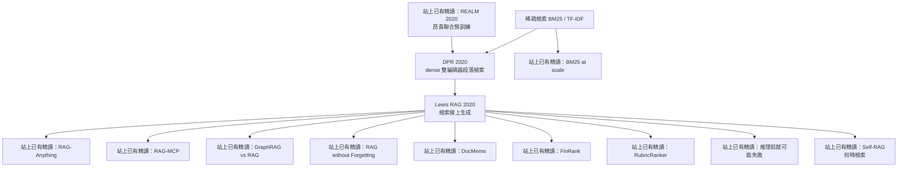

**建議把本頁加入書籤。** [論文精讀總覽](/paper-reading/) 已有三條 PATH：方法底座、檢索系統、Agent 系統。第二條從 DPR／Lewis RAG 起跳，混的是 2025–26 葉子。若你剛把 [DPR](/paper-reading/32-dense-passage-retrieval/) 與 [Lewis RAG](/paper-reading/31-retrieval-augmented-generation/) 讀完，還缺一張**脊椎圖**說明這兩篇 2020 經典如何接到站上已有的檢索精讀——本頁就是那張圖。

這不是新的論文精讀，也不取代各篇筆記裡的六個 Paper Essence 問題。它只回答：節點怎麼連、控制點改在哪、下一篇該點哪一條連結。姊妹定向頁是 [AI Agent 論文怎麼讀：從 CoT、WebGPT 到 ReAct](/blog/91-agent-method-foundation-reading-map/)（Agent vs Retrieval）。

> **花花的一句話**
>
> DPR 改的是「怎麼找段落」，Lewis RAG 改的是「找到之後怎麼生成」。後面的葉子都還長在這兩道縫口上，不是把 2020 的脊椎拆掉重做。

> **花花的工程提醒**
>
> 不要把兩張表混在一起，也不要把後來的排行榜寫回 2020。DPR 的 NQ top-20 78.4 不是 RAG-Seq 的 44.5；BM25-at-scale 談的是語料規模，不是 2020 ODQA 協議。

## 九十秒心智模型

1. **稀疏第一段檢索**（BM25／TF-IDF）是 DPR 必須勝過的預設。站上的 [BM25 at scale](/paper-reading/13-bm25-wins-at-scale/) 是**葉子**：談的是語料變大之後的準確率—成本曲線，不是 2020 開放域 QA 那套協議。
2. **DPR**（Karpukhin et al., 2020）把第一段改成 dense 雙編碼器（NQ top-20 78.4 vs BM25 59.1；搭配抽取式 reader 的 Exact Match 41.5）。**Lewis RAG**（Lewis et al., 2020）把生成改成條件化於取回的 Wikipedia 段落 $z$（NQ RAG-Seq Exact Match 44.5）。兩張表不要混讀。
3. 站上 2025–26 精讀是**葉子**：多模態、工具路由、圖、記憶寫回、證據發現、金融 hard negatives、set-wise 重排、read-before-final。它們繼承某個控制點，數字不得回填進 2020 的表。
4. **2020 RAG 不是 Production RAG 平台，也不是 Agent 迴圈。** 它沒有企業權限、hybrid 堆疊、citation 產品契約，也沒有 search／read／final 的代理迴圈。

REALM 的昂貴聯合預訓練控制點已有精讀：[REALM](/paper-reading/34-realm-retrieval-augmented-pretraining/)。ORQA 仍只連 [arXiv:1911.03868](https://arxiv.org/abs/1911.03868)，不做假精讀。Self-RAG 的「何時檢索」控制點已有精讀：[Self-RAG](/paper-reading/33-self-rag-retrieve-generate-critique/)。

## 脊椎圖

圖中「站上已有精讀」在正文裡讀成「你已經可以點開的筆記」。REALM 已接到站上精讀；ORQA 仍是 arXiv-only 相關祖先；Self-RAG 談的是 when-to-retrieve。

## 怎麼走這張圖

### 路徑 A · 最快：DPR 再加 Lewis RAG

1. [DPR](/paper-reading/32-dense-passage-retrieval/)：先抓住 dense 雙編碼器取代稀疏第一段的契約。
2. [Lewis RAG](/paper-reading/31-retrieval-augmented-generation/)：再看取回的 $z$ 如何條件化生成（RAG-Sequence／RAG-Token）。
3. 停。葉子等你真的需要那個控制點再讀。

### 路徑 B · 經典脊椎：稀疏對手 → REALM → DPR → RAG，ORQA 仍 arXiv-only

先建立昂貴祖先與「DPR 要勝過誰」：[REALM](/paper-reading/34-realm-retrieval-augmented-pretraining/) → [稀疏 BM25 作為對手](/paper-reading/32-dense-passage-retrieval/)（在 DPR 筆記裡對照）→ [DPR](/paper-reading/32-dense-passage-retrieval/) → [Lewis RAG](/paper-reading/31-retrieval-augmented-generation/)。ORQA 只當相關先前工作，連 [ORQA arXiv:1911.03868](https://arxiv.org/abs/1911.03868)，不做假精讀。這條路建立方法底座，不代替 [論文精讀總覽的檢索系統路徑](/paper-reading/#reading-paths)——那條現從 REALM／DPR／RAG 起跳後混進多模態、工具、圖與 runtime 葉子。

### 路徑 C · 從工作選葉子

| 你的工作卡住的點 | 先讀這片葉子 | 它繼承的控制點 |
| --- | --- | --- |
| 語料變大、hybrid／規模成本 | [BM25 at scale](/paper-reading/13-bm25-wins-at-scale/) | 稀疏檢索在大規模下的準確率—成本，不是 2020 ODQA 協議 |
| PDF／圖表／多模態文件 | [RAG-Anything](/paper-reading/03-rag-anything/) | 檢索對象從純文字段落變成可回指的多模態節點 |
| 工具 schema 太多、要先檢索再呼叫 | [RAG-MCP](/paper-reading/04-rag-mcp/) | 把「檢索」用在工具描述路由，不是授權 |
| 要不要上知識圖譜 | [GraphRAG vs RAG](/paper-reading/07-graphrag-vs-rag/) | 圖索引是不是這類問題的必要升級 |
| 成功的 expansion 能不能寫回索引 | [RAG without Forgetting](/paper-reading/05-rag-without-forgetting/) | 記憶寫回與 correctness gate |
| 證據要動態探索，不是一次 top-$k$ | [DocMemo](/paper-reading/21-docmemo-dynamic-evidence-discovery/) | 證據發現過程 |
| 金融／難負例、證據接地 | [FinRank](/paper-reading/18-finrank-evidence-grounded-rag/) | 排序與 hard negatives |
| Deep research 的 set-wise 重排 | [RubricRanker](/paper-reading/17-rubric-ranker-deep-research/) | 重排契約 |
| 搜尋了卻沒讀證據就回答 | [推理之前就可能失敗](/paper-reading/15-before-reasoning-fails/) | read-before-final；不是把 retrieval 品質換成 Read-Gate |
| 模型要不要自己決定何時檢索 | [Self-RAG](/paper-reading/33-self-rag-retrieve-generate-critique/) | when-to-retrieve；reflection tokens，不是 Read-Gate |

## 節點一覽：控制點、一句話、不要誤讀

| 節點 | 改動的控制點 | 一句話 | 連結 | 不要誤讀 |
| --- | --- | --- | --- | --- |
| 稀疏 BM25／TF-IDF | 第一段要不要靠詞重疊倒排 | DPR 必須勝過的預設稀疏檢索 | 見 [DPR 筆記內對照](/paper-reading/32-dense-passage-retrieval/) | 對手基線，不是站上 BM25-at-scale 葉子 |
| REALM | 預訓練要不要聯合檢索與異步索引刷新 | 昂貴檢索增強預訓練祖先；DPR 主張不必走這條帳單 | [站上已有精讀](/paper-reading/34-realm-retrieval-augmented-pretraining/) | 祖先；不是 production RAG，也不是 Lewis RAG 生成表 |
| ORQA | 潛變數 dense 檢索＋ICT（相關先前） | REALM 的直接對照起點之一；本站不做精讀 | [arXiv:1911.03868](https://arxiv.org/abs/1911.03868) | 只連 arXiv；不要期待 2026 格式筆記 |
| DPR | 第一段要不要改成 dense 雙編碼器 | 兩個 BERT、點積 MIPS；NQ top-20 78.4 vs 59.1，extractive EM 41.5 | [站上已有精讀](/paper-reading/32-dense-passage-retrieval/) | 檢索表不是 Lewis RAG 的生成表 |
| Lewis RAG | 生成要不要條件化於取回的 $z$ | BART＋DPR 初始化 retriever；NQ RAG-Seq 44.5 | [站上已有精讀](/paper-reading/31-retrieval-augmented-generation/) | 2020 方法論文 ≠ Production RAG 平台 ≠ Agent 迴圈 |
| BM25 at scale | 語料變大後準確率—成本怎麼拐 | 大規模企業型梯度上的稀疏／agent 成本葉子 | [站上已有精讀](/paper-reading/13-bm25-wins-at-scale/) | 葉子；不是 2020 ODQA 協議 |
| RAG-Anything | 文件節點能不能保留多模態結構 | 表格／圖／公式可回指，不是 caption-only | [站上已有精讀](/paper-reading/03-rag-anything/) | 葉子；數字不回填 2020 |
| RAG-MCP | 太多 tool schema 時怎麼挑 | 先檢索候選 schema，再讓執行模型呼叫 | [站上已有精讀](/paper-reading/04-rag-mcp/) | 葉子；檢索不是授權 |
| GraphRAG vs RAG | 要不要為多跳／結構關係上圖 | 系統性比較圖與向量路線的採用邊界 | [站上已有精讀](/paper-reading/07-graphrag-vs-rag/) | 葉子；不是 Lewis RAG 的替換件 |
| RAG without Forgetting | 成功 expansion 寫回哪裡 | correctness gate 後的 index adaptation | [站上已有精讀](/paper-reading/05-rag-without-forgetting/) | 葉子；寫回不是無條件記憶 |
| DocMemo | 證據要一次取回還是動態發現 | 動態證據探索，不是固定 top-$k$ | [站上已有精讀](/paper-reading/21-docmemo-dynamic-evidence-discovery/) | 葉子；不是 xMemory（那是 Agent 記憶） |
| FinRank | 金融難負例下證據怎麼排 | evidence-grounded 排序葉子 | [站上已有精讀](/paper-reading/18-finrank-evidence-grounded-rag/) | 葉子；數字不回填 2020 |
| RubricRanker | Deep research 如何 set-wise 重排 | 用 rubric 做集合式重排 | [站上已有精讀](/paper-reading/17-rubric-ranker-deep-research/) | 葉子；不是第一段檢索 |
| 推理前就可能失敗 | search 之後、final 之前有沒有 read | 證據前的程序失敗，不是讀完 gold 仍答錯 | [站上已有精讀](/paper-reading/15-before-reasoning-fails/) | 葉子；Read-Gate ≠ retrieval 品質替代品 |
| Self-RAG | 要不要／何時呼叫檢索 | 自我反思決定 retrieve／critique | [站上已有精讀](/paper-reading/33-self-rag-retrieve-generate-critique/) | when-to-retrieve；不是 Read-Gate，也不是 Production RAG 閘門 |

## 本頁刻意不做的事

- **不取代六個 Paper Essence 問題。** 每篇精讀仍要自己回答：論文解決什麼、舊方法差在哪、核心技術想法、一個輸入怎麼走完、標題主張靠哪筆證據、主張在哪裡停住。本頁只定向。
- **不發明 ORQA 精讀。** ORQA 仍只連 arXiv。REALM 與 Self-RAG 已有 [REALM](/paper-reading/34-realm-retrieval-augmented-pretraining/)／[Self-RAG](/paper-reading/33-self-rag-retrieve-generate-critique/) 站上精讀；本頁只做定向，不重寫六個 Paper Essence 問題。
- **不重寫論文庫的 retrieval-systems 路徑敘事。** 那條路徑現從 REALM → DPR → RAG → Self-RAG 起跳後混多模態、工具、圖與 runtime。本頁是方法底座的脊椎，不是第四種 path type。
- **不把後來數字回填經典，也不混用 DPR 與 Lewis RAG 兩張表。** 證據、作者主張、Bloss0m 判斷仍分層寫在各篇精讀裡。
- **不把 xMemory 或 AskChem 硬塞進這條脊椎。** xMemory 屬 Agent 記憶；AskChem 是 claim-centered synthesis，不在本圖第一類祖先／葉子上。

讀法本身若還不熟，可搭配 [高效學術論文閱讀：三遍掃描法](/blog/08-efficient-paper-reading-three-pass/)。若要從產品架構而不是論文家族進入 RAG，改走 [Enterprise RAG 完整指南](/blog/65-enterprise-rag-guide/)。Agent 家族的姊妹圖見 [AI Agent 論文怎麼讀：從 CoT、WebGPT 到 ReAct](/blog/91-agent-method-foundation-reading-map/)。

## 使用方式

- **從論文精讀總覽進來**：三條 PATH 仍在；若你要的是 DPR／Lewis RAG 怎麼接到葉子，停在本頁再點連結。檢索系統路徑見 [#reading-paths](/paper-reading/#reading-paths)。
- **從某一篇經典精讀進來**：文內若寫「閱讀地圖」，即指 [本頁](/blog/92-rag-method-foundation-reading-map/)。
- **要讀英文版**：同一篇地圖在 [English](/en/blog/92-rag-method-foundation-reading-map/)。

## 參考

- [論文精讀總覽](/paper-reading/)（含三條 PATH；檢索系統路徑見 [#reading-paths](/paper-reading/#reading-paths)）
- [Karpukhin et al., 2020, Dense Passage Retrieval](https://arxiv.org/abs/2004.04906)
- [Lewis et al., 2020, Retrieval-Augmented Generation](https://arxiv.org/abs/2005.11401)
- [Guu et al., 2020, REALM — on-site note](/paper-reading/34-realm-retrieval-augmented-pretraining/)
- [Guu et al., 2020, REALM arXiv](https://arxiv.org/abs/2002.08909)
- [Lee et al., 2019, ORQA](https://arxiv.org/abs/1911.03868)
- [Asai et al., 2023, Self-RAG](https://arxiv.org/abs/2310.11511)
- 站內方法文：[三遍掃描法](/blog/08-efficient-paper-reading-three-pass/)
- 姊妹定向頁（Agent 家族）：[AI Agent 論文怎麼讀：從 CoT、WebGPT 到 ReAct](/blog/91-agent-method-foundation-reading-map/)
- 另一張導覽（Harness 部落格，不是論文家族）：[Harness Engineering 導覽](/blog/13-harness-engineering-reading-map/)
