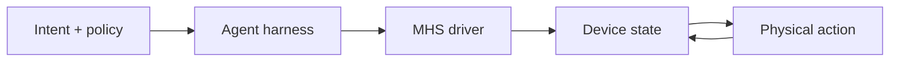

當 AI Agent 從檔案、資料庫與 API 走向顯微鏡、液體處理器、機械臂或量子電腦的雷射系統，真正先撞上的問題不是模型會不會推理，而是每一台裝置都用不同的介面、狀態格式與操作語意。Anthropic 在 2026 年 8 月 27 日公開的 **[Model Hardware Standard（MHS）研究預覽](https://www.anthropic.com/news/model-hardware-standard-research-preview)**，試圖把這一層收斂成一個讓 Agent 可以發現、讀取、寫入並編排實體裝置的共同形狀。

本文的結論先說在前：MHS 比較像是「給實體世界的 MCP 形狀介面」，解決的是 **adapter、discoverability 與 orchestration**；它不是完整的硬體安全標準，也不是把模型變成可被信任的控制器。公開材料仍稱 MHS 為限量、申請制的 research preview，正式規格與開源版本尚未釋出。

> **花花的一句話**
>
> MHS 讓 Agent 用共同語言看見並操作不同裝置，但「誰可以做什麼、什麼時候必須停下來、失敗後如何收拾」仍是平台的責任。

## 先把「標準化」放在正確的一層

把 MHS 想成硬體控制堆疊中的一層，而不是一個包辦所有風險的產品：

| 層次 | 要回答的問題 | MHS 研究預覽目前處理的部分 |
| --- | --- | --- |
| 裝置適配層 | 不同廠牌怎麼被同一套軟體呼叫？ | 以標準化 driver 將作業系統與裝置的專屬介面接起來 |
| 能力與狀態層 | Agent 怎麼知道裝置能測什麼、能調什麼、有哪些限制？ | discoverability、read/write 原語、裝置特性與安全限制的 reference file |
| Agent 通路層 | Agent harness 怎麼送出請求、跨裝置編排？ | MCP、command line interface 與 code files（APIs）三種控制方式 |
| 平台治理層 | 誰有權限、哪些動作要核准、故障怎麼隔離？ | 公開材料只透露仍在發展安全評估與最佳實務，沒有公開完整授權模型 |
| 實體與業務層 | 這個動作對樣本、機器、環境或產品是否安全？ | 仍須由裝置控制器、工程師、操作流程與平台共同保護 |

這個分層很重要。若把「有 safety limits」誤讀成「平台已經完成 authorization、approval 與 incident response」，就會把介面契約誤當成安全邊界。

## MHS 實際標準化了什麼？

### 1. 用 driver 隱藏廠商差異

Anthropic 的描述是：MHS driver 位在電腦作業系統與硬體裝置之間，把各家裝置原本不同的程式介面轉成共同的控制方式。這個抽象化首先解決的是整合成本：研究團隊不必為液體處理器、機械臂、讀板機各自再寫一套 Agent connector，便能把它們放進同一個工作流。

這不是「任何硬體插上就能用」。MHS 目前的適用邊界是 **有 programmable interface 的裝置**；沒有程式介面的設備仍需要製造商或整合者先補上 driver。driver 本身也必須正確翻譯命令、處理連線中斷與回報真實狀態，否則共同介面只是把錯誤包裝得更一致。

### 2. 用少量原語描述觀測與改變

公開說明以 `read`（例如讀取溫度）與 `write`（例如設定溫度）作為簡單原語。這種共同詞彙讓 Agent 能把「先讀狀態，再調整參數，再讀回結果」套用到多種設備；也讓跨裝置編排不必理解每個廠商的命令語言。

但 `write` 只是「提出一個狀態變更」，不是安全批准。實際執行仍需要檢查數值範圍、裝置目前狀態、樣本狀態、互斥條件、操作者身分與是否需要人工確認。對機械臂來說，合法的座標不等於安全的動作；對液體處理器來說，合法的流速也不代表此時不會造成氣泡或污染。

### 3. 把程式碼看不到的硬體知識變成可發現的描述

MHS 的另一個重點是裝置特性標籤。像機械臂重量、可以測量或調整的項目、會被強制執行的安全限制，可能原本只存在於紙本手冊、某位工程師的電腦或團隊的默會知識。公開材料表示，使用者可以用自然語言補充這些 tags，driver 再產生描述裝置能力與限制的 reference file。

這是很有價值的 **context packaging**，但不是物理真理的自動證明。標籤可能過期、填錯、缺少環境條件，或沒有表達「兩個裝置同時運轉時」才出現的限制。平台需要把描述的來源、版本、審核者與生效範圍記錄下來，不能因為文字看起來完整就把它當成已驗證的 interlock。

### 4. 讓同一套裝置可被不同 Agent 通路使用

Anthropic 表示 MHS 可透過 MCP、CLI 與 code files（APIs）控制硬體，並且設計成 model-agnostic，讓不同 Agent harness 都能接入。這裡的「MCP-shaped」不是說 MHS 等於 MCP：MCP 是 AI 應用與外部 server 之間的開放協定；MHS 則把硬體 driver、裝置描述與控制原語組成面向實體設備的介面。MCP 可以是其中一條 transport／integration path。

因此，合理的架構會像這樣：

圖中的 `Intent + policy` 與 `Agent harness` 不會因為加上 MHS 就消失；它們負責目標、規則、停止條件與何時讓人接手。MHS driver 讓裝置可被一致地讀寫，裝置控制層則必須拒絕超出自身能力或安全邊界的命令。

## 早期案例證明了什麼？

### Genentech：跨三台儀器完成 BCA assay proof of concept

Anthropic 與 Genentech 描述的案例用 liquid handler、robotic arm 與 microplate reader 協作執行 BCA protein assay。Claude 透過 MHS 讀取三台設備的狀態、執行液體轉移、移動 plate、讀取吸光值，再根據結果調整流速。這展示的是 **共同介面如何讓 Agent 進入跨裝置 closed loop**。

同一案例也清楚展示 MHS 沒有消除物理世界的 failure boundary：黏稠的蛋白溶液在流速過高時會產生氣泡，造成實際轉移量偏差、液面偵測錯誤與光學讀值失真。Claude 一開始傾向在同一孔位重試，研究人員必須告訴它這是物理問題，應移到乾淨孔位並降低混合次數。也就是說，driver 可以回報錯誤，Agent 可以重新規劃，但「這個錯誤代表樣本已經被影響到什麼程度」仍需要領域知識與平台流程。

### HHMI Janelia：把七套 vendor 程式接成一個 rig

Janelia 的顯微鏡案例描述一個由七個不同 vendor 程式組成、原本沒有共享介面的 rig。MHS 把 rig 的狀態放進共同的標準化字典，讓 Agent 在決策點選擇成像區域與分析流程，並讓研究者能即時觀察資料。案例也提到 MHS 的 device-level safety limits 可避免 Agent 意外使用過高雷射功率。

公開可檢視的 [Gently microscopy repository](https://github.com/gently-project/gently) 是 Anthropic 文章連結到的相鄰實作，並非 MHS 正式規格本身。它把 process isolation、device limits、受限 plan vocabulary 與 error cleanup 分成多層保護，正好說明實體 Agent 需要的安全通常是 **stack**，不是單一協定的屬性。

### QuEra：99.3% 是一個具體測試，不是通用保證

QuEra 的案例讓 Agent 讀取儀器、調整雷射控制，並在夜間反覆測試不同干擾。Anthropic 報告後續產生的 deterministic、可檢查 script，在 700 次隨機干擾試驗中成功恢復 695 次，也就是 99.3%；最終 script 可以在沒有 Agent 參與的情況下執行。

這個數字值得看，但必須保留它的邊界：它是特定雷射 lock recovery 任務、特定干擾集合與特定測試環境的結果；它支持「Agent 可以把探索經驗整理成可重播的控制程式」，不支持「MHS 對任意硬體有 99.3% 安全可靠度」。而且，公開案例的成熟產物反而是 deterministic script，不是讓線上模型永遠直接控制雷射。

> **花花的工程提醒**
>
> 實體 Agent 的最佳分工通常是讓模型探索、提出假設與選擇決策點，再把已驗證的穩定迴圈編譯成可檢查、可測試、可停止的 deterministic workflow。

## 哪些安全與權限仍由平台負責？

截至這個 research preview，官方公開材料談到 driver、裝置描述、device-level safety limits 與正在建立的安全評估，但沒有交代一套可供外部團隊直接採用的完整 identity、RBAC、token、approval 或 audit schema。因此，平台設計不能把 MHS 的 discoverability 當成 authorization。

至少要把下列責任放在 MHS 之外，並由確定性元件執行：

1. **身分與委託關係**：確認是哪位使用者、哪個 Agent workload、哪個租戶在代表誰執行；不要只相信模型自述的角色。
2. **最小權限與 action policy**：區分 read、低風險可回復 write、不可逆或高能量動作；把裝置、樣本、環境與時間範圍綁進授權。
3. **人工核准與 step-up control**：高雷射功率、移動機械臂、丟棄樣本、對外輸出或改變生產狀態，應由人確認實際參數與影響，不是只確認自然語言摘要。
4. **獨立 interlock 與限幅**：平台策略、driver 限制與硬體 emergency stop 應彼此獨立；Agent 失常時，硬體仍能停在安全狀態。
5. **併發、租約與 idempotency**：同一台設備不能被兩個 Agent 同時寫入；長時間任務要有 lease、timeout、取消、重試與避免重複副作用的 request identity。
6. **trace、證據與版本治理**：記錄模型看到的狀態、driver 描述版本、政策決定、實際參數、裝置回應與人工介入，讓一次實驗能被重播與追查。
7. **故障復原與 kill switch**：平台要定義哪些錯誤可重試、哪些必須換樣本或通知工程師、何時隔離設備，以及如何停止跨裝置工作流。

這些控制不是把 MHS 的價值打折，而是把它放在正確位置：MHS 提供可被政策引擎檢查的共同操作表面；平台決定這個表面在什麼條件下可以被誰使用。

## Failure boundary：錯誤發生時誰要負責？

可以用四個問題切責任：

| Failure boundary | 代表性失敗 | 應由誰處理 |
| --- | --- | --- |
| 介面與連線 | 命令格式錯、driver 翻譯錯、裝置斷線 | driver／device service；回報明確、可判斷的錯誤 |
| 硬體與物理過程 | 氣泡、漂移、過熱、碰撞、樣本污染 | 裝置互鎖、感測器、領域專家與安全流程 |
| Agent 推理與編排 | 選錯工具、誤解狀態、無限重試、錯誤組合動作 | Agent harness 的 policy、步數／成本上限、人工介入與 trace |
| 平台與營運 | 越權、跨租戶、憑證外洩、併發競爭、事故後無法復原 | control plane、IAM、審計、租戶隔離、on-call 與 runbook |

這也說明為什麼「MHS 可以 recover from hardware errors」必須精讀。它表示某些案例中 Agent 能根據觀測結果做出恢復動作，不代表所有硬體錯誤都可由軟體安全修復；Anthropic 自己的 Genentech 案例已指出，模型需要人類協助理解泡沫造成的物理失敗。

## 證據已到哪裡，還沒有到哪裡？

截至 2026-09-09，可以把公開狀態分成兩欄：

| 已有證據 | 尚未證明或尚未公開 |
| --- | --- |
| Anthropic 與 HHMI Janelia 發起；合作夥伴涵蓋科學、機器人、電子與製造 | 可供普遍使用的正式 specification、版本治理與相容性測試套件 |
| 限量、申請制 research preview；目標是先建安全評估與最佳實務，再開源 | 公開、完整的 auth、approval、audit、revocation 與 incident protocol |
| MHS 面向有 programmable interface 的設備，且可透過 MCP、CLI、API 進入 | 沒有程式介面的硬體仍不在目前支援範圍；跨廠牌、跨領域的廣泛互通性尚未建立 |
| Genentech、Janelia、QuEra 等早期 proof of concept；QuEra 報告特定 700 trial 的 99.3% recovery | 通用的安全、可靠度、成本或效能 benchmark；也沒有證據支持任意 Agent 可無人監督運作 |

官方 [MHS 網站](https://www.modelhardwarestandard.com/) 目前仍將它描述為 limited research preview，並以申請方式加入。這個狀態不是缺點的附註，而是採用決策的一部分：今天可以研究介面形狀與安全架構，不能把它當成已完成的產業標準或 production certification。

## 給平台與硬體團隊的採用順序

若團隊想實驗 MHS 類似的介面，建議把第一個里程碑設成「可觀測的 read-only integration」，而不是「讓 Agent 自主控制整個實驗」：

1. 先列出每個裝置的 capability、單位、狀態、前置條件、限制、回報錯誤與安全停機方式。
2. 以 driver 和 reference file 對齊語意，但為每個描述加上版本、來源、審核者與過期時間。
3. 先做 read-only、shadow mode 與 simulation，測試 discovery、狀態新鮮度、權限拒絕與跨裝置 trace。
4. 再開放小範圍、可回復、可限幅的 write；任何高風險 action 都經過獨立 policy engine 與人工核准。
5. 把長時間、頻繁且已驗證的閉環移出線上 reasoning，生成 deterministic script，並以相同的干擾集合做回歸測試。
6. 用事故演練驗證 timeout、斷線、錯誤重試、憑證撤銷、設備互鎖與 kill switch，而不是只展示 happy-path demo。

這個順序延續本站 [AI Agent 完整指南](/blog/64-ai-agent-guide/) 的基本原則：讓 Agent 處理真正無法預先寫死的決策，把可預測、需要強稽核的部分留在確定性工作流。MCP 的共同介面價值可參考 [MCP 規格更新](/blog/34-model-context-protocol-mcp/)，但「標準介面不等於安全授權」同樣適用在 MHS。

在企業環境，還需要把責任接到 [Enterprise Agentic AI 治理](/blog/39-enterprise-agentic-ai-governance/) 的 control plane，以及 [企業 AI Agent 安全架構](/blog/43-enterprise-ai-agent-security/) 所談的 execution envelope：模型可以提議下一步，模型之外的控制面才決定這一步是否被允許、是否需要人、是否留下足夠證據。

> **花花的判斷**
>
> MHS 的長期價值不在於宣稱「AI 已經懂硬體」，而在於把硬體能力、狀態與限制整理成可被多種 Agent harness 重用、評測與治理的共同契約。

## 一手來源與延伸閱讀

- [Anthropic：Previewing the Model Hardware Standard](https://www.anthropic.com/news/model-hardware-standard-research-preview) — MHS 研究預覽、driver、原語、早期案例與限制。
- [Model Hardware Standard 官方網站](https://www.modelhardwarestandard.com/) — research preview 的申請制狀態與開源前的專案定位。
- [Gently：Agentic harness for microscopy](https://github.com/gently-project/gently) — Anthropic 文章連結的公開相鄰實作；用於觀察 process isolation、device limits、plan constraints 與 cleanup 如何分層，不把它當成 MHS 正式規格。
- [Model Context Protocol：Architecture](https://modelcontextprotocol.io/specification/2025-06-18/architecture) — MCP host、client、server 與能力協商的協定邊界。
- [Anthropic：Introducing the Model Context Protocol](https://www.anthropic.com/news/model-context-protocol) — MCP 作為 AI 應用連接外部系統的開放標準之原始公告。
