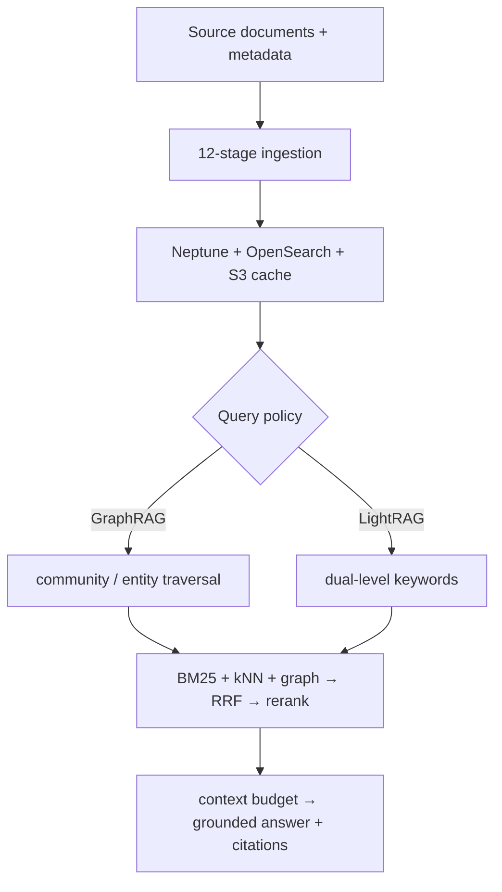

When an answer is distributed across several documents, the hard part is not only finding the passage most similar to the question. The system must connect entities, relationships, and sources into a defensible evidence chain. In [Unified Knowledge Graph RAG on AWS](https://aws.amazon.com/blogs/opensource/unified-knowledge-graph-rag-on-aws-graphrag-and-lightrag-on-one-stack/), published by the AWS Open Source Blog on September 14, 2026, AWS offers a useful design to study: place Microsoft GraphRAG community summaries and LightRAG dual-level keyword retrieval on one AWS-native stack, then choose the strategy per query.

The important claim is not that GraphRAG beats LightRAG, or that one method is a permanent winner for enterprise data. The useful boundary is architectural: ingestion and data lineage are one layer, query policy is another, and hybrid retrieval, reranking, context assembly, and generation form a shared layer beneath them. Teams can therefore compare policies against the same graph, documents, and model conditions instead of rebuilding the entire data pipeline whenever they change methods.

> **Huahua in one sentence**
>
> GraphRAG and LightRAG should be query policies selected for the question, not one global switch applied to every question.

This article uses the AWS Open Source Blog, the [awslabs/unified-kg-rag-on-aws repository](https://github.com/awslabs/unified-kg-rag-on-aws), and its [technical design document](https://github.com/awslabs/unified-kg-rag-on-aws/blob/main/docs/design.md) as primary sources. Quality, cost, and latency figures below are AWS-run measurements on public benchmarks; the architecture and lineage discussion follows the public reference implementation and design document. The proposed provenance contract is a Bloss0m engineering recommendation, not a claim that AWS has delivered a complete enterprise-governance product.

## Why vector-only RAG stalls on relationship questions

Conventional vector RAG chunks documents, embeds the chunks and query, and returns the nearest candidates. That works well for “What is the warranty period in section 4?” when the answer is concentrated in one passage. Three other question shapes need more than nearby text:

- **Multi-hop questions:** an amendment changes a milestone, a master agreement ties payment to that milestone, and a risk memo connects it to supply-chain impact. The answer must cross documents and entities.
- **Cross-document aggregation:** a request to list every clause that references the same indemnity cap has no single chunk containing the full list.
- **Global or thematic questions:** “What are the main risks across the corpus?” requires synthesis across topics and communities rather than a top-k neighborhood.

A knowledge graph connects extracted entities and relationships to the text units where they appeared. It can represent who is related to whom, how, and in which source passages. That does not make the result automatically correct: an LLM can miss an entity, resolution can merge the wrong names, and graph expansion can add irrelevant context. Graph retrieval supplies a different structure; it still requires data quality, evaluation, and source governance.

## One ingestion backbone, two query methods

The [AWS reference repository](https://github.com/awslabs/unified-kg-rag-on-aws) clean-room re-implements both methodologies and publishes the result under Apache-2.0. They share ingestion outputs—chunks, entities, relationships, communities, embeddings, and state used for caching and incremental processing. The branch happens at the retrieval layer.

| Dimension | GraphRAG | LightRAG |
| --- | --- | --- |
| Core indexing idea | Run Leiden community detection and generate hierarchical community reports | Skip community summaries and retain dual-level entity and relationship retrieval |
| Query focus | `local` expands from entities; `global` map-reduces communities; `drift` explores iteratively | Low-level keywords find concrete entities; high-level keywords find relationships, followed by graph expansion |
| Exposed strategies | `simple`, `local`, `global`, `drift`, `auto` | `naive`, `hybrid`, `mix` |
| Where work is paid | Pushes part of the community-summarization reasoning cost into indexing | Keeps indexing lighter but moves more interpretation and retrieval work to each query |
| Useful question shape | Entity context, corpus-wide thematic synthesis, exploratory questions | Relationship-oriented entity lookup, multi-hop questions, and answers that should retain source chunks |

GraphRAG `global` is not simply a larger `local` search. It depends on community reports, reducing partial answers across topics into a synthesis. That is sensible for a corpus-wide narrative but can discard details needed for a single exact value. LightRAG `hybrid` uses low- and high-level keywords to search entity and relationship indexes, then expands through Neptune; `mix` also brings in the original chunks cited by matched entities and relationships, so the answer is not limited to short graph descriptions.

## End-to-end architecture: the policy changes how the graph is traversed

The engineering value of this stack is the separation between how knowledge is built and how a question is answered. The following is a compact view from source documents to a cited answer; GraphRAG and LightRAG branch only at query policy.

### Ingestion: 12 checkpointable stages

The public design document describes `DataIngestionPipeline` as 12 ordered stages: document parsing, loading, chunking, optional translation, graph extraction, optional gleaning, graph resolution, optional claim extraction/resolution, graph analysis, community detection, and indexing. The early stages turn inputs such as PDF, TXT, CSV, and JSON into text units. The middle stages use an LLM to extract and merge entities and relationships. The final stage writes the graph to Neptune and BM25/vector indexes to OpenSearch.

Each stage can write to a local cache and optionally sync it to S3. A failed run can resume from a checkpoint with a pipeline ID and resume-from-stage instead of treating the whole expensive pipeline as one indivisible request. Translation, gleaning, claim extraction, and community detection are bounded configuration choices, not capabilities that every corpus or deployment must enable.

### What each AWS component does

| Concern | AWS service | Role in the reference stack |
| --- | --- | --- |
| LLM, embedding, reranking | Amazon Bedrock | Entity/relationship extraction, summaries, answers, embeddings, and optional reranking |
| Graph storage | Amazon Neptune | Entity/relationship graph and Gremlin traversal, with idempotent upserts |
| Lexical and vector search | Amazon OpenSearch Service | BM25 lexical indexes, kNN vector indexes, and entity/relationship/chunk retrieval |
| Incremental state | Amazon DynamoDB | Optional document-status registry with content hashes and artifact lineage |
| Source documents and cache | Amazon S3 | Corpus, stage cache, and artifacts reused across runs |

At query time, the framework can perform language processing, translation, and entity/keyword extraction before the selected strategy retrieves candidates. A fixed triple-hybrid backbone gathers results from OpenSearch BM25, OpenSearch kNN, and Neptune graph expansion. Reciprocal Rank Fusion (RRF) combines them, Bedrock reranking is optional, a token budget assembles the context, and the model generates an answer with source attribution. The policy changes how graph candidates are produced; fusion, reranking, context construction, and answer policy remain shared.

That boundary is also visible in the repository’s hexagonal architecture: the domain core does not depend on boto3 or LangChain, retrieval strategies self-register through a registry, and concrete backends arrive through role-based injection. Adding a strategy does not require a central `if/elif` branch. This demonstrates extensibility, however, not completed multi-tenant isolation or a service-level guarantee.

## Strategy selection: start with question shape, then budget

“Which is better, GraphRAG or LightRAG?” is not a sufficient production question. Treat query policy as an observable, evaluable routing decision:

| Question shape | First strategy to measure | Why |
| --- | --- | --- |
| Single fact, exact field, or short FAQ | `simple` or `naive`, alongside a normal vector/hybrid baseline | Graph construction and traversal may add no value |
| Detail around one entity | `local` or `mix` | Needs graph expansion while retaining source evidence |
| Cross-document, multi-hop relation | Compare `local`, `hybrid`, and `mix` on one evaluation set | Graph expansion is useful, but quality and cost depend on the question distribution |
| Corpus-wide thematic narrative | `global`, with a separate thematic evaluation | It is designed for community synthesis; extractive QA is the wrong substitute |
| Multi-faceted, iterative exploration | `drift` or a constrained router | Repeated expansion adds latency, tokens, and failure points |

`auto` lets an LLM router choose among strategies, but AWS explicitly says that `auto` itself was not benchmarked. The table’s numbers belong to the strategies it may route to, not to `auto` as a quality guarantee. A production router should record query class, router version, selection rationale, candidate policies, and fallback in the trace. Otherwise, when answers regress, the team cannot tell whether routing was wrong, the graph was poorly extracted, or generation failed.

## AWS-run benchmark: quality, cost, and latency do not share one ranking

AWS used 100 questions each from MuSiQue and 2WikiMultihopQA, both deliberately requiring hops across documents. Every strategy answered against the same graph with the same model and scorer; token-F1 is the mean of three runs. The full public comparison is below. `MuSiQue / 2Wiki` are token-F1, cost is an estimate per 1,000 queries, and latency is median response time.

| Strategy | Method | MuSiQue | 2Wiki | Per 1,000 queries | Median |
| --- | --- | ---: | ---: | ---: | ---: |
| `hybrid` | LightRAG | 0.634 | 0.628 | $42.29 | 19.8s |
| `mix` | LightRAG | 0.602 | **0.654** | $38.67 | 23.6s |
| `local` | GraphRAG | 0.519 | 0.577 | **$5.23** | **6.5s** |
| `drift` | GraphRAG | 0.379 | 0.541 | $7.99 | 12.0s |
| `naive` | LightRAG, vector only | 0.354 | 0.424 | $8.56 | 7.3s |
| `global` | GraphRAG | 0.231 | 0.396 | $66.22 | 17.3s |
| `simple` | GraphRAG | 0.209 | 0.374 | $7.41 | 5.1s |

Read the table this way:

1. `hybrid` leads MuSiQue and `mix` leads 2Wiki, but the gaps are only 0.032 and 0.026. They are not a permanent championship; AWS advises treating differences below roughly 0.05 as noise.
2. `local` costs $5.23 per 1,000 queries with a 6.5-second median; `hybrid` costs $42.29 with a 19.8-second median. That is about eight times the cost and three times the latency for roughly 0.12 and 0.05 F1 gaps across the two datasets. It may be reasonable for low-volume, accuracy-first work, but 100,000 monthly queries is a different financial decision.
3. `global` performs worst on these extractive multi-hop benchmarks. That does not mean it cannot answer global questions: its context contains a few longer community summaries that can omit exact values. AWS separately used a 28-question UltraDomain thematic set with an LLM judge: `global` beat plain vector search 64% of the time, compared with 82% for `local` and 93% for `mix`. This is not universal evidence; the judge and generator share a model family.
4. The cost column covers query cost, not all infrastructure, embedding, graph-extraction, or indexing costs. On one corpus AWS observed community summarization at roughly 7.6% of the ingestion bill, while entity/relationship extraction—which both methods require—remained the dominant cost.

These are AWS-run experiments under a specific setup, not independent production benchmarks. The cost run used Claude Sonnet 4.5 and Titan Text Embeddings V2 at on-demand prices in us-west-2, measured in August 2026, with separate 20-question runs executed strictly one at a time. Your region, models, cache behavior, concurrency, tokenization, query mix, and corpus size will change the result.

### Differences from upstream reference implementations

AWS also compared the clean-room implementation with upstream GraphRAG and LightRAG reference implementations using the same questions and offline scorer. LightRAG `mix` scored 0.602/0.654 on MuSiQue/2Wiki here versus 0.591/0.629 upstream; `hybrid` scored 0.634/0.628 versus 0.567/0.629; GraphRAG `local` scored 0.519/0.577 versus 0.404/0.471. AWS’s paired bootstrap placed the LightRAG differences inside statistical noise. The GraphRAG local improvement was attributed mainly to carrying source passages alongside graph descriptions rather than giving the model only a one-line entity description.

“Faithful re-implementation” and “higher score on this benchmark” are therefore different questions. Choose the repository because you need an AWS-native shared stack, the behavior of a particular methodology, or a base for comparing strategies on your own corpus—not because this table proves it wins everywhere.

## Incremental indexing: a changed document does not mean paying for the corpus again

Graph RAG is often described as expensive to build, but production systems more often struggle with documents that change every day. The repository’s incremental design treats the document registry as part of the data lifecycle: with the DynamoDB registry enabled, a stable document ID and content hash classify each document as new, changed, unchanged, or deleted.

For a changed document, the system uses recorded lineage to remove stale artifacts that are no longer referenced by other documents, then performs idempotent upserts for freshly extracted artifacts. For a deleted document, it removes only exclusive text units, entities, relationships, claims, communities, or reports; an entity still referenced by another document should survive. The behavior depends on actual `text_unit_ids` relationships rather than token overlap heuristics that guess whether an entity belongs to a passage.

Three contracts are worth preserving:

- **A hash detects change but is not full version governance:** if the same content appears under different source paths, source identity, permissions, and version rules still decide whether it is one document.
- **Lineage is the prerequisite for safe deletion:** without the document → text unit → entity/relationship chain, the system cannot safely delete only exclusive graph artifacts.
- **The registry advances only after successful writes:** the public `IncrementalIndexer` records a document as processed only after delta artifacts meet its success criteria. If deletion partially fails, it retains the registry record for retry rather than leaving orphaned graph data with no owner.

Incremental indexing does not mean every configuration change is hot-swappable. Changing extraction prompts, chunking, entity resolution, or the embedding model changes existing outputs. Create a new index generation or schedule a full rebuild instead of processing only new documents. A LightRAG-only deployment can set `graph.community_detection.enabled` to false and skip Leiden and community-report LLM calls; GraphRAG `global` and `drift` still require that ingestion work.

## Provenance contract: make “has citations” traceable

A GraphRAG answer may come from raw chunks, entity descriptions, relationship descriptions, community reports, or a combination. Displaying one source URL in the UI is not enough to answer: which document version supported this conclusion, through which graph artifact, and under which retrieval policy?

For an enterprise service, I recommend fixing at least these layers in every query trace:

| Layer | Required fields | Purpose |
| --- | --- | --- |
| Request | `trace_id`, `query_id`, tenant/principal, original query, timestamp, policy/router version | Replay the path and establish who asked under which boundary |
| Source | Stable `doc_id`, canonical source, version, content hash, captured/effective time, ACL snapshot | Identify the document version and visible scope behind the answer |
| Lineage | `text_unit_ids`, page/section, entity/relationship/claim IDs, community/report IDs | Walk from the answer back to source text and graph derivatives |
| Build | `pipeline_id`, stage status, chunking/extraction prompt versions, LLM/embedding model, config hash, index generation | Explain how the graph was built and whether two runs are comparable |
| Retrieval | Strategy, query class, per-retriever candidates, BM25/kNN/graph scores, RRF/rerank score, selected context, token count, latency | Distinguish missed retrieval, bad ranking, context overflow, and generation error |
| Answer | Generation model/version, source IDs per claim, citations, refusal/uncertainty, evaluator result, human review | Make the answer a verifiable artifact rather than unreplayable text |

The contract needs four policy companions:

1. **Apply ACL during retrieval.** Do not retrieve cross-tenant data and ask the prompt to ignore it later; cache keys must include tenant and permission scope.
2. **Citations must return to a source that can be re-authorized.** Seeing a citation in the answer does not bypass the source system’s access check when someone opens the document.
3. **Summaries must not erase the evidence chain.** If `global` supplies a community report, expose its abstraction level and report ID; high-risk answers should still be able to expand to supporting chunks.
4. **Deletion must be verifiable.** After a source is withdrawn, confirm that vector, relationship, entity, community, and cache artifacts are no longer used by new queries; retain tombstones and retry state when cleanup fails.

This contract turns the repository’s document hashes, artifact lineage, query sources, and evaluation outputs into an operational data model. It is not just another “source” field; it lets quality, permissions, latency, cost, and freshness share responsibility for the same answer.

## Production caveats: a reference stack is not production sign-off

Both the AWS blog and repository explicitly call the project a reference framework/sample and require users to perform their own security testing, threat modeling, hardening, and data-governance work before production. The optional CDK app provides a starting point with private VPC isolation, KMS encryption at rest, TLS, least-privilege IAM, and an optional Bedrock Guardrail. Those defaults do not certify your tenant model, data classification, end-user authentication, or incident response.

Deployment cost also extends beyond the query-cost table. The CDK app can create Neptune, OpenSearch, S3, DynamoDB, ECS Fargate, and Step Functions resources; public network mode may add NAT gateways. The repository warns that the dev profile’s teardown can delete stateful resources. Production requires a separate review of deletion protection, Multi-AZ sizing, CMKs, VPC flow logs, rate limits, monitoring, and backup policies.

At minimum, account for these quality limitations:

- The public benchmark has only two 100-question datasets. That is enough to expose trade-offs, not to prove equivalence; AWS suggests treating a single-run difference below roughly 0.05 as noise.
- MuSiQue and 2Wiki favor multi-hop graph retrieval by construction. Your evaluation set still needs ordinary FAQs, permission filters, version-sensitive questions, and no-answer cases.
- Every strategy shares one LLM-extracted graph. Extraction prompts, entity resolution, translation, and model-version errors affect every query.
- The thematic `global` evaluation uses an LLM judge from the same model family as the generator, creating a self-preference risk; calibrate it with independent judges and human samples.
- The measurements do not establish multi-tenant load behavior, concurrency throughput, P95/P99, cross-region performance, ingestion freshness curves, or long-term graph drift.

> **Huahua's engineering note**
>
> Do not turn AWS’s dollars per 1,000 queries or one token-F1 result into your SLO. Freeze the corpus, question distribution, permissions, models, and scorer, then compare policies through the same provenance trace; the reference implementation still needs your security, load, and data-governance validation.

## A practical adoption path

To bring this design into an enterprise RAG system, proceed in this order:

1. **Build a baseline first:** measure lexical, vector, and ordinary hybrid retrieval separately on single-fact, multi-hop, global, no-answer, and permission questions. Do not start with GraphRAG’s strongest narrative.
2. **Stabilize data identity:** assign stable IDs to sources, versions, content hashes, ACLs, chunks, entities, relationships, and deletion events. Verify lineage before adding a more complex policy.
3. **Build one shared graph and run multiple policies:** compare `local`, `mix`, and `hybrid` on the same ingestion generation, with quality, latency, tokens, cost, and citation coverage in one evaluation result.
4. **Evaluate the router as a product feature:** if you use `auto`, measure query classification, fallback behavior, routing errors, and cost ceilings separately; do not hide router decisions outside the trace.
5. **Test deltas:** cover additions, changes, deletions, shared entities, extraction failures, and partial backend failures. Confirm the registry never marks incomplete writes as processed.
6. **Choose the production profile last:** select policies by query volume, human review and refusal by risk, and ACL, encryption, network, and retention controls by data sensitivity.

The most useful experiment is simple: run two strategies on the same set of real questions over the same graph, and compare answers, citations, latency, tokens, and cost. If your corpus changes the ranking, that is not a failed experiment; it is evidence that query policy should follow corpus and question shape.

## Further reading and primary sources

For the foundations, start with the [Enterprise RAG Guide](/en/blog/65-enterprise-rag-guide/), then read [GraphRAG: A Deep Dive](/en/blog/35-graph-rag-llm/) for graph retrieval, and use [TREC RAG 2026: RAG Evaluation Harness](/en/blog/85-trec-rag-2026-rag-evaluation-harness/) to connect quality to operational metrics. For cost modeling, see [LLM API Pricing and Inference Cost](/en/blog/94-llm-api-pricing-inference-cost/).

- [AWS Open Source Blog: Unified Knowledge Graph RAG on AWS](https://aws.amazon.com/blogs/opensource/unified-knowledge-graph-rag-on-aws-graphrag-and-lightrag-on-one-stack/) — architecture, strategies, AWS-run benchmarks, and limitations.
- [awslabs/unified-kg-rag-on-aws](https://github.com/awslabs/unified-kg-rag-on-aws) — quick start, CLIs, service integration, tests, and the production disclaimer.
- [Technical design document](https://github.com/awslabs/unified-kg-rag-on-aws/blob/main/docs/design.md) — domain model, 12-stage pipeline, retrieval modes, incremental indexing, and hybrid scoring.
- [`incremental.py`](https://github.com/awslabs/unified-kg-rag-on-aws/blob/main/unified_kg_rag/application/ingestion/incremental.py) — document deltas, artifact lineage, exclusive deletion, and registry updates.
- [Microsoft GraphRAG paper](https://arxiv.org/abs/2404.16130) and [LightRAG paper](https://arxiv.org/abs/2410.05779) — the original research behind the two upstream methodologies.
