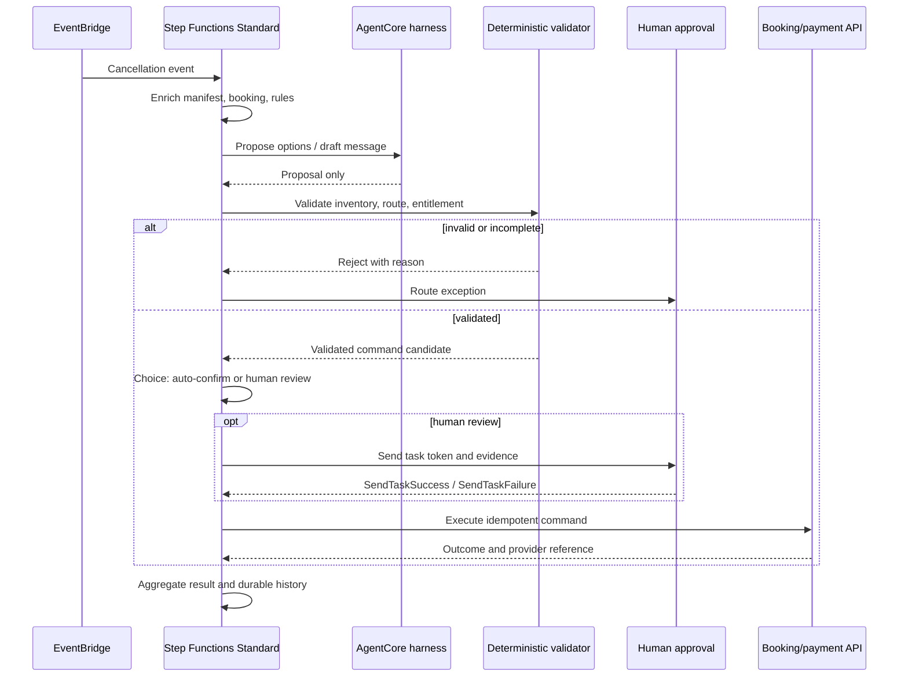

The most dangerous moment in a multi-agent system is not when an answer sounds unconvincing. It is when a plausible answer becomes a booking, payment, refund, or other irreversible state change. In its September 14, 2026 [reference workflow for Step Functions and Bedrock AgentCore](https://aws.amazon.com/blogs/compute/validating-multi-agent-decisions-with-step-functions-and-bedrock-agentcore/), AWS reframes the problem as an engineering boundary: **an agent may propose, but it must not write to a critical system directly; the proposal passes deterministic validation, waits for human approval when needed, and only then reaches a controlled execution step.**

This article does not treat the airline rebooking example as a proven production system, and it does not invent a public demo repository or benchmark. The useful subject is the control flow: which work belongs to a non-deterministic agent, which work belongs in a replayable workflow or rules engine, and how those boundaries handle parallel scale, waiting, timeouts, retries, idempotency, and audit.

> **Huahua in one sentence**
>
> An agent output is a proposal awaiting validation, not an executable command; critical state changes must come from a validated, traceable, idempotent execution step.

## Separate reasoning from state mutation

AWS uses post-cancellation rebooking as its example. Each passenger has different preferences, cabin and fare constraints, loyalty entitlements, connections, and available seats. An AgentCore harness is well suited to proposing three alternatives from that incomplete and variable context. Another agent can draft customer-facing compensation language based on the route, delay, and cause.

But proposing a flight and actually booking it are different responsibilities. The flight may have no remaining inventory, violate fare rules, be invalid for the route, or be evaluated under the wrong compensation regime. The reference flow therefore separates four kinds of work:

- **Proposal**: An AgentCore harness proposes options or drafts language from context. It returns a result but does not write to reservation or payment systems.
- **Validation**: A deterministic Task such as Lambda checks live inventory, fare and route rules, and entitlement calculations. It removes nonexistent, stale, or non-compliant candidates.
- **Approval**: A Choice state decides which validated cases may be auto-confirmed. Exceptions are sent to a human queue, and the workflow pauses on a task token.
- **Execution**: Only a validated and approved structured command reaches booking, refund, or notification APIs. Execution still uses an idempotency key bound to the decision.

The value of this separation is not a claim that deterministic code is always correct. It makes failures attributable: was the proposal wrong, did the validator omit a rule, did approval not happen, or did an external API mishandle a side effect?

## A readable, testable control flow

There is an important AgentCore integration constraint here. AWS’s [AgentCore harness integration](https://docs.aws.amazon.com/step-functions/latest/dg/connect-bedrockagentcore.html) currently supports the request-response pattern; the AgentCore Task does not support `.sync` or `.waitForTaskToken`, and the Step Functions Task has a maximum of 15 minutes (900 seconds). Human waiting therefore cannot be embedded in the Agent Task. A separate callback-capable Task must own it. If the Step Functions Task times out, the harness may continue until its own timeout; align both limits or a workflow can abandon an inference that still consumes resources.

## The contract table: every stage needs an owner and a failure boundary

The following turns the reference flow into a contract that can be reviewed before implementation. These are not AWS service terms; they are an engineering way to make “who may do what” explicit.

| Stage | Accepted input / output | Decision authority | Failure and side-effect rule |
| --- | --- | --- | --- |
| Proposal | Passenger and business context → candidate flights, compensation draft | Agent supplies candidates; it has no side-effect authority | Hallucinated, stale, or malformed output may be rejected; write APIs are forbidden |
| Validator | Proposal + live inventory, fare, route, and rule data → validated options / entitlement | Deterministic code and versioned rules | Semantic invalidity is not a retry condition; return a rejection reason or escalate |
| Approval | Validation evidence, differences, risk, and task token → approved / rejected | Human or explicit Choice policy | Pause with `.waitForTaskToken`; expiry, revocation, or token errors go to exception handling |
| Execution | Approved structured command + decision ID → provider reference | IAM- and API-policy-constrained deterministic Task | Only this stage creates bookings or refunds; every call carries an idempotency key |
| Timeout | Agent 900-second limit; business SLA for human waiting | Workflow owner | Align Agent Task and harness timeouts; approval expiry must not silently auto-approve |
| Retry | Classified transient error → retry result | State machine `Retry` policy | Retry throttling, network, or temporary service errors; do not retry an invalid proposal |
| Catch | Non-recoverable error → human queue / compensating path | Workflow owner and on-call | Agent, Lambda, and Map errors need observable `Catch` paths; one case must not sink the batch |
| Idempotency | Passenger ID + decision ID / validated option-set hash → stable key | Execution API and data owner | Standard exactly-once does not make an external API duplicate-proof; replay and redrive must be no-ops |

## Distributed Map: parallelism is not unlimited scale

When one cancellation affects hundreds or thousands of passengers, serial processing makes both the human queue and response time worse. AWS’s [Distributed Map](https://docs.aws.amazon.com/step-functions/latest/dg/state-map-distributed.html) runs each item as an independent child workflow, allowing the same “agent → validator → routing → execution” pattern to fan out at the case level. Each child has its own execution history, and a Map Run manages the collection of children.

The documentation lists conditions such as needing more than 40 concurrent iterations, expecting more than 25,000 execution-history events, or processing a dataset larger than 256 KiB. Distributed Map can run up to 10,000 child workflows in parallel by default. That is a platform capability, not a product setting you should copy blindly. The AWS article sets `MaxConcurrency` to 1000 to protect downstream booking and inventory systems. Your value should be derived from inventory API limits, AgentCore and model throughput, Lambda concurrency, human-review volume, and an acceptable failure rate.

Parallelism also changes failure handling. One passenger’s invalid flight should not fail every child, but an excessive failure ratio, an ItemReader failure, or broad downstream throttling may require the parent workflow to stop or route to batch recovery. This is why `MaxConcurrency`, Map failure thresholds, per-child `Catch`, and aggregation must be tested together—not merely switched from Inline to Distributed.

> **Huahua's engineering note**
>
> `10,000` is a Distributed Map concurrency capability, not a throughput guarantee. Each child adds agent inference, validation, state transitions, and downstream API pressure; model concurrency from what the downstream systems can sustain, then verify it with fault injection.

## waitForTaskToken: put people on the exception path, not inside the agent loop

The right abstraction for human review is not an agent repeatedly polling to ask whether someone clicked approve. It is a task token delivered to a notification or task system, with Step Functions paused until an external process calls `SendTaskSuccess` or `SendTaskFailure`. AWS’s [callback integration pattern](https://docs.aws.amazon.com/step-functions/latest/dg/connect-to-resource.html) can deliver review work through SQS, SNS, or Lambda; the token must be returned by a principal in the same AWS account.

The article uses four hours as an example human-review timeout. That is a case policy, not a universal service guarantee. A production design must decide whether expiry means rejection, another human queue, a new proposal, or cancellation. The review screen should include the original proposal, validator evidence and version, the command about to run, the material risks, and the decision ID—not just an Approve button with no context.

Waiting does not require Lambda or an agent to hold compute continuously, but “the callback is not running compute” does not mean the workflow is free. Model Step Functions state transitions, AgentCore and model calls, notification services, data retention, and human handling time. Add heartbeat, expiry, and revocation behavior so abandoned tokens do not wait forever.

## Timeouts, retries, catches, and idempotency are one design

### Timeouts define whether waiting is still safe

The 900-second Agent Task limit is a clear workflow boundary. The Lambda validator also needs a bounded timeout; a stuck inventory lookup should not hold a child indefinitely. Human approval has a business SLA and should not be replaced by “wait longer.” Every timeout needs an observable reason code and a defined next state.

### Retry only transient failures

Step Functions [`Retry` and `Catch`](https://docs.aws.amazon.com/step-functions/latest/dg/concepts-error-handling.html) can classify errors and configure intervals, maximum attempts, and exponential backoff for Task, Parallel, and Map states. Throttling, transient network faults, or a Lambda service exception are reasonable retry candidates. “The flight proposed by the agent does not exist” is a semantic validation failure; running the same proposal again is not a reliable fix.

`Catch` can send an unrecoverable case to a human queue or a batch-recovery workflow. Do not simply append `States.ALL` at the end. Error names, preserved inputs, sensitive-data redaction, and replay evidence must help on-call staff decide whether a rerun is safe.

### Exactly-once does not deduplicate external effects

For long-running, durable, auditable processes, AWS recommends [Standard Workflows](https://docs.aws.amazon.com/step-functions/latest/dg/choosing-workflow-type.html). They use an exactly-once workflow execution model, can run for up to one year, and expose full execution history through the API for up to 90 days. Express Workflows use at-least-once execution, run for up to five minutes, and are better suited to high-volume processing where actions are idempotent.

But “the workflow does not rerun” and “the reservation API receives exactly one request” are different claims. Retries, redrives, a network disconnect after an unknown side effect, duplicate events, and provider timeouts can all leave a client uncertain about whether a booking or payment succeeded. The execution step should derive a stable key from `passengerId + decisionId`, or from a validated option-set hash. Booking and payment APIs must treat it as a first-class contract: duplicate requests return the existing result instead of charging twice or issuing a second ticket.

## Durable history is audit material, not the whole truth

Standard Workflows record state transitions, allowing a team to inspect the input and output, which validator passed, who completed approval, and which command was sent. Distributed Map child history lets each passenger’s decision path be inspected separately. That is much closer to an explanation of “why did this happen?” than storing only the final natural-language answer.

Several boundaries still matter:

- The 90 days in AWS documentation is the retrieval period for Step Functions execution history, not an enterprise compliance-retention plan. Store masked, access-controlled proposal, validation, approval, command, and provider-reference evidence in a separate evidence store when policy requires it.
- History does not prove that input data, rule versions, or the validator itself were correct. Record the rule version, data timestamp, AgentCore harness/model configuration, and schema version for every decision.
- The AgentCore integration returns only the final assistant message. If you need tool-use or turn-by-turn investigation, enable the documented CloudWatch observability path and design sensitive-data redaction.
- Durable execution is not data governance. Passenger data, payment information, tokens, and external responses still need least privilege, encryption, retention, and replay-access policies.

## The boundary between reference architecture and production proof

The AWS article’s evidence is an inspectable, implementable workflow pattern: EventBridge trigger, enrichment, Distributed Map, AgentCore proposals, Lambda validation, Choice routing, human callback, execution, aggregation, and the timeout, retry, catch, and idempotency guidance for each boundary. That supports a useful architectural conclusion: **constraining the agent to a proposal boundary puts critical side effects behind a testable deterministic gate.**

It does not provide load-test results, fault-injection results, a real cost curve, cross-region failure analysis, an independent security review, or production incident history. A workflow diagram that can run is not evidence that an airline can safely automate rebooking end to end, and AWS service behavior should not be confused with the correctness of your business rules. Compensation law, fare rules, inventory consistency, and payment-provider semantics remain your responsibility to version, test, and review.

A serious verification plan should include at least four test families:

1. **Semantic rejection**: inject nonexistent flights, no inventory, invalid routes, expired entitlements, and malformed schemas; verify none can reach execution.
2. **Control flow**: test Agent, validator, and callback timeouts; invalid tokens; exhausted retries; one failed child; and Map failure thresholds.
3. **Side effects**: resend the same event, redrive, retry after an API timeout, and click approval twice; verify that the idempotency key creates only one booking or payment.
4. **Operations**: set concurrency from real downstream quotas, then measure state transitions, token usage, latency, human backlog, data retention, and replay access.

## What engineers should do differently

If you are connecting an agent to a workflow that changes critical state, start with this minimum boundary:

- Define separate proposal and execution-command schemas. The first permits uncertainty; the second can only be produced by the validator.
- Ensure every write API is called only by a deterministic Task, and block direct Agent access at IAM, network, and application layers.
- Treat the validator as product code: version its rules, test cases, rejection reasons, and regression results.
- Create an idempotency contract for every side effect that may be replayed. Do not use Standard Workflow exactly-once as a downstream guarantee.
- Make human approval an evidence-bearing callback with explicit expiry, revocation, rejection, replay, and permission-change handling.
- Establish trace and cost accounting for the whole flow before increasing Distributed Map concurrency.

For the broader architecture context, start with the [AI Agent architecture guide](/en/blog/64-ai-agent-guide/), then read [Enterprise Agentic AI governance](/en/blog/39-enterprise-agentic-ai-governance/) for putting policy, evaluation, and audit into a control plane. The [Agentic AI platform contract](/en/blog/93-agentic-ai-platform-contract/) turns those controls into a pre-launch review contract. If your agents also call external tools through MCP, compare the identity, consent, and audit boundaries in [Forge MCP auth runtime](/en/blog/99-forge-mcp-auth-runtime/).

## Sources and further reading

- [Validating multi-agent decisions with Step Functions and Bedrock AgentCore](https://aws.amazon.com/blogs/compute/validating-multi-agent-decisions-with-step-functions-and-bedrock-agentcore/) — AWS Compute Blog, 2026-09-14; the primary reference architecture and limitation source for this article.
- [Invoke Amazon Bedrock AgentCore harness with Step Functions](https://docs.aws.amazon.com/step-functions/latest/dg/connect-bedrockagentcore.html) — AWS Step Functions Developer Guide; integration pattern, 900-second limit, and response behavior.
- [Using Map state in Distributed mode](https://docs.aws.amazon.com/step-functions/latest/dg/state-map-distributed.html) — AWS Step Functions Developer Guide; child executions, Map Runs, and concurrency conditions.
- [Discover service integration patterns](https://docs.aws.amazon.com/step-functions/latest/dg/connect-to-resource.html) — AWS Step Functions Developer Guide; `waitForTaskToken` callback semantics and token boundaries.
- [Choosing workflow type in Step Functions](https://docs.aws.amazon.com/step-functions/latest/dg/choosing-workflow-type.html) — AWS Step Functions Developer Guide; Standard and Express durability, execution semantics, and history retention.
- [Handling errors in Step Functions workflows](https://docs.aws.amazon.com/step-functions/latest/dg/concepts-error-handling.html) — AWS Step Functions Developer Guide; `Retry`, `Catch`, and timeout error handling.
