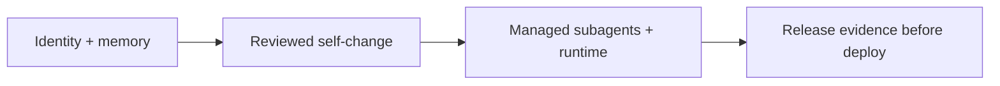

Self-modifying agents turn “what are we releasing?” into an engineering question. A conventional service can often treat its source repository, build pipeline, and release artifact as relatively stable links. But the [Ouroboros repository](https://github.com/razzant/ouroboros) describes an agent whose identity, memory, and history persist across tasks and restarts; it coordinates managed subagents and can modify the code, architecture, prompts, tools, and dependencies that it runs. Even when every change is reviewed, deployment still needs an externally inspectable provenance record: not merely “the tests passed,” but a path from the artifact to its source, composition, and checks.

This article stays with one engineering question: **how can a self-modifying agent make its release provenance inspectable before deployment?** Using the public [Ouroboros v7.4.4 release](https://github.com/razzant/ouroboros/releases/tag/v7.4.4), I separate first-party claims, downloadable release evidence, and conclusions that the published material still does not support.

> **Huahua in one sentence**
>
> For an agent that can rewrite itself, release provenance is not an extra signature file; it is the chain that connects what the agent is now to how that exact artifact was built.

## Name the agent’s change surfaces first

Ouroboros’s README presents the product as a general-purpose AI agent with continuing identity, durable memory, and history across tasks and restarts. It also claims the ability to rewrite the code, architecture, prompts, tools, and dependencies it runs, and to coordinate specialist agents. These are first-party capability claims, not independent evaluation results.

The repository and documentation suggest four change surfaces that should be covered by provenance:

1. **Identity and memory**: the README treats identity, memory, dialogue, knowledge, reflection, and version history as one continuing biography. `ouroboros/memory.py` shows persistent surfaces for identity, scratchpad, journals, and dialogue history. That means “the same agent” is more than a model version; a deployment review also needs to know whether the data root, memory schema, and migrations are in scope.
2. **Self-modification**: the project describes an editable surface spanning application code, architecture, prompts, tools, and dependencies, with Git history, review evidence, protected surfaces, and restart checks making changes traceable. Git history can trace a change; it does not prove that every self-change is correct or safe.
3. **Managed subagents**: the v7.4.4 release notes say configured subagents can be enabled or disabled individually, with labels reflecting their model and route. The repository’s `SubagentDispatch` resolves the lane, model, executor, route, profile, and capability delta at dispatch time and writes a durable projection. Those managed runtimes and routes can change effective behavior, so pinning only the main repository is insufficient.
4. **The packaged execution surface**: the README says the desktop and headless CLI expose the same managed tasks, progress, artifacts, logs, and schedules, while desktop packages include the Claudexor execution layer. Packaged runtimes, embedded repository bundles, and companion runtimes are artifact contents—not details to download after deployment.

The boundary can be summarized like this:

## v7.4.4’s evidence chain: from commit to downloadable artifact

The v7.4.4 release page says the release was built from commit `796f2e8708ee375216783a7fd80a3bf79f081079`, and lists workflow, artifact digests, SBOMs, and smoke receipts. The important design choice is that these facts are not left only in prose; they are delivered through cross-checkable artifacts.

### 1. Git tag and source commit: fix where the build starts

The release page and the [release workflow](https://github.com/razzant/ouroboros/blob/v7.4.4/.github/workflows/ci.yml) bind `v7.4.4` to a source commit. The workflow also checks that the annotated tag exists and that its peeled commit equals the build commit, avoiding a same-name ref that points somewhere else.

This is the first boundary for a self-modifying system: a self-change entering a release must land in a locatable Git object. It answers “what is the source identity?” It does not answer whether the commit satisfies an organization’s safety policy; that still requires review, testing, and a human decision.

### 2. SHA256SUMS: match downloaded files to content digests

`SHA256SUMS` lists a SHA-256 digest for every installable platform artifact, its SBOM, and its smoke receipt. `release-evidence.json` repeats the binding for each artifact with `name`, `proofId`, `sha256`, `size`, the SBOM filename, and the smoke-receipt filename. The point is that a filename is no longer the only identifier: the deployment system can recompute the digest of the downloaded file and compare it with the evidence index.

SHA-256 proves that the bytes in hand match the recorded bytes. It does not prove that the artifact is benign, or that the upstream process recording the digest deserves trust. The digest therefore has to be read together with source identity, build provenance, and composition evidence.

### 3. CycloneDX SBOM: list what the artifact contains

The release page claims that every installable platform artifact has a CycloneDX SBOM attestation. An SBOM answers “which components are present?”; it does not answer “is every component safe?” The macOS SBOM metadata, for example, identifies Syft as the generating tool and uses the CycloneDX format. That supports dependency inventory, vulnerability matching, and license review, but it does not replace runtime tests or human review.

For an agent that packages a runtime, an embedded repository bundle, and Claudexor, this matters: if the managed subagent execution layer or a companion dependency changes, deployment review should not look only at the main repository commit.

### 4. GitHub build provenance: connect the artifact back to the workflow

The release notes provide two `gh attestation verify` examples: one for GitHub build provenance and one for a CycloneDX predicate. Both specify the repository, signer workflow, source digest, and `refs/tags/v7.4.4`. The command shape turns “which workflow built which file from which source ref?” into a pre-deployment check.

There is an important distinction here. The release page provides a verification method and a first-party release claim. This article did not re-download every large installer and independently run `gh attestation verify`, so it does not turn “verifiable” into “independently verified here.” A production pipeline should rerun these checks under its own trusted runner, permissions, and policy.

### 5. release-evidence.json and smoke receipts: index the results

`release-evidence.json` is the index layer. Its schema version 1 combines `source` (repository, tag, commit), `workflow` (run URL and gate status), `artifacts` (digest, size, SBOM, and receipt), and the verification commands. Each `release-smoke-*.json` records the artifact, release tag, source commit, SHA256, the checks actually run, and `status: passed`.

That makes the meaning of a smoke test precise. It is not evidence that “the model is safe”; it is a receipt that one packaged artifact passed a defined set of CI smoke checks. The macOS receipt lists the Applications shortcut, arm64 executable, embedded runtimes, repository bundle, and packaged CLI help. The Linux AppImage receipt lists extraction and execution, gateway readiness, clean shutdown, shared libraries, and packaged CLI help. These checks reduce the risk that source tests pass while packaging breaks, but they remain a bounded execution sample.

> **Huahua's engineering note**
>
> `passed` is a scoped result: it describes one artifact, one runner, and one set of checks. It should not be upgraded into a claim that all hardware, root or boot behavior, external providers, long-lived memory continuity, or agent decision quality has passed.

## Turn release evidence into a deployment gate

To adapt this pattern to another self-modifying agent, I would make four pre-deployment gates explicitly rejectable:

| Gate | Evidence to fix | What failure should stop |
| --- | --- | --- |
| Source identity | Annotated tag, peeled commit, workflow run, review record | Accepting or building an artifact without bound source |
| Artifact integrity | SHA256SUMS, evidence index, recomputed download digest | Installing a file whose digest does not match |
| Composition | CycloneDX SBOM and attestation for every artifact | Deploying an unapproved runtime, dependency, or subagent layer |
| Runtime evidence | Artifact-specific smoke receipt, environment, and checks | Treating source-only tests as packaged-runtime evidence |

In practice, `release-evidence.json` should not be a decorative release-note attachment. Deployment can treat it as a machine-readable manifest: verify the tag and commit, verify that every artifact digest, SBOM, and receipt exists and points to the expected objects, then run provenance verification and required smoke or install checks in an allowed environment. A missing file, `NOT_RUN`, source mismatch, or failed attestation should produce an explicit blocked state—not an agent-generated “probably good enough.”

For self-modification, the change surfaces also need a stable evidence mapping:

- Changes to code, architecture, prompts, tools, or dependencies point to a commit, review record, and SBOM diff.
- Changes to identity, memory, journals, or history schemas point to a migration version and restart or recovery checks.
- Changes to a managed subagent’s model, route, executor, or capability point to a dispatch projection, runtime digest, and route-specific smoke receipt.
- Changes to a packaged desktop, CLI, embedded repository bundle, or companion runtime point to a platform artifact digest, SBOM, and smoke receipt.

The goal is not to force every runtime state into one JSON file. It is to prevent a broken chain where the main repository has provenance but the execution surface being deployed does not.

## What is first-party claim, and what remains unverified?

From the public v7.4.4 material, we can responsibly say:

- **Ouroboros claims** continuing identity, durable memory, self-modification, evolution campaigns, and a live swarm. These descriptions are inspectable in the [README capability section](https://github.com/razzant/ouroboros/blob/v7.4.4/README.md) and repository code as design intent, but they are not an independent capability evaluation in this article.
- **The v7.4.4 release materials record** a source commit, SHA256SUMS, `release-evidence.json`, CycloneDX SBOMs, GitHub attestation commands, and platform smoke receipts. These are downloadable, parseable release evidence that a deployment team can use to rerun checks.
- **The release workflow records** gate status for full tests, UI and Docker smoke, skill smoke, packaged-artifact smoke, and the Android build. Those are first-party CI results, not a third-party reproducibility study.

The public material is not enough to conclude that self-modification remains correct across all tasks; durable memory can never be lost, polluted, or recalled incorrectly; managed subagents obey intended permissions under every model and route combination; or any smoke-tested installer will operate safely across all hardware, operating systems, providers, and production data. The Android setup notes specifically exclude root, boot, hardware, and phone-runtime behavior from the CI artifact checks’ guarantee.

> **Huahua's take**
>
> The maturity of a self-modifying agent should not be measured only by whether it can change itself. A more useful question is whether every change can be located, its composition listed, its required checks rerun, and the deployment stopped when evidence is incomplete.

## A minimum rollout checklist for platform teams

If a team needs release provenance for an agent that can modify itself, start with a small but hard boundary:

1. Accept only an annotated tag and one source commit per release, and write both to a machine-readable evidence manifest.
2. Compute SHA256 for every platform artifact actually deployed. Do not hash only a source archive, and do not let packaged runtime components download unpinned execution surfaces after installation.
3. Produce an artifact-specific SBOM, treating model adapters, subagent runtimes, tool bridges, and native, Python, or Node dependencies as composition.
4. Use trusted build provenance to connect the artifact to the workflow, repository, source ref, and commit; keep a human-readable verification command too.
5. Make each smoke receipt state exactly which file, commit, checks, and environment it covers—and what it does not cover.
6. Connect the evidence manifest to deployment policy: missing digest, SBOM, receipt, attestation mismatch, or `NOT_RUN` is a blocking condition.
7. Test identity and memory migrations, managed-subagent permissions, route resolution, restart, and recovery independently; artifact smoke is not a substitute.

The engineering value is turning “the agent keeps changing” into a reviewable release interface. It does not solve model judgment, memory contamination, or tool abuse automatically. It does make the deployment decision concrete: which commit, which bytes, which dependencies, and which checks are being approved.

## Further reading and sources

- [Ouroboros v7.4.4 release notes and assets](https://github.com/razzant/ouroboros/releases/tag/v7.4.4): version changes, SHA256SUMS, `release-evidence.json`, SBOMs, smoke receipts, and attestation commands.
- [Ouroboros README at v7.4.4](https://github.com/razzant/ouroboros/blob/v7.4.4/README.md): first-party descriptions of identity, memory, self-modification, subagent swarms, and packaged runtime.
- [Ouroboros release workflow](https://github.com/razzant/ouroboros/blob/v7.4.4/.github/workflows/ci.yml): tag checks, artifact builds, SBOM generation, attestations, and smoke steps.
- [AI Agent Guide](/en/blog/64-ai-agent-guide/): the foundation for agent architecture, state, memory, evaluation, and production governance.
- [Agentic AI Platform Contract](/en/blog/93-agentic-ai-platform-contract/): turning Evidence, Policy, Judge, and Trace into a pre-production control-plane contract.
- [Enterprise AI Agent Security](/en/blog/43-enterprise-ai-agent-security/): further reading on identity, tool authorization, memory, and supply-chain boundaries.
