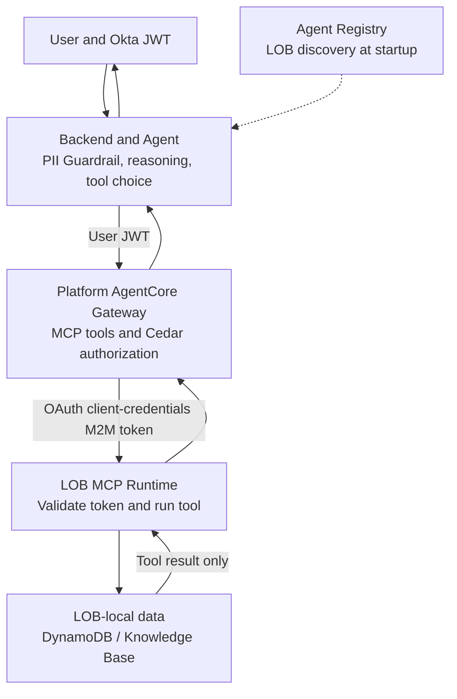

Cross-functional agents face a familiar trade-off: copying every line-of-business (LOB) dataset into a central account blurs data ownership and deployment boundaries, while letting an agent access every account directly pushes authorization and IAM operations onto the platform team. In its September 24, 2026 [AgentCore Gateway and MCP walkthrough](https://aws.amazon.com/blogs/machine-learning/build-a-multi-account-ai-agent-with-agentcore-gateway-and-mcp/), AWS demonstrates another split: data and tools stay in LOB accounts, the agent and unified tool endpoint live in a platform account, and only tool results needed for a request travel back.

This is an AWS architecture demonstration, not production acceptance evidence. The [official sample repository](https://github.com/aws-samples/sample-amazon-bedrock-agentcore-banking-mcp-multi-account) explicitly calls itself a “Proof-of-concept demo — NOT for production use” and uses synthetic data. Its most useful lesson is the division of trust boundaries: **the Gateway authorizes the user identity with a Cedar policy, while the Gateway uses a separate M2M credential for downstream LOB calls.** Those two paths should not be described as end-user delegated access.

## Hub and spoke separate data ownership from the agent control plane

The example spans four AWS accounts: one platform account and three LOB accounts for Retail Banking, Transaction Banking, and Lending & Wealth. The platform account runs a Strands Agent, AgentCore Gateway, Agent Registry, and web application. Each LOB runs an MCP server on AgentCore Runtime in its own account, where it accesses local DynamoDB data or, for Lending & Wealth, a Knowledge Base. The sample lists 16 tools; the Gateway exposes their discovery and invocation through one MCP endpoint.

A user signs in through Okta and submits a question through the web backend. The backend applies Bedrock Guardrails for PII handling on input and output, then invokes the Agent on AgentCore Runtime with the user JWT. The Agent sends the prompt to the model and chooses tools; it then places the original user JWT in the Gateway request’s `Authorization` header. The token contains claims such as `sub`, groups, and audience. Forwarding it does not mean the Agent itself made the authorization decision.

The Gateway uses MCP semantic search and `tools/list` to expose tools from registered targets. The sample also queries Agent Registry at startup to obtain registered LOB MCP server information. These have different responsibilities: Registry helps the Agent discover which LOB capabilities exist; Gateway is the MCP endpoint the Agent actually connects to for tool discovery and target invocation. Onboarding a LOB requires deploying its MCP server and configuring its target and Registry entry; the new tools become visible through the Gateway’s next tool-list query. The AWS post calls the Registry a Preview, so verify its current service status and interface support before adopting it.

## Two identity paths: user JWT to Cedar, M2M token to the LOB

After receiving the user JWT, the Gateway evaluates the requested tool action against Cedar policies when an AgentCore Policy engine is associated. The Gateway can permit or deny each call before routing it. The sample uses ENFORCE mode and default-deny: policies must explicitly permit actions such as `tools/list`, specific read tools, or other approved operations, and can explicitly forbid dangerous actions. This puts user-level authorization at the Gateway instead of relying on the model or prompt.

An allowed request follows a second path. The Gateway obtains an OAuth 2.0 client-credentials access token from AgentCore Identity and uses that token to call the target LOB MCP server. The LOB Runtime’s `customJWTAuthorizer` validates the token against its Okta OIDC configuration; the MCP server then uses its own runtime role to access DynamoDB or a Knowledge Base in the same account. This token represents a machine client. It does not automatically carry the end user’s delegated permissions or row-level identity downstream.

The sample’s authorization model is therefore “Cedar evaluates the inbound user JWT at the Gateway, then outbound M2M credentials call the LOB.” AWS notes that AgentCore Identity also offers on-behalf-of (OBO) token exchange, which can carry user identity downstream. The same post explains that this implementation uses M2M because the Okta developer account used by the sample does not support OBO. If an LOB must enforce per-user row-level access, design and validate OBO or another delegation flow separately; do not describe this sample’s M2M as completed end-user delegation.

> **Huahua's engineering note**
>
> Cedar at the Gateway is an effective boundary only when requests actually pass through the Gateway. AWS says this sample primarily relies on OAuth audience validation and recommends setting `allowedWorkloadConfiguration` on the LOB Runtime to the Gateway ARN in production. That requires the workload identity chain to include the Gateway, reducing the risk of a direct Runtime call bypassing Gateway policy.

## Deployment prerequisites go beyond running `deploy.sh`

The sample README assumes four AWS accounts in the same AWS Organization, four configured AWS CLI profiles, Bedrock model access in the platform account, and AgentCore set up in the accounts. It also requires AWS CLI v2, Python 3.12+, Docker, Node.js 18+, the CDK CLI, the AgentCore CLI, and an Okta authorization server. The README specifies `us-east-1` for its model-access prerequisite. The first `deploy.sh` run bootstraps CDK and account resources, prepares sample data, deploys three MCP servers, creates Gateway targets, an OAuth provider and Cedar policies, registers the LOBs in Agent Registry, then deploys the Agent and the CloudFront/ECS web application. After deployment, the generated CloudFront URL must still be added to the Okta redirect URIs. The repository estimates a full deployment at about 25–35 minutes; that is an estimate for its demonstration environment, not a deployment SLA.

The end-to-end walkthrough also includes Guardrail checks on input and output, tool execution traces, and a cleanup script, `./cleanup.sh`. Cleanup removes AgentCore components, Okta configuration, MCP deployments, CDK stacks, and sample data across all four accounts. Before running the demo, verify the account/profile targets; afterward, check what was deleted and whether any billable resources remain.

More importantly, the README’s login demo has one user with access to all 16 tools; its policy-denial scenario demonstrates blocking `delete_customer`. This shows that a Gateway policy can block a tool, but it does not demonstrate complete tests for distinct user groups, tenants, record scopes, or delegated permissions. Keeping data in a LOB account also does not mean data never leaves it: tool results return to the platform account, enter the Agent’s context, and take part in model inference. Review returned fields, PII handling, prompt injection, trace retention, and downstream model data processing as part of the data flow.

## Close the production gap with controls you can verify

AWS’s production guidance points to specific work: set `allowedWorkloadConfiguration` on LOB Runtime; use distinct OAuth audiences for separate trust boundaries to reduce token reuse; restrict Gateway and Runtime network paths and evaluate VPCs, PrivateLink, and private subnets; enable Gateway data-plane logging to CloudWatch Logs and AgentCore Gateway data events in CloudTrail; and centralize audit records from platform and LOB accounts in a dedicated logging account. The sample README also lists WAF, a custom domain, monitoring alarms, X-Ray, Secrets Manager rotation, and additional Guardrails as items to add. These are control designs to verify; adding recommended configuration alone does not establish a security guarantee.

Before adoption, ask each LOB owner to approve its exposed MCP tools, input/output schemas, data classification, runtime role, and token audience. The platform team should maintain Gateway target change review, Cedar test cases, tool-list snapshots, and versioned evaluation datasets. Put allow, deny, timeout, identity-provider failure, unavailable MCP server, tool-schema change, and temporary Registry failure into a test matrix. Confirm that traces connect the user principal, Gateway policy decision, target, tool, M2M client, and result, while masking sensitive fields.

> **Huahua's take**
>
> The pattern is useful because cross-account integration can rely on a consistent MCP contract and an explicit policy boundary instead of moving LOB data into a central store. It is a deployable starting point for a multi-team platform; production readiness is a separate claim that requires evidence for user-to-policy mapping, Gateway-only workload paths, account isolation, audit, and failure exercises.

## A practical adoption sequence

Start with one low-risk, read-only LOB tool. Confirm its input scope, data minimization, and output masking, then trace the complete path: “login JWT → Agent Runtime → Gateway Cedar → M2M OAuth → LOB Runtime → local data.” Next, add at least two user roles and an explicit denial case. If downstream data permissions must follow each user, validate the OBO path as a separate work item. Only then expand to write tools, more accounts, or automated onboarding, and document target onboarding, policy updates, tool-version compatibility, alerting, rollback, and cleanup.

For more governance context, read the [AI Agent engineering guide](/en/blog/64-ai-agent-guide/), [enterprise controls for GitHub MCP](/en/blog/87-github-mcp-enterprise-controls/), and [the OAuth identity flow in AgentCore Consent Portal](/en/blog/104-aws-agentcore-consent-portal/). They cover different parts of the problem: agent runtime, MCP management policy, and end-user token flows.

## Sources

- [AWS Machine Learning Blog: Build a multi-account AI agent with AgentCore Gateway and MCP](https://aws.amazon.com/blogs/machine-learning/build-a-multi-account-ai-agent-with-agentcore-gateway-and-mcp/) — September 24, 2026; architecture, identity paths, deployment, and governance guidance.
- [AWS sample repository: sample-amazon-bedrock-agentcore-banking-mcp-multi-account](https://github.com/aws-samples/sample-amazon-bedrock-agentcore-banking-mcp-multi-account) — PoC disclaimer, prerequisites, deployment sequence, demo permissions, and production considerations in the README.
- [Amazon Bedrock AgentCore Gateway documentation](https://docs.aws.amazon.com/bedrock-agentcore/latest/devguide/gateway.html) — Gateway MCP targets and integration capabilities.
- [AgentCore Runtime OAuth and workload identity documentation](https://docs.aws.amazon.com/bedrock-agentcore/latest/devguide/runtime-oauth.html) — restricts which workloads can invoke a Runtime using a Gateway ARN in `allowedWorkloadConfiguration`.
- [AgentCore interface VPC endpoints documentation](https://docs.aws.amazon.com/bedrock-agentcore/latest/devguide/vpc-interface-endpoints.html) — private connectivity to AgentCore resources through AWS PrivateLink.
