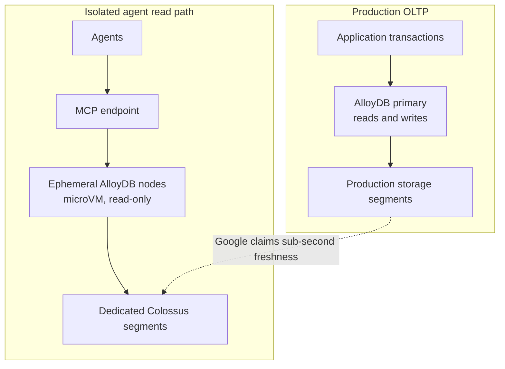

Agents can query a database repeatedly in a short window: each reasoning step may trigger several SQL, vector, or full-text searches, and several tasks may arrive at once. Sending that traffic directly to an OLTP (online transaction processing) primary turns unpredictable agent bursts into risk for the system that records business transactions. On September 24, 2026, Google Cloud introduced an AlloyDB for agents architecture that uses temporary, read-only AlloyDB nodes to handle this work separately from the production primary.

The core design is not “add more read replicas to the primary.” Agents use independent microVM compute nodes and dedicated Colossus storage segments, with nodes started and stopped around each workload. That separation is a meaningful engineering direction. But claims about thousands of nodes, millions of agents, sub-millisecond I/O, and zero impact on the primary should remain Google’s architecture and test claims, not independently established general results.

> **Huahua in one sentence**
>
> Moving agent read bursts off the transaction primary—and isolating the read nodes, network path, and storage resources—creates a chance to preserve both fresh data access and OLTP stability.

## The architecture aims to share data without sharing a failure domain

The original Google Cloud post was written by database engineering vice presidents Amit Ganesh and Sailesh Krishnamurthy and dated September 24, 2026. It proposes three requirements for an agentic database: isolation, low latency, and compute that can start within seconds and quickly scale back to zero. That is Google’s proposed design bar; the post does not establish that it is the only viable one.

The design keeps production transactions on pre-provisioned, dedicated infrastructure, then lets agents connect through the Model Context Protocol (MCP) to an independent, short-lived pool of AlloyDB nodes. Each agent node is a microVM running the full AlloyDB for PostgreSQL engine with read-only access. It reads directly from Colossus storage segments separate from those serving production. Google says the nodes can read production state with sub-second freshness. The public post does not fully specify the network and data propagation mechanisms or consistency semantics, so “fresh” should not be read as a guarantee of any particular transaction isolation level or synchronous read.

The diagram is a conceptual rendering of Google’s public description, not a complete published deployment topology. MCP is the interface between agents and database capabilities; it does not, by itself, decide database identities, SQL permissions, row-level security, or tool authorization. A real deployment still needs to show how agent identity maps to data scope and whether queries could expose rows or fields that the agent should not access.

## Dedicated segments are central to the isolation claim

Traditional read replicas usually copy data and provide separate compute, making their isolation easier to reason about. But creating a replica and loading a large dataset takes time, and capacity may remain idle between bursts. Shared-storage designs can add compute quickly, yet let the primary and readers contend for the same storage servers or bandwidth. Google’s AlloyDB design aims to split that trade-off: agent nodes read directly from Colossus, while agent-specific segments are physically separate from production segments.

Independent compute alone does not prove the primary is protected. Teams also need to examine whether network and I/O limits are shared, whether storage segments are genuinely separated, and whether failures or maintenance events still have common components. Google says agent traffic shares no database components with production and that Jupiter networking and Colossus support expansion. These are descriptions of Google’s own cloud implementation; customers cannot independently audit the underlying isolation from the blog post.

## Fresh reads do not mean transactional writes

The public material repeatedly describes agent nodes as read-only and says they can read “up-to-the-second” or “sub-second freshness” production data. That is useful for search, retrieval, scenario analysis, and simulation: agents can use PostgreSQL SQL, indexes, vector, full-text, and spatial search, and can join current operational data with BigQuery or Spark lakehouse data.

The read-only boundary is also a capability boundary. An agent node cannot commit a write to the OLTP primary, nor can its query be treated as part of a production write transaction. If an agent needs to place an order, change inventory, issue a refund, or update a customer record, an application service with explicit permissions and validation should use the established transaction path. Authorization, version checks, idempotency, conflict handling, and audit should be verified before committing the side effect. This is the same separation illustrated by the [Step Functions and AgentCore decision-validation case](/en/blog/102-aws-step-functions-agentcore-validation/): an agent’s reasoning output is not transaction authorization by itself.

“Fresh” also has limits. A lag under one second does not mean a synchronous, transactionally consistent read against a particular primary commit, and it does not explain whether multiple queries share a consistent snapshot. For inventory, accounting, or risk workloads that depend on defined consistency semantics, teams need to confirm visibility, retry, and transaction boundaries in Preview documentation and with the service team, then use application-level version checks or pre-write validation as needed.

## The performance figures are Google’s tests, not an independent benchmark

Google says it ran concurrent index lookups against a dataset larger than available DRAM, scaling from one to 1,000 agent nodes. It reports:

- From one to 10 nodes, throughput rose from 3.9K to 41K queries per second (QPS). At 1,000 nodes, Google says throughput grew near-linearly to 3 million QPS while Colossus served more than 8 million IOPS.
- In the 1-to-1,000-node test, Google says it measured no primary-cluster performance degradation.
- In a separate full-table-scan test with 2,100 nodes, aggregate scan throughput exceeded 1 Tb/s.
- Google claims sub-millisecond I/O based on Colossus remote reads and the architecture; the product documentation labels the feature Preview.

All these measurements come from tests designed and run by Google. The public post does not name the competitor in its comparison, though it describes a commercial service using object storage and shared block servers. Google reports that adding up to eight read replicas produced less than 2× throughput, declining after four replicas, while primary throughput fell by more than 75%. Because the competitor is unnamed and the comparison configuration and complete test program are not public, this is a vendor-run comparison—not an independent benchmark or a representative result for every shared-storage database.

The post also omits details needed for an external rerun: node hardware, region, index and query mix, concurrency model, tail latency, cache state, error rates, data update frequency, and cost across workloads. QPS, IOPS, or scan bandwidth cannot stand in for a team’s own transaction-latency and isolation checks.

## Elastic compute may cut idle spend, but cold starts matter

Google says agent nodes can start in seconds, scale back to zero when work ends, and are billed per active node-second. This can suit workloads with short traffic spikes and idle nodes between runs. It avoids paying continuously for a fleet of provisioned replicas just to wait for the next burst.

But scale to zero does not mean every request avoids waiting or every task is cheap. Scheduling, connection setup, microVM startup, and the first-query latency at burst onset need measurement. The number of nodes required for a one-minute task, whether requests queue, and whether nodes are reused or shared all affect latency and billing. Google says billing is per second, but has not published a price sheet or end-to-end cost model sufficient to estimate a specific workload from the announcement. Teams should also count model tokens, agent orchestration, the MCP gateway, network transfer, lakehouse queries, and data governance.

Use the team’s own traces to estimate capacity and cost: record queries per task, peak concurrency, node-active time, cold-start latency, P95/P99 query time, rejected queries, and primary latency. Compare fixed read replicas, quotas on the primary, and an agent-node pool on the same dataset and query mix, then decide whether the burst protection justifies the cost.

> **Huahua's engineering note**
>
> “Starts in seconds, scales to zero, and bills by the second” is still a Preview claim to validate against cold starts, peak concurrency, authorization, and actual invoices. Read-only nodes do not replace permissions and write validation on the production transaction path.

## Workloads worth evaluating and an adoption checklist

This design is most worth testing when many short-lived agents concurrently make read-only queries against fresh operational data and the primary’s tail latency must remain stable. If traffic is steady, the read set is small, or existing replicas are affordable, a new data platform may add more integration and governance surface than value. If work requires writes, cross-region disaster-recovery guarantees, or strict snapshot semantics, the public architecture description is not enough to decide whether the service fits.

After requesting Preview access, start with a controlled workflow that cannot trigger production side effects and verify:

1. **Access control:** How do MCP client identity, database roles, and row and column permissions propagate? Can an agent read only its authorized tenant data?
2. **Freshness and consistency:** Measure P50/P95/P99 time from primary commit to agent-visible data. Confirm semantics for snapshots across queries, retries, and replication lag.
3. **Isolation under failure:** Apply bursts and failure injection to the agent pool while observing primary locks, CPU, network, I/O, P99 latency, and error rate.
4. **Transaction boundary:** Confirm read-only restrictions cannot be bypassed, and validate that only a separately authorized service can write.
5. **Cost and startup:** Record cold starts, idle reclamation, node-seconds per task, queued queries, and failed retries; compare monthly cost with fixed replicas.

Google’s documentation currently labels PostgreSQL for agents in AlloyDB as Preview, says access must be requested, and warns that Pre-GA offerings may have limited support. Feature maturity, regional availability, SLA, limits, and pricing should therefore be checked in the documentation and contract available at the time of access. Google’s numbers are useful capacity hypotheses to test, not promises to use when setting a production SLO.

## Further reading and sources

For the broader agent tool, state, and lifecycle model, start with the [AI Agent guide](/en/blog/64-ai-agent-guide/). For multi-tenant isolation, compare [how Benchling isolates agent-generated code](/en/blog/117-benchling-agentcore-multitenant-code-execution/). The [Step Functions and AgentCore decision-validation case](/en/blog/102-aws-step-functions-agentcore-validation/) explores authorization boundaries for transactional side effects.

- Amit Ganesh and Sailesh Krishnamurthy, Google Cloud Blog, 2026-09-24: [AlloyDB’s agentic database architecture](https://cloud.google.com/blog/products/databases/alloydbs-agentic-database-architecture) — architecture components, isolation claims, and Google’s own performance tests.
- Google Cloud Blog, 2026-09-24: [AlloyDB delivers PostgreSQL for agents](https://cloud.google.com/blog/products/databases/announcing-postgresql-for-agents-in-alloydb) — Preview announcement, read-only nodes, capabilities, and customer quote.
- Google Cloud Documentation: [PostgreSQL for agents in AlloyDB](https://docs.cloud.google.com/alloydb/docs/postgresql-agents-alloydb) — Preview status and access-request information.
