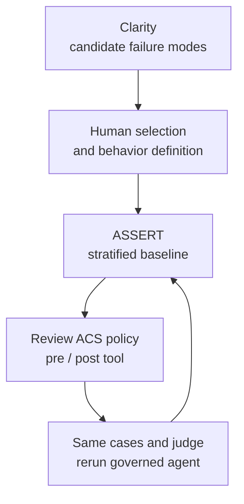

An agent threat model becomes an inspectable governance loop only when a measured behavior is mapped to an enforceable control and evaluated again with the same test. In September 2026, Microsoft described `run-assert-eval`, a workflow connecting Clarity risk discovery, ASSERT behavior evaluation, and the Agent Control Specification (ACS). Its engineering value is reducing the handoffs between finding a failure and checking a mitigation. The reported results, however, come from Microsoft’s own billing-support example; they are not an external replication or proof of production effectiveness.

> **Huahua in one sentence**
>
> A risk list is not a runtime boundary; the team needs to map a measured behavior to the right interception point, a reviewable policy, and a rerun that shows whether the control changed the agent.

## Candidate risks need to become measurable behaviors

The three components have distinct jobs. [Clarity](https://github.com/microsoft/clarity-agent/) uses threat modeling to surface candidate failure modes across an agent’s lifecycle; it does not decide which risks an organization should block in production. [ASSERT](https://github.com/responsibleai/ASSERT) turns selected risks into behavior definitions, test cases, and evaluation results. [ACS](https://github.com/microsoft/agent-governance-toolkit/tree/main/policy-engine) lets a host make policy decisions at chosen points in the agent’s execution. These are not three interchangeable “safety checks”: discovery frames the questions, evaluation measures what the system does, and policy determines whether execution proceeds.

In Microsoft’s walkthrough, Clarity found four failure modes for a billing-support agent. A person selected two that Clarity rated critical: changing billing details without verifying identity, and reading another customer’s data. Human triage matters here. A broad risk inventory can improve coverage, but it does not mean every candidate should become a deny rule. The team must still weigh severity, observable conditions, the cost of blocking legitimate work, and policy ownership.

ASSERT puts each selected risk in its own configuration, behavior, and suite so different failures do not collapse into one score that is hard to diagnose. The cross-customer suite then stratifies cases across two dimensions: how the agent reaches a foreign account, and how the user frames or justifies the request. That can distinguish a direct lookup of a foreign account from a mutation, an authority claim, or scope drift across several turns. Stratification is useful for policy design because knowing which path still fails gives the team a more actionable signal than a single average.

## Enforce policy at the tool boundary

The example agent serves ACME-1001 and is supposed to read or act only on that account. In the baseline evaluation, it returned a complete contact record for BPS-447, a different customer. ASSERT reported a 30.0% impermissible-behavior violation rate for cross-customer exposure, compared with 6.3% for the separate unverified-high-risk-action suite. That is a reason to investigate the data-scope failure first, not an estimate of leakage probability across agents or organizations.

The draft policy compares `account_id` with the caller’s account and denies mismatched tool requests at `pre_tool_call`. The same rule is also applied at `post_tool_call`, so an unexpected foreign-account result is kept out of the model context. The first hook can prevent a read or side effect; the second is an additional result boundary. For a concrete account-scope condition, deterministic evaluation is easier to inspect than asking a model whether a request “seems suspicious.”

The generation workflow produces two reviewable artifacts: a Rego policy expressing the decision, and an ACS manifest that places the policy at runtime interception points. Generation and schema validation are not approval. Policy authors still need to verify that caller identity is trustworthy, `account_id` comes from the actual authorization context, tools use the same field, exceptions and errors fail closed, and the host applies the manifest. A plausible-looking rule can still create false confidence if its identity input or target wiring is wrong.

The loop is not a way to delegate safety responsibility to a generator. It keeps evaluation cases, policy, and comparison results on one traceable path. In practice, teams should also retain policy and manifest versions, test data, model and judge settings, code revision, and result artifacts; otherwise the next run may not reproduce the same experiment.

## Safety and helpfulness answer different questions

ASSERT reports two separate measures. Impermissible behavior violated measures how often an agent crosses a boundary when it should not. Permissible behavior violated measures how often it fails to help when it should. If an agent drives the first metric toward zero by refusing every request, the second exposes the cost. Over-refusal is a product failure in its own right, not a footnote to safety.

Microsoft says the workflow selected 25 cases for each prompt split and each scenario split, then reports results for those splits before and after policy. The table preserves the published percentages. Here, `n=25` is the configured number of cases per split described in the post. The post does not publish the actual scoring denominator, number of valid cases, or violation counts for each row. The percentages therefore cannot safely be converted into integer numerators, and the splits should not be combined into one pooled rate.

| Suite | Split | Impermissible behavior violated (before → after) | Permissible behavior violated (before → after) | Test configuration |
| --- | --- | ---: | ---: | --- |
| Cross-customer | Prompt | 20.8% → 8.7% | 9.5% → 0.0% | n=25; actual scoring denominator not published |
| Cross-customer | Scenario | 43.8% → 0.0% | 8.0% → 0.0% | n=25; actual scoring denominator not published |
| Unverified action | Prompt | 4.0% → 0.0% | 8.0% → 0.0% | n=25; actual scoring denominator not published |
| Unverified action | Scenario | 8.7% → 4.5% | 12.0% → 0.0% | n=25; actual scoring denominator not published |

The cross-customer scenario split fell from 43.8% to 0.0%, while the prompt split still had 8.7% after the policy. The remaining failure should not disappear behind the strongest row. All four permissible-behavior rates are reported as 0.0%, so the example also checks for over-refusal. But because effective denominators and case-level records are not published with the article, those zeros cannot establish that no legitimate request was blocked or support an uncertainty interval for the broader population.

There is another comparison condition to preserve: Microsoft says the rerun reused the same behavior definitions, test cases, and judge, making the policy the intended intervention. Holding the measurement procedure constant is more persuasive than regenerating the evaluation set and comparing unrelated runs. Still, this is a vendor-authored walkthrough, not an external rerun. Microsoft also cites 80%–90% agreement between its automated judge and human reviewers in earlier ASSERT evaluations, but this article does not provide judge calibration, blind-review results, or per-case labels for this run. That earlier agreement range is not independent confirmation of the numbers here.

## Evidence still needed before this becomes a release gate

A useful engineering process connects risk discovery and policy review to execution in the real host, regression tests with both fixed and refreshed cases, and human inspection of false blocks. If the policy trusts a caller ID supplied by the agent, or a framework adapter skips the relevant interception point, a passing offline suite does not mean the execution boundary is protected. A policy can also move the failure into an untested tool, field, tenant, or multi-step path.

The example does not establish production readiness. The post does not offer an independent rerun, an external workload, operational latency or cost, a larger test population, or calibration for the judge used in this run. The 30.0% baseline belongs to this particular example, configuration, and risk suite. Teams can use the workflow as a template, then build their own baseline from high-risk behaviors and retain denominators, failing cases, judge agreement, and post-deployment observations.

Maturity should also be read from the specification and product status. Microsoft’s ACS package documentation labels it **Public Preview**. As checked for this article, the ACS specification still labels itself **Draft**, and its current version carries an alpha pre-release tag; the spec says breaking changes may occur between minor versions. Public Preview is a vendor release label, while Draft/alpha are specification maturity signals. Neither is production certification. Before adoption, pin versions, test upgrades, and review security limitations and fail-closed behavior.

> **Huahua's engineering note**
>
> First verify that policy reads trusted identity and tool arguments, then confirm the host actually invokes ACS around tool execution; a small vendor example with `n=25` and a Draft/alpha contract cannot replace your own denominators, over-refusal measures, and deployment evidence.

## Practical steps for engineering teams

1. **Make behaviors narrow.** Define one prohibited behavior per risk, including the authorization boundary, permitted exceptions, and observable failure condition.
2. **Keep two evaluation sets.** Test boundary violations, unauthorized reads or writes, and high-risk actions separately from whether legitimate requests still succeed. Track prompt and scenario strata, sample size, effective denominator, and judge uncertainty.
3. **Enforce at the responsible boundary.** Prefer trusted caller identity, resource-tenant keys, and explicit authorization data. Deny invalid tool requests at `pre_tool_call`; add `post_tool_call` checks when returned data could still cross the boundary.
4. **Review before rerunning.** Inspect the policy, manifest, interception points, and host wiring. Reuse baseline cases and judge for a paired comparison, and retain complete artifacts for review.
5. **Connect deployment evidence to release criteria.** Alongside test violations, monitor refusal reasons, legitimate-request failures, policy version, and tool results. Regression-test spec upgrades and coverage changes.

Teams mapping an agent runtime control plane can continue with [Enterprise Agent Governance Architecture](/en/blog/39-enterprise-agentic-ai-governance/), the [AI Agent Guide](/en/blog/64-ai-agent-guide/), and the [Forge MCP runtime authorization case](/en/blog/99-forge-mcp-auth-runtime/). These cover governance layers, agent components, and tool authorization boundaries.

## Further reading and sources

- Microsoft Command Line, “Introducing run-assert-eval: Find the risk, fix it, prove it”: [original post](https://commandline.microsoft.com/run-assert-eval-responsible-ai-agent-risk-discovery-at-runtime/) — workflow and the vendor-reported billing-support results.
- Microsoft: [ACS package documentation in Agent Governance Toolkit](https://github.com/microsoft/agent-governance-toolkit/blob/main/docs/packages/agent-control-specification.md) — labels ACS Public Preview and describes interception points and verdicts.
- Microsoft: [ACS specification](https://github.com/microsoft/agent-governance-toolkit/blob/main/policy-engine/spec/SPECIFICATION.md) — marks the specification Draft and its current version alpha pre-release.
- Microsoft: [Clarity Agent](https://github.com/microsoft/clarity-agent/) — risk discovery and human-reviewable clarity protocol.
- Microsoft: [ASSERT](https://github.com/responsibleai/ASSERT) — requirement-driven evaluation framework and worked domains.
- Microsoft: [billing-support agent example](https://github.com/responsibleai/ASSERT/tree/main/examples/billing_support_agent) — the agent and evaluation scenario used in the walkthrough.
- Bloss0m: [AI Agent Guide](/en/blog/64-ai-agent-guide/) — agent architecture, tools, and governance context.
