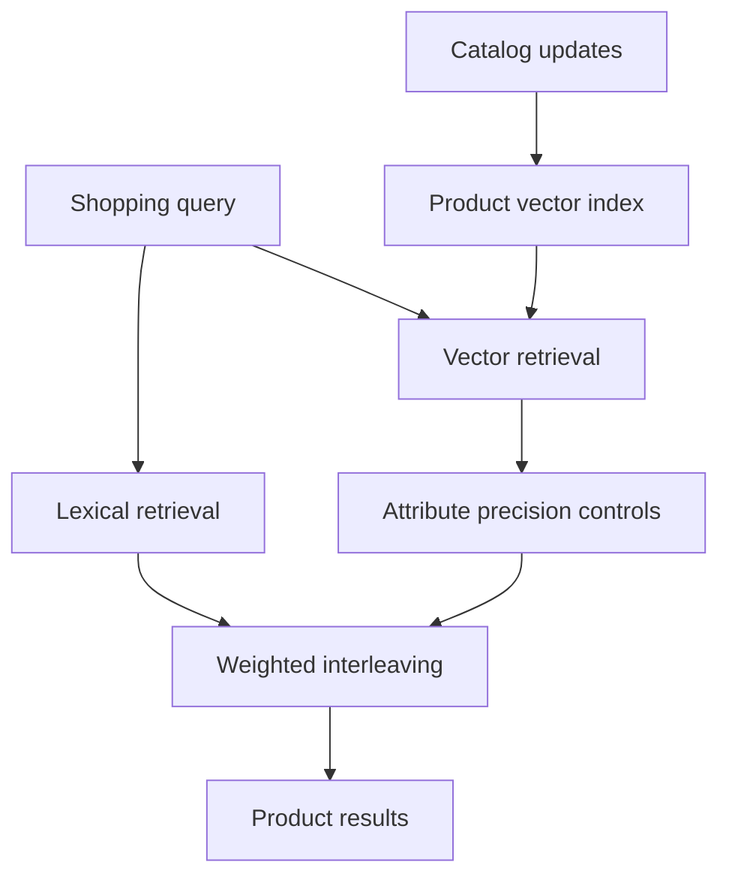

Target's product-search case answers a question that is often oversimplified: once a catalog has a vector index, should keyword search be removed? Target's answer is to run both, constrain vector results with product attributes, and let online experiments choose how to combine them. This is a **commerce catalog retrieval** system; it has no answer-generation stage and is not generative RAG. Based on the [September 25, 2026 v1 technical report](https://arxiv.org/html/2609.31498v1) from Target Data Sciences, this article examines the architecture, the strength of its evidence, and the evaluation methods other teams can adapt.

> **Huahua's take**
>
> Vector retrieval fills the recall gap when shoppers describe products differently from the catalog. Product type, brand, and size constraints protect precision. Evaluate these stages separately; embedding similarity alone is not search quality.

## This is not a keyword replacement

Retail queries range from exact specifications to open-ended discovery. Brand, size, product identifiers, and a query such as “organic milk 1/2 gallon” still benefit from lexical and structured-field matching. A request like “something to keep my feet warm during winter” or a misspelling such as `yoge mat` may have little literal overlap with product titles. Target runs lexical and dense (vector) retrieval in parallel: the first retains exact term matching, spell correction, rewriting, and facet filtering, while the second finds candidates through semantic representations of queries and product text.

The report describes an online stack using a Solr inverted index and a ScaNN approximate nearest-neighbor (ANN) index on AlloyDB; a ranking service merges their results. These are the authors' disclosed implementation choices, not a required product stack for every team. A separate product-indexing path embeds new or updated items and supports both batch and streaming updates. This split keeps query serving from having to recompute the whole catalog synchronously.

The vector channel is meant to supplement recall, not replace lexical retrieval. It is also different from retrieving documents and passing them to a large language model to answer a question. For a comparison with document retrieval and generation, see Bloss0m's [Enterprise RAG retrieval architecture guide](/en/blog/65-enterprise-rag-guide/) and [RAG methods reading map](/en/blog/92-rag-method-foundation-reading-map/). Their corpora, success criteria, and downstream steps differ.

## Model selection: start small, then adapt it to retail behavior

Target first compared pretrained encoders using 5,000 human-labeled commerce queries, each with about 200 candidate products, and NDCG. e5-large-v2 scored 0.7825 average NDCG; e5-small-v2 scored 0.7757, a difference of just 0.0068. The team selected e5-small-v2, with about 33 million parameters and 384-dimensional output, as the fine-tuning base to keep inference costs lower while retaining similar offline relevance. This human-relevance benchmark was used for model selection and should not be compared directly with later fine-tuning experiments based on interaction labels.

The team then prepared about 20 million query–product labels from anonymized, aggregated interactions across web and mobile, stratified by category and query frequency. Positive scores combined clicks, add-to-cart events, and conversions, with stronger purchase-intent signals weighted more heavily; the weights and decision thresholds were withheld for business confidentiality. Negatives included products shown without any engagement and similar products that were often retrieved but were not positives. The latter matter because the model must learn not only what looks relevant, but also how to distinguish close misses.

Product inputs combined title, brand, item type, category, and an optional highlights field. Marker tokens identified fields, and training randomly masked fields to reduce dependence on incomplete or noisy metadata. The report's ablations show improvements from more data, hard negatives, field markers, and descriptive product text. Some rows change more than one setting, however, and the authors caution readers to compare within each experiment table rather than treating results across tables as one controlled experiment.

The model-selection lesson is not that “smaller is always better.” It is that **general semantic similarity is not the same as shopping intent**. In the report, the zero-shot e5 model performed worse than the lexical baseline on every online metric. Fine-tuning on Target's own engagement labels changed the outcome. For another perspective on retrieval architecture and evaluation, see the [WeKnora knowledge-platform architecture case](/en/blog/95-weknora-architecture/); it concerns knowledge indexing, not the same commerce-search workload.

## Precision controls: semantic proximity does not guarantee the right attributes

Pure vector similarity can return items that are semantically close but violate an important query constraint. Target's precision-control service uses named entity recognition (NER) to extract explicit brand, gender, and size intent, then a query classifier to infer likely item types and categories. The filters cover item type, category, brand, gender, and size group. The report also describes tiered constraints for sensitive or ambiguous categories; for example, a food query should not return pet products unless the query asks for them.

In the report's offline vector-retrieval experiment, Precision@1 was 0.890 and Precision@10 was 0.836 with no filters. Adding NER constraints and classifier-inferred item type and category raised them to 0.929 and 0.885. These are author-reported results on a fixed candidate set, not an independent validation of total site-search quality. Filtering also carries a cost: a mistaken classifier prediction or ambiguous query can remove useful products. The report acknowledges that some queries still return no results and lists more adaptive learned precision control as future work.

> **Huahua's engineering note**
>
> Keep attribute filtering as an observable stage. Track which rule removes each candidate, along with empty-result rate and precision. One incorrect hard constraint can discard every useful item found by dense retrieval.

## RRF versus weighted interleaving: preserve rankings when lists overlap little

Target compared reciprocal rank fusion (RRF) with weighted interleaving. RRF adds scores based on each item's rank, avoiding the need to calibrate BM25 scores against cosine similarity. But an item present in both lists receives an agreement advantage. When lexical and vector lists have little overlap, that agreement signal is limited. Weighted interleaving instead draws each position from one channel according to a global weight, taking that channel's highest-ranked item not already included. It preserves each channel's internal order while allocating positions to both.

This is not a general rejection of RRF. Target reports that its two lists had low overlap and that weighted interleaving performed better in its A/B tests. With the first fine-tuned model, RRF produced relative changes of -0.85% in click-through rate and -1.20% in order conversion versus the baseline. Switching to weighted interleaving produced +0.40% and +0.74%. The team used successive explore-then-commit experiments to select the channel weights, which were not disclosed. Other catalogs may have different overlap, ranking quality, and shopper preferences, so they still need their own comparison.

## Offline relevance and online business outcomes answer different questions

The paper describes two offline sets with different purposes. The first uses 5,000 human-judged queries with about 200 candidate products each to select pretrained models. The second contains more than 5,000 unseen queries with interaction-derived grades from 0 to 4 based on clicks, add-to-cart events, and purchases. It measures NDCG and mean reciprocal rank (MRR), with Precision@K for filter experiments. The second set ranks a fixed candidate pool per query: it measures ranking within that pool, not recall from the full product catalog. The authors say the test queries do not overlap with training or validation queries, but the fixed-pool limitation remains.

The online stage consists of four-week A/B tests against the existing lexical search. Target reports that its fine-tuned model with weighted interleaving increased click-through rate by 0.97% relative, add-to-cart rate per visitor by 0.89%, order conversion by 0.98%, demand per visitor by 1.10%, and its relevance metric by 0.21%. Zero-result searches fell by about half relative to the control. These are **relative changes reported by Target**, not percentage points and not gains that other retailers should expect. The authors say results were statistically significant (p<0.05), but do not provide traffic denominators, a full assignment protocol, or confidence intervals. Some labeling thresholds, metric weights, and fusion weights are also withheld. The report includes no public code or dataset, and no independent replication is available for cross-checking these results.

The mechanism behind fewer zero-result searches is plausible: a vector channel can return candidates for long-tail, misspelled, or natural-language queries that have no literal match. But the roughly 50% decrease was observed under this catalog, query distribution, filter policy, and A/B traffic. If attribute controls remove every candidate, hybrid search can still return no results. The result shows how another retrieval channel can address particular failure types; it does not mean zero-result searches are solved.

## How latency and scale shape model choice

Target reports that e5-small-v2 averaged about 25 ms per query in an isolated CPU benchmark. Its online embedding service had p75/p95 latencies of roughly 25–30 ms, against a p99 target below 50 ms. The service used an embedding cache for frequent queries, adaptive micro-batching, TorchServe, and Kubernetes horizontal scaling. The product vector index used sharded ScaNN and asynchronous near-real-time updates. Training on roughly 20 million examples used A100 GPUs, while online inference ran on CPUs. The paper says the system serves millions of searches per day; these scale and latency figures are the authors' deployment report, not independently measured results.

This helps explain why a larger model's extra 0.0068 NDCG did not automatically win. The search-path budget includes model inference, vector lookup, precision controls, and downstream ranking, not only an offline encoder score. Teams should measure end-to-end tail latency, cache hit rate, and index freshness; isolated average latency does not represent p99 under peak load.

## Engineering practices other teams can reuse

1. Segment query failures first: exact brands and specifications, synonyms, misspellings, natural language, tail queries, and empty results. “Should we use vectors?” is not a useful requirements definition.
2. Make lexical candidates, dense candidates, attribute filters, and list merging independently observable and ablatable. Track which stage recovers recall and which constraints remove relevant items.
3. Use complementary evaluation: human relevance for initial model selection, interaction labels for ranking analysis, and randomized online experiments for behavioral and business impact. Measure conversion and empty results as well as clicks.
4. Treat fusion as an empirical choice. Measure list overlap, compare RRF, weighted interleaving, or other methods, and record weight versions and traffic conditions.
5. Report the baseline, experiment duration, relative or absolute changes, traffic size, confidence intervals, and withheld settings. When details cannot be disclosed, limit the claim to the reported deployment context.

## Sources and further reading

- Sonagara, Zhang, Singh, and Li, [Retail Product Search: A Practical Approach at Target](https://arxiv.org/html/2609.31498v1), arXiv:2609.31498v1, submitted September 25, 2026. The figures, architecture, and experiments in this article come from that report; the discussion of generalization limits is an assessment of its public evidence.
- Further reading: [Enterprise RAG retrieval architecture guide](/en/blog/65-enterprise-rag-guide/), [RAG methods reading map](/en/blog/92-rag-method-foundation-reading-map/), and [WeKnora knowledge-platform architecture](/en/blog/95-weknora-architecture/). They provide retrieval comparisons; product search is not the same as RAG.
