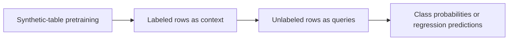

Kumo Tabular is not asking whether a model can make predictions from a table. It asks whether every new dataset requires its own fit, tuning, and deployed model. NVIDIA's approach is to pretrain a model on a large number of artificial tables, then treat labeled rows as context for predicting new rows. It does not remove training; it replaces task-specific training with inference-time in-context learning.

That change is worth testing, but the strongest leaderboard and speed claims currently come from NVIDIA's own evaluations. The practical questions are whether your data fits the model's assumptions, whether context rows represent future data, and whether fewer task-specific training steps offset inference and GPU costs.

> **Huahua in one sentence**
>
> Kumo Tabular is not a model that was never trained; it learns statistical structure from synthetic tables, then uses a small labeled context to make predictions for a task.

## From fitting a model per dataset to supplying task context

A conventional tabular machine-learning workflow splits each task into training and validation data, handles preprocessing, runs cross-validation, selects a model, and searches hyperparameters. This mature process gives gradient-boosted trees room to exploit a specific dataset, but each new question requires some of that work again and often leaves the team with another task-specific model. Our [Titanic implementation](/en/blog/37-kaggle-titanic-survival-prediction/) shows how feature processing, cross-validation, and leaderboard generalization can interact even on a small table.

Kumo Tabular represents a classification or regression task with two groups of rows: context rows with features and labels, and query rows with features but unknown labels. The model returns class probabilities or regression predictions; [NVIDIA's API documentation](https://nvidia.github.io/structured-data-models/api/models.html) also shows the context/query interface. According to [NVIDIA's technical overview](https://huggingface.co/blog/nvidia/kumo-tabular), users do not update Kumo's weights for each dataset; however, the model was pretrained on artificial tables, and a task still needs useful labeled context.

## How it puts table structure into a Transformer

A text Transformer processes tokens in a sequence. A table model must also represent how values compare within a column, how columns interact within a row, and how labeled rows inform predictions for new rows. [NVIDIA's description of Kumo Tabular's architecture](https://huggingface.co/blog/nvidia/kumo-tabular) separates those relationships into cell, row, and in-context representations.

First, numerical and categorical values become cell embeddings. Missing values receive a special representation rather than requiring a single imputed value. Second, column attention alternates with row attention: column attention learns how values compare across rows in the same column—for example, whether 42 is typical or extreme—while row attention learns feature interactions within a row. NVIDIA says column-attention cost grows linearly with the number of rows, and row-level representations compress later processing.

Third, context rows attend to one another, while query rows read from context without attending to other queries. This means an individual prediction does not depend on the order or composition of other query rows in its batch. Context keys and values can also be reused for follow-up predictions. The model then returns class probabilities or, for regression, 999 quantiles from which a point estimate and uncertainty signal can be derived. These are architectural descriptions, not proof that cost or calibration is solved for tables of every size.

## What does synthetic-table pretraining teach?

NVIDIA says its Small, Medium, and Large versions saw roughly 35 million, 71 million, and 137 million artificial tables, respectively. The generator samples a Structural Causal Model (SCM) configuration and a random causal graph, then draws different functions for its nodes to create numerical or categorical columns and prediction targets. Post-processing adds column correlations, outliers, missingness, high-cardinality categories, and heavy-tailed regression targets; tables without a learnable signal are discarded.

Classification and regression are separate models trained separately; this is not one set of weights that switches freely between the two task types. NVIDIA also says a single forward pass natively supports up to 10 classes, with the [library API](https://nvidia.github.io/structured-data-models/api/models.html) extending this to more classes using error-correcting output codes. These boundaries affect model selection and cost estimates, so “one tabular model” should not be read as one universal checkpoint.

The training objective is not to memorize one enterprise dataset. It is to learn, across many generated mechanisms, how labeled rows can help predict unlabeled ones. At inference, the labeled data therefore tells the model what the current task looks like; it is not another round of weight updates.

But synthetic diversity does not imply coverage of every real-world structure. The generator's causal graphs, function families, missingness patterns, and value ranges define the model's prior. If enterprise data departs from those assumptions, or if context and query distributions differ, predictions may degrade. NVIDIA explicitly warns that accuracy can fall on tables far beyond training ranges or under context/query distribution shift, and recommends checking accuracy and calibration on held-out data.

> **Huahua's engineering note**
>
> “No task-specific fit” does not mean “no data preparation.” The native inputs listed by NVIDIA are numerical and categorical columns; text, images, and timestamps still need feature preprocessing, and timestamp encoding can change the evaluation result.

## How should we read the four benchmark “firsts”?

According to [NVIDIA's published benchmark results](https://huggingface.co/blog/nvidia/kumo-tabular), Kumo Tabular ranks first on TabArena, BeyondArena, TALENT, and ScoringBench. The [TabArena project](https://github.com/autogluon/tabarena) provides background and benchmark artifacts for that competition. Those results are useful signals, but each benchmark uses different metrics, test data, and comparison sets. ELO, average rank, log-loss, and regression RMSE are not interchangeable notions of accuracy. The comparisons were run or compiled by NVIDIA; this article found no independent rerun.

| NVIDIA-reported evaluation | Reported result | Boundary when interpreting it |
| --- | --- | --- |
| TabArena | ELO 1950, first overall | Applies to that leaderboard's setup and competitor set, not every business table |
| BeyondArena | ELO 1418 and 7.78% Improvability | Interpret using that benchmark's metric definition; it is not a direct accuracy gain |
| TALENT | Average ranks of 6.67 for classification accuracy, 3.98 for classification log-loss, and 4.22 for regression RMSE | Three metric-specific ranks, not a single percentage |
| ScoringBench | Large and Medium rank first and second by average rank | Focuses on predictive distributions; model size, tasks, and run settings still matter |

The same [NVIDIA comparison on one RTX 6000 Pro](https://huggingface.co/blog/nvidia/kumo-tabular) says Kumo inference was about 17 times faster than LimiX-2 in its TabArena evaluation. That is not a guarantee across hardware, datasets, or end-to-end deployment costs; it is NVIDIA's measurement. Before adopting the claim, teams should fix model revision, data split, batch and context sizes, warm-up, GPU, and timing boundaries, then compare against their own tuned gradient-boosted-tree and AutoML pipelines. Our article on [model hardware and benchmark standards](/en/blog/97-model-hardware-standard/) explains why hardware and measurement boundaries matter.

## Open code does not mean every training artifact is public

NVIDIA has published the [structured-data-models library](https://github.com/NVIDIA/structured-data-models), [Kumo Tabular weights and model card](https://huggingface.co/nvidia/Kumo-Tabular), and [API documentation](https://nvidia.github.io/structured-data-models/api/models.html). The repository identifies NVIDIA-authored code as Apache-2.0; model weights use separate OpenMDW 1.1 terms. The code license cannot be assumed to cover the weights. Legal and model-governance teams should review the actual model terms, version, and use restrictions before deployment.

NVIDIA also says its training recipe and artificial-data generator will be released later. For now, “weights and inference code are public” does not mean “the full training process is reproducible.” GitHub benchmark code, dataset versions, Kumo checkpoint revisions, and the numbers in NVIDIA's post should be tracked separately. Reproducing a comparison requires pinning at least the code commit, model revision, dependencies, hardware, and data split; otherwise a moving `main` branch or Hub revision can change the result.

## When is it worth running your own trial?

Treat Kumo as a candidate model, not an automatic replacement for a production pipeline. A small trial can answer a meaningful decision question:

1. **Fix the task and split.** Build a held-out set for classification, regression, temporal, or group-based prediction that did not influence model selection. Avoid letting records from the same customer or entity leak across train and test.
2. **Set a credible baseline.** Compare the current model, a properly tuned gradient-boosted tree, or AutoML—not just Kumo defaults against a weak baseline. Record quality, calibration, inference time, memory, and per-batch cost.
3. **Test the context assumptions.** Vary context-row count, class count, missingness, and time window. Check whether query rows really resemble context rows and whether future data introduces concept drift.
4. **Count the lifecycle cost.** Avoiding a separate fit may reduce pipeline maintenance, but inference still loads weights and processes context. A simple tree may be cheaper for small, infrequent tasks; reusing a pretrained prior may help more when similar tasks recur.

These checks define which work “no tuning” actually removes. It does not replace label-quality controls, data permissions, error-cost analysis, or production monitoring, and it does not prove that generated training data covers the populations in a business domain.

## The real question is whether the task prior transfers

Kumo Tabular makes a clear technical claim: pretrain on many synthetic tables, infer a particular task from labeled context rows, and use table-structured attention to handle larger row counts. Public weights and code give engineering teams a way to try it. The synthetic generator and complete training recipe remain unavailable, and independent comparisons are still missing.

The most defensible conclusion is not that AutoML has been replaced. It is that a new candidate deserves comparison on the same data, split, and hardware budget. Only after teams verify prediction quality, calibration, distribution-shift behavior, licensing, and total cost on their own data can they decide whether skipping task-specific training makes the production system simpler.

## Further reading and sources

- [NVIDIA: Kumo Tabular technical overview and benchmark claims](https://huggingface.co/blog/nvidia/kumo-tabular)
- [NVIDIA structured-data-models source code and licensing](https://github.com/NVIDIA/structured-data-models)
- [Kumo Tabular weights and model card](https://huggingface.co/nvidia/Kumo-Tabular)
- [Kumo Tabular API documentation](https://nvidia.github.io/structured-data-models/api/models.html)
- [TabArena benchmark repository](https://github.com/autogluon/tabarena)
